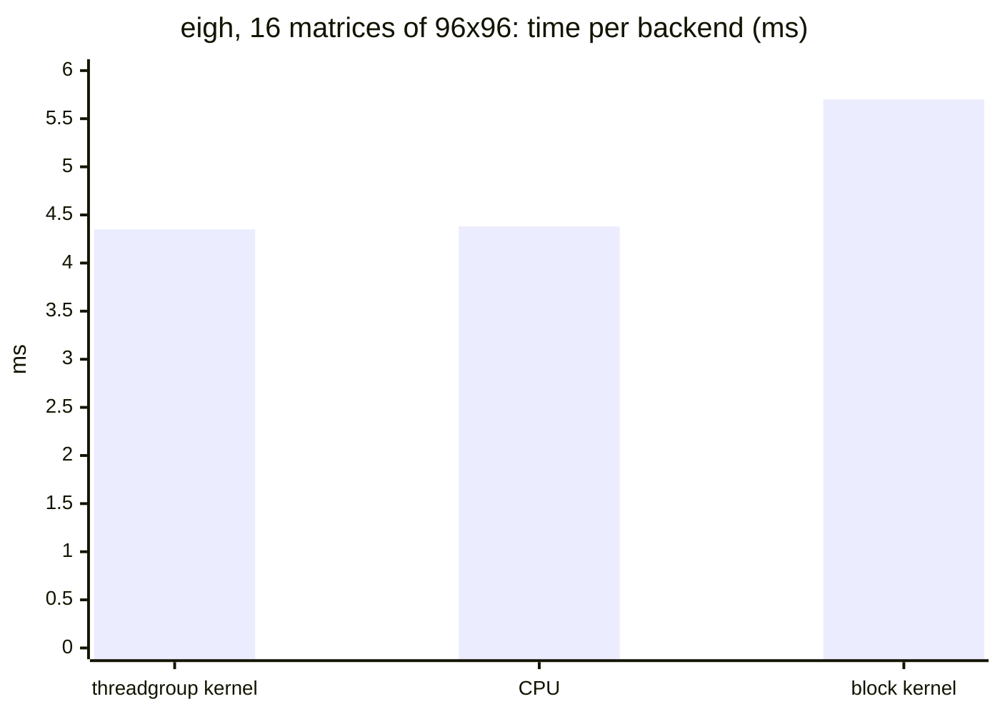
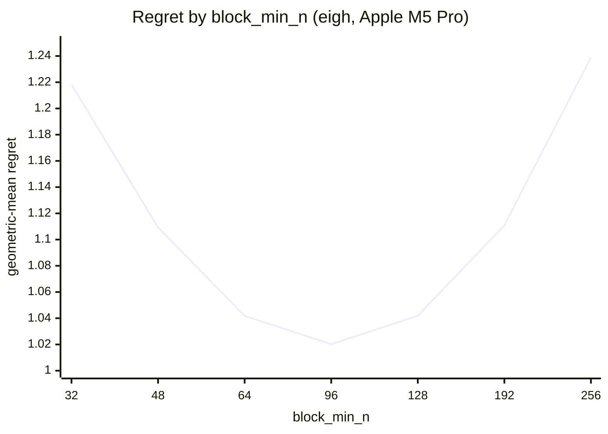
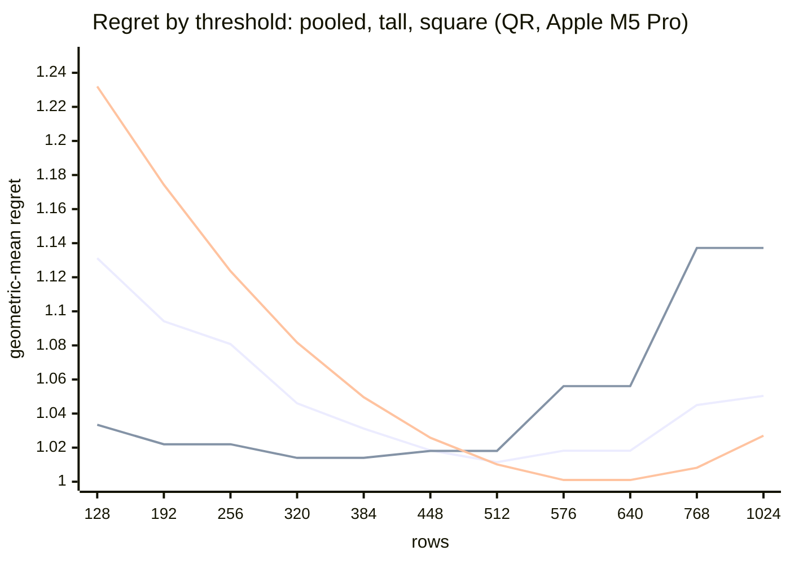

# Reading a routing report

Every run of `tuning/run.py` writes a `report.md` for each decomposition, under
`docs/results/<device>/<id>/{qr,eigh,svd}/`, and `tuning/combine.py` writes
the same kind of report for a device's combined runs. This page explains
every section and every number in them. The definitions are those of the
code in `tuning/`, and the examples are from the Apple M5 Pro run
(`docs/results/apple-m5-pro-20gpu/20260930-27b6c2/`).

## The idea

At each measured point (a matrix shape and a batch size) every backend that
could run there is timed. A routing rule, the policy for this device, picks
one backend per point. The rule is scored by how much slower its pick is than
the fastest backend at each point, and its constants are chosen to make that
as small as possible across all points. Then the result is checked: is the
optimum sharp or flat, does a richer rule really do better or only on the
points it was fitted to, and was the machine steady enough to trust any of it.

## Regret and the numbers in every table

The **regret** of a rule at a point is

    regret = time of the backend the rule picks / time of the fastest backend measured there

so 1.00 is the best possible and 1.25 means the rule's pick is 25% slower than
the best one available. "The fastest backend measured" is the **oracle**, and
a rule that always picked it would score 1.00 everywhere; that is the
`oracle` row of the tables. Each backend's time at a point is the fastest of
its passes.

Every rule table has the same columns:

| column | meaning |
|---|---|
| **geomean regret** | the geometric mean of the regret over all points, exp(mean of ln regret). This is the score being minimised. Geometric, because regrets are ratios: a 2x loss counts the same on a 0.1 ms call as on a 100 ms one, and a single very bad point cannot dominate it the way it would an arithmetic mean |
| **worst** | the largest regret at any single point. A rule with a good geomean and a bad worst case is fine on average and terrible somewhere |
| **>10%** | how many points have a regret above 1.10 |
| **total time / oracle** | the time to run every point through the rule, divided by the time the oracle would take. Unlike the geomean, this is dominated by the slowest points, so the two together say whether the losses are on small or large problems |
| **est. picks** | points where the rule picks a backend that was not timed there, because the cost model judged it too slow to measure (see Calibration). Its regret is then the model's estimate: it counts in the geomean, >10% and total time, but not in **worst**, and the warnings list each such point |

### Example: regret at one point

The eigensolver on 16 matrices of 96×96, three backends timed, in ms:



The fastest is the threadgroup kernel, 4.35 ms. The M5 Pro's policy sends
N = 96 to the block kernel, 5.70 ms, so its regret here is 5.70 / 4.35 =
**1.31**: 31% slower than the best choice available.

### Example: four points, four numbers

| point | best backend | rule picks | regret |
|---|---|---|---|
| 128×128, batch 16 | block, 7.10 ms | block, 7.10 ms | 1.000 |
| 128×128, batch 1 | CPU, 0.51 ms | CPU, 0.51 ms | 1.000 |
| 64×64, batch 4096 | block, 101.0 ms | threadgroup, 153.3 ms | 1.518 |
| 96×96, batch 16 | threadgroup, 4.35 ms | block, 5.70 ms | 1.310 |

Over these four points the rule scores:

- **geomean regret** = (1.000 × 1.000 × 1.518 × 1.310)^(1/4) = **1.19**
- **worst** = **1.52x**, at 64×64, batch 4096 (this is in fact the worst point
  of the whole M5 Pro eigensolver run)
- **>10%** = **2** points
- **total time / oracle** = (7.10 + 0.51 + 153.3 + 5.70) / (7.10 + 0.51 + 101.0
  + 4.35) = 166.6 / 113.0 = **1.47**

The total-time ratio is much worse than the geomean because the one large
problem, 101 ms against 153 ms, dominates the sum; the geomean weighs it the
same as the 0.5 ms problem. Reading the two together tells you whether the
losses are on large problems or small ones.

## The flat region, and the value that is shipped

The candidate values for a threshold are the sizes that were measured:
between two measured sizes every threshold makes the same choices, so nothing
in between can score differently.

The report gives the **flat region**: every candidate scoring within a
tolerance of the best, 0.5% of the best geomean for the eigensolver and SVD
and 0.003 of regret for QR. It reports the range rather than the single best
value because the best value of a flat curve is noise: run the sweep again and
it moves within the region. A wide region means the constant barely matters on
this device; a region of one value means it is sharp. On the M5 Pro the
eigensolver's block crossover is sharp (only 96 is in the region) and its CPU
cap is flat (1024 to no cap).

Which value is shipped:

- **eigh and SVD**: the value already in the table, if it is inside the region
  and its worst case is within 10% of the best worst case there, since a gain
  smaller than the noise is not worth a constant that changes from run to run;
  otherwise the value in the region with the smallest worst case.
- **QR**: the middle of the band.

## Regret curves

Each curve varies one constant over its candidate values with every other
constant held at its chosen value, and plots the geomean regret (the chart)
and lists it with the worst case (the table below the chart).

- The **floor** of the curve is the flat region.
- The **slope** on either side is what a wrong value costs. Curves are often
  asymmetric: for QR on the M1, erring low cost little and erring high lost
  most on tall matrices.
- The **worst** row can jump while the geomean barely moves: one point going
  badly wrong.

### Example: a sharp optimum

The eigensolver's block crossover on the M5 Pro, `block_min_n`: matrices of
at least this size go to the block kernel, smaller ones to the whole-matrix
kernel. The report draws it like this:



The same numbers as bars, each `█` one percent of regret above perfect:

```
block_min_n  geomean   worst
        32   1.218     9.33x   ██████████████████████    too low: small matrices sent to the block kernel
        48   1.109     5.05x   ███████████
        64   1.042     2.94x   ████
        96   1.020     1.52x   ██                        the floor: the only value in the flat region
       128   1.042     1.88x   ████
       192   1.111     2.22x   ███████████
       256   1.239     4.42x   ████████████████████████  too high: large matrices kept on the whole-matrix kernel
```

A V with steep walls: one value is right and both neighbours cost about 2%.
The worst-case column tells a second story. 64 and 128 have almost the same
geomean, but 64's worst case is far higher: a crossover that is too low
sends one particular size to a kernel that is badly wrong for it, while one
that is too high spreads a smaller loss over more sizes.

### Example: a curve that turns

The eigensolver's minimum batch for the GPU, `gpu_min_batch`:

```
gpu_min_batch  geomean   worst
           1   1.095     3.34x   █████████    lone matrices go to the GPU, where they are slower
           2   1.077     3.34x   ████████
           4   1.056     3.34x   ██████
           8   1.037     2.48x   ████
          16   1.024     1.93x   ██           the floor
          32   1.038     1.93x   ████         now batches the GPU would win are refused
```

Here the curve falls gently and then rises again past 16: each step up keeps
another band of small batches on the CPU, which helps until the batches being
turned away are ones the GPU would have won.

The QR report draws one curve per kind of shape (square, tall, wide,
near-square) as well as the pooled one, because a threshold can look fine
pooled and fail on one aspect ratio: on the M1 a square-heavy grid suggested
512, which lost up to 1.95x on tall input.

### Example: why QR's curves are split by shape

The M5 Pro's QR crossover, the row count from which the grid-parallel
backend is used. Three of the report's lines: pooled over every shape, tall
matrices only, and square ones only.



The tall line (second) is lowest from 288 to 384 (288 is in the report's
table) and climbs steeply from 576; the square line (third) is lowest at 576
to 640 and climbs steeply below 512. They want different thresholds. The
pooled line (first) bottoms out at 480 to 512, where neither loses much, and
that is the value shipped. A grid with only square shapes would see just the
third line, pick 576 or 640, and never show what that costs tall matrices.

## Two stages: which GPU kernel, then GPU or CPU

The eigensolver and SVD reports fit their rule in two stages.

**Stage 1** chooses between the GPU kernels, scored against the best *GPU*
backend at each point, as if there were no CPU. Fitting this jointly with the
CPU boundary would hide it: wherever the CPU wins, every GPU choice scores the
same, so the kernel crossover could not be seen. Stage 1 is also exactly the
rule a forced-GPU call follows (`EIGH_DEVICE=gpu`).

**Stage 1b** (eigensolver) fits the window of N in which the `ql` backend
replaces the Jacobi kernel stage 1 picked, scored like stage 1 against the
best GPU backend, now `ql` included, and checked on held-out points against
leaving it off. Stage 1 itself chooses among the Jacobi kernels only, so its
crossovers mean what they did before the backend existed.

**Stage 2** fits the GPU/CPU boundary given stage 1's choice, scored against
the best of all backends.

For example, one 128×128 matrix: the block kernel takes 6.42 ms, the
threadgroup kernel 7.95 ms, and the CPU 0.51 ms. In stage 2 the CPU wins by
12x and whichever GPU kernel the rule would have named makes no difference
to the score. Stage 1 still sees that the block kernel is the right GPU
kernel for this size, which is what a forced-GPU call will use.

## Held-out checks of richer rules

Each harness also tries rules with more constants, which a single run would
always seem to favour: a batch-dependent kernel crossover (all three), a
per-size GPU/CPU boundary (eigh, SVD), a narrow-matrix special case (QR). To
tell a real improvement from fitting noise, the points are split in two, the
richer rule and the plain one are both fitted on one half, and both are scored
on the other:

- **eigh, SVD**: the split gives each half half of the batch sizes at every
  matrix size. The comparison is a **bootstrap** over the held-out points: they
  are resampled with replacement 2000 times and the mean log-regret of the two
  rules compared each time. "Better in 93% of resamples" is how often the
  richer rule won; the "median gain" is its typical improvement. It is
  **justified**, and goes into the row, if it wins in at least 95% of
  resamples and its held-out worst case is no more than 2% worse. A justified
  refinement is then refitted on all points.
- **QR**: the measured points, in order, alternate between the halves, and a refinement is adopted if
  its held-out geomean is lower by more than 0.002 and its held-out worst case
  no more than 0.01 higher.

It is normal for a rule to score better on the half it was fitted to than on
the other; a refinement that wins on its own half and loses on the other is
fitting noise, which is what the check is for.

### Example: a rejected and a justified refinement

Each picture shows the 2000 bootstrap resamples, sorted by how much the
richer rule improved the held-out geomean (each `█` is 20 resamples).

The eigensolver's batch-dependent block crossover on the M5 Pro, **rejected**:

```
held-out gain    resamples
 -2% to -1%         13   █                      worse in 139 of 2000 (7%)
 -1% to  0%        126   ██████
  0% to +1%        424   █████████████████████
 +1% to +2%        728   ████████████████████████████████████
 +2% to +3%        477   ████████████████████████
 +3% to +4%        201   ██████████
 +4% to +5%         30   █▌
```

Better in 93% of resamples, with a median gain of 1.6%: probably a small
real improvement, but in 7% of resamples it is worse, and the bar is 95%.

The SVD's batch-dependent block crossover, **justified**:

```
held-out gain    resamples
  0% to  +3%        18   █                      worse in none of 2000
 +3% to  +6%       289   ██████████████
 +6% to  +9%       776   ███████████████████████████████████████
 +9% to +12%       672   ██████████████████████████████████
+12% to +15%       221   ███████████
+15% to +20%        24   █
```

Every resample is better, by a median of 8.7%, so it is in the row. On the
held-out half its geomean is 1.0449 against 1.1363 for one crossover alone.

## Decision surfaces

Grids of matrix size against batch size, one cell per measured point.

**Eigensolver and SVD**, as letters: the best backend at each point, then
what the rule picks; once for the GPU kernels alone (stage 1) and once for all
backends (stage 2). Where the two grids differ, the rule is losing. The legend
is in the report: `c` is the CPU, `.` a point not measured, and for the
eigensolver `s`, `t` and `B` its kernels (simd, threadgroup, block); for the
SVD `J` and `B` the whole-matrix and block kernels and `j`, `b` the same after
QR. The third grid is the **speedup**: the CPU's time divided by the best GPU
backend's, so above 1 the GPU wins; `gpu` marks a point where the CPU was not
timed because it would take seconds.

### Example: reading the letters

Three rows of the eigensolver's stage-2 grids on the M5 Pro, the best backend
above and the rule's pick below, with `^` under each cell where they differ:

```
  N \ batch     1     2     4     8    16    32    64   128   256   512  1024  2048  4096
best    64     c     c     c     c     t     t     t     t     B     B     B     B     B
rule    64     c     c     c     c     t     t     t     t     t     t     t     t     t
                                                               ^     ^     ^     ^     ^
best    96     c     c     c     c     t     t     B     B     B     B     B     B     B
rule    96     c     c     c     c     B     B     B     B     B     B     B     B     B
                                       ^     ^
best   512     c     c     c     B     B     c     c     B
rule   512     c     c     c     c     B     B     B     B
                                 ^           ^     ^
```

- At N = 64 the block kernel wins from batch 256 up, but the rule keeps
  N = 64 on the whole-matrix kernel. This is the region the rejected
  batch-dependent crossover above would have fixed, and where the run's
  worst point (1.52x at batch 4096) is.
- At N = 96 the rule sends batches of 16 and 32 to the block kernel one
  size too early (1.31x at batch 16).
- At N = 512 the GPU and the CPU are close, and the best choice flips back and
  forth with batch size. No rule with a few constants follows that, and it
  does not need to: the speedup grid shows how little is at stake there.

The speedup grid for the same sizes reads directly: below 1 the CPU wins,
above 1 the GPU does by that factor.

```
  N \ batch     1     2     4     8    16    32    64   128   256   512  1024  2048  4096
        64   0.09  0.24  0.43  0.87  1.14  2.30  2.68  3.28  3.96  4.93  5.29  5.35  5.56
```

One 64×64 matrix is 11x faster on the CPU (0.09), the GPU draws level at
about 16 matrices, and from about a thousand on it is more than 5x faster.

**QR**, as numbers with a glyph: the ratio of the grid-parallel backend's time
to the single-threadgroup backend's, for batch 1 and batch 16. Below 1 the
grid-parallel backend wins: `###` below 0.60, `##` below 0.85, `#` below 0.95,
`~` a tie (0.95 to 1.05), `.` up to 1.30, blank above. The arrow marks the
first row at or above the chosen threshold.

## QR only: which feature, and candidate rules

**Which feature decides** fits a threshold on each of three quantities, the
row count M, max(M, N) and min(M, N), and lists each at its best threshold. M
wins by a wide margin on every device measured, because the single-threadgroup
backend sweeps the rows serially. If another quantity ever won, the right rule
would have a different shape, not a different number.

**Candidate rules** scores several complete rules, including the original
heuristic the crossover replaced, overall and per kind of shape.

## Noise floor

Every point is measured in two or more passes, in a different random order
each time so that thermal drift during the run is not mistaken for an effect
of size. For each backend at each point the **pass-to-pass ratio** is its
slowest pass divided by its fastest. The report gives the median, 90th
percentile and maximum of that ratio overall and by how long the call takes.

A difference between two backends smaller than the p90 for its time bucket is
not a result. From the M5 Pro eigensolver run:

| runtime | median | p90 |
|---|---|---|
| < 1 ms | 1.050 | 1.705 |
| 3–10 ms | 1.007 | 1.040 |
| > 100 ms | 1.004 | 1.014 |

So two timings of the same sub-millisecond call differ by 70% or more one
time in ten, and a 20% gap between two backends there means nothing; above
100 ms, a 2% gap is real. Calls under a millisecond are always the noisiest (the
submission of the work dominates), which is why the fitting uses the fastest
pass and the geometric mean rather than single comparisons. For QR, a median
ratio above 1.10 marks the run untrustworthy. In a combined report the ratio
is computed within each run, so it measures noise and not the spread between
machines.

## Conditions: machine state, probe drift, calibration

The lines at the top of the eigensolver and SVD reports describe the machine.

- **Machine state**: the load average and power source at the start and the
  end. A load average above half the CPU count, or Low Power Mode, marks the
  run untrustworthy: other work slows the CPU backend most, which would bias
  the routing toward the GPU.
- **Probe point**: one point timed before the sweep and again after it. The
  ratio, after over before, should be close to 1. If any backend moved by more
  than 25%, the machine changed state during the run (it throttled, or a job
  started) and timings from either side cannot be compared; the run is marked
  untrustworthy.
- **Cost model calibration**: the harness estimates each call's time from a
  simple model of an M1, so it can skip calls that would take more than 2.5
  seconds each. The probe point rescales the model to this device: "block
  x0.30" means the block kernel ran in 30% of the M1 model's estimate there.
  A faster device is therefore measured further out, where its crossovers have
  moved. The same model prices the estimated picks.

## The answer

In the eigensolver and SVD reports the **Answer** section gives the row for
`kTuned[]` and the same policy as environment variables, to try before
rebuilding. It says **"Indicative only; do not paste this row"** instead when
the run was a single pass (`--quick`), the machine was busy, or the probe
point drifted. The QR report gives its row under **The band**. The **Warnings** that follow
are explained in [`tuning-details.md`](tuning-details.md#5-reading-a-report).

## Combined reports

A report written by `tuning/combine.py` says so near the top, listing the
runs it used. Each backend's time at a point is then the median, over the runs, of
each run's fastest pass, so one unusual machine cannot move it; everything
else reads as above.
