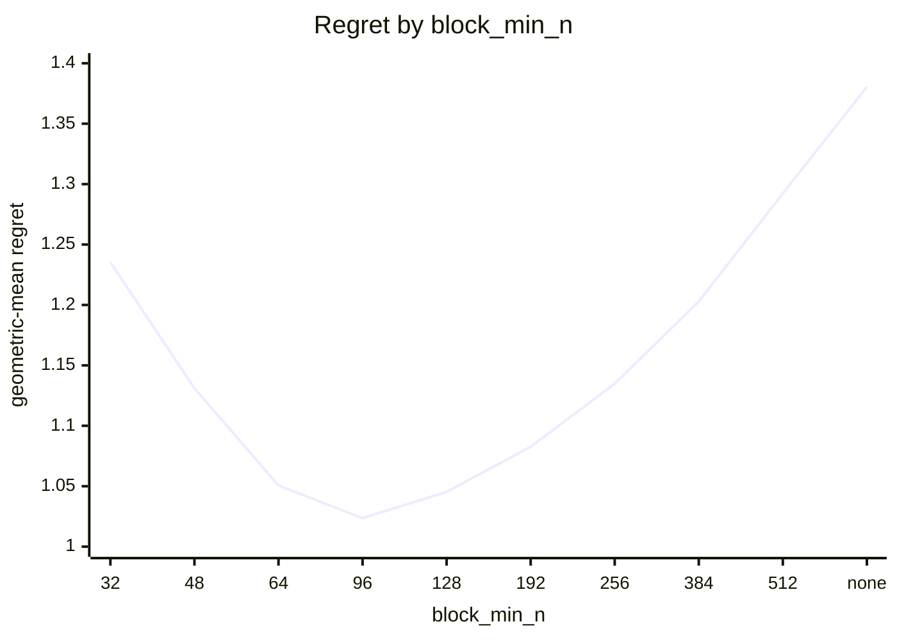
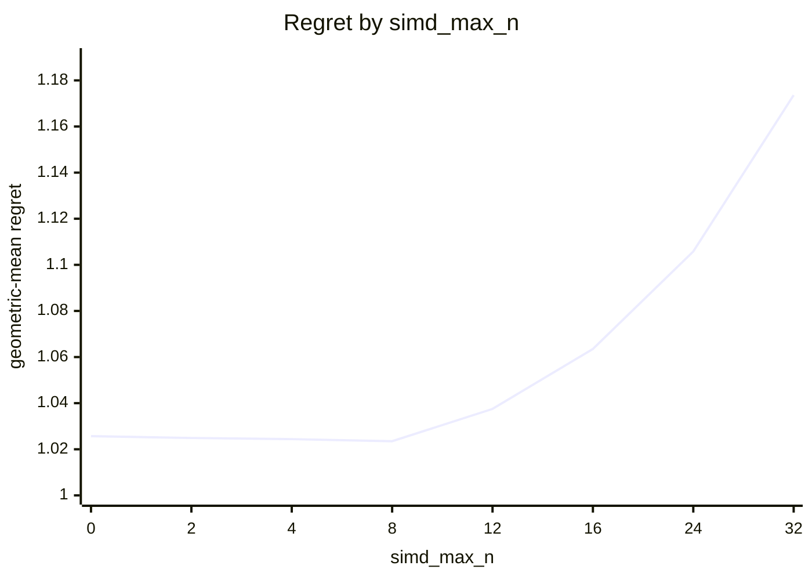
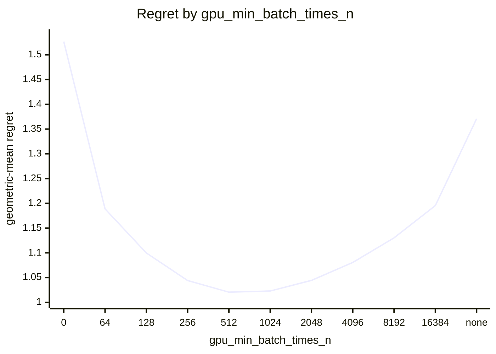
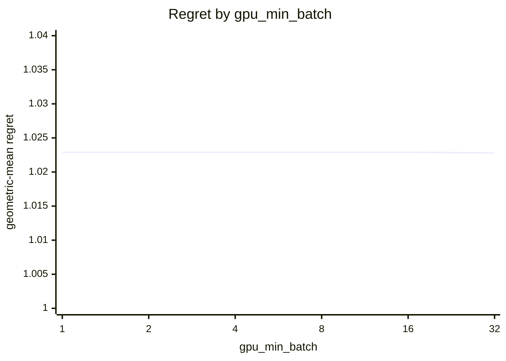
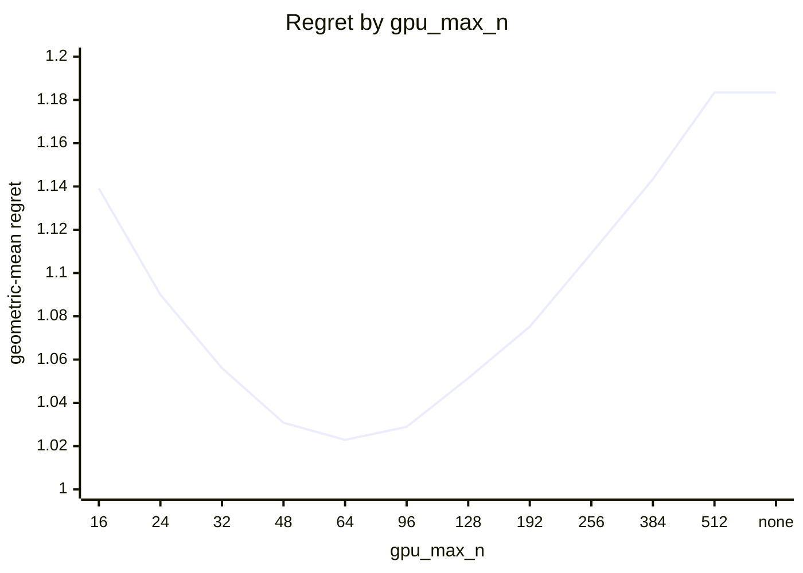

# Eigensolver routing on Apple M1 (8 GPU cores)

What every section and number below means: [reading-reports.md](https://github.com/c0rmac/metal-linalg/blob/main/docs/reading-reports.md).

Machine state was not recorded for this run.

Generated by `tuning/tune_eigh.py` from 174 (N, batch) points, N in [2, 4, 8, 12, 16, 24, 32, 48, 64, 96, 128, 192, 256, 384, 512], batch in [1, 2, 4, 8, 16, 32, 64, 128, 256, 512, 1024, 2048, 4096], four backends, two or more passes, min-of-repeats.

## Answer

Row for `kTuned[]` in `src/eigh.mm`:

```cpp
// device, GPU cores,   simd_max_n, block_min_n, block_min_n_batched, block_min_batch,   gpu_max_n, gpu_min_batch_times_n, gpu_min_batch
{"Apple M1", 8,   8, 96, 0, 0,   64, 1024, 1},
```

To try it without rebuilding:

```sh
EIGH_SIMD_MAX_N=8 EIGH_BLOCK_MIN_N=96 EIGH_BLOCK_MIN_N_BATCHED=0 EIGH_BLOCK_MIN_BATCH=0 EIGH_GPU_MAX_N=64 EIGH_GPU_MIN_BATCH_TIMES_N=1024 EIGH_GPU_MIN_BATCH=1
```

The policy in effect on this device came from `tuned:Apple M1`. It matches the fitted one.

Against the best measured backend at every point the whole rule scores 1.0229 geometric-mean regret, worst 1.70x, 13 of 174 points losing more than 10%, and 1.038x the oracle's total time. The decision is fitted in two stages, below, because the CPU routing would otherwise hide the GPU backend crossover.

## Warnings

- chosen rule loses more than 25% at N=24 batch=32 (cpu, 1.70x), N=48 batch=16 (cpu, 1.33x), N=12 batch=64 (cpu, 1.32x), N=64 batch=4096 (tg, 1.30x), N=24 batch=16 (cpu, 1.30x), N=64 batch=2048 (tg, 1.27x), N=32 batch=16 (cpu, 1.27x), N=64 batch=1024 (tg, 1.25x)
- GPU split loses more than 25% against the best GPU backend at N=96 batch=2 (block, 1.49x), N=96 batch=8 (block, 1.48x), N=96 batch=4 (block, 1.43x), N=96 batch=1 (block, 1.37x), N=64 batch=4096 (tg, 1.30x), N=64 batch=2048 (tg, 1.27x), N=64 batch=1024 (tg, 1.25x)

## Stage 1: which GPU backend

Scored against the best *GPU* backend at each of the 174 points, as if there were no CPU: this is the rule a forced-GPU call (`EIGH_DEVICE=gpu`) and the `detail` entry points follow, and it is what a GPU with more cores will lean on.

| rule | geomean regret | worst | >10% | total time / oracle | est. picks |
|---|---|---|---|---|---|
| policy in effect ('8', '96', 'none', 'none') | 1.0235 | 1.49x | 14 | 1.016 | 0 |
| fitted ('8', '96', 'none', 'none') | 1.0235 | 1.49x | 14 | 1.016 | 0 |

4 of 80 (simd_max_n, block_min_n) pairs are within 0.5% of the best geomean: simd_max_n 0 .. 8, block_min_n 96 .. 96.



| block_min_n | 32 | 48 | 64 | 96 | 128 | 192 | 256 | 384 | 512 | none |
|---|---|---|---|---|---|---|---|---|---|---|
| geomean | 1.2353 | 1.1311 | 1.0506 | 1.0235 | 1.0453 | 1.0827 | 1.1348 | 1.2029 | 1.2923 | 1.3804 |
| worst | 7.61x | 5.37x | 2.88x | 1.49x | 2.09x | 2.09x | 2.53x | 3.86x | 7.79x | 11.78x |



| simd_max_n | 0 | 2 | 4 | 8 | 12 | 16 | 24 | 32 |
|---|---|---|---|---|---|---|---|---|
| geomean | 1.0257 | 1.0249 | 1.0244 | 1.0235 | 1.0375 | 1.0635 | 1.1058 | 1.1736 |
| worst | 1.49x | 1.49x | 1.49x | 1.49x | 1.53x | 1.89x | 3.17x | 4.99x |

Held-out check of a batch-dependent crossover (block from a lower N once the batch is large enough). Fitted on 93 points, scored on the other 81; the verdict is a bootstrap over the test points.

| rule | fitted on train | train geomean | test geomean | test worst | verdict |
|---|---|---|---|---|---|
| two constants | [8, 96, 1000000000, 1000000000] | 1.0206 | 1.0267 | 1.48x | baseline |
| batch-dependent block crossover | {"block_lo": 64, "batch_hi": 64} | 1.0115 | 1.0143 | 1.34x | rejected (better in 89% of resamples, median gain 1.2%) |

Best GPU backend per point (`s` simd, `t` threadgroup, `B` block), then what the split picks:

```
  N \ batch     1     2     4     8    16    32    64   128   256   512  1024  2048  4096
          2     s     s     t     t     t     s     s     t     s     t     t     s     s
          4     s     s     t     s     s     t     t     t     s     t     s     s     s
          8     s     t     t     s     s     s     t     s     t     s     s     t     s
         12     t     t     t     t     t     t     t     t     s     t     s     s     s
         16     t     t     t     t     t     t     t     t     t     t     t     s     s
         24     t     t     t     t     t     t     t     t     s     s     s     s     s
         32     t     t     t     t     t     t     t     t     s     t     t     t     t
         48     t     t     t     t     t     t     t     t     t     t     t     t     t
         64     t     t     t     t     t     t     t     t     B     B     B     B     B
         96     t     t     t     t     B     B     B     B     B     B     B     B     B
        128     B     B     B     B     B     B     B     B     B     B     B     B     .
        192     B     B     B     B     B     B     B     B     B     B     .     .     .
        256     B     B     B     B     B     B     B     B     B     .     .     .     .
        384     B     B     B     B     B     B     B     .     .     .     .     .     .
        512     B     B     B     B     B     B     .     .     .     .     .     .     .
```

```
  N \ batch     1     2     4     8    16    32    64   128   256   512  1024  2048  4096
          2     s     s     s     s     s     s     s     s     s     s     s     s     s
          4     s     s     s     s     s     s     s     s     s     s     s     s     s
          8     s     s     s     s     s     s     s     s     s     s     s     s     s
         12     t     t     t     t     t     t     t     t     t     t     t     t     t
         16     t     t     t     t     t     t     t     t     t     t     t     t     t
         24     t     t     t     t     t     t     t     t     t     t     t     t     t
         32     t     t     t     t     t     t     t     t     t     t     t     t     t
         48     t     t     t     t     t     t     t     t     t     t     t     t     t
         64     t     t     t     t     t     t     t     t     t     t     t     t     t
         96     B     B     B     B     B     B     B     B     B     B     B     B     B
        128     B     B     B     B     B     B     B     B     B     B     B     B     .
        192     B     B     B     B     B     B     B     B     B     B     .     .     .
        256     B     B     B     B     B     B     B     B     B     .     .     .     .
        384     B     B     B     B     B     B     B     .     .     .     .     .     .
        512     B     B     B     B     B     B     .     .     .     .     .     .     .
```

## Stage 2: GPU or CPU

Given the split above, GPU iff `N <= gpu_max_n`, `batch * N >= gpu_min_batch_times_n` and `batch >= gpu_min_batch`, scored against the best of all four backends. `worst` is over the points where the chosen backend was timed; a pick the cost model had to guess is listed in the warnings instead.

| rule | geomean regret | worst | >10% | total time / oracle | est. picks |
|---|---|---|---|---|---|
| oracle (best per point) | 1.0000 | 1.00x | 0 | 1.000 | 0 |
| policy in effect ('64', '1024', '1') | 1.0229 | 1.70x | 13 | 1.038 | 0 |
| fitted ('64', '1024', '1') | 1.0229 | 1.70x | 13 | 1.038 | 0 |

12 of 792 combinations are within 0.5% of the best geomean: gpu_max_n 64 .. 64, gpu_min_batch_times_n 512 .. 1024, gpu_min_batch 1 .. 32.



| gpu_min_batch_times_n | 0 | 64 | 128 | 256 | 512 | 1024 | 2048 | 4096 | 8192 | 16384 | none |
|---|---|---|---|---|---|---|---|---|---|---|---|
| geomean | 1.5267 | 1.1888 | 1.0998 | 1.0441 | 1.0206 | 1.0229 | 1.0444 | 1.0806 | 1.1303 | 1.1954 | 1.3710 |
| worst | 12.44x | 6.89x | 4.45x | 2.81x | 1.68x | 1.70x | 2.30x | 2.84x | 3.56x | 4.60x | 8.06x |



| gpu_min_batch | 1 | 2 | 4 | 8 | 16 | 32 |
|---|---|---|---|---|---|---|
| geomean | 1.0229 | 1.0229 | 1.0229 | 1.0229 | 1.0229 | 1.0228 |
| worst | 1.70x | 1.70x | 1.70x | 1.70x | 1.70x | 1.70x |



| gpu_max_n | 16 | 24 | 32 | 48 | 64 | 96 | 128 | 192 | 256 | 384 | 512 | none |
|---|---|---|---|---|---|---|---|---|---|---|---|---|
| geomean | 1.1391 | 1.0900 | 1.0561 | 1.0308 | 1.0229 | 1.0289 | 1.0514 | 1.0752 | 1.1091 | 1.1434 | 1.1834 | 1.1834 |
| worst | 3.72x | 2.47x | 1.90x | 1.70x | 1.70x | 1.79x | 2.58x | 2.58x | 2.77x | 3.20x | 3.62x | 3.62x |

Held-out check of a per-N boundary (a lookup table of the smallest batch at which the GPU wins, per N) against the product rule. Fitted on 93 points, scored on the other 81.

| rule | fitted on train | train geomean | test geomean | test worst | verdict |
|---|---|---|---|---|---|
| product rule | [64, 1024, 1] | 1.0162 | 1.0307 | 1.70x | baseline |
| per-N table | {"min_batch_by_n": {"2": null, "4": 512, "8": 128, "12": 64, "16": 64, "24": 64, "32": 16, "48": 32, "64": 32, "96": 512, "128": null, "192": null, "256": null, "384": null, "512": null}} | 1.0088 | 1.0734 | 4.52x | rejected (better in 2% of resamples, median gain -3.7%) |

Best backend per point (`c` CPU, `s` simd, `t` threadgroup, `B` block, `.` not measured), what the whole rule picks, and the speedup of the best GPU backend over the CPU:

```
  N \ batch     1     2     4     8    16    32    64   128   256   512  1024  2048  4096
          2     c     c     c     c     c     c     c     c     c     t     t     s     s
          4     c     c     c     c     c     c     c     c     s     t     s     s     s
          8     c     c     c     c     c     c     t     s     t     s     s     t     s
         12     c     c     c     c     c     c     t     t     s     t     s     s     s
         16     c     c     c     c     c     t     t     t     t     t     t     s     s
         24     c     c     c     c     t     t     t     t     s     s     s     s     s
         32     c     c     c     c     t     t     t     t     s     t     t     t     t
         48     c     c     c     c     t     t     t     t     t     t     t     t     t
         64     c     c     c     c     c     t     t     t     B     B     B     B     B
         96     c     c     c     c     c     c     c     c     c     B     B     B     B
        128     c     c     c     c     c     c     c     c     c     c     c     c     .
        192     c     c     c     c     c     c     c     c     c     c     .     .     .
        256     c     c     c     c     c     c     c     c     c     .     .     .     .
        384     c     c     c     c     c     c     c     .     .     .     .     .     .
        512     c     c     c     c     c     c     .     .     .     .     .     .     .
```

```
  N \ batch     1     2     4     8    16    32    64   128   256   512  1024  2048  4096
          2     c     c     c     c     c     c     c     c     c     s     s     s     s
          4     c     c     c     c     c     c     c     c     s     s     s     s     s
          8     c     c     c     c     c     c     c     s     s     s     s     s     s
         12     c     c     c     c     c     c     c     t     t     t     t     t     t
         16     c     c     c     c     c     c     t     t     t     t     t     t     t
         24     c     c     c     c     c     c     t     t     t     t     t     t     t
         32     c     c     c     c     c     t     t     t     t     t     t     t     t
         48     c     c     c     c     c     t     t     t     t     t     t     t     t
         64     c     c     c     c     t     t     t     t     t     t     t     t     t
         96     c     c     c     c     c     c     c     c     c     c     c     c     c
        128     c     c     c     c     c     c     c     c     c     c     c     c     .
        192     c     c     c     c     c     c     c     c     c     c     .     .     .
        256     c     c     c     c     c     c     c     c     c     .     .     .     .
        384     c     c     c     c     c     c     c     .     .     .     .     .     .
        512     c     c     c     c     c     c     .     .     .     .     .     .     .
```

```
  N \ batch     1     2     4     8    16    32    64   128   256   512  1024  2048  4096
          2  0.12  0.14  0.15  0.13  0.13  0.17  0.22  0.37  0.59  1.01  1.89  2.74  4.52
          4  0.11  0.13  0.12  0.14  0.16  0.27  0.47  0.73  1.28  2.17  3.01  3.69  4.47
          8  0.08  0.10  0.12  0.21  0.29  0.55  1.03  1.73  2.84  3.56  4.45  5.91  8.06
         12  0.09  0.11  0.15  0.22  0.41  0.75  1.32  1.92  2.49  3.28  4.60  5.73  6.02
         16  0.09  0.13  0.20  0.36  0.63  1.07  1.55  2.00  2.92  4.22  5.11  5.51  5.70
         24  0.15  0.24  0.43  0.76  1.30  1.70  2.30  2.62  3.08  3.23  3.52  3.72  3.69
         32  0.19  0.24  0.44  0.76  1.27  1.70  1.79  1.59  2.00  2.08  2.28  2.33  2.47
         48  0.15  0.34  0.54  0.95  1.33  1.48  1.35  1.57  1.79  1.82  1.87  1.87  1.90
         64  0.15  0.26  0.54  0.85  0.98  1.16  1.26  1.18  1.31  1.40  1.47  1.52  1.53
         96  0.11  0.17  0.32  0.54  0.56  0.67  0.86  0.91  0.98  1.02  1.06  1.08  1.06
        128  0.12  0.15  0.25  0.39  0.51  0.66  0.67  0.72  0.74  0.78  0.79  0.82     .
        192  0.13  0.19  0.32  0.52  0.49  0.54  0.58  0.63  0.64  0.62     .     .     .
        256  0.13  0.21  0.36  0.44  0.47  0.48  0.48  0.51  0.51     .     .     .     .
        384  0.16  0.27  0.36  0.31  0.34  0.37  0.36     .     .     .     .     .     .
        512  0.19  0.28  0.28  0.31  0.31  0.33     .     .     .     .     .     .     .
```

## Noise floor

Pass-to-pass ratio (max/min of the same measurement across passes), 526 measurements: median 1.047, p90 1.194, max 2.64. The held-out verdicts use a bootstrap rather than this figure, since a mean over many points is far less noisy than one measurement.

| runtime | n | median | p90 | max |
|---|---|---|---|---|
| <1 ms | 168 | 1.073 | 1.253 | 1.64 |
| 1-3 ms | 67 | 1.041 | 1.248 | 1.36 |
| 3-10 ms | 73 | 1.038 | 1.119 | 2.64 |
| 10-30 ms | 62 | 1.036 | 1.103 | 1.15 |
| 30-100 ms | 50 | 1.020 | 1.100 | 1.21 |
| >100 ms | 106 | 1.043 | 1.157 | 1.34 |
