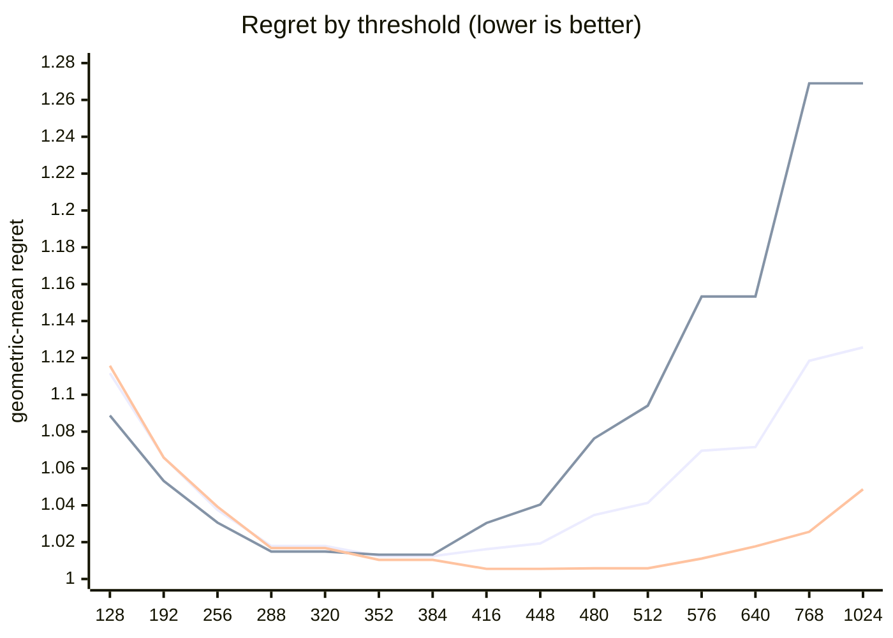

# QR dispatch crossover — Apple M1

What every section and number below means: [reading-reports.md](https://github.com/c0rmac/metal-linalg/blob/main/docs/reading-reports.md).

Generated by `tuning/tune_qr.py`. 421 shapes, 758 shape/backend pairs measured twice.

| | |
|---|---|
| Device | Apple M1 |
| GPU cores | 8 |
| Resident matrices (`qr_unblocked`) | 48 |
| Shapes measured | 421 |
| Coverage | near-square 72, square 157, tall 146, wide 46 |

## The band

```
M >= 384  ->  qr_streaming_amx_reduced
otherwise  ->  qr_unblocked
```

The optimum is flat from **352 to 384** rows (every threshold within 0.3% of the best, 1.0124x). Any value inside that band is equivalent on this hardware; **384** is the middle of it.

Paste into `kTuned[]` in `src/qr.mm`:

```c
    {"Apple M1", 8, 384, 384, 16,   kQrNoLimit, 0, 1, 0,   0, 0,   0},
```

### Cost of missing the band

| threshold | regret | excess | |
|---|---|---|---|
| 128 | 1.1117x | +9.81% |  |
| 192 | 1.0660x | +5.29% |  |
| 256 | 1.0375x | +2.48% |  |
| 288 | 1.0179x | +0.54% |  |
| 320 | 1.0179x | +0.54% |  |
| 352 | 1.0124x | +0.00% | **in band** |
| 384 | 1.0124x | +0.00% | **in band** |
| 416 | 1.0162x | +0.38% |  |
| 448 | 1.0193x | +0.68% |  |
| 480 | 1.0347x | +2.20% |  |
| 512 | 1.0413x | +2.85% |  |
| 576 | 1.0696x | +5.65% |  |
| 640 | 1.0716x | +5.85% |  |
| 768 | 1.1184x | +10.47% |  |
| 1024 | 1.1257x | +11.19% |  |

The penalty is usually asymmetric. Erring low costs little; erring high degrades specifically on tall inputs. Adding GPU cores makes the grid-parallel backend relatively stronger and pushes the true crossover down, so an untuned device is safer low than high.

## GPU or CPU

No CPU timings in these runs (they predate QR's CPU path), so the row sends every call to the GPU, as before.

## Regret by threshold

Regret is how much slower the chosen backend is than the best one measured at that shape; 1.0000x would be a perfect oracle. The per-region curves are the point: a grid covering only one aspect ratio can be nearly flat, and will then pick a threshold out of noise.



Series order: pooled, tall only, square only.

| threshold | pooled | square | tall | wide | near-square | pooled worst |
|---|---|---|---|---|---|---|
| 128 | 1.1117 | 1.1157 | 1.0887 | 1.1017 | 1.1602 | 3.69x |
| 192 | 1.0660 | 1.0659 | 1.0532 | 1.0315 | 1.1155 | 2.20x |
| 256 | 1.0375 | 1.0392 | 1.0306 | 1.0087 | 1.0684 | 1.84x |
| 288 | 1.0179 | 1.0168 | 1.0149 | 1.0010 | 1.0370 | 1.48x |
| 320 | 1.0179 | 1.0168 | 1.0149 | 1.0010 | 1.0370 | 1.48x |
| 352 | 1.0124 | 1.0104 | 1.0132 | 1.0010 | 1.0210 | 1.36x |
| 384 | 1.0124 | 1.0104 | 1.0132 | 1.0010 | 1.0210 | 1.36x |
| 416 | 1.0162 | 1.0055 | 1.0304 | 1.0010 | 1.0135 | 1.54x |
| 448 | 1.0193 | 1.0055 | 1.0404 | 1.0010 | 1.0099 | 1.54x |
| 480 | 1.0347 | 1.0058 | 1.0762 | 1.0010 | 1.0183 | 1.95x |
| 512 | 1.0413 | 1.0058 | 1.0941 | 1.0010 | 1.0177 | 1.95x |
| 576 | 1.0696 | 1.0111 | 1.1533 | 1.0010 | 1.0421 | 2.21x |
| 640 | 1.0716 | 1.0177 | 1.1533 | 1.0010 | 1.0421 | 2.21x |
| 768 | 1.1184 | 1.0256 | 1.2690 | 1.0010 | 1.0583 | 3.26x |
| 1024 | 1.1257 | 1.0487 | 1.2690 | 1.0010 | 1.0583 | 3.26x |

## Which feature decides

`qr_unblocked` gives each matrix a single threadgroup, which sweeps `M` rows per Householder reflection while `N` parallelises across that threadgroup's threads. Rows and columns are therefore not interchangeable, and a rule on `max(M, N)` cannot express the difference.

| feature | best threshold | geomean regret | worst |
|---|---|---|---|
| M (rows) | 352 | 1.0124x | 1.36x |
| max(M, N) | 352 | 1.0445x | 2.31x |
| K = min(M, N) | 256 | 1.1858x | 9.90x |

## Decision surface

**batch 1**

```
      N=32      N=64      N=128     N=256     N=512     
      ---------------------------------------------
  128 .  1.21     1.39     1.74     1.66     1.55
  256 ## 0.84  .  1.16     1.49     1.59     1.45
  384 ## 0.66  ## 0.81  .  1.07  .  1.15  .  1.12   <- M >= 384
  512 ###0.47  ## 0.61  ## 0.81  #  0.89  ~  0.95
  640 ###0.39  ###0.46  ## 0.62  ## 0.68  ## 0.72

      ratio = reduced / unblocked.  ### <0.60  ## <0.85  # <0.95
      ~ tie (0.95-1.05)   . <1.30   blank >1.30  (unblocked wins)
```

**batch 16**

```
      N=32      N=64      N=128     N=256     N=512     
      ---------------------------------------------
  128 .  1.08  .  1.28     1.58  .  1.16  .  1.13
  256 #  0.90  ~  1.00  .  1.11  .  1.11  .  1.09
  384 ## 0.74  ## 0.81  #  0.85  ## 0.85  ~  0.97   <- M >= 384
  512 ###0.51  ###0.59  ## 0.63  ## 0.69  #  0.87
  640 ###0.31  ###0.46  ###0.50  ###0.57  ## 0.73

      ratio = reduced / unblocked.  ### <0.60  ## <0.85  # <0.95
      ~ tie (0.95-1.05)   . <1.30   blank >1.30  (unblocked wins)
```

## Candidate rules

Per-region columns matter more than the overall number: an aggregate can look excellent while one aspect class is badly served.

| rule | geomean | worst | >10% off | square | tall | wide | near-square |
|---|---|---|---|---|---|---|---|
| original 5-rule heuristic | 1.1124x | 3.63x | 115/372 | 1.067 | 1.063 | 1.390 | 1.126 |
| max(M,N) >= 512 | 1.0747x | 2.31x | 86/372 | 1.006 | 1.094 | 1.249 | 1.040 |
| K = min(M,N) >= 128 | 1.1948x | 9.90x | 153/372 | 1.116 | 1.323 | 1.102 | 1.134 |
| M >= 384  (chosen) | 1.0124x | 1.36x | 21/372 | 1.010 | 1.013 | 1.001 | 1.021 |

## Refinements tested

Both of these were rejected on an 8-core M1, and both are re-tested here rather than assumed. A GPU with many more cores saturates `qr_unblocked` much later, so the batch split in particular could be justified elsewhere. Each is fitted on half the shapes and scored on the other half.

Baseline for comparison — `M >= 384` on the held-out half: **1.0137x** geomean, 1.36x worst.

| refinement | fitted form | train | held-out | held-out worst | verdict |
|---|---|---|---|---|---|
| batch-dependent split | `M >= (352 if batch < 2 else 352)` | 1.0110x | 1.0137x | 1.36x | reject |
| narrow-N special case | `M >= 448 or (N <= 64 and M >= 224)` | 1.0086x | 1.0206x | 1.84x | reject |

> Neither refinement survived. Ship the plain threshold. A refinement that looks good on the training half and not on the held-out half is fitting noise, which is exactly what the split is there to catch.

## Measurement noise

Run-to-run ratio over 758 shape/backend pairs measured twice: median 1.034x, p90 1.167x, max 1.787x.

| runtime | pairs | median | p90 | max |
|---|---|---|---|---|
| <1 ms | 33 | 1.291x | 1.474x | 1.597x |
| 1-3 ms | 220 | 1.052x | 1.233x | 1.787x |
| 3-10 ms | 228 | 1.027x | 1.086x | 1.663x |
| 10-30 ms | 151 | 1.024x | 1.091x | 1.633x |
| 30-100 ms | 92 | 1.022x | 1.097x | 1.441x |
| >100 ms | 34 | 1.039x | 1.117x | 1.196x |

Noise concentrates in fast shapes, where submission jitter dominates. A difference smaller than the p90 figure for its size bucket is not a result.

---

Raw timings in `raw.csv`; full analysis including plot-ready series in `results.json`. Re-render this report without remeasuring: `python3 tuning/tune_qr.py --from results.json`.
