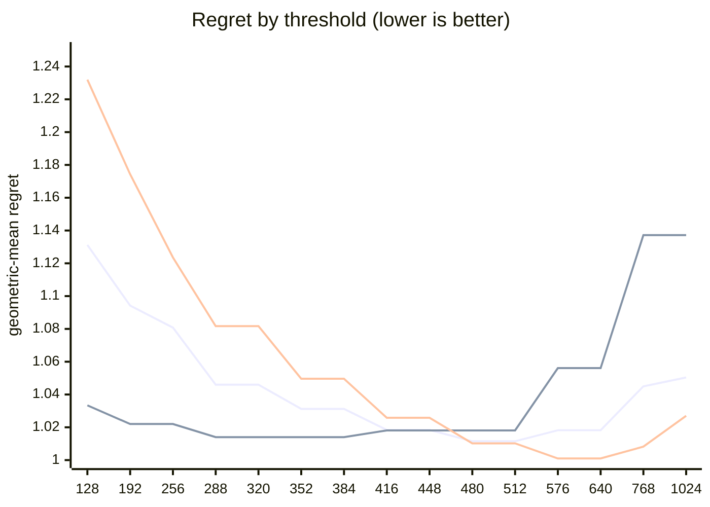

# QR dispatch crossover — Apple M5 Pro

What every section and number below means: [reading-reports.md](https://github.com/c0rmac/metal-linalg/blob/main/docs/reading-reports.md).

Generated by `tuning/tune_qr.py`. 143 shapes, 286 shape/backend pairs measured twice.

| | |
|---|---|
| Device | Apple M5 Pro |
| GPU cores | 20 |
| Resident matrices (`qr_unblocked`) | 120 |
| Shapes measured | 143 |
| Coverage | near-square 29, square 40, tall 44, wide 30 |

## The band

```
M >= 512  ->  qr_streaming_amx_reduced
otherwise  ->  qr_unblocked
```

The optimum is flat from **480 to 512** rows (every threshold within 0.3% of the best, 1.0115x). Any value inside that band is equivalent on this hardware; **512** is the middle of it.

Paste into `kTuned[]` in `src/qr.mm`:

```c
    {"Apple M5 Pro", 20, 512, 512, 16},
```

### Cost of missing the band

| threshold | regret | excess | |
|---|---|---|---|
| 128 | 1.1312x | +11.83% |  |
| 192 | 1.0942x | +8.18% |  |
| 256 | 1.0808x | +6.85% |  |
| 288 | 1.0460x | +3.41% |  |
| 320 | 1.0460x | +3.41% |  |
| 352 | 1.0312x | +1.95% |  |
| 384 | 1.0312x | +1.95% |  |
| 416 | 1.0184x | +0.68% |  |
| 448 | 1.0184x | +0.68% |  |
| 480 | 1.0115x | +0.00% | **in band** |
| 512 | 1.0115x | +0.00% | **in band** |
| 576 | 1.0182x | +0.66% |  |
| 640 | 1.0182x | +0.66% |  |
| 768 | 1.0450x | +3.31% |  |
| 1024 | 1.0504x | +3.85% |  |

The penalty is usually asymmetric. Erring low costs little; erring high degrades specifically on tall inputs. Adding GPU cores makes the grid-parallel backend relatively stronger and pushes the true crossover down, so an untuned device is safer low than high.

## Regret by threshold

Regret is how much slower the chosen backend is than the best one measured at that shape; 1.0000x would be a perfect oracle. The per-region curves are the point: a grid covering only one aspect ratio can be nearly flat, and will then pick a threshold out of noise.



Series order: pooled, tall only, square only.

| threshold | pooled | square | tall | wide | near-square | pooled worst |
|---|---|---|---|---|---|---|
| 128 | 1.1312 | 1.2320 | 1.0334 | 1.0575 | 1.2367 | 1.89x |
| 192 | 1.0942 | 1.1743 | 1.0220 | 1.0224 | 1.1811 | 1.64x |
| 256 | 1.0808 | 1.1236 | 1.0220 | 1.0224 | 1.1811 | 1.54x |
| 288 | 1.0460 | 1.0817 | 1.0140 | 1.0037 | 1.0925 | 1.39x |
| 320 | 1.0460 | 1.0817 | 1.0140 | 1.0037 | 1.0925 | 1.39x |
| 352 | 1.0312 | 1.0496 | 1.0140 | 1.0037 | 1.0616 | 1.30x |
| 384 | 1.0312 | 1.0496 | 1.0140 | 1.0037 | 1.0616 | 1.30x |
| 416 | 1.0184 | 1.0258 | 1.0181 | 1.0037 | 1.0241 | 1.23x |
| 448 | 1.0184 | 1.0258 | 1.0181 | 1.0037 | 1.0241 | 1.23x |
| 480 | 1.0115 | 1.0102 | 1.0181 | 1.0037 | 1.0116 | 1.22x |
| 512 | 1.0115 | 1.0102 | 1.0181 | 1.0037 | 1.0116 | 1.22x |
| 576 | 1.0182 | 1.0010 | 1.0561 | 1.0037 | 1.0007 | 1.61x |
| 640 | 1.0182 | 1.0010 | 1.0561 | 1.0037 | 1.0007 | 1.61x |
| 768 | 1.0450 | 1.0082 | 1.1372 | 1.0037 | 1.0069 | 1.97x |
| 1024 | 1.0504 | 1.0270 | 1.1372 | 1.0037 | 1.0069 | 1.97x |

## Which feature decides

`qr_unblocked` gives each matrix a single threadgroup, which sweeps `M` rows per Householder reflection while `N` parallelises across that threadgroup's threads. Rows and columns are therefore not interchangeable, and a rule on `max(M, N)` cannot express the difference.

| feature | best threshold | geomean regret | worst |
|---|---|---|---|
| M (rows) | 480 | 1.0115x | 1.22x |
| max(M, N) | 576 | 1.0411x | 1.61x |
| K = min(M, N) | 576 | 1.1160x | 5.81x |

## Decision surface

**batch 1**

```
      N=32      N=64      N=128     N=256     N=512     
      ---------------------------------------------
  128 .  1.27     1.44     1.51     1.48     1.49
  256 ~  1.02  .  1.09     1.39     1.54     1.40
  384 #  0.92  ~  0.99  .  1.22  .  1.25  .  1.19
  512 ## 0.66  #  0.85  ~  1.04  ~  1.03  ~  1.04   <- M >= 512
  640 ###0.51  ## 0.69  #  0.86  ## 0.83  ## 0.82

      ratio = reduced / unblocked.  ### <0.60  ## <0.85  # <0.95
      ~ tie (0.95-1.05)   . <1.30   blank >1.30  (unblocked wins)
```

**batch 16**

```
      N=32      N=64      N=128     N=256     N=512     
      ---------------------------------------------
  128 .  1.28  .  1.27     1.52     1.41     1.36
  256 ~  1.03  .  1.09     1.32     1.42     1.31
  384 ## 0.82  #  0.94  .  1.17  .  1.25  .  1.22
  512 ## 0.62  ## 0.81  ~  1.00  .  1.09  .  1.20   <- M >= 512
  640 ###0.51  ## 0.65  ## 0.80  #  0.91  ~  1.02

      ratio = reduced / unblocked.  ### <0.60  ## <0.85  # <0.95
      ~ tie (0.95-1.05)   . <1.30   blank >1.30  (unblocked wins)
```

## Candidate rules

Per-region columns matter more than the overall number: an aggregate can look excellent while one aspect class is badly served.

| rule | geomean | worst | >10% off | square | tall | wide | near-square |
|---|---|---|---|---|---|---|---|
| original 5-rule heuristic | 1.1322x | 1.60x | 61/143 | 1.116 | 1.029 | 1.294 | 1.162 |
| max(M,N) >= 512 | 1.0564x | 1.49x | 27/143 | 1.010 | 1.018 | 1.195 | 1.046 |
| K = min(M,N) >= 128 | 1.2239x | 5.81x | 73/143 | 1.232 | 1.353 | 1.058 | 1.211 |
| M >= 512  (chosen) | 1.0115x | 1.22x | 5/143 | 1.010 | 1.018 | 1.004 | 1.012 |

## Refinements tested

Both of these were rejected on an 8-core M1, and both are re-tested here rather than assumed. A GPU with many more cores saturates `qr_unblocked` much later, so the batch split in particular could be justified elsewhere. Each is fitted on half the shapes and scored on the other half.

Baseline for comparison — `M >= 512` on the held-out half: **1.0125x** geomean, 1.22x worst.

| refinement | fitted form | train | held-out | held-out worst | verdict |
|---|---|---|---|---|---|
| batch-dependent split | `M >= (480 if batch < 32 else 416)` | 1.0106x | 1.0142x | 1.22x | reject |
| narrow-N special case | `M >= 416 or (N <= 64 and M >= 288)` | 1.0132x | 1.0162x | 1.17x | reject |

> Neither refinement survived. Ship the plain threshold. A refinement that looks good on the training half and not on the held-out half is fitting noise, which is exactly what the split is there to catch.

## Measurement noise

Run-to-run ratio over 286 shape/backend pairs measured twice: median 1.015x, p90 1.175x, max 1.913x.

| runtime | pairs | median | p90 | max |
|---|---|---|---|---|
| <1 ms | 40 | 1.105x | 1.323x | 1.913x |
| 1-3 ms | 124 | 1.022x | 1.168x | 1.637x |
| 3-10 ms | 92 | 1.006x | 1.042x | 1.196x |
| 10-30 ms | 23 | 1.005x | 1.020x | 1.028x |
| 30-100 ms | 6 | 1.002x | 1.017x | 1.018x |
| >100 ms | 1 | 1.006x | 1.006x | 1.006x |

Noise concentrates in fast shapes, where submission jitter dominates. A difference smaller than the p90 figure for its size bucket is not a result.

---

Raw timings in `raw.csv`; full analysis including plot-ready series in `results.json`. Re-render this report without remeasuring: `python3 tuning/tune_qr.py --from results.json`.
