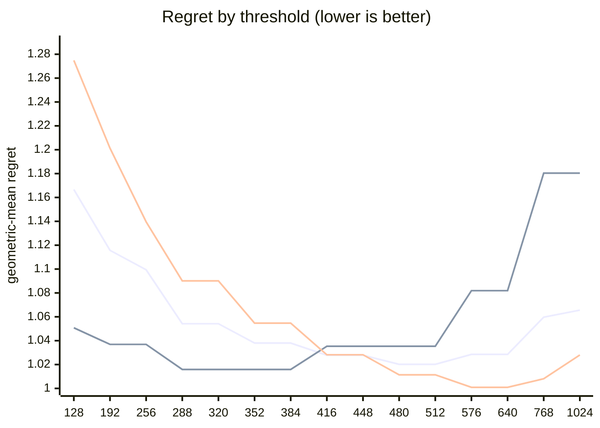

# QR dispatch crossover — Apple M5 Pro

What every section and number below means: [reading-reports.md](https://github.com/c0rmac/metal-linalg/blob/main/docs/reading-reports.md).

Generated by `tuning/tune_qr.py`. 143 shapes, 286 shape/backend pairs measured twice.

| | |
|---|---|
| Device | Apple M5 Pro |
| GPU cores | 20 |
| Resident matrices (`qr_unblocked`) | 120 |
| Shapes measured | 143 |
| Coverage | near-square 29, square 40, tall 44, wide 30 |

## The band

```
M >= 512  ->  qr_streaming_amx_reduced
otherwise  ->  qr_unblocked
```

The optimum is flat from **480 to 512** rows (every threshold within 0.3% of the best, 1.0202x). Any value inside that band is equivalent on this hardware; **512** is the middle of it.

Paste into `kTuned[]` in `src/qr.mm`:

```c
    {"Apple M5 Pro", 20, 512, 512, 16},
```

### Cost of missing the band

| threshold | regret | excess | |
|---|---|---|---|
| 128 | 1.1667x | +14.36% |  |
| 192 | 1.1157x | +9.36% |  |
| 256 | 1.0994x | +7.76% |  |
| 288 | 1.0542x | +3.33% |  |
| 320 | 1.0542x | +3.33% |  |
| 352 | 1.0380x | +1.74% |  |
| 384 | 1.0380x | +1.74% |  |
| 416 | 1.0278x | +0.74% |  |
| 448 | 1.0278x | +0.74% |  |
| 480 | 1.0202x | +0.00% | **in band** |
| 512 | 1.0202x | +0.00% | **in band** |
| 576 | 1.0285x | +0.81% |  |
| 640 | 1.0285x | +0.81% |  |
| 768 | 1.0597x | +3.87% |  |
| 1024 | 1.0656x | +4.45% |  |

The penalty is usually asymmetric. Erring low costs little; erring high degrades specifically on tall inputs. Adding GPU cores makes the grid-parallel backend relatively stronger and pushes the true crossover down, so an untuned device is safer low than high.

## Regret by threshold

Regret is how much slower the chosen backend is than the best one measured at that shape; 1.0000x would be a perfect oracle. The per-region curves are the point: a grid covering only one aspect ratio can be nearly flat, and will then pick a threshold out of noise.



Series order: pooled, tall only, square only.

| threshold | pooled | square | tall | wide | near-square | pooled worst |
|---|---|---|---|---|---|---|
| 128 | 1.1667 | 1.2749 | 1.0508 | 1.0849 | 1.3042 | 2.16x |
| 192 | 1.1157 | 1.2013 | 1.0369 | 1.0380 | 1.2134 | 1.81x |
| 256 | 1.0994 | 1.1396 | 1.0369 | 1.0380 | 1.2134 | 1.67x |
| 288 | 1.0542 | 1.0901 | 1.0159 | 1.0160 | 1.1062 | 1.61x |
| 320 | 1.0542 | 1.0901 | 1.0159 | 1.0160 | 1.1062 | 1.61x |
| 352 | 1.0380 | 1.0547 | 1.0159 | 1.0160 | 1.0725 | 1.61x |
| 384 | 1.0380 | 1.0547 | 1.0159 | 1.0160 | 1.0725 | 1.61x |
| 416 | 1.0278 | 1.0282 | 1.0353 | 1.0160 | 1.0285 | 1.61x |
| 448 | 1.0278 | 1.0282 | 1.0353 | 1.0160 | 1.0285 | 1.61x |
| 480 | 1.0202 | 1.0114 | 1.0353 | 1.0160 | 1.0139 | 1.61x |
| 512 | 1.0202 | 1.0114 | 1.0353 | 1.0160 | 1.0139 | 1.61x |
| 576 | 1.0285 | 1.0009 | 1.0819 | 1.0160 | 1.0016 | 1.87x |
| 640 | 1.0285 | 1.0009 | 1.0819 | 1.0160 | 1.0016 | 1.87x |
| 768 | 1.0597 | 1.0081 | 1.1804 | 1.0160 | 1.0071 | 2.30x |
| 1024 | 1.0656 | 1.0280 | 1.1804 | 1.0160 | 1.0071 | 2.30x |

## Which feature decides

`qr_unblocked` gives each matrix a single threadgroup, which sweeps `M` rows per Householder reflection while `N` parallelises across that threadgroup's threads. Rows and columns are therefore not interchangeable, and a rule on `max(M, N)` cannot express the difference.

| feature | best threshold | geomean regret | worst |
|---|---|---|---|
| M (rows) | 480 | 1.0202x | 1.61x |
| max(M, N) | 576 | 1.0678x | 2.09x |
| K = min(M, N) | 576 | 1.1375x | 6.42x |

## Decision surface

**batch 1**

```
      N=32      N=64      N=128     N=256     N=512     
      ---------------------------------------------
  128    1.38     1.73     1.82     1.76     1.69
  256 ~  0.99  .  1.19     1.55     1.67     1.48
  384 ## 0.69  ~  0.99  .  1.24  .  1.30  .  1.22
  512 ###0.53  ## 0.79  .  1.07  ~  1.04  .  1.07   <- M >= 512
  640 ###0.46  ## 0.63  #  0.85  ## 0.83  ## 0.81

      ratio = reduced / unblocked.  ### <0.60  ## <0.85  # <0.95
      ~ tie (0.95-1.05)   . <1.30   blank >1.30  (unblocked wins)
```

**batch 16**

```
      N=32      N=64      N=128     N=256     N=512     
      ---------------------------------------------
  128    1.31     1.72     1.64     1.55     1.42
  256 #  0.88  .  1.19     1.44     1.50     1.32
  384 ## 0.66  #  0.94  .  1.20  .  1.29  .  1.27
  512 ###0.58  ## 0.77  ~  1.01  .  1.12  .  1.19   <- M >= 512
  640 ###0.43  ###0.58  ## 0.76  #  0.90  ~  1.05

      ratio = reduced / unblocked.  ### <0.60  ## <0.85  # <0.95
      ~ tie (0.95-1.05)   . <1.30   blank >1.30  (unblocked wins)
```

## Candidate rules

Per-region columns matter more than the overall number: an aggregate can look excellent while one aspect class is badly served.

| rule | geomean | worst | >10% off | square | tall | wide | near-square |
|---|---|---|---|---|---|---|---|
| original 5-rule heuristic | 1.1942x | 2.12x | 62/143 | 1.144 | 1.048 | 1.521 | 1.203 |
| max(M,N) >= 512 | 1.0806x | 2.09x | 27/143 | 1.011 | 1.035 | 1.288 | 1.053 |
| K = min(M,N) >= 128 | 1.2722x | 6.42x | 75/143 | 1.275 | 1.428 | 1.085 | 1.256 |
| M >= 512  (chosen) | 1.0202x | 1.61x | 7/143 | 1.011 | 1.035 | 1.016 | 1.014 |

## Refinements tested

Both of these were rejected on an 8-core M1, and both are re-tested here rather than assumed. A GPU with many more cores saturates `qr_unblocked` much later, so the batch split in particular could be justified elsewhere. Each is fitted on half the shapes and scored on the other half.

Baseline for comparison — `M >= 512` on the held-out half: **1.0170x** geomean, 1.51x worst.

| refinement | fitted form | train | held-out | held-out worst | verdict |
|---|---|---|---|---|---|
| batch-dependent split | `M >= (480 if batch < 32 else 416)` | 1.0233x | 1.0188x | 1.51x | reject |
| narrow-N special case | `M >= 416 or (N <= 32 and M >= 128)` | 1.0224x | 1.0298x | 1.38x | reject |

> Neither refinement survived. Ship the plain threshold. A refinement that looks good on the training half and not on the held-out half is fitting noise, which is exactly what the split is there to catch.

## Measurement noise

Run-to-run ratio over 286 shape/backend pairs measured twice: median 1.008x, p90 1.071x, max 2.721x.

| runtime | pairs | median | p90 | max |
|---|---|---|---|---|
| <1 ms | 85 | 1.033x | 1.493x | 2.721x |
| 1-3 ms | 95 | 1.005x | 1.024x | 1.048x |
| 3-10 ms | 78 | 1.004x | 1.025x | 1.109x |
| 10-30 ms | 22 | 1.005x | 1.015x | 1.024x |
| 30-100 ms | 6 | 1.009x | 1.015x | 1.037x |

Noise concentrates in fast shapes, where submission jitter dominates. A difference smaller than the p90 figure for its size bucket is not a result.

---

Raw timings in `raw.csv`; full analysis including plot-ready series in `results.json`. Re-render this report without remeasuring: `python3 tuning/tune_qr.py --from results.json`.
