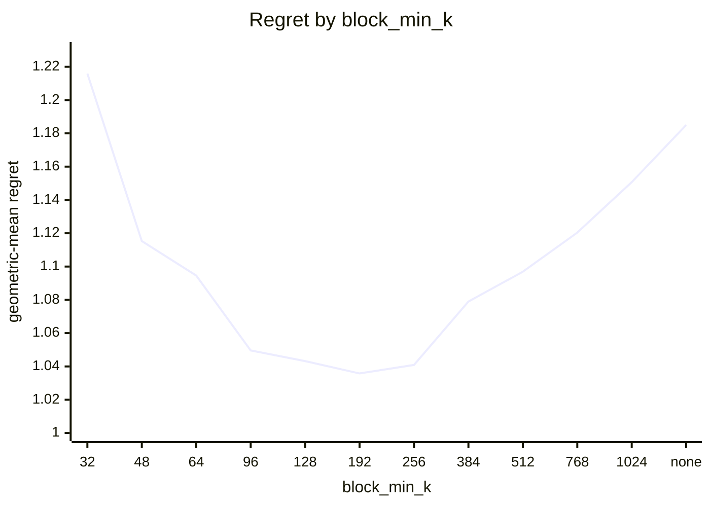
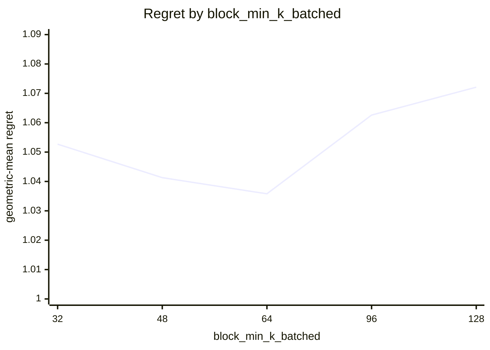
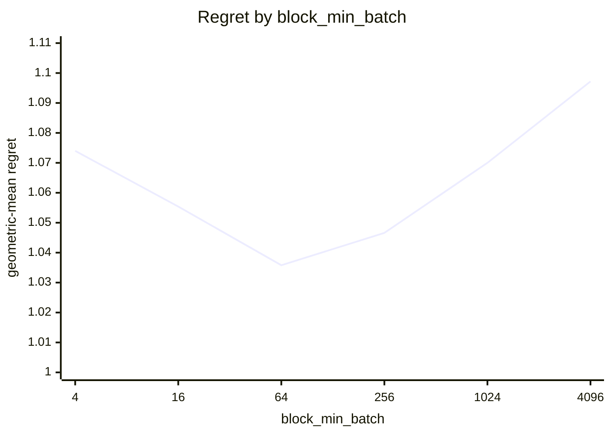
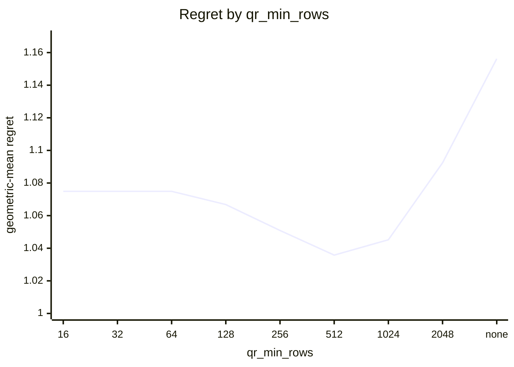
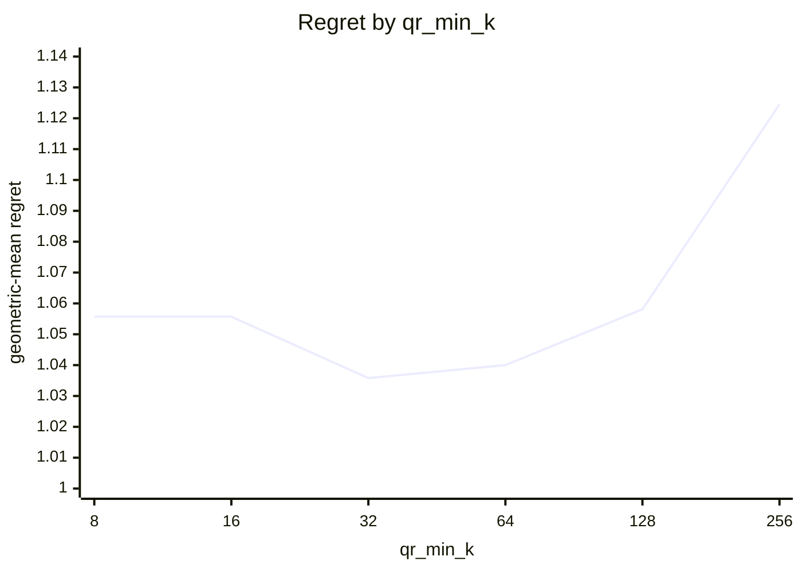
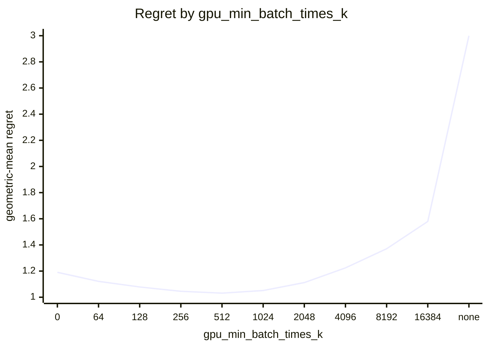
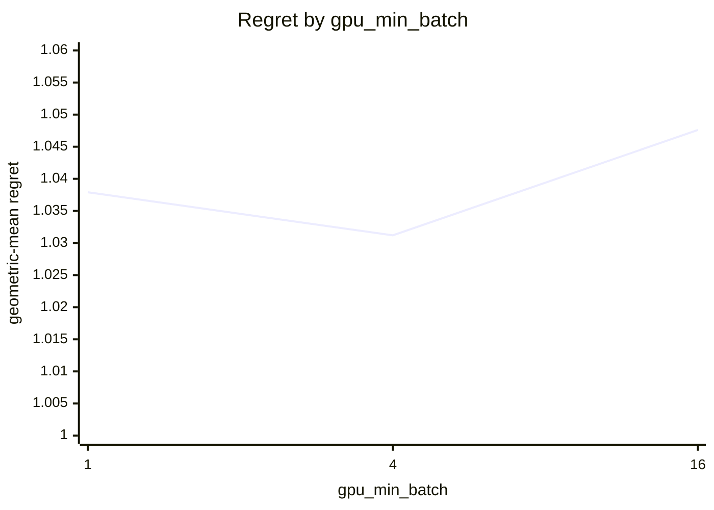
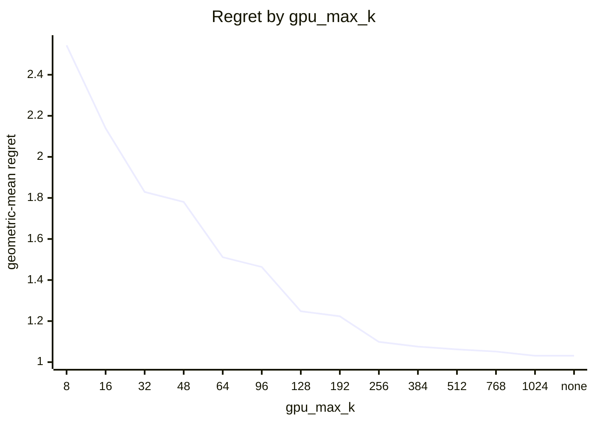

# SVD routing on Apple M5 Pro (20 GPU cores)

What every section and number below means: [reading-reports.md](https://github.com/c0rmac/metal-linalg/blob/main/docs/reading-reports.md).

Cost model scaled to this device from one probe point: block x0.24, cpu x0.68, jacobi x0.10, qr x0.20, qrblock x0.24 (1.00 is an M1).

Machine state: load 5.4/18 at the start, load 5.9/18 at the end; power mains.

Probe point after the sweep relative to before it: block x1.00, cpu x1.01, jacobi x0.99, qr x0.98, qrblock x1.00 (stable).

Generated by `tuning/tune_svd.py` from 267 (shape, batch) points, 41 shapes with M >= N, batch in [1, 4, 16, 64, 256, 1024, 4096], five backends, two or more passes, min-of-repeats.

## Answer

Row for `kTuned[]` in `src/svd.mm`:

```cpp
// device, GPU cores,   qr_min_rows, qr_min_k,   block_min_k, block_min_k_batched, block_min_batch,   gpu_max_k, gpu_min_batch_times_k, gpu_min_batch
{"Apple M5 Pro", 20,   512, 32,   192, 64, 64,   1024, 512, 4},
```

To try it without rebuilding:

```sh
SVD_QR_MIN_ROWS=512 SVD_QR_MIN_K=32 SVD_BLOCK_MIN_K=192 SVD_BLOCK_MIN_K_BATCHED=64 SVD_BLOCK_MIN_BATCH=64 SVD_GPU_MAX_K=1024 SVD_GPU_MIN_BATCH_TIMES_K=512 SVD_GPU_MIN_BATCH=4
```

The policy in effect on this device came from `tuned:Apple M5 Pro`. Against the best measured backend at every point the fitted rule scores 1.0312 geometric-mean regret, worst 1.83x, 30 of 267 points losing more than 10%, and 1.020x the oracle's total time.

## Warnings

- chosen rule loses more than 25% at 512x32 batch=16 (qr, 1.83x), 256x32 batch=4096 (jacobi, 1.70x), 1024x32 batch=16 (qr, 1.62x), 512x32 batch=4096 (qr, 1.61x), 512x32 batch=1024 (qr, 1.50x), 256x32 batch=1024 (jacobi, 1.48x), 1024x32 batch=4096 (qr, 1.46x), 1024x32 batch=1024 (qr, 1.45x) ...
- GPU split loses more than 25% against the best GPU backend at 512x32 batch=16 (qr, 1.83x), 256x32 batch=4096 (jacobi, 1.70x), 1024x32 batch=16 (qr, 1.62x), 512x32 batch=4096 (qr, 1.61x), 512x32 batch=4 (qr, 1.58x), 512x32 batch=1 (qr, 1.53x), 512x32 batch=1024 (qr, 1.50x), 256x32 batch=1024 (jacobi, 1.48x) ...
- the GPU is still ahead of the CPU at the largest k measured (1024): gpu_max_k is a lower bound, rerun with a larger --max-k to find the cap

## Stage 1: which GPU backend

Scored against the best GPU backend at each of the 267 points, as if there were no CPU: this is the rule a forced-GPU call (`SVD_DEVICE=gpu`) follows, and what a GPU with more cores will lean on. Two independent choices. Precondition with QR iff the long side is at least `qr_min_rows`, the short side at least `qr_min_k`, and the long side at least twice the short one. Block kernel iff the short side is at least `block_min_k`, or at least `block_min_k_batched` in a batch of `block_min_batch` or more.

| rule | geomean regret | worst | >10% | total time / oracle | est. picks |
|---|---|---|---|---|---|
| policy in effect ('512', '32', '192', '64', '64') | 1.0358 | 1.83x | 33 | 1.020 | 0 |
| fitted ('512', '32', '192', '64', '64') | 1.0358 | 1.83x | 33 | 1.020 | 0 |

Without a batch term, 4 of 588 combinations are within 0.5% of the best geomean: qr_min_rows 256 .. 512, qr_min_k 32 .. 64, block_min_k 96 .. 128.

With the batch term adopted (below), 2 combinations are within 0.5% of the best: block_min_k 192 .. 256, block_min_k_batched 64 .. 64, block_min_batch 64 .. 64. The curves vary one constant around the chosen combination.



| block_min_k | 32 | 48 | 64 | 96 | 128 | 192 | 256 | 384 | 512 | 768 | 1024 | none |
|---|---|---|---|---|---|---|---|---|---|---|---|---|
| geomean | 1.2159 | 1.1153 | 1.0946 | 1.0496 | 1.0432 | 1.0358 | 1.0409 | 1.0790 | 1.0969 | 1.1204 | 1.1507 | 1.1850 |
| worst | 6.88x | 3.40x | 2.88x | 1.83x | 1.83x | 1.83x | 1.83x | 2.77x | 5.10x | 8.24x | 15.87x | 24.52x |



| block_min_k_batched | 32 | 48 | 64 | 96 | 128 |
|---|---|---|---|---|---|
| geomean | 1.0527 | 1.0413 | 1.0358 | 1.0626 | 1.0721 |
| worst | 2.58x | 1.95x | 1.83x | 2.42x | 2.42x |



| block_min_batch | 4 | 16 | 64 | 256 | 1024 | 4096 |
|---|---|---|---|---|---|---|
| geomean | 1.0740 | 1.0554 | 1.0358 | 1.0466 | 1.0700 | 1.0972 |
| worst | 2.56x | 2.54x | 1.83x | 2.34x | 2.47x | 2.48x |



| qr_min_rows | 16 | 32 | 64 | 128 | 256 | 512 | 1024 | 2048 | none |
|---|---|---|---|---|---|---|---|---|---|
| geomean | 1.0749 | 1.0749 | 1.0749 | 1.0668 | 1.0509 | 1.0358 | 1.0452 | 1.0924 | 1.1562 |
| worst | 2.36x | 2.36x | 2.36x | 2.36x | 2.36x | 1.83x | 2.35x | 4.27x | 6.26x |



| qr_min_k | 8 | 16 | 32 | 64 | 128 | 256 |
|---|---|---|---|---|---|---|
| geomean | 1.0557 | 1.0557 | 1.0358 | 1.0400 | 1.0581 | 1.1245 |
| worst | 3.56x | 3.56x | 1.83x | 3.59x | 3.59x | 6.26x |

Held-out check of a batch-dependent block crossover (block from a smaller k once the batch is large enough), fitted on 151 points and scored on the other 116; the verdict is a bootstrap over the test points.

| rule | fitted on train | train geomean | test geomean | test worst | verdict |
|---|---|---|---|---|---|
| one block crossover | ["512", "32", "128", "none", "none"] | 1.0651 | 1.0990 | 2.42x | baseline |
| batch-dependent block crossover | {"block_min": "192", "block_lo": "64", "batch_hi": "64"} | 1.0373 | 1.0339 | 1.83x | **justified** (better in 100% of resamples, median gain 6.2%) |

Best GPU backend per point (`J` whole-matrix kernel, `B` block kernel, `j` and `b` the same after QR), then what the rule picks:

```
      M x N  \ batch     1     4    16    64   256  1024  4096
      4 x 4               J     J     J     J     J     J     J
      8 x 8               J     J     J     J     J     J     J
     16 x 8               J     J     J     J     J     J     J
     32 x 8               J     J     J     J     J     J     J
     64 x 8               J     J     J     J     J     J     J
    128 x 8               J     J     J     J     J     J     J
    256 x 8               J     J     J     J     J     J     J
     16 x 16              J     J     J     J     J     J     J
     32 x 16              J     J     J     j     J     J     J
     64 x 16              J     J     J     j     J     J     J
    128 x 16              J     J     J     J     J     J     J
    256 x 16              J     J     J     j     J     J     J
    512 x 16              J     J     J     J     J     J     J
     32 x 32              J     J     J     J     J     B     B
     64 x 32              J     J     j     J     J     B     B
    128 x 32              J     J     J     J     J     J     B
    256 x 32              J     J     J     J     B     B     B
    512 x 32              J     J     J     J     B     B     B
   1024 x 32              J     J     J     j     B     B     B
     48 x 48              J     J     J     J     J     J     J
     64 x 64              J     J     J     J     B     B     B
    128 x 64              J     J     J     J     B     B     B
    256 x 64              J     J     J     B     B     B     B
    512 x 64              J     J     J     B     B     B     B
   1024 x 64              j     j     j     j     B     B     B
   2048 x 64              j     j     j     j     B     B     j
     96 x 96              J     J     J     B     B     B     B
    128 x 128             J     J     J     B     B     B     B
    256 x 128             j     j     j     B     b     b     B
    512 x 128             j     j     j     B     b     b     b
   1024 x 128             j     j     j     b     b     b     b
   2048 x 128             j     j     j     b     b     b     .
    192 x 192             B     B     B     B     B     B     .
    256 x 256             B     B     B     B     B     B     .
    512 x 256             B     B     b     b     b     b     .
   1024 x 256             b     b     b     b     b     b     .
   2048 x 256             b     b     b     b     b     .     .
    384 x 384             B     B     B     B     B     .     .
    512 x 512             B     B     B     B     .     .     .
    768 x 768             B     B     B     .     .     .     .
   1024 x 1024            B     B     B     .     .     .     .
```

```
      M x N  \ batch     1     4    16    64   256  1024  4096
      4 x 4               J     J     J     J     J     J     J
      8 x 8               J     J     J     J     J     J     J
     16 x 8               J     J     J     J     J     J     J
     32 x 8               J     J     J     J     J     J     J
     64 x 8               J     J     J     J     J     J     J
    128 x 8               J     J     J     J     J     J     J
    256 x 8               J     J     J     J     J     J     J
     16 x 16              J     J     J     J     J     J     J
     32 x 16              J     J     J     J     J     J     J
     64 x 16              J     J     J     J     J     J     J
    128 x 16              J     J     J     J     J     J     J
    256 x 16              J     J     J     J     J     J     J
    512 x 16              J     J     J     J     J     J     J
     32 x 32              J     J     J     J     J     J     J
     64 x 32              J     J     J     J     J     J     J
    128 x 32              J     J     J     J     J     J     J
    256 x 32              J     J     J     J     J     J     J
    512 x 32              j     j     j     j     j     j     j
   1024 x 32              j     j     j     j     j     j     j
     48 x 48              J     J     J     J     J     J     J
     64 x 64              J     J     J     B     B     B     B
    128 x 64              J     J     J     B     B     B     B
    256 x 64              J     J     J     B     B     B     B
    512 x 64              j     j     j     b     b     b     b
   1024 x 64              j     j     j     b     b     b     b
   2048 x 64              j     j     j     b     b     b     b
     96 x 96              J     J     J     B     B     B     B
    128 x 128             J     J     J     B     B     B     B
    256 x 128             J     J     J     B     B     B     B
    512 x 128             j     j     j     b     b     b     b
   1024 x 128             j     j     j     b     b     b     b
   2048 x 128             j     j     j     b     b     b     .
    192 x 192             B     B     B     B     B     B     .
    256 x 256             B     B     B     B     B     B     .
    512 x 256             b     b     b     b     b     b     .
   1024 x 256             b     b     b     b     b     b     .
   2048 x 256             b     b     b     b     b     .     .
    384 x 384             B     B     B     B     B     .     .
    512 x 512             B     B     B     B     .     .     .
    768 x 768             B     B     B     .     .     .     .
   1024 x 1024            B     B     B     .     .     .     .
```

## Stage 2: GPU or CPU

GPU iff `k <= gpu_max_k`, `batch * k >= gpu_min_batch_times_k` and `batch >= gpu_min_batch`, with k = min(M, N), scored against the best of all five backends. `worst` is over the points where the chosen backend was timed; a pick the cost model had to guess is listed in the warnings instead.

| rule | geomean regret | worst | >10% | total time / oracle | est. picks |
|---|---|---|---|---|---|
| oracle (best per point) | 1.0000 | 1.00x | 0 | 1.000 | 0 |
| policy in effect ('1024', '512', '4') | 1.0312 | 1.83x | 30 | 1.020 | 0 |
| fitted ('1024', '512', '4') | 1.0312 | 1.83x | 30 | 1.020 | 0 |

2 of 462 combinations are within 0.5% of the best geomean: gpu_max_k 1024 .. none, gpu_min_batch_times_k 512 .. 512, gpu_min_batch 4 .. 4.



| gpu_min_batch_times_k | 0 | 64 | 128 | 256 | 512 | 1024 | 2048 | 4096 | 8192 | 16384 | none |
|---|---|---|---|---|---|---|---|---|---|---|---|
| geomean | 1.1907 | 1.1213 | 1.0784 | 1.0454 | 1.0312 | 1.0513 | 1.1120 | 1.2245 | 1.3708 | 1.5797 | 3.0218 |
| worst | 19.69x | 7.35x | 3.67x | 1.99x | 1.83x | 3.14x | 5.73x | 6.49x | 9.82x | 12.34x | 18.30x |



| gpu_min_batch | 1 | 4 | 16 |
|---|---|---|---|
| geomean | 1.0379 | 1.0312 | 1.0476 |
| worst | 1.96x | 1.83x | 1.83x |



| gpu_max_k | 8 | 16 | 32 | 48 | 64 | 96 | 128 | 192 | 256 | 384 | 512 | 768 | 1024 | none |
|---|---|---|---|---|---|---|---|---|---|---|---|---|---|---|
| geomean | 2.5436 | 2.1394 | 1.8292 | 1.7803 | 1.5113 | 1.4636 | 1.2480 | 1.2233 | 1.0988 | 1.0758 | 1.0622 | 1.0516 | 1.0312 | 1.0312 |
| worst | 16.82x | 10.99x | 8.12x | 8.12x | 6.41x | 6.41x | 3.85x | 3.85x | 1.83x | 1.83x | 1.83x | 1.83x | 1.83x | 1.83x |

Held-out check of a per-k boundary against the product rule, fitted on 151 points and scored on the other 116; the verdict is a bootstrap.

| rule | fitted on train | train geomean | test geomean | test worst | verdict |
|---|---|---|---|---|---|
| product rule | [1024, 512, 4] | 1.0321 | 1.0300 | 1.83x | baseline |
| per-k table | {"min_batch_by_k": {"4": 256, "8": 64, "16": 64, "32": 16, "48": 16, "64": 16, "96": 64, "128": 4, "192": 1024, "256": 4, "384": 16, "512": 16, "768": 4, "1024": 16}} | 1.0303 | 1.0971 | 3.25x | rejected (better in 0% of resamples, median gain -5.9%) |

Best backend per point (`c` CPU, `J` whole-matrix kernel, `B` block kernel, `j` and `b` the same after QR, `.` not measured), what the rule picks, and the speedup of the best GPU backend over the CPU:

```
      M x N  \ batch     1     4    16    64   256  1024  4096
      4 x 4               c     c     c     c     J     J     J
      8 x 8               c     c     c     c     J     J     J
     16 x 8               c     c     c     J     J     J     J
     32 x 8               c     c     c     J     J     J     J
     64 x 8               c     c     c     J     J     J     J
    128 x 8               c     c     c     J     J     J     J
    256 x 8               c     c     c     J     J     J     J
     16 x 16              c     c     c     J     J     J     J
     32 x 16              c     c     c     j     J     J     J
     64 x 16              c     c     c     j     J     J     J
    128 x 16              c     c     c     J     J     J     J
    256 x 16              c     c     c     j     J     J     J
    512 x 16              c     c     c     J     J     J     J
     32 x 32              c     c     c     J     J     B     B
     64 x 32              c     c     j     J     J     B     B
    128 x 32              c     c     J     J     J     J     B
    256 x 32              c     c     J     J     B     B     B
    512 x 32              c     c     J     J     B     B     B
   1024 x 32              c     c     J     j     B     B     B
     48 x 48              c     c     J     J     J     J     J
     64 x 64              c     c     J     J     B     B     B
    128 x 64              c     c     J     J     B     B     B
    256 x 64              c     c     J     B     B     B     B
    512 x 64              c     c     J     B     B     B     B
   1024 x 64              c     c     j     j     B     B     B
   2048 x 64              c     c     j     j     B     B     j
     96 x 96              c     c     J     B     B     B     B
    128 x 128             c     c     J     B     B     B     B
    256 x 128             c     c     j     B     b     b     B
    512 x 128             c     j     j     B     b     b     b
   1024 x 128             c     j     j     b     b     b     b
   2048 x 128             c     j     j     b     b     b     .
    192 x 192             c     c     B     B     B     B     .
    256 x 256             c     B     B     B     B     B     .
    512 x 256             c     B     b     b     b     b     .
   1024 x 256             c     b     b     b     b     b     .
   2048 x 256             c     b     b     b     b     .     .
    384 x 384             c     B     B     B     B     .     .
    512 x 512             c     B     B     B     .     .     .
    768 x 768             c     B     B     .     .     .     .
   1024 x 1024            c     B     B     .     .     .     .
```

```
      M x N  \ batch     1     4    16    64   256  1024  4096
      4 x 4               c     c     c     c     J     J     J
      8 x 8               c     c     c     J     J     J     J
     16 x 8               c     c     c     J     J     J     J
     32 x 8               c     c     c     J     J     J     J
     64 x 8               c     c     c     J     J     J     J
    128 x 8               c     c     c     J     J     J     J
    256 x 8               c     c     c     J     J     J     J
     16 x 16              c     c     c     J     J     J     J
     32 x 16              c     c     c     J     J     J     J
     64 x 16              c     c     c     J     J     J     J
    128 x 16              c     c     c     J     J     J     J
    256 x 16              c     c     c     J     J     J     J
    512 x 16              c     c     c     J     J     J     J
     32 x 32              c     c     J     J     J     J     J
     64 x 32              c     c     J     J     J     J     J
    128 x 32              c     c     J     J     J     J     J
    256 x 32              c     c     J     J     J     J     J
    512 x 32              c     c     j     j     j     j     j
   1024 x 32              c     c     j     j     j     j     j
     48 x 48              c     c     J     J     J     J     J
     64 x 64              c     c     J     B     B     B     B
    128 x 64              c     c     J     B     B     B     B
    256 x 64              c     c     J     B     B     B     B
    512 x 64              c     c     j     b     b     b     b
   1024 x 64              c     c     j     b     b     b     b
   2048 x 64              c     c     j     b     b     b     b
     96 x 96              c     c     J     B     B     B     B
    128 x 128             c     J     J     B     B     B     B
    256 x 128             c     J     J     B     B     B     B
    512 x 128             c     j     j     b     b     b     b
   1024 x 128             c     j     j     b     b     b     b
   2048 x 128             c     j     j     b     b     b     .
    192 x 192             c     B     B     B     B     B     .
    256 x 256             c     B     B     B     B     B     .
    512 x 256             c     b     b     b     b     b     .
   1024 x 256             c     b     b     b     b     b     .
   2048 x 256             c     b     b     b     b     .     .
    384 x 384             c     B     B     B     B     .     .
    512 x 512             c     B     B     B     .     .     .
    768 x 768             c     B     B     .     .     .     .
   1024 x 1024            c     B     B     .     .     .     .
```

```
      M x N  \ batch     1     4    16    64   256  1024  4096
      4 x 4            0.02  0.05  0.17  0.62  2.02  4.47 18.30
      8 x 8            0.03  0.09  0.27  0.94  4.59  9.34 13.32
     16 x 8            0.03  0.10  0.37  1.24  2.70 12.34 17.41
     32 x 8            0.04  0.10  0.40  1.71  5.10 12.24 17.70
     64 x 8            0.07  0.12  0.41  1.42  2.68 11.91 15.32
    128 x 8            0.04  0.14  0.70  1.48  5.79  9.65 13.02
    256 x 8            0.04  0.14  0.84  1.62  6.49  9.18 10.86
     16 x 16           0.04  0.14  0.50  2.10  5.98  8.43 10.27
     32 x 16           0.07  0.22  0.82  2.03  9.82 13.98 16.82
     64 x 16           0.08  0.25  0.85  2.23  8.81 13.21 15.71
    128 x 16           0.07  0.31  0.84  4.90  8.26 11.50 13.33
    256 x 16           0.07  0.23  0.80  2.05  7.60  9.35 10.29
    512 x 16           0.21  0.34  0.88  5.73  5.48  5.19  4.92
     32 x 32           0.17  0.41  0.92  3.29  6.19  8.06  9.79
     64 x 32           0.13  0.72  1.31  5.07  7.10  9.75 10.99
    128 x 32           0.17  0.55  1.71  5.03  7.48  8.71  9.98
    256 x 32           0.21  0.86  3.14  4.64  5.42  6.86  7.89
    512 x 32           0.22  0.81  2.79  3.98  4.36  6.17  6.67
   1024 x 32           0.21  0.84  2.98  2.84  4.07  5.26  5.27
     48 x 48           0.15  0.59  2.19  3.92  5.17  5.41  5.74
     64 x 64           0.19  0.68  2.56  3.63  5.25  6.17  6.55
    128 x 64           0.24  0.86  3.25  4.71  7.10  7.86  8.12
    256 x 64           0.21  0.75  2.80  3.91  5.79  6.34  6.63
    512 x 64           0.21  0.78  2.87  3.84  5.21  5.85  5.73
   1024 x 64           0.23  0.81  2.50  3.28  4.24  4.63   gpu
   2048 x 64           0.25  0.86  2.43  3.03  3.69  3.81   gpu
     96 x 96           0.23  0.90  3.25  4.21  5.99  6.22   gpu
    128 x 128          0.21  0.83  3.21  4.54  5.28  5.40   gpu
    256 x 128          0.25  0.94  3.44  5.75  6.13  6.41   gpu
    512 x 128          0.27  1.02  3.58  4.97  5.66   gpu   gpu
   1024 x 128          0.31  1.16  3.78  4.85  5.37   gpu   gpu
   2048 x 128          0.36  1.28  3.55  4.43  4.94   gpu     .
    192 x 192          0.20  0.77  2.32  3.16  3.15   gpu     .
    256 x 256          0.30  1.09  2.45  2.90   gpu   gpu     .
    512 x 256          0.44  1.50  3.29  3.62   gpu   gpu     .
   1024 x 256          0.42  1.43  3.31  3.85   gpu   gpu     .
   2048 x 256          0.46  1.59  3.56  3.81   gpu     .     .
    384 x 384          0.34  1.06  1.78   gpu   gpu     .     .
    512 x 512          0.51  1.34  1.68   gpu     .     .     .
    768 x 768          0.51  1.15   gpu     .     .     .     .
   1024 x 1024         0.67   gpu   gpu     .     .     .     .
```

## Noise floor

Pass-to-pass ratio, 967 measurements: median 1.007, p90 1.051, max 3.11.

| runtime | n | median | p90 | max |
|---|---|---|---|---|
| <1 ms | 203 | 1.027 | 1.330 | 3.11 |
| 1-3 ms | 152 | 1.007 | 1.040 | 1.30 |
| 3-10 ms | 176 | 1.005 | 1.018 | 1.07 |
| 10-30 ms | 118 | 1.004 | 1.017 | 1.05 |
| 30-100 ms | 123 | 1.005 | 1.017 | 1.15 |
| >100 ms | 195 | 1.004 | 1.030 | 1.21 |
