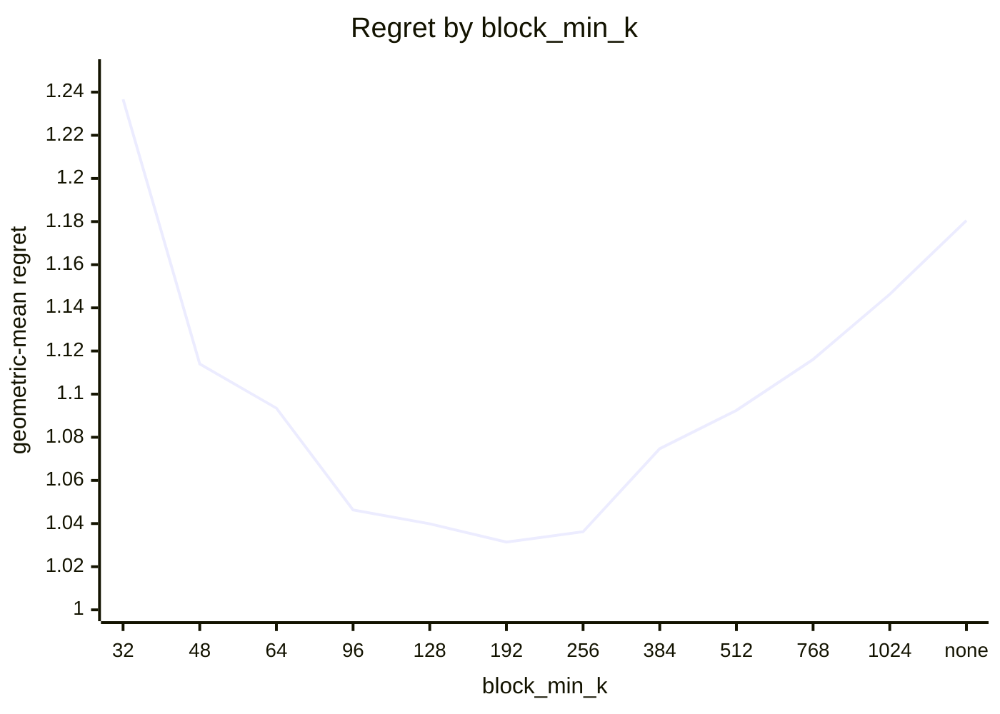
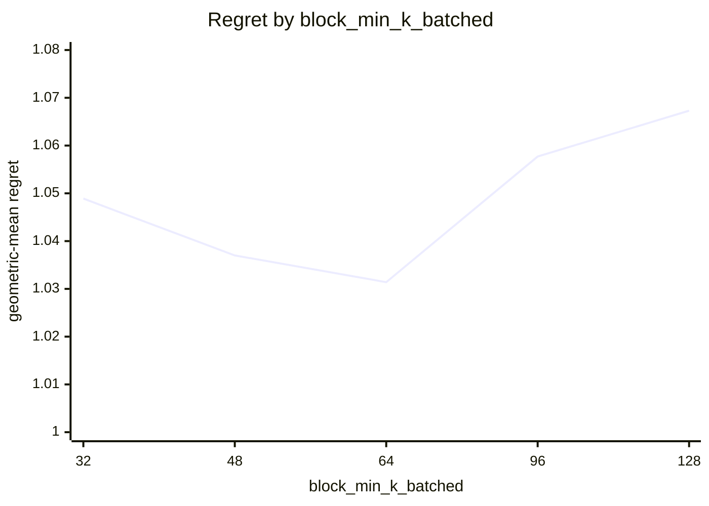
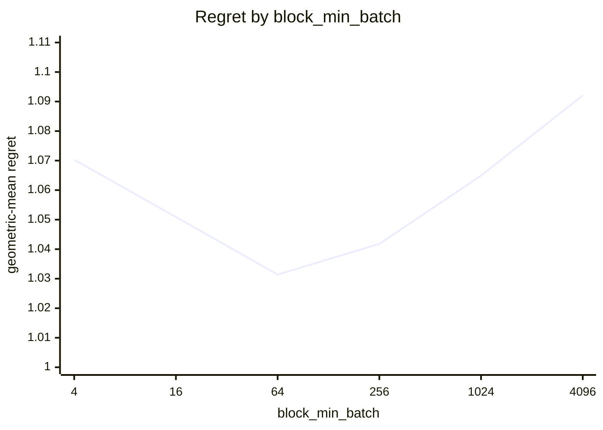
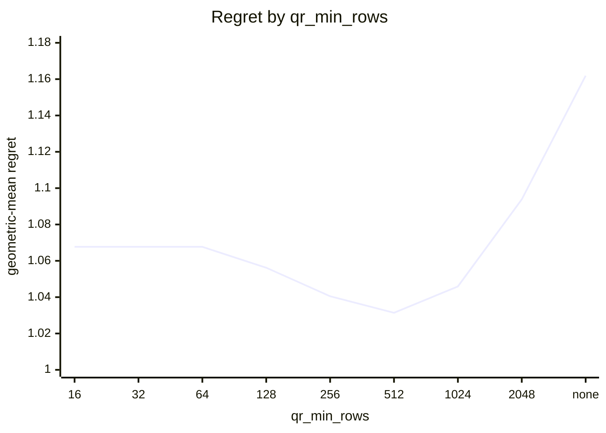
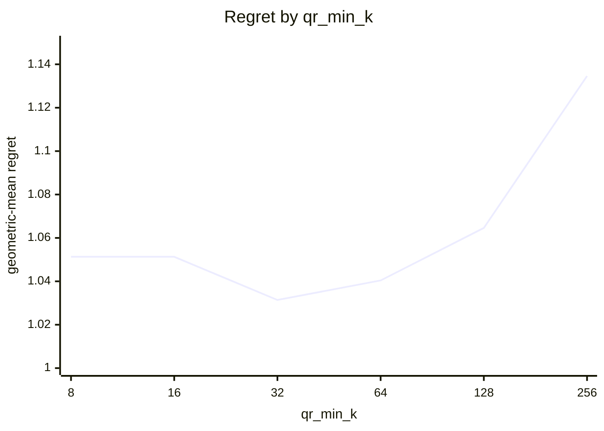
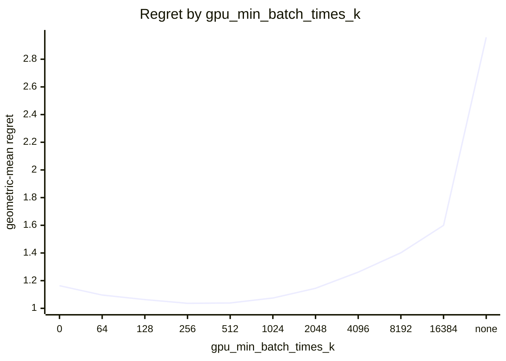
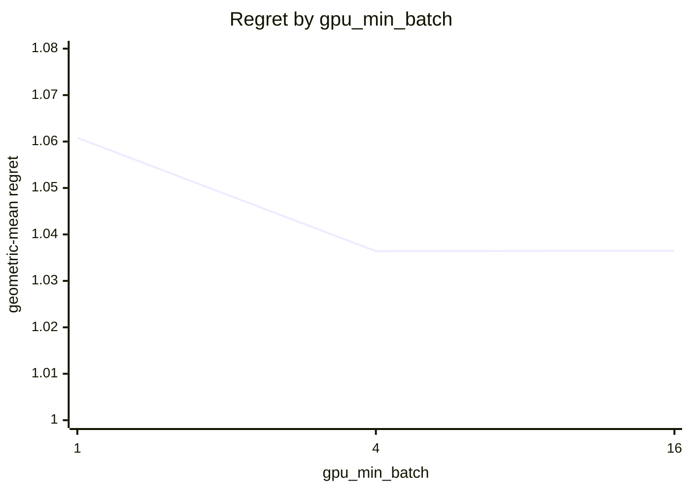
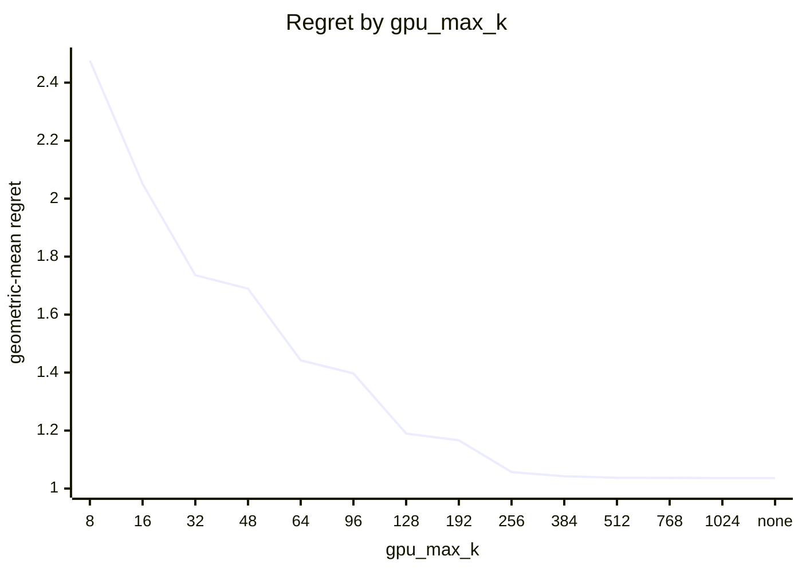

# SVD routing on Apple M5 Pro (20 GPU cores)

What every section and number below means: [reading-reports.md](https://github.com/c0rmac/metal-linalg/blob/main/docs/reading-reports.md).

Cost model scaled to this device from one probe point: bidiag x1.00, block x0.24, cpu x0.68, jacobi x0.10, qr x0.21, qrblock x0.25 (1.00 is an M1).

Machine state: load 6.1/18 at the start, load 2.3/18 at the end; power mains.

Probe point after the sweep relative to before it: block x1.00, cpu x1.01, jacobi x0.98, qr x1.06, qrblock x1.00 (stable).

Generated by `tuning/tune_svd.py` from 266 (shape, batch) points, 41 shapes with M >= N, batch in [1, 4, 16, 64, 256, 1024, 4096], six backends (and the CPU and bidiag again for singular values alone), two or more passes, min-of-repeats.

## Answer

Row for `kTuned[]` in `src/svd.mm`:

```cpp
// device, GPU cores,   qr_min_rows, qr_min_k,   block_min_k, block_min_k_batched, block_min_batch,   gpu_max_k, gpu_min_batch_times_k, gpu_min_batch,   bidiag_min_k, values_bidiag_min_k
{"Apple M5 Pro", 20,   512, 32,   192, 64, 64,   1024, 256, 4,   2048, 2048},
```

To try it without rebuilding:

```sh
SVD_QR_MIN_ROWS=512 SVD_QR_MIN_K=32 SVD_BLOCK_MIN_K=192 SVD_BLOCK_MIN_K_BATCHED=64 SVD_BLOCK_MIN_BATCH=64 SVD_GPU_MAX_K=1024 SVD_GPU_MIN_BATCH_TIMES_K=256 SVD_GPU_MIN_BATCH=4 SVD_BIDIAG_MIN_K=2048 SVD_VALUES_BIDIAG_MIN_K=2048
```

The policy in effect on this device came from `tuned-stale:Apple M5 Pro`. Against the best measured backend at every point the fitted rule scores 1.0364 geometric-mean regret, worst 1.83x, 36 of 266 points losing more than 10%, and 1.017x the oracle's total time.

## Warnings

- chosen rule loses more than 25% at 512x32 batch=16 (qr, 1.83x), 256x32 batch=4096 (jacobi, 1.70x), 1024x32 batch=16 (qr, 1.68x), 512x32 batch=4096 (qr, 1.61x), 256x32 batch=1024 (jacobi, 1.53x), 512x32 batch=1024 (qr, 1.49x), 64x64 batch=4 (jacobi, 1.48x), 1024x32 batch=1024 (qr, 1.46x) ...
- GPU split loses more than 25% against the best GPU backend at 512x32 batch=16 (qr, 1.83x), 256x32 batch=4096 (jacobi, 1.70x), 1024x32 batch=16 (qr, 1.68x), 512x32 batch=4096 (qr, 1.61x), 256x32 batch=1024 (jacobi, 1.53x), 512x32 batch=1024 (qr, 1.49x), 1024x32 batch=1024 (qr, 1.46x), 1024x32 batch=4096 (qr, 1.44x) ...
- the fitted policy differs from the one in effect (tuned-stale:Apple M5 Pro)

## Stage 1: which GPU backend

Scored against the best GPU backend at each of the 266 points, as if there were no CPU: this is the rule a forced-GPU call (`SVD_DEVICE=gpu`) follows, and what a GPU with more cores will lean on. Two independent choices. Precondition with QR iff the long side is at least `qr_min_rows`, the short side at least `qr_min_k`, and the long side at least twice the short one. Block kernel iff the short side is at least `block_min_k`, or at least `block_min_k_batched` in a batch of `block_min_batch` or more.

| rule | geomean regret | worst | >10% | total time / oracle | est. picks |
|---|---|---|---|---|---|
| policy in effect ('512', '32', '192', '64', '64') | 1.0314 | 1.83x | 32 | 1.016 | 0 |
| fitted ('512', '32', '192', '64', '64') | 1.0314 | 1.83x | 32 | 1.016 | 0 |

Without a batch term, 3 of 588 combinations are within 0.5% of the best geomean: qr_min_rows 256 .. 512, qr_min_k 32 .. 32, block_min_k 96 .. 128.

With the batch term adopted (below), 2 combinations are within 0.5% of the best: block_min_k 192 .. 256, block_min_k_batched 64 .. 64, block_min_batch 64 .. 64. The curves vary one constant around the chosen combination.



| block_min_k | 32 | 48 | 64 | 96 | 128 | 192 | 256 | 384 | 512 | 768 | 1024 | none |
|---|---|---|---|---|---|---|---|---|---|---|---|---|
| geomean | 1.2367 | 1.1140 | 1.0935 | 1.0463 | 1.0399 | 1.0314 | 1.0362 | 1.0747 | 1.0925 | 1.1161 | 1.1463 | 1.1805 |
| worst | 7.18x | 3.41x | 2.74x | 1.83x | 1.83x | 1.83x | 1.83x | 2.67x | 5.11x | 8.15x | 15.82x | 24.47x |



| block_min_k_batched | 32 | 48 | 64 | 96 | 128 |
|---|---|---|---|---|---|
| geomean | 1.0489 | 1.0370 | 1.0314 | 1.0577 | 1.0673 |
| worst | 2.73x | 1.94x | 1.83x | 2.41x | 2.41x |



| block_min_batch | 4 | 16 | 64 | 256 | 1024 | 4096 |
|---|---|---|---|---|---|---|
| geomean | 1.0703 | 1.0509 | 1.0314 | 1.0418 | 1.0649 | 1.0921 |
| worst | 2.64x | 2.49x | 1.83x | 2.35x | 2.48x | 2.49x |



| qr_min_rows | 16 | 32 | 64 | 128 | 256 | 512 | 1024 | 2048 | none |
|---|---|---|---|---|---|---|---|---|---|
| geomean | 1.0677 | 1.0677 | 1.0677 | 1.0562 | 1.0405 | 1.0314 | 1.0459 | 1.0938 | 1.1619 |
| worst | 2.39x | 2.39x | 2.39x | 2.39x | 2.39x | 1.83x | 2.28x | 4.23x | 6.21x |



| qr_min_k | 8 | 16 | 32 | 64 | 128 | 256 |
|---|---|---|---|---|---|---|
| geomean | 1.0513 | 1.0513 | 1.0314 | 1.0404 | 1.0646 | 1.1346 |
| worst | 3.36x | 3.36x | 1.83x | 3.55x | 4.48x | 6.21x |

Held-out check of a batch-dependent block crossover (block from a smaller k once the batch is large enough), fitted on 151 points and scored on the other 115; the verdict is a bootstrap over the test points.

| rule | fitted on train | train geomean | test geomean | test worst | verdict |
|---|---|---|---|---|---|
| one block crossover | ["512", "32", "128", "none", "none"] | 1.0731 | 1.0799 | 2.32x | baseline |
| batch-dependent block crossover | {"block_min": "192", "block_lo": "64", "batch_hi": "64"} | 1.0329 | 1.0294 | 1.53x | **justified** (better in 100% of resamples, median gain 4.8%) |

Best GPU backend per point (`J` whole-matrix kernel, `B` block kernel, `j` and `b` the same after QR), then what the rule picks:

```
      M x N  \ batch     1     4    16    64   256  1024  4096
      4 x 4               J     J     J     J     J     J     J
      8 x 8               J     J     J     J     J     J     J
     16 x 8               J     J     J     J     J     J     J
     32 x 8               J     J     J     J     J     J     J
     64 x 8               J     J     J     J     J     J     J
    128 x 8               J     J     J     J     J     J     J
    256 x 8               J     j     J     J     J     J     J
     16 x 16              J     J     J     J     J     J     J
     32 x 16              j     j     J     j     J     J     J
     64 x 16              J     j     j     J     J     J     J
    128 x 16              J     J     J     J     J     J     J
    256 x 16              j     J     J     J     J     J     J
    512 x 16              J     J     J     J     J     J     J
     32 x 32              J     J     J     J     J     B     B
     64 x 32              J     J     J     J     J     B     B
    128 x 32              J     J     J     J     J     J     B
    256 x 32              J     J     J     J     B     B     B
    512 x 32              J     J     J     J     B     B     B
   1024 x 32              j     J     J     j     B     B     B
     48 x 48              J     J     J     J     J     J     J
     64 x 64              J     J     J     J     B     B     B
    128 x 64              J     J     J     J     B     B     B
    256 x 64              j     J     J     B     B     B     B
    512 x 64              j     j     J     B     B     B     B
   1024 x 64              j     j     j     j     B     B     B
   2048 x 64              j     j     j     j     B     B     b
     96 x 96              J     J     J     B     B     B     B
    128 x 128             J     J     J     B     B     B     B
    256 x 128             j     j     J     B     b     b     B
    512 x 128             j     j     j     B     b     b     b
   1024 x 128             j     j     j     b     b     b     b
   2048 x 128             j     j     j     b     b     b     .
    192 x 192             B     B     B     B     B     B     .
    256 x 256             B     B     B     B     B     B     .
    512 x 256             b     B     b     b     b     b     .
   1024 x 256             b     b     b     b     b     .     .
   2048 x 256             b     b     b     b     b     .     .
    384 x 384             B     B     B     B     B     .     .
    512 x 512             B     B     B     B     .     .     .
    768 x 768             B     B     B     .     .     .     .
   1024 x 1024            B     B     B     .     .     .     .
```

```
      M x N  \ batch     1     4    16    64   256  1024  4096
      4 x 4               J     J     J     J     J     J     J
      8 x 8               J     J     J     J     J     J     J
     16 x 8               J     J     J     J     J     J     J
     32 x 8               J     J     J     J     J     J     J
     64 x 8               J     J     J     J     J     J     J
    128 x 8               J     J     J     J     J     J     J
    256 x 8               J     J     J     J     J     J     J
     16 x 16              J     J     J     J     J     J     J
     32 x 16              J     J     J     J     J     J     J
     64 x 16              J     J     J     J     J     J     J
    128 x 16              J     J     J     J     J     J     J
    256 x 16              J     J     J     J     J     J     J
    512 x 16              J     J     J     J     J     J     J
     32 x 32              J     J     J     J     J     J     J
     64 x 32              J     J     J     J     J     J     J
    128 x 32              J     J     J     J     J     J     J
    256 x 32              J     J     J     J     J     J     J
    512 x 32              j     j     j     j     j     j     j
   1024 x 32              j     j     j     j     j     j     j
     48 x 48              J     J     J     J     J     J     J
     64 x 64              J     J     J     B     B     B     B
    128 x 64              J     J     J     B     B     B     B
    256 x 64              J     J     J     B     B     B     B
    512 x 64              j     j     j     b     b     b     b
   1024 x 64              j     j     j     b     b     b     b
   2048 x 64              j     j     j     b     b     b     b
     96 x 96              J     J     J     B     B     B     B
    128 x 128             J     J     J     B     B     B     B
    256 x 128             J     J     J     B     B     B     B
    512 x 128             j     j     j     b     b     b     b
   1024 x 128             j     j     j     b     b     b     b
   2048 x 128             j     j     j     b     b     b     .
    192 x 192             B     B     B     B     B     B     .
    256 x 256             B     B     B     B     B     B     .
    512 x 256             b     b     b     b     b     b     .
   1024 x 256             b     b     b     b     b     .     .
   2048 x 256             b     b     b     b     b     .     .
    384 x 384             B     B     B     B     B     .     .
    512 x 512             B     B     B     B     .     .     .
    768 x 768             B     B     B     .     .     .     .
   1024 x 1024            B     B     B     .     .     .     .
```

## Stage 2: GPU or CPU

GPU iff `k <= gpu_max_k`, `batch * k >= gpu_min_batch_times_k` and `batch >= gpu_min_batch`, with k = min(M, N), scored against the best of the CPU and the four Jacobi backends. `worst` is over the points where the chosen backend was timed; a pick the cost model had to guess is listed in the warnings instead.

| rule | geomean regret | worst | >10% | total time / oracle | est. picks |
|---|---|---|---|---|---|
| oracle (best per point) | 1.0000 | 1.00x | 0 | 1.000 | 0 |
| policy in effect ('1024', '512', '4') | 1.0389 | 2.43x | 31 | 1.017 | 0 |
| fitted ('1024', '256', '4') | 1.0364 | 1.83x | 36 | 1.017 | 0 |

13 of 462 combinations are within 0.5% of the best geomean: gpu_max_k 384 .. none, gpu_min_batch_times_k 256 .. 512, gpu_min_batch 4 .. 16.



| gpu_min_batch_times_k | 0 | 64 | 128 | 256 | 512 | 1024 | 2048 | 4096 | 8192 | 16384 | none |
|---|---|---|---|---|---|---|---|---|---|---|---|
| geomean | 1.1635 | 1.0960 | 1.0632 | 1.0364 | 1.0389 | 1.0745 | 1.1449 | 1.2615 | 1.4016 | 1.5993 | 2.9584 |
| worst | 18.88x | 6.06x | 3.06x | 1.83x | 2.43x | 3.09x | 5.34x | 6.62x | 9.70x | 12.09x | 16.73x |



| gpu_min_batch | 1 | 4 | 16 |
|---|---|---|---|
| geomean | 1.0608 | 1.0364 | 1.0365 |
| worst | 3.35x | 1.83x | 1.83x |



| gpu_max_k | 8 | 16 | 32 | 48 | 64 | 96 | 128 | 192 | 256 | 384 | 512 | 768 | 1024 | none |
|---|---|---|---|---|---|---|---|---|---|---|---|---|---|---|
| geomean | 2.4765 | 2.0510 | 1.7359 | 1.6895 | 1.4421 | 1.3971 | 1.1899 | 1.1665 | 1.0569 | 1.0424 | 1.0372 | 1.0367 | 1.0364 | 1.0364 |
| worst | 16.59x | 10.94x | 8.08x | 8.08x | 6.34x | 6.34x | 3.94x | 3.94x | 1.83x | 1.83x | 1.83x | 1.83x | 1.83x | 1.83x |

Held-out check of a per-k boundary against the product rule, fitted on 151 points and scored on the other 115; the verdict is a bootstrap.

| rule | fitted on train | train geomean | test geomean | test worst | verdict |
|---|---|---|---|---|---|
| product rule | [1024, 512, 4] | 1.0369 | 1.0416 | 2.43x | baseline |
| per-k table | {"min_batch_by_k": {"4": 256, "8": 64, "16": 16, "32": 16, "48": 16, "64": 16, "96": 16, "128": 4, "192": 1024, "256": 4, "384": 4, "512": 16, "768": 16, "1024": 4}} | 1.0304 | 1.0582 | 3.19x | rejected (better in 20% of resamples, median gain -1.4%) |

Best backend per point (`c` CPU, `J` whole-matrix kernel, `B` block kernel, `j` and `b` the same after QR, `.` not measured), what the rule picks, and the speedup of the best GPU backend over the CPU:

```
      M x N  \ batch     1     4    16    64   256  1024  4096
      4 x 4               c     c     c     c     J     J     J
      8 x 8               c     c     c     J     J     J     J
     16 x 8               c     c     c     J     J     J     J
     32 x 8               c     c     c     J     J     J     J
     64 x 8               c     c     c     J     J     J     J
    128 x 8               c     c     c     J     J     J     J
    256 x 8               c     c     c     J     J     J     J
     16 x 16              c     c     J     J     J     J     J
     32 x 16              c     c     J     j     J     J     J
     64 x 16              c     c     c     J     J     J     J
    128 x 16              c     c     J     J     J     J     J
    256 x 16              c     c     J     J     J     J     J
    512 x 16              c     c     J     J     J     J     J
     32 x 32              c     c     J     J     J     B     B
     64 x 32              c     c     J     J     J     B     B
    128 x 32              c     c     J     J     J     J     B
    256 x 32              c     c     J     J     B     B     B
    512 x 32              c     c     J     J     B     B     B
   1024 x 32              c     c     J     j     B     B     B
     48 x 48              c     c     J     J     J     J     J
     64 x 64              c     c     J     J     B     B     B
    128 x 64              c     c     J     J     B     B     B
    256 x 64              c     c     J     B     B     B     B
    512 x 64              c     c     J     B     B     B     B
   1024 x 64              c     c     j     j     B     B     B
   2048 x 64              c     c     j     j     B     B     b
     96 x 96              c     c     J     B     B     B     B
    128 x 128             c     c     J     B     B     B     B
    256 x 128             c     c     J     B     b     b     B
    512 x 128             c     j     j     B     b     b     b
   1024 x 128             c     j     j     b     b     b     b
   2048 x 128             c     j     j     b     b     b     .
    192 x 192             c     c     B     B     B     B     .
    256 x 256             c     B     B     B     B     B     .
    512 x 256             c     B     b     b     b     b     .
   1024 x 256             c     b     b     b     b     .     .
   2048 x 256             c     b     b     b     b     .     .
    384 x 384             c     B     B     B     B     .     .
    512 x 512             c     B     B     B     .     .     .
    768 x 768             c     B     B     .     .     .     .
   1024 x 1024            c     B     B     .     .     .     .
```

```
      M x N  \ batch     1     4    16    64   256  1024  4096
      4 x 4               c     c     c     J     J     J     J
      8 x 8               c     c     c     J     J     J     J
     16 x 8               c     c     c     J     J     J     J
     32 x 8               c     c     c     J     J     J     J
     64 x 8               c     c     c     J     J     J     J
    128 x 8               c     c     c     J     J     J     J
    256 x 8               c     c     c     J     J     J     J
     16 x 16              c     c     J     J     J     J     J
     32 x 16              c     c     J     J     J     J     J
     64 x 16              c     c     J     J     J     J     J
    128 x 16              c     c     J     J     J     J     J
    256 x 16              c     c     J     J     J     J     J
    512 x 16              c     c     J     J     J     J     J
     32 x 32              c     c     J     J     J     J     J
     64 x 32              c     c     J     J     J     J     J
    128 x 32              c     c     J     J     J     J     J
    256 x 32              c     c     J     J     J     J     J
    512 x 32              c     c     j     j     j     j     j
   1024 x 32              c     c     j     j     j     j     j
     48 x 48              c     c     J     J     J     J     J
     64 x 64              c     J     J     B     B     B     B
    128 x 64              c     J     J     B     B     B     B
    256 x 64              c     J     J     B     B     B     B
    512 x 64              c     j     j     b     b     b     b
   1024 x 64              c     j     j     b     b     b     b
   2048 x 64              c     j     j     b     b     b     b
     96 x 96              c     J     J     B     B     B     B
    128 x 128             c     J     J     B     B     B     B
    256 x 128             c     J     J     B     B     B     B
    512 x 128             c     j     j     b     b     b     b
   1024 x 128             c     j     j     b     b     b     b
   2048 x 128             c     j     j     b     b     b     .
    192 x 192             c     B     B     B     B     B     .
    256 x 256             c     B     B     B     B     B     .
    512 x 256             c     b     b     b     b     b     .
   1024 x 256             c     b     b     b     b     .     .
   2048 x 256             c     b     b     b     b     .     .
    384 x 384             c     B     B     B     B     .     .
    512 x 512             c     B     B     B     .     .     .
    768 x 768             c     B     B     .     .     .     .
   1024 x 1024            c     B     B     .     .     .     .
```

```
      M x N  \ batch     1     4    16    64   256  1024  4096
      4 x 4            0.02  0.05  0.16  0.84  2.33  8.12 12.79
      8 x 8            0.04  0.11  0.47  1.54  4.39  9.34 13.20
     16 x 8            0.04  0.08  0.33  1.18  4.75 11.85 16.62
     32 x 8            0.04  0.12  0.37  2.00  3.25 12.09 16.73
     64 x 8            0.04  0.11  0.60  1.32  5.89 11.31 14.74
    128 x 8            0.08  0.13  0.44  2.51  2.43  9.41 12.85
    256 x 8            0.08  0.15  0.96  2.30  6.62  8.83 10.86
     16 x 16           0.04  0.26  1.03  2.95  5.90  8.36 10.24
     32 x 16           0.07  0.24  1.61  2.07  9.70 13.73 16.59
     64 x 16           0.17  0.27  0.88  5.14  8.79 12.83 15.42
    128 x 16           0.17  0.51  1.83  3.37  7.68 11.26 13.16
    256 x 16           0.12  0.37  1.94  5.08  7.47  9.29 10.22
    512 x 16           0.17  0.75  2.43  5.34  5.36  5.15  4.99
     32 x 32           0.19  0.66  2.26  4.17  6.15  8.13  9.52
     64 x 32           0.21  0.72  2.87  4.72  7.09  9.50 10.94
    128 x 32           0.22  0.84  2.57  4.76  7.49  8.61  9.96
    256 x 32           0.25  0.70  3.09  4.59  5.30  6.93  7.88
    512 x 32           0.26  0.81  2.91  3.91  4.55  6.34  6.64
   1024 x 32           0.33  0.87  3.05  2.86  4.00  5.36  5.14
     48 x 48           0.16  0.57  2.14  3.87  5.13  5.45  5.77
     64 x 64           0.19  0.67  2.49  3.59  5.20  6.06  6.24
    128 x 64           0.23  0.84  3.16  4.63  7.09  7.86  8.08
    256 x 64           0.23  0.80  2.86  3.85  5.87  6.36  6.54
    512 x 64           0.30  0.79  2.93  3.84  5.19  5.82  5.65
   1024 x 64           0.37  0.83  2.48  3.28  4.34  4.59   gpu
   2048 x 64           0.47  0.78  2.48  3.08  3.71  3.82   gpu
     96 x 96           0.23  0.89  3.22  4.19  6.03  6.15   gpu
    128 x 128          0.21  0.83  3.22  4.51  5.37  5.44   gpu
    256 x 128          0.28  0.94  3.44  5.74  6.14  6.34   gpu
    512 x 128          0.33  1.02  3.52  5.00  5.74   gpu   gpu
   1024 x 128          0.39  1.15  3.75  4.88  5.26   gpu   gpu
   2048 x 128          0.45  1.28  3.54  4.36  4.77   gpu     .
    192 x 192          0.21  0.75  2.29  3.12  3.19   gpu     .
    256 x 256          0.30  1.07  2.48  2.94   gpu   gpu     .
    512 x 256          0.44  1.50  3.28  3.77   gpu   gpu     .
   1024 x 256          0.47  1.44  3.45  3.94   gpu     .     .
   2048 x 256          0.55  1.58  3.60  3.87   gpu     .     .
    384 x 384          0.33  1.06  1.79  1.75   gpu     .     .
    512 x 512          0.52  1.35  1.69  1.64     .     .     .
    768 x 768          0.52  1.15  1.00     .     .     .     .
   1024 x 1024         0.67  1.06  1.01     .     .     .     .
```

## Stage 3: the bidiag backend instead of the CPU

Where the rule above chooses the CPU, the `bidiag` backend (GPU bidiagonalization, then LAPACK's bidiagonal solve) from a threshold k = min(M, N) on (0: never), fitted on the points where bidiag was timed (k >= 128, within the cost cap): the region the threshold decides. With vectors it is scored against the best of all backends, bidiag included; for singular values alone (`svdvals`), bidiag against the CPU at the points where the rule chooses the CPU.

| | threshold | geomean regret | worst | without bidiag: geomean | worst | held out (fitted on half) |
|---|---|---|---|---|---|---|
| with vectors | 2048 | 1.0136 | 1.33x | 1.0483 | 1.95x | from 2048: 1.0099 vs 1.0229 |
| singular values alone | 2048 | 1.0000 | 1.00x | 1.0737 | 1.88x | from 2048: 1.0000 vs 1.0750 |

bidiag over the CPU (with vectors), M x N x batch: 128x128x1 0.24x, 128x128x4 0.24x, 128x128x16 0.24x, 128x128x64 0.23x, 128x128x256 0.23x, 256x128x1 0.29x, 256x128x4 0.29x, 256x128x16 0.28x, 256x128x64 0.28x, 256x128x256 0.28x, 512x128x1 0.33x, 512x128x4 0.33x, 512x128x16 0.32x, 512x128x64 0.33x, 512x128x256 0.33x, 1024x128x1 0.39x, 1024x128x4 0.38x, 1024x128x16 0.38x, 1024x128x64 0.38x, 1024x128x256 0.38x, 2048x128x1 0.45x, 2048x128x4 0.44x, 2048x128x16 0.45x, 2048x128x64 0.45x, 2048x128x256 0.44x, 192x192x1 0.28x, 192x192x4 0.26x, 192x192x16 0.26x, 192x192x64 0.26x, 192x192x256 0.26x, 256x256x1 0.38x, 256x256x4 0.37x, 256x256x16 0.38x, 256x256x64 0.37x, 512x256x1 0.44x, 512x256x4 0.43x, 512x256x16 0.43x, 512x256x64 0.43x, 1024x256x1 0.48x, 1024x256x4 0.48x, 1024x256x16 0.48x, 1024x256x64 0.48x, 2048x256x1 0.55x, 2048x256x4 0.55x, 2048x256x16 0.55x, 2048x256x64 0.56x, 384x384x1 0.43x, 384x384x4 0.45x, 384x384x16 0.44x, 384x384x64 0.44x, 512x512x1 0.65x, 512x512x4 0.64x, 512x512x16 0.63x, 512x512x64 0.63x, 768x768x1 0.73x, 768x768x4 0.69x, 768x768x16 0.69x, 1024x1024x1 1.02x, 1024x1024x4 1.02x, 1024x1024x16 1.02x, 1536x1536x1 1.12x, 1536x1536x2 1.06x, 1536x1536x4 1.05x, 2048x2048x1 1.43x, 2048x2048x2 1.40x, 2048x2048x4 1.38x, 3072x3072x1 1.83x, 4096x4096x1 1.95x

bidiag over the CPU (singular values alone), M x N x batch: 128x128x1 0.18x, 256x128x1 0.21x, 512x128x1 0.22x, 1024x128x1 0.23x, 2048x128x1 0.27x, 192x192x1 0.15x, 256x256x1 0.21x, 512x256x1 0.24x, 1024x256x1 0.27x, 2048x256x1 0.30x, 384x384x1 0.28x, 512x512x1 0.41x, 768x768x1 0.51x, 1024x1024x1 0.75x, 1536x1536x1 0.89x, 1536x1536x2 0.89x, 1536x1536x4 0.89x, 2048x2048x1 1.16x, 2048x2048x2 1.16x, 2048x2048x4 1.15x, 3072x3072x1 1.65x, 4096x4096x1 1.88x

## Noise floor

Pass-to-pass ratio, 1182 measurements: median 1.008, p90 1.052, max 2.89.

| runtime | n | median | p90 | max |
|---|---|---|---|---|
| <1 ms | 217 | 1.030 | 1.793 | 2.89 |
| 1-3 ms | 151 | 1.007 | 1.029 | 1.22 |
| 3-10 ms | 198 | 1.005 | 1.028 | 1.11 |
| 10-30 ms | 151 | 1.007 | 1.027 | 1.10 |
| 30-100 ms | 160 | 1.004 | 1.018 | 1.06 |
| >100 ms | 305 | 1.007 | 1.034 | 1.17 |
