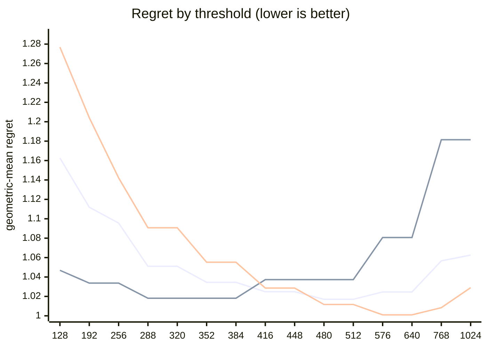

# QR dispatch crossover — Apple M5 Pro

What every section and number below means: [reading-reports.md](https://github.com/c0rmac/metal-linalg/blob/main/docs/reading-reports.md).

Generated by `tuning/tune_qr.py`. 173 shapes, 519 shape/backend pairs measured twice.

| | |
|---|---|
| Device | Apple M5 Pro |
| GPU cores | 20 |
| Resident matrices (`qr_unblocked`) | 120 |
| Shapes measured | 173 |
| Coverage | near-square 29, square 70, tall 44, wide 30 |

## The band

```
M >= 512  ->  qr_streaming_amx_reduced
otherwise  ->  qr_unblocked
```

The optimum is flat from **480 to 512** rows (every threshold within 0.3% of the best, 1.0170x). Any value inside that band is equivalent on this hardware; **512** is the middle of it.

Paste into `kTuned[]` in `src/qr.mm`:

```c
    {"Apple M5 Pro", 20, 512, 512, 16,   8, 10240, 1, 0,   1024, 4},
```

### Cost of missing the band

| threshold | regret | excess | |
|---|---|---|---|
| 128 | 1.1626x | +14.32% |  |
| 192 | 1.1119x | +9.33% |  |
| 256 | 1.0956x | +7.73% |  |
| 288 | 1.0510x | +3.34% |  |
| 320 | 1.0510x | +3.34% |  |
| 352 | 1.0345x | +1.72% |  |
| 384 | 1.0345x | +1.72% |  |
| 416 | 1.0248x | +0.77% |  |
| 448 | 1.0248x | +0.77% |  |
| 480 | 1.0170x | +0.00% | **in band** |
| 512 | 1.0170x | +0.00% | **in band** |
| 576 | 1.0246x | +0.75% |  |
| 640 | 1.0246x | +0.75% |  |
| 768 | 1.0566x | +3.89% |  |
| 1024 | 1.0626x | +4.48% |  |

The penalty is usually asymmetric. Erring low costs little; erring high degrades specifically on tall inputs. Adding GPU cores makes the grid-parallel backend relatively stronger and pushes the true crossover down, so an untuned device is safer low than high.

## GPU or CPU

```
GPU iff k <= 8, batch * k >= 10240 and batch >= 1   (k = min(M, N))
or k >= 1024 and batch <= 4   (large matrices)
otherwise LAPACK on the CPU
```

Fitted on every shape with a CPU timing; inside the region within 0.5% of the best geometric-mean regret, the candidate with the smallest worst case.

| routing | geomean regret | worst | >10% off |
|---|---|---|---|
| chosen | 1.0354x | 2.41x | 13/173 |
| chosen without the large-matrix clause | 1.0616x | 2.41x | 22/173 |
| always the GPU (before the CPU path) | 2.2371x | 60.44x | 145/173 |
| always the CPU | 1.0616x | 2.41x | 22/173 |

Held out (fitted on half the shapes, scored on the other half): 1.0491x geomean, 2.41x worst, against 2.0927x and 42.39x for always the GPU.

The CPU was the fastest backend at 146 of 173 shapes, e.g. 1 x 8x8, 1 x 16x16, 1 x 16x256, 1 x 32x32, 1 x 64x64, 1 x 64x256, 1 x 64x384, 1 x 64x640.

## Regret by threshold

Regret is how much slower the chosen backend is than the best one measured at that shape; 1.0000x would be a perfect oracle. The per-region curves are the point: a grid covering only one aspect ratio can be nearly flat, and will then pick a threshold out of noise.



Series order: pooled, tall only, square only.

| threshold | pooled | square | tall | wide | near-square | pooled worst |
|---|---|---|---|---|---|---|
| 128 | 1.1626 | 1.2769 | 1.0469 | 1.0738 | 1.3002 | 2.14x |
| 192 | 1.1119 | 1.2042 | 1.0337 | 1.0226 | 1.2134 | 1.78x |
| 256 | 1.0956 | 1.1422 | 1.0337 | 1.0226 | 1.2134 | 1.68x |
| 288 | 1.0510 | 1.0907 | 1.0181 | 1.0003 | 1.1031 | 1.45x |
| 320 | 1.0510 | 1.0907 | 1.0181 | 1.0003 | 1.1031 | 1.45x |
| 352 | 1.0345 | 1.0552 | 1.0181 | 1.0003 | 1.0679 | 1.32x |
| 384 | 1.0345 | 1.0552 | 1.0181 | 1.0003 | 1.0679 | 1.32x |
| 416 | 1.0248 | 1.0286 | 1.0373 | 1.0003 | 1.0266 | 1.47x |
| 448 | 1.0248 | 1.0286 | 1.0373 | 1.0003 | 1.0266 | 1.47x |
| 480 | 1.0170 | 1.0117 | 1.0373 | 1.0003 | 1.0113 | 1.47x |
| 512 | 1.0170 | 1.0117 | 1.0373 | 1.0003 | 1.0113 | 1.47x |
| 576 | 1.0246 | 1.0010 | 1.0807 | 1.0003 | 1.0003 | 1.88x |
| 640 | 1.0246 | 1.0010 | 1.0807 | 1.0003 | 1.0003 | 1.88x |
| 768 | 1.0566 | 1.0084 | 1.1815 | 1.0003 | 1.0066 | 2.35x |
| 1024 | 1.0626 | 1.0290 | 1.1815 | 1.0003 | 1.0066 | 2.35x |

## Which feature decides

`qr_unblocked` gives each matrix a single threadgroup, which sweeps `M` rows per Householder reflection while `N` parallelises across that threadgroup's threads. Rows and columns are therefore not interchangeable, and a rule on `max(M, N)` cannot express the difference.

| feature | best threshold | geomean regret | worst |
|---|---|---|---|
| M (rows) | 480 | 1.0170x | 1.47x |
| max(M, N) | 576 | 1.0663x | 2.02x |
| K = min(M, N) | 576 | 1.1354x | 6.69x |

## Decision surface

**batch 1**

```
      N=32      N=64      N=128     N=256     N=512     
      ---------------------------------------------
  128    1.39     1.73     1.76     1.77     1.79
  256 ## 0.84     1.31     1.59     1.68     1.48
  384 ## 0.68  #  0.93  .  1.29     1.32  .  1.22
  512 ## 0.78  ## 0.80  .  1.08  ~  1.04  .  1.07   <- M >= 512
  640 ###0.46  ## 0.63  #  0.85  ## 0.83  ## 0.82

      ratio = reduced / unblocked.  ### <0.60  ## <0.85  # <0.95
      ~ tie (0.95-1.05)   . <1.30   blank >1.30  (unblocked wins)
```

**batch 16**

```
      N=32      N=64      N=128     N=256     N=512     
      ---------------------------------------------
  128 .  1.25     1.60     1.62     1.51     1.45
  256 ~  0.96  .  1.13     1.47     1.54     1.35
  384 ## 0.68  #  0.93  .  1.23  .  1.19  .  1.26
  512 ###0.59  ## 0.76  ~  0.99  .  1.08  .  1.18   <- M >= 512
  640 ###0.42  ###0.57  ## 0.74  #  0.89  ~  1.01

      ratio = reduced / unblocked.  ### <0.60  ## <0.85  # <0.95
      ~ tie (0.95-1.05)   . <1.30   blank >1.30  (unblocked wins)
```

## Candidate rules

Per-region columns matter more than the overall number: an aggregate can look excellent while one aspect class is badly served.

| rule | geomean | worst | >10% off | square | tall | wide | near-square |
|---|---|---|---|---|---|---|---|
| original 5-rule heuristic | 1.2014x | 2.39x | 61/143 | 1.143 | 1.043 | 1.574 | 1.204 |
| max(M,N) >= 512 | 1.0882x | 2.02x | 28/143 | 1.012 | 1.037 | 1.331 | 1.051 |
| K = min(M,N) >= 128 | 1.2714x | 6.69x | 74/143 | 1.277 | 1.433 | 1.074 | 1.255 |
| M >= 512  (chosen) | 1.0170x | 1.47x | 6/143 | 1.012 | 1.037 | 1.000 | 1.011 |

## Refinements tested

Both of these were rejected on an 8-core M1, and both are re-tested here rather than assumed. A GPU with many more cores saturates `qr_unblocked` much later, so the batch split in particular could be justified elsewhere. Each is fitted on half the shapes and scored on the other half.

Baseline for comparison — `M >= 512` on the held-out half: **1.0166x** geomean, 1.47x worst.

| refinement | fitted form | train | held-out | held-out worst | verdict |
|---|---|---|---|---|---|
| batch-dependent split | `M >= (480 if batch < 32 else 416)` | 1.0175x | 1.0186x | 1.47x | reject |
| narrow-N special case | `M >= 416 or (N <= 32 and M >= 128)` | 1.0166x | 1.0272x | 1.39x | reject |

> Neither refinement survived. Ship the plain threshold. A refinement that looks good on the training half and not on the held-out half is fitting noise, which is exactly what the split is there to catch.

## Measurement noise

Run-to-run ratio over 519 shape/backend pairs measured twice: median 1.012x, p90 1.165x, max 2.960x.

| runtime | pairs | median | p90 | max |
|---|---|---|---|---|
| <1 ms | 202 | 1.037x | 1.443x | 2.960x |
| 1-3 ms | 143 | 1.011x | 1.105x | 1.654x |
| 3-10 ms | 102 | 1.007x | 1.030x | 1.315x |
| 10-30 ms | 34 | 1.006x | 1.025x | 1.293x |
| 30-100 ms | 20 | 1.006x | 1.025x | 1.271x |
| >100 ms | 18 | 1.002x | 1.009x | 1.011x |

Noise concentrates in fast shapes, where submission jitter dominates. A difference smaller than the p90 figure for its size bucket is not a result.

---

Raw timings in `raw.csv`; full analysis including plot-ready series in `results.json`. Re-render this report without remeasuring: `python3 tuning/tune_qr.py --from results.json`.
