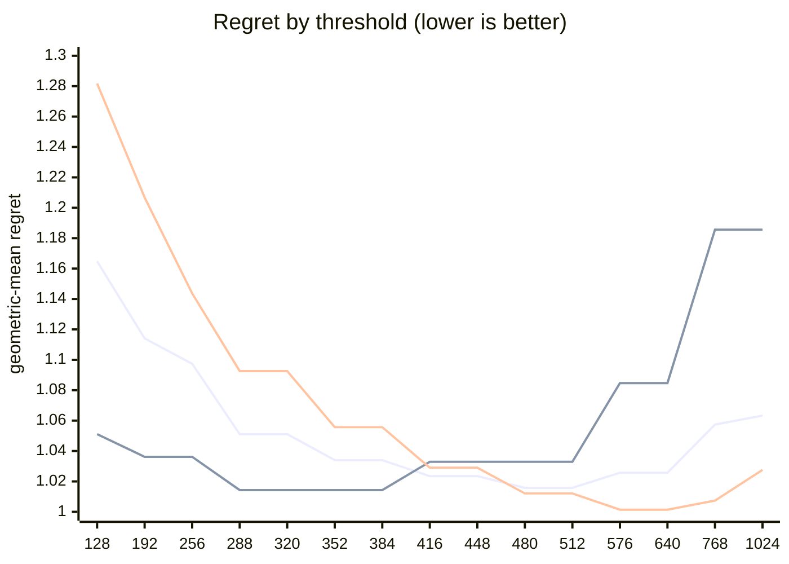

# QR dispatch crossover — Apple M5 Pro

What every section and number below means: [reading-reports.md](https://github.com/c0rmac/metal-linalg/blob/main/docs/reading-reports.md).

Generated by `tuning/tune_qr.py`. 178 shapes, 534 shape/backend pairs measured twice.

| | |
|---|---|
| Device | Apple M5 Pro |
| GPU cores | 20 |
| Resident matrices (`qr_unblocked`) | 120 |
| Shapes measured | 178 |
| Coverage | near-square 29, square 75, tall 44, wide 30 |

## The band

```
M >= 512  ->  qr_streaming_amx_reduced
otherwise  ->  qr_unblocked
```

The optimum is flat from **480 to 512** rows (every threshold within 0.3% of the best, 1.0158x). Any value inside that band is equivalent on this hardware; **512** is the middle of it.

Paste into `kTuned[]` in `src/qr.mm`:

```c
    {"Apple M5 Pro", 20, 512, 512, 16,   128, 131072, 1, 0,   1024, 4},
```

### Cost of missing the band

| threshold | regret | excess | |
|---|---|---|---|
| 128 | 1.1648x | +14.67% |  |
| 192 | 1.1141x | +9.68% |  |
| 256 | 1.0974x | +8.03% |  |
| 288 | 1.0511x | +3.48% |  |
| 320 | 1.0511x | +3.48% |  |
| 352 | 1.0340x | +1.79% |  |
| 384 | 1.0340x | +1.79% |  |
| 416 | 1.0235x | +0.76% |  |
| 448 | 1.0235x | +0.76% |  |
| 480 | 1.0158x | +0.00% | **in band** |
| 512 | 1.0158x | +0.00% | **in band** |
| 576 | 1.0257x | +0.97% |  |
| 640 | 1.0257x | +0.97% |  |
| 768 | 1.0574x | +4.10% |  |
| 1024 | 1.0633x | +4.68% |  |

The penalty is usually asymmetric. Erring low costs little; erring high degrades specifically on tall inputs. Adding GPU cores makes the grid-parallel backend relatively stronger and pushes the true crossover down, so an untuned device is safer low than high.

## GPU or CPU

```
GPU iff k <= 128, batch * k >= 131072 and batch >= 1   (k = min(M, N))
or k >= 1024 and batch <= 4   (large matrices)
otherwise LAPACK on the CPU
```

Fitted on every shape with a CPU timing; inside the region within 0.5% of the best geometric-mean regret, the candidate with the smallest worst case.

| routing | geomean regret | worst | >10% off |
|---|---|---|---|
| chosen | 1.0348x | 2.61x | 13/178 |
| chosen without the large-matrix clause | 1.0602x | 2.61x | 22/178 |
| always the GPU (before the CPU path) | 2.1937x | 61.27x | 148/178 |
| always the CPU | 1.0604x | 2.61x | 22/178 |

Held out (fitted on half the shapes, scored on the other half): 1.0720x geomean, 2.61x worst, against 2.0457x and 44.82x for always the GPU.

The CPU was the fastest backend at 151 of 178 shapes, e.g. 1 x 8x8, 1 x 16x16, 1 x 16x256, 1 x 32x32, 1 x 32x384, 1 x 64x64, 1 x 64x256, 1 x 64x384.

## Regret by threshold

Regret is how much slower the chosen backend is than the best one measured at that shape; 1.0000x would be a perfect oracle. The per-region curves are the point: a grid covering only one aspect ratio can be nearly flat, and will then pick a threshold out of noise.



Series order: pooled, tall only, square only.

| threshold | pooled | square | tall | wide | near-square | pooled worst |
|---|---|---|---|---|---|---|
| 128 | 1.1648 | 1.2818 | 1.0511 | 1.0676 | 1.3053 | 2.18x |
| 192 | 1.1141 | 1.2068 | 1.0362 | 1.0220 | 1.2176 | 1.82x |
| 256 | 1.0974 | 1.1437 | 1.0362 | 1.0220 | 1.2176 | 1.67x |
| 288 | 1.0511 | 1.0926 | 1.0143 | 1.0000 | 1.1074 | 1.47x |
| 320 | 1.0511 | 1.0926 | 1.0143 | 1.0000 | 1.1074 | 1.47x |
| 352 | 1.0340 | 1.0557 | 1.0143 | 1.0000 | 1.0708 | 1.33x |
| 384 | 1.0340 | 1.0557 | 1.0143 | 1.0000 | 1.0708 | 1.33x |
| 416 | 1.0235 | 1.0290 | 1.0329 | 1.0000 | 1.0266 | 1.50x |
| 448 | 1.0235 | 1.0290 | 1.0329 | 1.0000 | 1.0266 | 1.50x |
| 480 | 1.0158 | 1.0121 | 1.0329 | 1.0000 | 1.0116 | 1.50x |
| 512 | 1.0158 | 1.0121 | 1.0329 | 1.0000 | 1.0116 | 1.50x |
| 576 | 1.0257 | 1.0014 | 1.0847 | 1.0000 | 1.0000 | 1.89x |
| 640 | 1.0257 | 1.0014 | 1.0847 | 1.0000 | 1.0000 | 1.89x |
| 768 | 1.0574 | 1.0074 | 1.1856 | 1.0000 | 1.0068 | 2.32x |
| 1024 | 1.0633 | 1.0276 | 1.1856 | 1.0000 | 1.0068 | 2.32x |

## Which feature decides

`qr_unblocked` gives each matrix a single threadgroup, which sweeps `M` rows per Householder reflection while `N` parallelises across that threadgroup's threads. Rows and columns are therefore not interchangeable, and a rule on `max(M, N)` cannot express the difference.

| feature | best threshold | geomean regret | worst |
|---|---|---|---|
| M (rows) | 480 | 1.0158x | 1.50x |
| max(M, N) | 576 | 1.0662x | 2.09x |
| K = min(M, N) | 576 | 1.1364x | 6.71x |

## Decision surface

**batch 1**

```
      N=32      N=64      N=128     N=256     N=512     
      ---------------------------------------------
  128    1.43     1.71     1.78     1.73     1.59
  256 ~  0.98  .  1.25     1.67     1.67     1.48
  384 ## 0.68  ~  0.97  .  1.28     1.31  .  1.23
  512 ###0.53  ## 0.79  .  1.06  ~  1.04  .  1.08   <- M >= 512
  640 ###0.45  ## 0.63  #  0.85  ## 0.83  ## 0.83

      ratio = reduced / unblocked.  ### <0.60  ## <0.85  # <0.95
      ~ tie (0.95-1.05)   . <1.30   blank >1.30  (unblocked wins)
```

**batch 16**

```
      N=32      N=64      N=128     N=256     N=512     
      ---------------------------------------------
  128    1.31     1.67     1.63     1.53     1.49
  256 ~  0.96  .  1.16     1.41     1.52     1.33
  384 ## 0.67  ~  0.96  .  1.22  .  1.28  .  1.28
  512 ###0.56  ## 0.78  ~  1.01  .  1.09  .  1.18   <- M >= 512
  640 ###0.43  ###0.58  ## 0.75  #  0.88  ~  0.99

      ratio = reduced / unblocked.  ### <0.60  ## <0.85  # <0.95
      ~ tie (0.95-1.05)   . <1.30   blank >1.30  (unblocked wins)
```

## Candidate rules

Per-region columns matter more than the overall number: an aggregate can look excellent while one aspect class is badly served.

| rule | geomean | worst | >10% off | square | tall | wide | near-square |
|---|---|---|---|---|---|---|---|
| original 5-rule heuristic | 1.1942x | 2.09x | 62/143 | 1.147 | 1.045 | 1.520 | 1.204 |
| max(M,N) >= 512 | 1.0847x | 2.09x | 27/143 | 1.012 | 1.033 | 1.317 | 1.052 |
| K = min(M,N) >= 128 | 1.2731x | 6.71x | 73/143 | 1.282 | 1.437 | 1.068 | 1.259 |
| M >= 512  (chosen) | 1.0158x | 1.50x | 5/143 | 1.012 | 1.033 | 1.000 | 1.012 |

## Refinements tested

Both of these were rejected on an 8-core M1, and both are re-tested here rather than assumed. A GPU with many more cores saturates `qr_unblocked` much later, so the batch split in particular could be justified elsewhere. Each is fitted on half the shapes and scored on the other half.

Baseline for comparison — `M >= 512` on the held-out half: **1.0170x** geomean, 1.50x worst.

| refinement | fitted form | train | held-out | held-out worst | verdict |
|---|---|---|---|---|---|
| batch-dependent split | `M >= (480 if batch < 32 else 416)` | 1.0146x | 1.0188x | 1.50x | reject |
| narrow-N special case | `M >= 416 or (N <= 64 and M >= 288)` | 1.0153x | 1.0141x | 1.21x | **adopt** |

> At least one refinement cleared held-out validation on this GPU. `QrPolicy` already carries the batch-split fields (`m_crossover_small_batch` / `m_crossover_large_batch` / `batch_threshold`) — set them from the fitted form above.

## Measurement noise

Run-to-run ratio over 534 shape/backend pairs measured twice: median 1.011x, p90 1.167x, max 2.802x.

| runtime | pairs | median | p90 | max |
|---|---|---|---|---|
| <1 ms | 204 | 1.033x | 1.502x | 2.802x |
| 1-3 ms | 143 | 1.008x | 1.061x | 1.358x |
| 3-10 ms | 108 | 1.006x | 1.027x | 1.116x |
| 10-30 ms | 40 | 1.007x | 1.021x | 1.081x |
| 30-100 ms | 21 | 1.005x | 1.013x | 1.022x |
| >100 ms | 18 | 1.002x | 1.018x | 1.082x |

Noise concentrates in fast shapes, where submission jitter dominates. A difference smaller than the p90 figure for its size bucket is not a result.

---

Raw timings in `raw.csv`; full analysis including plot-ready series in `results.json`. Re-render this report without remeasuring: `python3 tuning/tune_qr.py --from results.json`.
