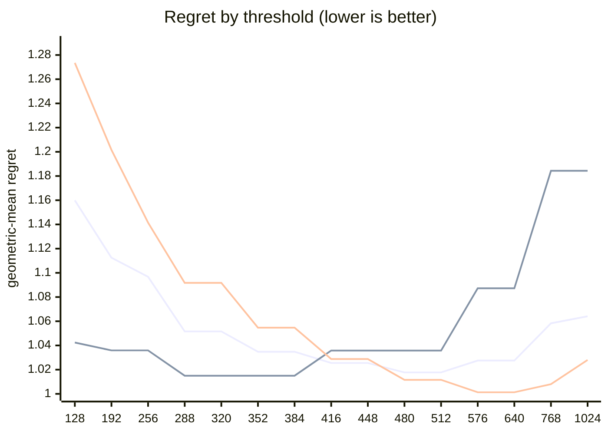

# QR dispatch crossover — Apple M5 Pro

What every section and number below means: [reading-reports.md](https://github.com/c0rmac/metal-linalg/blob/main/docs/reading-reports.md).

Generated by `tuning/tune_qr.py`. 185 shapes, 555 shape/backend pairs measured twice.

| | |
|---|---|
| Device | Apple M5 Pro |
| GPU cores | 20 |
| Resident matrices (`qr_unblocked`) | 120 |
| Shapes measured | 185 |
| Coverage | near-square 29, square 82, tall 44, wide 30 |

## The band

```
M >= 512  ->  qr_streaming_amx_reduced
otherwise  ->  qr_unblocked
```

The optimum is flat from **480 to 512** rows (every threshold within 0.3% of the best, 1.0177x). Any value inside that band is equivalent on this hardware; **512** is the middle of it.

Paste into `kTuned[]` in `src/qr.mm`:

```c
    {"Apple M5 Pro", 20, 512, 512, 16,   192, 16384, 1, 128,   1024, 4},
```

### Cost of missing the band

| threshold | regret | excess | |
|---|---|---|---|
| 128 | 1.1599x | +13.97% |  |
| 192 | 1.1125x | +9.32% |  |
| 256 | 1.0967x | +7.76% |  |
| 288 | 1.0516x | +3.33% |  |
| 320 | 1.0516x | +3.33% |  |
| 352 | 1.0348x | +1.68% |  |
| 384 | 1.0348x | +1.68% |  |
| 416 | 1.0255x | +0.77% |  |
| 448 | 1.0255x | +0.77% |  |
| 480 | 1.0177x | +0.00% | **in band** |
| 512 | 1.0177x | +0.00% | **in band** |
| 576 | 1.0275x | +0.96% |  |
| 640 | 1.0275x | +0.96% |  |
| 768 | 1.0583x | +3.99% |  |
| 1024 | 1.0641x | +4.56% |  |

The penalty is usually asymmetric. Erring low costs little; erring high degrades specifically on tall inputs. Adding GPU cores makes the grid-parallel backend relatively stronger and pushes the true crossover down, so an untuned device is safer low than high.

## GPU or CPU

```
GPU iff 128 <= k <= 192, batch * k >= 16384 and batch >= 1   (k = min(M, N))
or k >= 1024 and batch <= 4   (large matrices)
otherwise LAPACK on the CPU
```

Fitted on every shape with a CPU timing; inside the region within 0.5% of the best geometric-mean regret, the candidate with the smallest worst case.

| routing | geomean regret | worst | >10% off |
|---|---|---|---|
| chosen | 1.0365x | 3.33x | 12/185 |
| chosen without the large-matrix clause | 1.0624x | 3.33x | 23/185 |
| always the GPU (before the CPU path) | 2.2466x | 83.10x | 155/185 |
| always the CPU | 1.0627x | 3.33x | 23/185 |

Held out (fitted on half the shapes, scored on the other half): 1.0530x geomean, 3.33x worst, against 2.0950x and 82.33x for always the GPU.

The CPU was the fastest backend at 157 of 185 shapes, e.g. 1 x 8x8, 1 x 16x16, 1 x 16x256, 1 x 32x32, 1 x 64x64, 1 x 64x256, 1 x 64x384, 1 x 64x640.

## Regret by threshold

Regret is how much slower the chosen backend is than the best one measured at that shape; 1.0000x would be a perfect oracle. The per-region curves are the point: a grid covering only one aspect ratio can be nearly flat, and will then pick a threshold out of noise.



Series order: pooled, tall only, square only.

| threshold | pooled | square | tall | wide | near-square | pooled worst |
|---|---|---|---|---|---|---|
| 128 | 1.1599 | 1.2735 | 1.0424 | 1.0698 | 1.3038 | 2.15x |
| 192 | 1.1125 | 1.2016 | 1.0359 | 1.0256 | 1.2128 | 1.79x |
| 256 | 1.0967 | 1.1415 | 1.0359 | 1.0256 | 1.2128 | 1.68x |
| 288 | 1.0516 | 1.0917 | 1.0150 | 1.0045 | 1.1052 | 1.46x |
| 320 | 1.0516 | 1.0917 | 1.0150 | 1.0045 | 1.1052 | 1.46x |
| 352 | 1.0348 | 1.0547 | 1.0150 | 1.0045 | 1.0704 | 1.33x |
| 384 | 1.0348 | 1.0547 | 1.0150 | 1.0045 | 1.0704 | 1.33x |
| 416 | 1.0255 | 1.0288 | 1.0358 | 1.0045 | 1.0276 | 1.54x |
| 448 | 1.0255 | 1.0288 | 1.0358 | 1.0045 | 1.0276 | 1.54x |
| 480 | 1.0177 | 1.0116 | 1.0358 | 1.0045 | 1.0126 | 1.54x |
| 512 | 1.0177 | 1.0116 | 1.0358 | 1.0045 | 1.0126 | 1.54x |
| 576 | 1.0275 | 1.0013 | 1.0872 | 1.0045 | 1.0005 | 1.94x |
| 640 | 1.0275 | 1.0013 | 1.0872 | 1.0045 | 1.0005 | 1.94x |
| 768 | 1.0583 | 1.0080 | 1.1843 | 1.0045 | 1.0070 | 2.27x |
| 1024 | 1.0641 | 1.0280 | 1.1843 | 1.0045 | 1.0070 | 2.27x |

## Which feature decides

`qr_unblocked` gives each matrix a single threadgroup, which sweeps `M` rows per Householder reflection while `N` parallelises across that threadgroup's threads. Rows and columns are therefore not interchangeable, and a rule on `max(M, N)` cannot express the difference.

| feature | best threshold | geomean regret | worst |
|---|---|---|---|
| M (rows) | 480 | 1.0177x | 1.54x |
| max(M, N) | 576 | 1.0680x | 2.09x |
| K = min(M, N) | 576 | 1.1355x | 6.40x |

## Decision surface

**batch 1**

```
      N=32      N=64      N=128     N=256     N=512     
      ---------------------------------------------
  128 .  1.27     1.79     1.77     1.72     1.58
  256 ~  0.99     1.31     1.57     1.68     1.48
  384 ## 0.67  ~  0.97  .  1.28  .  1.30  .  1.20
  512 ###0.52  ## 0.79  .  1.07  ~  1.04  .  1.07   <- M >= 512
  640 ###0.47  ## 0.63  #  0.85  ## 0.82  ## 0.82

      ratio = reduced / unblocked.  ### <0.60  ## <0.85  # <0.95
      ~ tie (0.95-1.05)   . <1.30   blank >1.30  (unblocked wins)
```

**batch 16**

```
      N=32      N=64      N=128     N=256     N=512     
      ---------------------------------------------
  128 ~  1.03     1.75     1.60     1.51     1.44
  256 ~  0.95  .  1.13     1.41     1.53     1.38
  384 ## 0.65  ~  0.95  .  1.19  .  1.28  .  1.23
  512 ## 0.61  ## 0.78  ~  1.04  .  1.12  .  1.17   <- M >= 512
  640 ###0.44  ###0.60  ## 0.79  #  0.90  ~  1.01

      ratio = reduced / unblocked.  ### <0.60  ## <0.85  # <0.95
      ~ tie (0.95-1.05)   . <1.30   blank >1.30  (unblocked wins)
```

## Candidate rules

Per-region columns matter more than the overall number: an aggregate can look excellent while one aspect class is badly served.

| rule | geomean | worst | >10% off | square | tall | wide | near-square |
|---|---|---|---|---|---|---|---|
| original 5-rule heuristic | 1.1928x | 2.09x | 63/143 | 1.142 | 1.045 | 1.522 | 1.203 |
| max(M,N) >= 512 | 1.0872x | 2.09x | 30/143 | 1.012 | 1.036 | 1.327 | 1.052 |
| K = min(M,N) >= 128 | 1.2690x | 6.40x | 76/143 | 1.274 | 1.433 | 1.070 | 1.254 |
| M >= 512  (chosen) | 1.0177x | 1.54x | 8/143 | 1.012 | 1.036 | 1.004 | 1.013 |

## Refinements tested

Both of these were rejected on an 8-core M1, and both are re-tested here rather than assumed. A GPU with many more cores saturates `qr_unblocked` much later, so the batch split in particular could be justified elsewhere. Each is fitted on half the shapes and scored on the other half.

Baseline for comparison — `M >= 512` on the held-out half: **1.0199x** geomean, 1.54x worst.

| refinement | fitted form | train | held-out | held-out worst | verdict |
|---|---|---|---|---|---|
| batch-dependent split | `M >= (480 if batch < 32 else 416)` | 1.0156x | 1.0219x | 1.54x | reject |
| narrow-N special case | `M >= 416 or (N <= 64 and M >= 288)` | 1.0157x | 1.0166x | 1.19x | **adopt** |

> At least one refinement cleared held-out validation on this GPU. `QrPolicy` already carries the batch-split fields (`m_crossover_small_batch` / `m_crossover_large_batch` / `batch_threshold`) — set them from the fitted form above.

## Measurement noise

Run-to-run ratio over 555 shape/backend pairs measured twice: median 1.008x, p90 1.184x, max 2.907x.

| runtime | pairs | median | p90 | max |
|---|---|---|---|---|
| <1 ms | 205 | 1.025x | 1.693x | 2.907x |
| 1-3 ms | 149 | 1.005x | 1.041x | 1.345x |
| 3-10 ms | 111 | 1.006x | 1.027x | 1.234x |
| 10-30 ms | 44 | 1.005x | 1.020x | 1.098x |
| 30-100 ms | 27 | 1.007x | 1.021x | 1.072x |
| >100 ms | 19 | 1.002x | 1.012x | 1.067x |

Noise concentrates in fast shapes, where submission jitter dominates. A difference smaller than the p90 figure for its size bucket is not a result.

---

Raw timings in `raw.csv`; full analysis including plot-ready series in `results.json`. Re-render this report without remeasuring: `python3 tuning/tune_qr.py --from results.json`.
