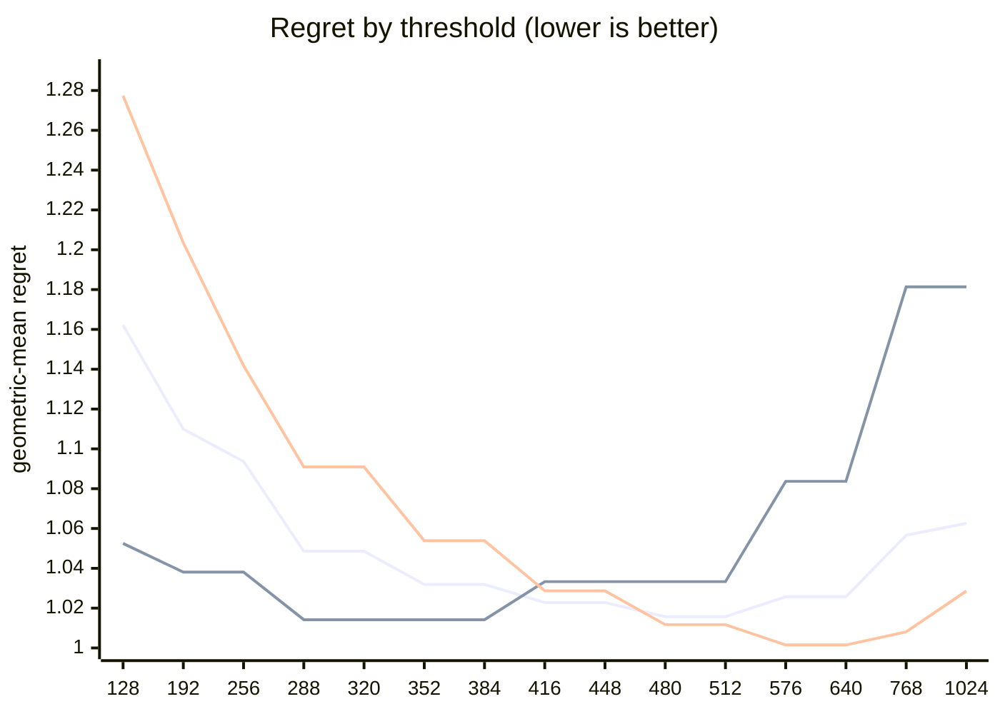

# QR dispatch crossover — Apple M5 Pro

What every section and number below means: [reading-reports.md](https://github.com/c0rmac/metal-linalg/blob/main/docs/reading-reports.md).

Generated by `tuning/tune_qr.py`. 185 shapes, 555 shape/backend pairs measured twice.

| | |
|---|---|
| Device | Apple M5 Pro |
| GPU cores | 20 |
| Resident matrices (`qr_unblocked`) | 120 |
| Shapes measured | 185 |
| Coverage | near-square 29, square 82, tall 44, wide 30 |

## The band

```
M >= 512  ->  qr_streaming_amx_reduced
otherwise  ->  qr_unblocked
```

The optimum is flat from **480 to 512** rows (every threshold within 0.3% of the best, 1.0157x). Any value inside that band is equivalent on this hardware; **512** is the middle of it.

Paste into `kTuned[]` in `src/qr.mm`:

```c
    {"Apple M5 Pro", 20, 512, 512, 16,   192, 40960, 1, 128,   1024, 4},
```

### Cost of missing the band

| threshold | regret | excess | |
|---|---|---|---|
| 128 | 1.1621x | +14.41% |  |
| 192 | 1.1099x | +9.27% |  |
| 256 | 1.0937x | +7.68% |  |
| 288 | 1.0486x | +3.24% |  |
| 320 | 1.0486x | +3.24% |  |
| 352 | 1.0319x | +1.59% |  |
| 384 | 1.0319x | +1.59% |  |
| 416 | 1.0228x | +0.70% |  |
| 448 | 1.0228x | +0.70% |  |
| 480 | 1.0157x | +0.00% | **in band** |
| 512 | 1.0157x | +0.00% | **in band** |
| 576 | 1.0257x | +0.98% |  |
| 640 | 1.0257x | +0.98% |  |
| 768 | 1.0566x | +4.03% |  |
| 1024 | 1.0626x | +4.62% |  |

The penalty is usually asymmetric. Erring low costs little; erring high degrades specifically on tall inputs. Adding GPU cores makes the grid-parallel backend relatively stronger and pushes the true crossover down, so an untuned device is safer low than high.

## GPU or CPU

```
GPU iff 128 <= k <= 192, batch * k >= 40960 and batch >= 1   (k = min(M, N))
or k >= 1024 and batch <= 4   (large matrices)
otherwise LAPACK on the CPU
```

Fitted on every shape with a CPU timing; inside the region within 0.5% of the best geometric-mean regret, the candidate with the smallest worst case.

| routing | geomean regret | worst | >10% off |
|---|---|---|---|
| chosen | 1.0000x | 1.00x | 0/185 |
| chosen without the large-matrix clause | 1.0238x | 2.15x | 10/185 |
| always the GPU (before the CPU path) | 2.6576x | 72.51x | 170/185 |
| always the CPU | 1.0240x | 2.15x | 10/185 |

Held out (fitted on half the shapes, scored on the other half): 1.0003x geomean, 1.03x worst, against 2.5181x and 53.12x for always the GPU.

The CPU was the fastest backend at 172 of 185 shapes, e.g. 1 x 8x8, 1 x 16x16, 1 x 16x256, 1 x 32x32, 1 x 32x384, 1 x 32x512, 1 x 64x64, 1 x 64x256.

## Regret by threshold

Regret is how much slower the chosen backend is than the best one measured at that shape; 1.0000x would be a perfect oracle. The per-region curves are the point: a grid covering only one aspect ratio can be nearly flat, and will then pick a threshold out of noise.



Series order: pooled, tall only, square only.

| threshold | pooled | square | tall | wide | near-square | pooled worst |
|---|---|---|---|---|---|---|
| 128 | 1.1621 | 1.2774 | 1.0525 | 1.0665 | 1.2953 | 2.13x |
| 192 | 1.1099 | 1.2035 | 1.0381 | 1.0211 | 1.1979 | 1.80x |
| 256 | 1.0937 | 1.1418 | 1.0381 | 1.0211 | 1.1979 | 1.68x |
| 288 | 1.0486 | 1.0909 | 1.0142 | 1.0005 | 1.0966 | 1.47x |
| 320 | 1.0486 | 1.0909 | 1.0142 | 1.0005 | 1.0966 | 1.47x |
| 352 | 1.0319 | 1.0539 | 1.0142 | 1.0005 | 1.0626 | 1.32x |
| 384 | 1.0319 | 1.0539 | 1.0142 | 1.0005 | 1.0626 | 1.32x |
| 416 | 1.0228 | 1.0287 | 1.0333 | 1.0005 | 1.0223 | 1.51x |
| 448 | 1.0228 | 1.0287 | 1.0333 | 1.0005 | 1.0223 | 1.51x |
| 480 | 1.0157 | 1.0117 | 1.0333 | 1.0005 | 1.0107 | 1.51x |
| 512 | 1.0157 | 1.0117 | 1.0333 | 1.0005 | 1.0107 | 1.51x |
| 576 | 1.0257 | 1.0015 | 1.0837 | 1.0005 | 1.0007 | 1.83x |
| 640 | 1.0257 | 1.0015 | 1.0837 | 1.0005 | 1.0007 | 1.83x |
| 768 | 1.0566 | 1.0081 | 1.1814 | 1.0005 | 1.0070 | 2.24x |
| 1024 | 1.0626 | 1.0286 | 1.1814 | 1.0005 | 1.0070 | 2.24x |

## Which feature decides

`qr_unblocked` gives each matrix a single threadgroup, which sweeps `M` rows per Householder reflection while `N` parallelises across that threadgroup's threads. Rows and columns are therefore not interchangeable, and a rule on `max(M, N)` cannot express the difference.

| feature | best threshold | geomean regret | worst |
|---|---|---|---|
| M (rows) | 480 | 1.0157x | 1.51x |
| max(M, N) | 576 | 1.0633x | 2.06x |
| K = min(M, N) | 576 | 1.1336x | 6.39x |

## Decision surface

**batch 1**

```
      N=32      N=64      N=128     N=256     N=512     
      ---------------------------------------------
  128    1.42     1.75     1.80     1.88     1.56
  256 ~  1.01  .  1.30     1.57     1.68     1.48
  384 ## 0.66  ~  0.98  .  1.25  .  1.30  .  1.21
  512 ###0.55  ## 0.76  .  1.08  ~  1.04  .  1.07   <- M >= 512
  640 ###0.46  ## 0.63  #  0.85  ## 0.83  ## 0.82

      ratio = reduced / unblocked.  ### <0.60  ## <0.85  # <0.95
      ~ tie (0.95-1.05)   . <1.30   blank >1.30  (unblocked wins)
```

**batch 16**

```
      N=32      N=64      N=128     N=256     N=512     
      ---------------------------------------------
  128 .  1.29     1.70     1.59     1.72     1.54
  256 ~  0.95  .  1.23     1.42     1.56  .  1.22
  384 ## 0.72  #  0.90  .  1.20  .  1.20  .  1.23
  512 ###0.60  ## 0.78  ~  1.02  .  1.06  .  1.16   <- M >= 512
  640 ###0.45  ###0.58  ## 0.78  #  0.91  ~  1.02

      ratio = reduced / unblocked.  ### <0.60  ## <0.85  # <0.95
      ~ tie (0.95-1.05)   . <1.30   blank >1.30  (unblocked wins)
```

## Candidate rules

Per-region columns matter more than the overall number: an aggregate can look excellent while one aspect class is badly served.

| rule | geomean | worst | >10% off | square | tall | wide | near-square |
|---|---|---|---|---|---|---|---|
| original 5-rule heuristic | 1.1867x | 2.06x | 62/143 | 1.145 | 1.046 | 1.483 | 1.198 |
| max(M,N) >= 512 | 1.0819x | 2.06x | 28/143 | 1.012 | 1.033 | 1.308 | 1.046 |
| K = min(M,N) >= 128 | 1.2665x | 6.39x | 73/143 | 1.277 | 1.427 | 1.067 | 1.247 |
| M >= 512  (chosen) | 1.0157x | 1.51x | 6/143 | 1.012 | 1.033 | 1.000 | 1.011 |

## Refinements tested

Both of these were rejected on an 8-core M1, and both are re-tested here rather than assumed. A GPU with many more cores saturates `qr_unblocked` much later, so the batch split in particular could be justified elsewhere. Each is fitted on half the shapes and scored on the other half.

Baseline for comparison — `M >= 512` on the held-out half: **1.0163x** geomean, 1.51x worst.

| refinement | fitted form | train | held-out | held-out worst | verdict |
|---|---|---|---|---|---|
| batch-dependent split | `M >= (480 if batch < 32 else 416)` | 1.0151x | 1.0181x | 1.51x | reject |
| narrow-N special case | `M >= 416 or (N <= 64 and M >= 288)` | 1.0148x | 1.0134x | 1.20x | **adopt** |

> At least one refinement cleared held-out validation on this GPU. `QrPolicy` already carries the batch-split fields (`m_crossover_small_batch` / `m_crossover_large_batch` / `batch_threshold`) — set them from the fitted form above.

## Measurement noise

Run-to-run ratio over 555 shape/backend pairs measured twice: median 1.015x, p90 1.186x, max 2.927x.

| runtime | pairs | median | p90 | max |
|---|---|---|---|---|
| <1 ms | 213 | 1.036x | 1.595x | 2.927x |
| 1-3 ms | 141 | 1.013x | 1.145x | 1.409x |
| 3-10 ms | 111 | 1.010x | 1.048x | 1.324x |
| 10-30 ms | 44 | 1.011x | 1.034x | 1.099x |
| 30-100 ms | 27 | 1.009x | 1.031x | 1.257x |
| >100 ms | 19 | 1.004x | 1.033x | 1.036x |

Noise concentrates in fast shapes, where submission jitter dominates. A difference smaller than the p90 figure for its size bucket is not a result.

---

Raw timings in `raw.csv`; full analysis including plot-ready series in `results.json`. Re-render this report without remeasuring: `python3 tuning/tune_qr.py --from results.json`.
