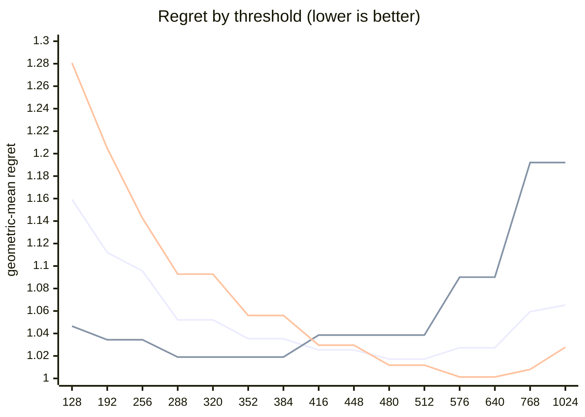

# QR dispatch crossover — Apple M5 Pro

What every section and number below means: [reading-reports.md](https://github.com/c0rmac/metal-linalg/blob/main/docs/reading-reports.md).

Generated by `tuning/tune_qr.py`. 185 shapes, 586 shape/backend pairs measured twice.

| | |
|---|---|
| Device | Apple M5 Pro |
| GPU cores | 20 |
| Resident matrices (`qr_unblocked`) | 120 |
| Shapes measured | 185 |
| Coverage | near-square 29, square 82, tall 44, wide 30 |

## The band

```
M >= 512  ->  qr_streaming_amx_reduced
otherwise  ->  qr_unblocked
```

The optimum is flat from **480 to 512** rows (every threshold within 0.3% of the best, 1.0172x). Any value inside that band is equivalent on this hardware; **512** is the middle of it.

Paste into `kTuned[]` in `src/qr.mm`:

```c
    {"Apple M5 Pro", 20, 512, 512, 16,   128, 40960, 1, 0,   1024, 4,   64},
```

### Cost of missing the band

| threshold | regret | excess | |
|---|---|---|---|
| 128 | 1.1592x | +13.96% |  |
| 192 | 1.1120x | +9.32% |  |
| 256 | 1.0956x | +7.71% |  |
| 288 | 1.0521x | +3.43% |  |
| 320 | 1.0521x | +3.43% |  |
| 352 | 1.0353x | +1.78% |  |
| 384 | 1.0353x | +1.78% |  |
| 416 | 1.0253x | +0.80% |  |
| 448 | 1.0253x | +0.80% |  |
| 480 | 1.0172x | +0.00% | **in band** |
| 512 | 1.0172x | +0.00% | **in band** |
| 576 | 1.0273x | +0.99% |  |
| 640 | 1.0273x | +0.99% |  |
| 768 | 1.0594x | +4.15% |  |
| 1024 | 1.0652x | +4.72% |  |

The penalty is usually asymmetric. Erring low costs little; erring high degrades specifically on tall inputs. Adding GPU cores makes the grid-parallel backend relatively stronger and pushes the true crossover down, so an untuned device is safer low than high.

## GPU or CPU

```
GPU iff k <= 128, batch * k >= 40960 and batch >= 1   (k = min(M, N))
or k >= 1024 and batch <= 4   (large matrices)
otherwise LAPACK on the CPU
```

On the GPU, from a batch of 64 the batch is shared with the CPU path (the GPU and the CPU solving it at once): fitted first, on the GPU's side alone (the kernel against `share`, timed from batch 64), and the routing above fitted with it in effect.

| shared from batch | geomean regret (GPU side) | worst |
|---|---|---|
| never | 1.4335 | 2.82x |
| 64 | 1.0339 | 1.57x |
| 256 | 1.0917 | 1.57x |
| 1024 | 1.0851 | 1.51x |
| 4096 | 1.1763 | 2.51x |
| 16384 | 1.3052 | 2.53x |

Fitted on every shape with a CPU timing; inside the region within 0.5% of the best geometric-mean regret, the candidate with the smallest worst case.

| routing | geomean regret | worst | >10% off |
|---|---|---|---|
| chosen | 1.0013x | 1.17x | 1/185 |
| chosen without the large-matrix clause | 1.0256x | 2.12x | 12/185 |
| always the GPU (before the CPU path) | 2.5263x | 71.94x | 159/185 |
| always the CPU | 1.0328x | 2.12x | 17/185 |

Held out (fitted on half the shapes, scored on the other half): 1.0061x geomean, 1.50x worst, against 2.4435x and 45.88x for always the GPU.

The CPU was the fastest backend at 164 of 185 shapes, e.g. 1 x 8x8, 1 x 16x16, 1 x 16x256, 1 x 32x32, 1 x 32x384, 1 x 32x512, 1 x 64x64, 1 x 64x256.

## Regret by threshold

Regret is how much slower the chosen backend is than the best one measured at that shape; 1.0000x would be a perfect oracle. The per-region curves are the point: a grid covering only one aspect ratio can be nearly flat, and will then pick a threshold out of noise.



Series order: pooled, tall only, square only.

| threshold | pooled | square | tall | wide | near-square | pooled worst |
|---|---|---|---|---|---|---|
| 128 | 1.1592 | 1.2807 | 1.0465 | 1.0690 | 1.2831 | 2.18x |
| 192 | 1.1120 | 1.2047 | 1.0344 | 1.0203 | 1.2147 | 1.80x |
| 256 | 1.0956 | 1.1425 | 1.0344 | 1.0203 | 1.2147 | 1.67x |
| 288 | 1.0521 | 1.0928 | 1.0190 | 1.0000 | 1.1048 | 1.47x |
| 320 | 1.0521 | 1.0928 | 1.0190 | 1.0000 | 1.1048 | 1.47x |
| 352 | 1.0353 | 1.0560 | 1.0190 | 1.0000 | 1.0695 | 1.31x |
| 384 | 1.0353 | 1.0560 | 1.0190 | 1.0000 | 1.0695 | 1.31x |
| 416 | 1.0253 | 1.0296 | 1.0386 | 1.0000 | 1.0258 | 1.53x |
| 448 | 1.0253 | 1.0296 | 1.0386 | 1.0000 | 1.0258 | 1.53x |
| 480 | 1.0172 | 1.0118 | 1.0386 | 1.0000 | 1.0106 | 1.53x |
| 512 | 1.0172 | 1.0118 | 1.0386 | 1.0000 | 1.0106 | 1.53x |
| 576 | 1.0273 | 1.0013 | 1.0901 | 1.0000 | 1.0000 | 1.93x |
| 640 | 1.0273 | 1.0013 | 1.0901 | 1.0000 | 1.0000 | 1.93x |
| 768 | 1.0594 | 1.0080 | 1.1921 | 1.0000 | 1.0070 | 2.37x |
| 1024 | 1.0652 | 1.0278 | 1.1921 | 1.0000 | 1.0070 | 2.37x |

## Which feature decides

`qr_unblocked` gives each matrix a single threadgroup, which sweeps `M` rows per Householder reflection while `N` parallelises across that threadgroup's threads. Rows and columns are therefore not interchangeable, and a rule on `max(M, N)` cannot express the difference.

| feature | best threshold | geomean regret | worst |
|---|---|---|---|
| M (rows) | 480 | 1.0172x | 1.53x |
| max(M, N) | 576 | 1.0669x | 2.04x |
| K = min(M, N) | 576 | 1.1379x | 6.44x |

## Decision surface

**batch 1**

```
      N=32      N=64      N=128     N=256     N=512     
      ---------------------------------------------
  128    1.33  .  1.08     1.93     1.76     1.80
  256 ~  0.98  .  1.24     1.57     1.67     1.49
  384 ## 0.65  ~  1.00  .  1.28  .  1.30  .  1.22
  512 ###0.52  ## 0.82  .  1.07  ~  1.04  .  1.07   <- M >= 512
  640 ###0.47  ## 0.61  #  0.85  ## 0.83  ## 0.82

      ratio = reduced / unblocked.  ### <0.60  ## <0.85  # <0.95
      ~ tie (0.95-1.05)   . <1.30   blank >1.30  (unblocked wins)
```

**batch 16**

```
      N=32      N=64      N=128     N=256     N=512     
      ---------------------------------------------
  128 .  1.25     1.64     1.62     1.57     1.43
  256 ## 0.78  .  1.21     1.43     1.53     1.41
  384 ## 0.67  #  0.94  .  1.20  .  1.30  .  1.24
  512 ###0.59  ## 0.75  ~  1.02  .  1.09  .  1.15   <- M >= 512
  640 ###0.42  ###0.58  ## 0.76  #  0.86  ~  1.00

      ratio = reduced / unblocked.  ### <0.60  ## <0.85  # <0.95
      ~ tie (0.95-1.05)   . <1.30   blank >1.30  (unblocked wins)
```

## Candidate rules

Per-region columns matter more than the overall number: an aggregate can look excellent while one aspect class is badly served.

| rule | geomean | worst | >10% off | square | tall | wide | near-square |
|---|---|---|---|---|---|---|---|
| original 5-rule heuristic | 1.1955x | 2.04x | 62/143 | 1.146 | 1.047 | 1.552 | 1.183 |
| max(M,N) >= 512 | 1.0869x | 2.04x | 29/143 | 1.012 | 1.039 | 1.319 | 1.052 |
| K = min(M,N) >= 128 | 1.2744x | 6.44x | 75/143 | 1.281 | 1.442 | 1.069 | 1.258 |
| M >= 512  (chosen) | 1.0172x | 1.53x | 7/143 | 1.012 | 1.039 | 1.000 | 1.011 |

## Refinements tested

Both of these were rejected on an 8-core M1, and both are re-tested here rather than assumed. A GPU with many more cores saturates `qr_unblocked` much later, so the batch split in particular could be justified elsewhere. Each is fitted on half the shapes and scored on the other half.

Baseline for comparison — `M >= 512` on the held-out half: **1.0175x** geomean, 1.53x worst.

| refinement | fitted form | train | held-out | held-out worst | verdict |
|---|---|---|---|---|---|
| batch-dependent split | `M >= (480 if batch < 32 else 416)` | 1.0169x | 1.0195x | 1.53x | reject |
| narrow-N special case | `M >= 416 or (N <= 32 and M >= 128)` | 1.0154x | 1.0266x | 1.33x | reject |

> Neither refinement survived. Ship the plain threshold. A refinement that looks good on the training half and not on the held-out half is fitting noise, which is exactly what the split is there to catch.

## Measurement noise

Run-to-run ratio over 586 shape/backend pairs measured twice: median 1.017x, p90 1.153x, max 2.740x.

| runtime | pairs | median | p90 | max |
|---|---|---|---|---|
| <1 ms | 227 | 1.032x | 1.402x | 2.740x |
| 1-3 ms | 145 | 1.014x | 1.072x | 1.687x |
| 3-10 ms | 115 | 1.012x | 1.033x | 1.158x |
| 10-30 ms | 50 | 1.011x | 1.046x | 1.267x |
| 30-100 ms | 28 | 1.014x | 1.028x | 1.295x |
| >100 ms | 21 | 1.005x | 1.025x | 1.039x |

Noise concentrates in fast shapes, where submission jitter dominates. A difference smaller than the p90 figure for its size bucket is not a result.

---

Raw timings in `raw.csv`; full analysis including plot-ready series in `results.json`. Re-render this report without remeasuring: `python3 tuning/tune_qr.py --from results.json`.
