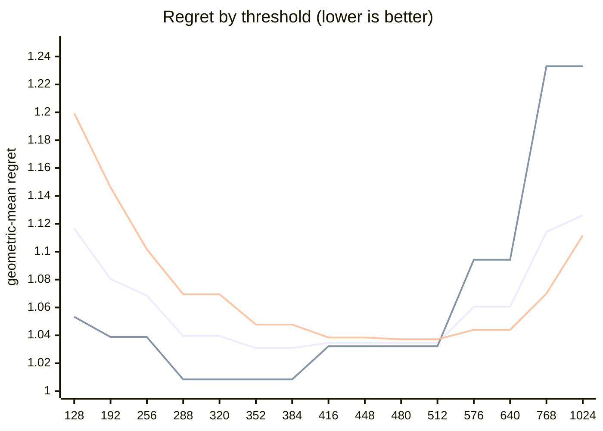

# QR dispatch crossover — Apple M5 Pro

What every section and number below means: [reading-reports.md](https://github.com/c0rmac/metal-linalg/blob/main/docs/reading-reports.md).

Generated by `tuning/tune_qr.py`. 185 shapes, 586 shape/backend pairs measured twice.

| | |
|---|---|
| Device | Apple M5 Pro |
| GPU cores | 20 |
| Resident matrices (`qr_unblocked`) | 120 |
| Shapes measured | 185 |
| Coverage | near-square 29, square 82, tall 44, wide 30 |

## The band

```
M >= 384  ->  qr_streaming_amx_reduced
otherwise  ->  qr_unblocked
```

The optimum is flat from **352 to 384** rows (every threshold within 0.3% of the best, 1.0309x). Any value inside that band is equivalent on this hardware; **384** is the middle of it.

Paste into `kTuned[]` in `src/qr.mm`:

```c
    {"Apple M5 Pro", 20, 384, 384, 16,   128, 20480, 1, 16,   768, 4,   64},
```

### Cost of missing the band

| threshold | regret | excess | |
|---|---|---|---|
| 128 | 1.1167x | +8.32% |  |
| 192 | 1.0804x | +4.80% |  |
| 256 | 1.0685x | +3.65% |  |
| 288 | 1.0395x | +0.83% |  |
| 320 | 1.0395x | +0.83% |  |
| 352 | 1.0309x | +0.00% | **in band** |
| 384 | 1.0309x | +0.00% | **in band** |
| 416 | 1.0347x | +0.37% |  |
| 448 | 1.0347x | +0.37% |  |
| 480 | 1.0346x | +0.36% |  |
| 512 | 1.0346x | +0.36% |  |
| 576 | 1.0605x | +2.87% |  |
| 640 | 1.0605x | +2.87% |  |
| 768 | 1.1142x | +8.08% |  |
| 1024 | 1.1261x | +9.23% |  |

The penalty is usually asymmetric. Erring low costs little; erring high degrades specifically on tall inputs. Adding GPU cores makes the grid-parallel backend relatively stronger and pushes the true crossover down, so an untuned device is safer low than high.

## GPU or CPU

```
GPU iff 16 <= k <= 128, batch * k >= 20480 and batch >= 1   (k = min(M, N))
or k >= 768 and batch <= 4   (large matrices)
otherwise LAPACK on the CPU
```

On the GPU, from a batch of 64 the batch is shared with the CPU path (the GPU and the CPU solving it at once): fitted first, on the GPU's side alone (the kernel against `share`, timed from batch 64), and the routing above fitted with it in effect.

| shared from batch | geomean regret (GPU side) | worst |
|---|---|---|
| never | 1.4750 | 2.93x |
| 64 | 1.0253 | 1.35x |
| 256 | 1.1156 | 2.51x |
| 1024 | 1.1334 | 2.51x |
| 4096 | 1.2070 | 2.51x |
| 16384 | 1.3464 | 2.58x |

Fitted on every shape with a CPU timing; inside the region within 0.5% of the best geometric-mean regret, the candidate with the smallest worst case.

| routing | geomean regret | worst | >10% off |
|---|---|---|---|
| chosen | 1.0059x | 1.37x | 4/185 |
| chosen without the large-matrix clause | 1.0682x | 6.66x | 14/185 |
| always the GPU (before the CPU path) | 2.4937x | 86.53x | 155/185 |
| always the CPU | 1.0732x | 6.66x | 17/185 |

Held out (fitted on half the shapes, scored on the other half): 1.0177x geomean, 1.65x worst, against 2.3797x and 56.24x for always the GPU.

The CPU was the fastest backend at 159 of 185 shapes, e.g. 1 x 8x8, 1 x 16x16, 1 x 16x256, 1 x 32x32, 1 x 32x384, 1 x 32x512, 1 x 64x64, 1 x 64x256.

## Regret by threshold

Regret is how much slower the chosen backend is than the best one measured at that shape; 1.0000x would be a perfect oracle. The per-region curves are the point: a grid covering only one aspect ratio can be nearly flat, and will then pick a threshold out of noise.



Series order: pooled, tall only, square only.

| threshold | pooled | square | tall | wide | near-square | pooled worst |
|---|---|---|---|---|---|---|
| 128 | 1.1167 | 1.1993 | 1.0533 | 1.0501 | 1.1784 | 2.15x |
| 192 | 1.0804 | 1.1462 | 1.0388 | 1.0155 | 1.1269 | 1.74x |
| 256 | 1.0685 | 1.1017 | 1.0388 | 1.0155 | 1.1269 | 1.63x |
| 288 | 1.0395 | 1.0695 | 1.0084 | 1.0083 | 1.0799 | 1.46x |
| 320 | 1.0395 | 1.0695 | 1.0084 | 1.0083 | 1.0799 | 1.46x |
| 352 | 1.0309 | 1.0478 | 1.0084 | 1.0083 | 1.0664 | 1.31x |
| 384 | 1.0309 | 1.0478 | 1.0084 | 1.0083 | 1.0664 | 1.31x |
| 416 | 1.0347 | 1.0385 | 1.0322 | 1.0083 | 1.0616 | 1.55x |
| 448 | 1.0347 | 1.0385 | 1.0322 | 1.0083 | 1.0616 | 1.55x |
| 480 | 1.0346 | 1.0372 | 1.0322 | 1.0083 | 1.0627 | 1.61x |
| 512 | 1.0346 | 1.0372 | 1.0322 | 1.0083 | 1.0627 | 1.61x |
| 576 | 1.0605 | 1.0440 | 1.0942 | 1.0083 | 1.0890 | 2.02x |
| 640 | 1.0605 | 1.0440 | 1.0942 | 1.0083 | 1.0890 | 2.02x |
| 768 | 1.1142 | 1.0700 | 1.2331 | 1.0083 | 1.1199 | 2.64x |
| 1024 | 1.1261 | 1.1117 | 1.2331 | 1.0083 | 1.1199 | 3.11x |

## Which feature decides

`qr_unblocked` gives each matrix a single threadgroup, which sweeps `M` rows per Householder reflection while `N` parallelises across that threadgroup's threads. Rows and columns are therefore not interchangeable, and a rule on `max(M, N)` cannot express the difference.

| feature | best threshold | geomean regret | worst |
|---|---|---|---|
| M (rows) | 352 | 1.0309x | 1.31x |
| max(M, N) | 480 | 1.0922x | 2.75x |
| K = min(M, N) | 256 | 1.1953x | 15.14x |

## Decision surface

**batch 1**

```
      N=32      N=64      N=128     N=256     N=512     
      ---------------------------------------------
  128    1.42  .  1.27  .  1.06  .  1.12  .  1.13
  256    1.35  .  1.26  .  1.28  #  0.94  ## 0.82
  384 #  0.90  ## 0.80  ~  1.02  ## 0.85  ## 0.65   <- M >= 384
  512 ###0.49  ## 0.60  ## 0.77  ## 0.65  ###0.55
  640 ###0.38  ###0.44  ###0.59  ###0.50  ###0.44

      ratio = reduced / unblocked.  ### <0.60  ## <0.85  # <0.95
      ~ tie (0.95-1.05)   . <1.30   blank >1.30  (unblocked wins)
```

**batch 16**

```
      N=32      N=64      N=128     N=256     N=512     
      ---------------------------------------------
  128 .  1.29     1.69     1.61     1.51     1.50
  256 ~  0.99  .  1.28     1.43     1.51  .  1.25
  384 ## 0.67  ~  0.96  .  1.19  .  1.29  .  1.23   <- M >= 384
  512 ###0.60  ## 0.79  ~  1.03  .  1.06  .  1.18
  640 ###0.44  ###0.58  ## 0.78  #  0.90  ~  1.01

      ratio = reduced / unblocked.  ### <0.60  ## <0.85  # <0.95
      ~ tie (0.95-1.05)   . <1.30   blank >1.30  (unblocked wins)
```

## Candidate rules

Per-region columns matter more than the overall number: an aggregate can look excellent while one aspect class is badly served.

| rule | geomean | worst | >10% off | square | tall | wide | near-square |
|---|---|---|---|---|---|---|---|
| original 5-rule heuristic | 1.1403x | 2.75x | 48/143 | 1.075 | 1.045 | 1.469 | 1.087 |
| max(M,N) >= 512 | 1.0922x | 2.75x | 33/143 | 1.037 | 1.032 | 1.313 | 1.056 |
| K = min(M,N) >= 128 | 1.2359x | 15.14x | 61/143 | 1.199 | 1.490 | 1.050 | 1.148 |
| M >= 384  (chosen) | 1.0309x | 1.31x | 20/143 | 1.048 | 1.008 | 1.008 | 1.066 |

## Refinements tested

Both of these were rejected on an 8-core M1, and both are re-tested here rather than assumed. A GPU with many more cores saturates `qr_unblocked` much later, so the batch split in particular could be justified elsewhere. Each is fitted on half the shapes and scored on the other half.

Baseline for comparison — `M >= 384` on the held-out half: **1.0287x** geomean, 1.31x worst.

| refinement | fitted form | train | held-out | held-out worst | verdict |
|---|---|---|---|---|---|
| batch-dependent split | `M >= (352 if batch < 8 else 416)` | 1.0241x | 1.0284x | 1.50x | reject |
| narrow-N special case | `M >= 416 or (N <= 64 and M >= 288)` | 1.0284x | 1.0235x | 1.43x | reject |

> Neither refinement survived. Ship the plain threshold. A refinement that looks good on the training half and not on the held-out half is fitting noise, which is exactly what the split is there to catch.

## Measurement noise

Run-to-run ratio over 586 shape/backend pairs measured twice: median 1.011x, p90 1.221x, max 3.012x.

| runtime | pairs | median | p90 | max |
|---|---|---|---|---|
| <1 ms | 230 | 1.037x | 1.596x | 3.012x |
| 1-3 ms | 153 | 1.007x | 1.071x | 1.804x |
| 3-10 ms | 104 | 1.004x | 1.023x | 1.205x |
| 10-30 ms | 52 | 1.005x | 1.025x | 1.101x |
| 30-100 ms | 29 | 1.004x | 1.012x | 1.110x |
| >100 ms | 18 | 1.002x | 1.017x | 1.031x |

Noise concentrates in fast shapes, where submission jitter dominates. A difference smaller than the p90 figure for its size bucket is not a result.

---

Raw timings in `raw.csv`; full analysis including plot-ready series in `results.json`. Re-render this report without remeasuring: `python3 tuning/tune_qr.py --from results.json`.
