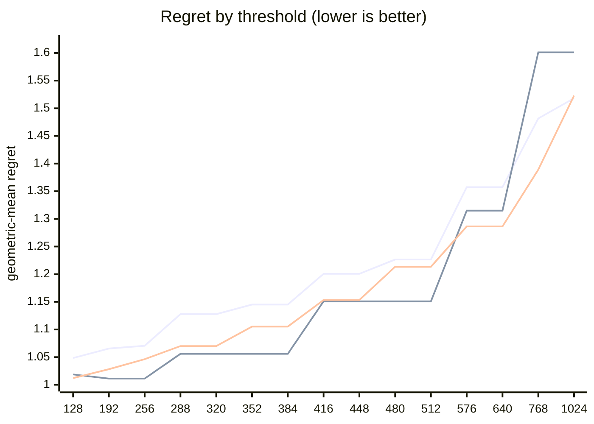

# QR dispatch crossover — Apple M5 Pro

What every section and number below means: [reading-reports.md](https://github.com/c0rmac/metal-linalg/blob/main/docs/reading-reports.md).

Generated by `tuning/tune_qr.py`. 207 shapes, 640 shape/backend pairs measured twice.

| | |
|---|---|
| Device | Apple M5 Pro |
| GPU cores | 20 |
| Resident matrices (`qr_unblocked`) | 120 |
| Shapes measured | 207 |
| Coverage | near-square 29, square 84, tall 56, wide 38 |

## The band

```
M >= 128  ->  qr_streaming_amx_reduced
otherwise  ->  qr_unblocked
```

The optimum is flat from **128 to 128** rows (every threshold within 0.3% of the best, 1.0484x). Any value inside that band is equivalent on this hardware; **128** is the middle of it.

Paste into `kTuned[]` in `src/qr.mm`:

```c
    {"Apple M5 Pro", 20, 128, 128, 16,   256, 20480, 1, 16,   512, 64,   1024},
```

### Cost of missing the band

| threshold | regret | excess | |
|---|---|---|---|
| 128 | 1.0484x | +0.00% | **in band** |
| 192 | 1.0655x | +1.63% |  |
| 256 | 1.0705x | +2.11% |  |
| 288 | 1.1277x | +7.56% |  |
| 320 | 1.1277x | +7.56% |  |
| 352 | 1.1451x | +9.22% |  |
| 384 | 1.1451x | +9.22% |  |
| 416 | 1.2006x | +14.52% |  |
| 448 | 1.2006x | +14.52% |  |
| 480 | 1.2265x | +16.99% |  |
| 512 | 1.2265x | +16.99% |  |
| 576 | 1.3574x | +29.47% |  |
| 640 | 1.3574x | +29.47% |  |
| 768 | 1.4816x | +41.32% |  |
| 1024 | 1.5181x | +44.80% |  |

The penalty is usually asymmetric. Erring low costs little; erring high degrades specifically on tall inputs. Adding GPU cores makes the grid-parallel backend relatively stronger and pushes the true crossover down, so an untuned device is safer low than high.

## GPU or CPU

```
GPU iff 16 <= k <= 256, batch * k >= 20480 and batch >= 1   (k = min(M, N))
or sqrt(M k) >= 512 and batch <= 64   (large matrices, by rows and k)
otherwise LAPACK on the CPU
```

On the GPU, from a batch of 1024 the batch is shared with the CPU path (the GPU and the CPU solving it at once): fitted first, on the GPU's side alone (the kernel against `share`, timed from batch 64), and the routing above fitted with it in effect.

| shared from batch | geomean regret (GPU side) | worst |
|---|---|---|
| never | 1.4332 | 2.97x |
| 64 | 1.1416 | 1.60x |
| 256 | 1.1225 | 1.56x |
| 1024 | 1.0866 | 1.67x |
| 4096 | 1.1703 | 2.54x |
| 16384 | 1.3034 | 2.58x |

Fitted on every shape with a CPU timing; inside the region within 0.5% of the best geometric-mean regret, the candidate with the smallest worst case.

| routing | geomean regret | worst | >10% off |
|---|---|---|---|
| chosen | 1.0133x | 1.72x | 12/207 |
| chosen without the large-matrix clause | 1.2131x | 7.14x | 56/207 |
| always the GPU (before the CPU path) | 1.8925x | 62.85x | 129/207 |
| always the CPU | 1.2230x | 7.14x | 62/207 |

Held out (fitted on half the shapes, scored on the other half): 1.0274x geomean, 1.72x worst, against 1.8126x and 43.92x for always the GPU.

The CPU was the fastest backend at 131 of 207 shapes, e.g. 1 x 8x8, 1 x 16x16, 1 x 16x256, 1 x 32x32, 1 x 32x384, 1 x 32x512, 1 x 64x64, 1 x 64x256.

## Regret by threshold

Regret is how much slower the chosen backend is than the best one measured at that shape; 1.0000x would be a perfect oracle. The per-region curves are the point: a grid covering only one aspect ratio can be nearly flat, and will then pick a threshold out of noise.



Series order: pooled, tall only, square only.

| threshold | pooled | square | tall | wide | near-square | pooled worst |
|---|---|---|---|---|---|---|
| 128 | 1.0484 | 1.0121 | 1.0187 | 1.1564 | 1.0110 | 2.02x |
| 192 | 1.0655 | 1.0282 | 1.0112 | 1.2147 | 1.0207 | 3.30x |
| 256 | 1.0705 | 1.0463 | 1.0112 | 1.2147 | 1.0207 | 3.30x |
| 288 | 1.1277 | 1.0700 | 1.0559 | 1.3408 | 1.0679 | 3.30x |
| 320 | 1.1277 | 1.0700 | 1.0559 | 1.3408 | 1.0679 | 3.30x |
| 352 | 1.1451 | 1.1053 | 1.0559 | 1.3408 | 1.1055 | 3.30x |
| 384 | 1.1451 | 1.1053 | 1.0559 | 1.3408 | 1.1055 | 3.30x |
| 416 | 1.2006 | 1.1533 | 1.1509 | 1.3408 | 1.1707 | 3.30x |
| 448 | 1.2006 | 1.1533 | 1.1509 | 1.3408 | 1.1707 | 3.30x |
| 480 | 1.2265 | 1.2134 | 1.1509 | 1.3408 | 1.2197 | 3.30x |
| 512 | 1.2265 | 1.2134 | 1.1509 | 1.3408 | 1.2197 | 3.30x |
| 576 | 1.3574 | 1.2863 | 1.3149 | 1.5079 | 1.3369 | 8.36x |
| 640 | 1.3574 | 1.2863 | 1.3149 | 1.5079 | 1.3369 | 8.36x |
| 768 | 1.4816 | 1.3890 | 1.6012 | 1.5079 | 1.4065 | 8.36x |
| 1024 | 1.5181 | 1.5229 | 1.6012 | 1.5079 | 1.4065 | 8.36x |

## Which feature decides

`qr_unblocked` gives each matrix a single threadgroup, which sweeps `M` rows per Householder reflection while `N` parallelises across that threadgroup's threads. Rows and columns are therefore not interchangeable, and a rule on `max(M, N)` cannot express the difference.

| feature | best threshold | geomean regret | worst |
|---|---|---|---|
| max(M, N) | 128 | 1.0200x | 1.98x |
| M (rows) | 128 | 1.0484x | 2.02x |
| K = min(M, N) | 128 | 1.2660x | 20.13x |

> **The best feature here is max(M, N), not M.** The dispatcher keys on `M`. If this reproduces, `qr_accelerated` needs revisiting for this GPU — a change of feature is structural and matters more than the threshold moving.

## Decision surface

**batch 1**

```
      N=32      N=64      N=128     N=256     N=512     
      ---------------------------------------------
  128    1.59  ## 0.78  ~  0.98  ~  0.96  #  0.86   <- M >= 128
  256    1.42  #  0.93  .  1.12  #  0.93  ## 0.80
  384 ###0.54  ###0.59  #  0.87  ## 0.76  ## 0.64
  512 ###0.38  ###0.46  ## 0.63  ###0.58  ###0.52
  640 ###0.31  ###0.34  ###0.47  ###0.44  ###0.42

      ratio = reduced / unblocked.  ### <0.60  ## <0.85  # <0.95
      ~ tie (0.95-1.05)   . <1.30   blank >1.30  (unblocked wins)
```

**batch 16**

```
      N=32      N=64      N=128     N=256     N=512     
      ---------------------------------------------
  128 #  0.87  .  1.23  ## 0.80  ## 0.82  ## 0.72   <- M >= 128
  256 ## 0.73  ## 0.74  #  0.89  ## 0.82  ## 0.64
  384 ###0.48  ###0.56  ## 0.74  ## 0.77  ## 0.64
  512 ###0.39  ###0.43  ## 0.62  ## 0.63  ## 0.66
  640 ###0.27  ###0.37  ###0.47  ###0.51  ###0.54

      ratio = reduced / unblocked.  ### <0.60  ## <0.85  # <0.95
      ~ tie (0.95-1.05)   . <1.30   blank >1.30  (unblocked wins)
```

## Candidate rules

Per-region columns matter more than the overall number: an aggregate can look excellent while one aspect class is badly served.

| rule | geomean | worst | >10% off | square | tall | wide | near-square |
|---|---|---|---|---|---|---|---|
| original 5-rule heuristic | 1.0874x | 2.08x | 36/151 | 1.140 | 1.088 | 1.052 | 1.063 |
| max(M,N) >= 512 | 1.1456x | 2.08x | 59/151 | 1.213 | 1.151 | 1.065 | 1.157 |
| K = min(M,N) >= 128 | 1.2660x | 20.13x | 49/151 | 1.012 | 1.944 | 1.156 | 1.012 |
| M >= 128  (chosen) | 1.0484x | 2.02x | 22/151 | 1.012 | 1.019 | 1.156 | 1.011 |

## Refinements tested

Both of these were rejected on an 8-core M1, and both are re-tested here rather than assumed. A GPU with many more cores saturates `qr_unblocked` much later, so the batch split in particular could be justified elsewhere. Each is fitted on half the shapes and scored on the other half.

Baseline for comparison — `M >= 128` on the held-out half: **1.0429x** geomean, 1.69x worst.

| refinement | fitted form | train | held-out | held-out worst | verdict |
|---|---|---|---|---|---|
| batch-dependent split | `M >= (352 if batch < 2 else 256)` | 1.1163x | 1.0628x | 1.69x | reject |
| narrow-N special case | `M >= 352 or (N <= 64 and M >= 128)` | 1.1492x | 1.1165x | 2.95x | reject |

> Neither refinement survived. Ship the plain threshold. A refinement that looks good on the training half and not on the held-out half is fitting noise, which is exactly what the split is there to catch.

## Measurement noise

Run-to-run ratio over 640 shape/backend pairs measured twice: median 1.022x, p90 1.285x, max 3.073x.

| runtime | pairs | median | p90 | max |
|---|---|---|---|---|
| <1 ms | 262 | 1.051x | 1.733x | 3.073x |
| 1-3 ms | 155 | 1.016x | 1.108x | 1.314x |
| 3-10 ms | 115 | 1.014x | 1.050x | 1.325x |
| 10-30 ms | 62 | 1.014x | 1.050x | 1.951x |
| 30-100 ms | 29 | 1.011x | 1.047x | 1.171x |
| >100 ms | 17 | 1.013x | 1.029x | 1.059x |

Noise concentrates in fast shapes, where submission jitter dominates. A difference smaller than the p90 figure for its size bucket is not a result.

---

Raw timings in `raw.csv`; full analysis including plot-ready series in `results.json`. Re-render this report without remeasuring: `python3 tuning/tune_qr.py --from results.json`.
