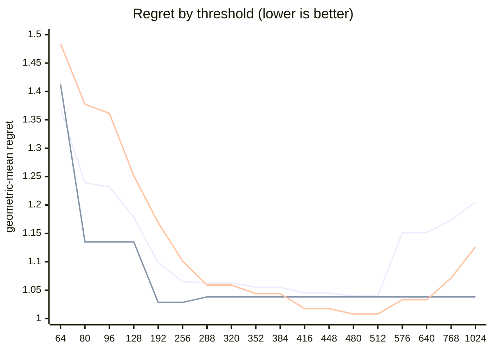

# QR dispatch crossover — Apple M5 Pro

What every section and number below means: [reading-reports.md](https://github.com/c0rmac/metal-linalg/blob/main/docs/reading-reports.md).

Generated by `tuning/tune_qr.py`. 221 shapes, 702 shape/backend pairs measured twice.

| | |
|---|---|
| Device | Apple M5 Pro |
| GPU cores | 20 |
| Resident matrices (`qr_unblocked`) | 120 |
| Shapes measured | 221 |
| Coverage | near-square 29, square 98, tall 56, wide 38 |

## The band

```
k = min(M, N) >= 512  ->  qr_streaming_amx_reduced
otherwise  ->  qr_unblocked
```

The optimum is flat from **k = 480 to 512** (every threshold within 0.3% of the best, 1.0397x). Any value inside that band is equivalent on this hardware; **512** is the middle of it.

Shipped instead: the batch-dependent split, which survived held-out data ([below](#refinements-tested)): the blocked QR from **k = 192** for batches below 8, from **k = 576** for larger ones.

Paste into `kTuned[]` in `src/qr.mm`:

```c
    {"Apple M5 Pro", 20, 192, 576, 8,   320, 6144, 1, 0,   362, 0,   0},
```

### Cost of missing the band

| threshold | regret | excess | |
|---|---|---|---|
| 64 | 1.3696x | +31.73% |  |
| 80 | 1.2391x | +19.18% |  |
| 96 | 1.2316x | +18.46% |  |
| 128 | 1.1783x | +13.33% |  |
| 192 | 1.0988x | +5.68% |  |
| 256 | 1.0648x | +2.41% |  |
| 288 | 1.0629x | +2.23% |  |
| 320 | 1.0629x | +2.23% |  |
| 352 | 1.0549x | +1.46% |  |
| 384 | 1.0549x | +1.46% |  |
| 416 | 1.0449x | +0.50% |  |
| 448 | 1.0449x | +0.50% |  |
| 480 | 1.0397x | +0.00% | **in band** |
| 512 | 1.0397x | +0.00% | **in band** |
| 576 | 1.1515x | +10.75% |  |
| 640 | 1.1515x | +10.75% |  |
| 768 | 1.1736x | +12.88% |  |
| 1024 | 1.2050x | +15.90% |  |

The penalty is usually asymmetric. Erring low costs little; erring high degrades specifically on tall inputs. Adding GPU cores makes the grid-parallel backend relatively stronger and pushes the true crossover down, so an untuned device is safer low than high.

## GPU or CPU

```
GPU iff k <= 320, batch * k >= 6144 and batch >= 1   (k = min(M, N))
or sqrt(M k) >= 362   (large matrices, by rows and k)
otherwise LAPACK on the CPU
```

On the GPU, no batch is shared with the CPU path: fitted first, on the GPU's side alone (the kernel against `share`, timed from batch 64), and the routing above fitted with it in effect.

| shared from batch | geomean regret (GPU side) | worst |
|---|---|---|
| never | 1.0121 | 1.12x |
| 64 | 1.5009 | 2.25x |
| 256 | 1.3747 | 2.25x |
| 1024 | 1.2527 | 2.25x |
| 4096 | 1.1338 | 1.99x |
| 16384 | 1.0593 | 1.86x |

Fitted on every shape with a CPU timing; inside the region within 0.5% of the best geometric-mean regret, the candidate with the smallest worst case.

| routing | geomean regret | worst | >10% off |
|---|---|---|---|
| chosen | 1.0377x | 1.96x | 24/221 |
| chosen without the large-matrix clause | 1.2311x | 6.96x | 70/221 |
| always the GPU (before the CPU path) | 1.7296x | 44.28x | 116/221 |
| always the CPU | 1.3156x | 6.96x | 93/221 |

Held out (fitted on half the shapes, scored on the other half): 1.0670x geomean, 2.33x worst, against 1.6664x and 31.35x for always the GPU.

The CPU was the fastest backend at 123 of 221 shapes, e.g. 1 x 8x8, 1 x 16x16, 1 x 16x256, 1 x 32x32, 1 x 32x384, 1 x 32x512, 1 x 64x64, 1 x 64x256.

## Regret by threshold

Regret is how much slower the chosen backend is than the best one measured at that shape; 1.0000x would be a perfect oracle. The per-region curves are the point: a grid covering only one aspect ratio can be nearly flat, and will then pick a threshold out of noise.



Series order: pooled, tall only, square only.

| threshold | pooled | square | tall | wide | near-square | pooled worst |
|---|---|---|---|---|---|---|
| 64 | 1.3696 | 1.4842 | 1.4126 | 1.0000 | 1.1197 | 2.69x |
| 80 | 1.2391 | 1.3774 | 1.1350 | 1.0000 | 1.1197 | 2.69x |
| 96 | 1.2316 | 1.3615 | 1.1350 | 1.0000 | 1.1197 | 2.69x |
| 128 | 1.1783 | 1.2515 | 1.1350 | 1.0000 | 1.1197 | 2.69x |
| 192 | 1.0988 | 1.1690 | 1.0284 | 1.0000 | 1.0462 | 2.12x |
| 256 | 1.0648 | 1.1011 | 1.0284 | 1.0000 | 1.0462 | 1.93x |
| 288 | 1.0629 | 1.0590 | 1.0381 | 1.2133 | 1.0154 | 3.19x |
| 320 | 1.0629 | 1.0590 | 1.0381 | 1.2133 | 1.0154 | 3.19x |
| 352 | 1.0549 | 1.0438 | 1.0381 | 1.2133 | 1.0154 | 3.19x |
| 384 | 1.0549 | 1.0438 | 1.0381 | 1.2133 | 1.0154 | 3.19x |
| 416 | 1.0449 | 1.0175 | 1.0381 | 1.2133 | 1.0561 | 3.19x |
| 448 | 1.0449 | 1.0175 | 1.0381 | 1.2133 | 1.0561 | 3.19x |
| 480 | 1.0397 | 1.0079 | 1.0381 | 1.2133 | 1.0561 | 3.19x |
| 512 | 1.0397 | 1.0079 | 1.0381 | 1.2133 | 1.0561 | 3.19x |
| 576 | 1.1515 | 1.0330 | 1.0381 | 2.7576 | 1.1510 | 11.08x |
| 640 | 1.1515 | 1.0330 | 1.0381 | 2.7576 | 1.1510 | 11.08x |
| 768 | 1.1736 | 1.0711 | 1.0381 | 2.7576 | 1.1510 | 11.08x |
| 1024 | 1.2050 | 1.1264 | 1.0381 | 2.7576 | 1.1510 | 11.08x |

## Which feature decides

`qr_unblocked` gives each matrix a simdgroup or a threadgroup whose threads hold its rows, and walks its k = min(M, N) columns a panel step at a time: its depth is k, while its rows run in parallel. The blocked QR pays several dispatches a panel. Rows and columns are therefore not interchangeable, and a rule on `max(M, N)` cannot express the difference.

| feature | best threshold | geomean regret | worst |
|---|---|---|---|
| K = min(M, N) | 480 | 1.0397x | 3.19x |
| max(M, N) | 768 | 1.0810x | 2.04x |
| M (rows) | 480 | 1.1291x | 3.19x |

## Decision surface

**batch 1**

```
      N=512     
      ---------
  512 ###0.58 *
  640 ###0.58 *

      ratio = reduced / unblocked.  ### <0.60  ## <0.85  # <0.95
      ~ tie (0.95-1.05)   . <1.30   blank >1.30  (unblocked wins)
      * k = min(M, N) >= 512: the blocked QR's
```

**batch 16**

```
      N=32      N=64      N=128     N=256     N=512     
      ---------------------------------------------
  256   .         .          1.50    .         .
  384   .          1.36     1.41    .         .
  512   .          2.25     1.66  .  1.20  ~  0.98 *
  640    1.66     1.62     1.65  .  1.21  ~  1.02 *

      ratio = reduced / unblocked.  ### <0.60  ## <0.85  # <0.95
      ~ tie (0.95-1.05)   . <1.30   blank >1.30  (unblocked wins)
      * k = min(M, N) >= 512: the blocked QR's
```

## Candidate rules

Per-region columns matter more than the overall number: an aggregate can look excellent while one aspect class is badly served.

| rule | geomean | worst | >10% off | square | tall | wide | near-square |
|---|---|---|---|---|---|---|---|
| original 5-rule heuristic | 1.1078x | 2.25x | 14/61 | 1.008 | 1.401 | 1.000 | 1.046 |
| max(M,N) >= 512 | 1.1078x | 2.25x | 14/61 | 1.008 | 1.401 | 1.000 | 1.046 |
| k >= 512  (chosen) | 1.0397x | 3.19x | 5/61 | 1.008 | 1.038 | 1.213 | 1.056 |
| M >= 512  (rows, the feature before 2.16.0) | 1.1291x | 3.19x | 15/61 | 1.008 | 1.401 | 1.213 | 1.046 |

## Refinements tested

Both of these were rejected on an 8-core M1, and both are re-tested here rather than assumed. A GPU with many more cores saturates `qr_unblocked` much later, so the batch split in particular could be justified elsewhere. Each is fitted on half the shapes and scored on the other half.

Baseline for comparison — `k >= 512` on the held-out half: **1.0650x** geomean, 3.19x worst.

| refinement | fitted form | train | held-out | held-out worst | verdict |
|---|---|---|---|---|---|
| batch-dependent split | `k >= (192 if batch < 8 else 576)` | 1.0000x | 1.0037x | 1.10x | **adopt** |
| narrow-N special case | `k >= 416 or (N <= 16 and k >= 128)` | 1.0158x | 1.0758x | 3.19x | reject |

> At least one refinement cleared held-out validation on this GPU. `QrPolicy` already carries the batch-split fields (`m_crossover_small_batch` / `m_crossover_large_batch` / `batch_threshold`) — set them from the fitted form above.

## Measurement noise

Run-to-run ratio over 702 shape/backend pairs measured twice: median 1.023x, p90 1.314x, max 2.829x.

| runtime | pairs | median | p90 | max |
|---|---|---|---|---|
| <1 ms | 318 | 1.051x | 1.706x | 2.829x |
| 1-3 ms | 155 | 1.018x | 1.078x | 1.269x |
| 3-10 ms | 114 | 1.014x | 1.056x | 1.128x |
| 10-30 ms | 66 | 1.014x | 1.051x | 1.809x |
| 30-100 ms | 34 | 1.009x | 1.027x | 1.083x |
| >100 ms | 15 | 1.007x | 1.013x | 1.027x |

Noise concentrates in fast shapes, where submission jitter dominates. A difference smaller than the p90 figure for its size bucket is not a result.

---

Raw timings in `raw.csv`; full analysis including plot-ready series in `results.json`. Re-render this report without remeasuring: `python3 tuning/tune_qr.py --from results.json`.
