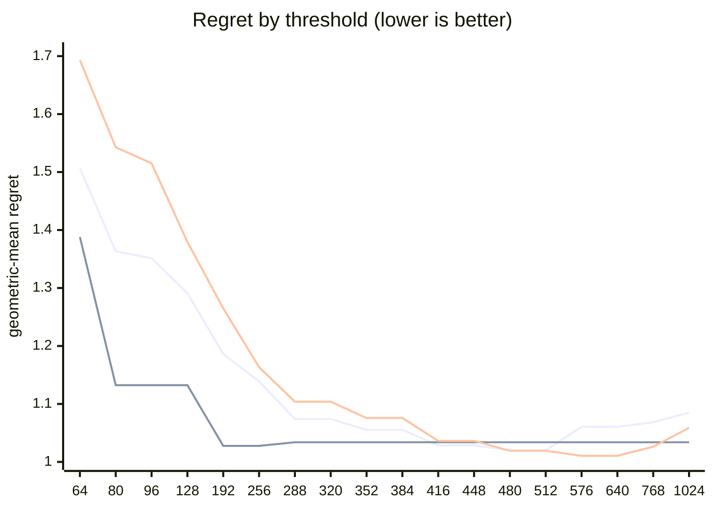

# QR dispatch crossover — Apple M5 Pro

What every section and number below means: [reading-reports.md](https://github.com/c0rmac/metal-linalg/blob/main/docs/reading-reports.md).

Generated by `tuning/tune_qr.py`. 221 shapes, 702 shape/backend pairs measured twice.

| | |
|---|---|
| Device | Apple M5 Pro |
| GPU cores | 20 |
| Resident matrices (`qr_unblocked`) | 120 |
| Shapes measured | 221 |
| Coverage | near-square 29, square 98, tall 56, wide 38 |

## The band

```
k = min(M, N) >= 512  ->  qr_streaming_amx_reduced
otherwise  ->  qr_unblocked
```

The optimum is flat from **k = 480 to 512** (every threshold within 0.3% of the best, 1.0202x). Any value inside that band is equivalent on this hardware; **512** is the middle of it.

Shipped instead: the batch-dependent split, which survived held-out data ([below](#refinements-tested)): the blocked QR from **k = 80** for batches below 8, from **k = 768** for larger ones.

Paste into `kTuned[]` in `src/qr.mm`:

```c
    {"Apple M5 Pro", 20, 80, 768, 8,   448, 1448, 1, 0,   512, 0,   0},
```

### Cost of missing the band

| threshold | regret | excess | |
|---|---|---|---|
| 64 | 1.5064x | +47.66% |  |
| 80 | 1.3634x | +33.64% |  |
| 96 | 1.3514x | +32.46% |  |
| 128 | 1.2910x | +26.54% |  |
| 192 | 1.1863x | +16.28% |  |
| 256 | 1.1389x | +11.63% |  |
| 288 | 1.0741x | +5.28% |  |
| 320 | 1.0741x | +5.28% |  |
| 352 | 1.0554x | +3.45% |  |
| 384 | 1.0554x | +3.45% |  |
| 416 | 1.0285x | +0.81% |  |
| 448 | 1.0285x | +0.81% |  |
| 480 | 1.0202x | +0.00% | **in band** |
| 512 | 1.0202x | +0.00% | **in band** |
| 576 | 1.0605x | +3.95% |  |
| 640 | 1.0605x | +3.95% |  |
| 768 | 1.0685x | +4.73% |  |
| 1024 | 1.0850x | +6.35% |  |

The penalty is usually asymmetric. Erring low costs little; erring high degrades specifically on tall inputs. Adding GPU cores makes the grid-parallel backend relatively stronger and pushes the true crossover down, so an untuned device is safer low than high.

## GPU or CPU

```
GPU iff w <= 448, batch * w >= 1448 and batch >= 1   (w = floor(sqrt(M k)), k = min(M, N))
or sqrt(M k) >= 512   (large matrices, by rows and k)
otherwise LAPACK on the CPU
```

On the GPU, no batch is shared with the CPU path: fitted first, on the GPU's side alone (the kernel against `share`, timed from batch 64), and the routing above fitted with it in effect.

| shared from batch | geomean regret (GPU side) | worst |
|---|---|---|
| never | 1.0271 | 1.29x |
| 64 | 1.3557 | 2.23x |
| 256 | 1.2930 | 2.23x |
| 1024 | 1.2339 | 2.23x |
| 4096 | 1.1420 | 2.23x |
| 16384 | 1.0598 | 2.06x |

Fitted on every shape with a CPU timing; inside the region within 0.5% of the best geometric-mean regret, the candidate with the smallest worst case.

| routing | geomean regret | worst | >10% off |
|---|---|---|---|
| chosen | 1.0200x | 1.85x | 14/221 |
| chosen without the large-matrix clause | 1.2225x | 6.91x | 60/221 |
| always the GPU (before the CPU path) | 1.6961x | 89.78x | 106/221 |
| always the CPU | 1.4423x | 6.91x | 109/221 |

Held out (fitted on half the shapes, scored on the other half): 1.0302x geomean, 1.92x worst, against 1.6205x and 54.92x for always the GPU.

The CPU was the fastest backend at 104 of 221 shapes, e.g. 1 x 8x8, 1 x 16x16, 1 x 16x256, 1 x 32x32, 1 x 32x384, 1 x 32x512, 1 x 64x64, 1 x 64x256.

## Regret by threshold

Regret is how much slower the chosen backend is than the best one measured at that shape; 1.0000x would be a perfect oracle. The per-region curves are the point: a grid covering only one aspect ratio can be nearly flat, and will then pick a threshold out of noise.



Series order: pooled, tall only, square only.

| threshold | pooled | square | tall | wide | near-square | pooled worst |
|---|---|---|---|---|---|---|
| 64 | 1.5064 | 1.6931 | 1.3880 | 1.1689 | 1.4055 | 3.41x |
| 80 | 1.3634 | 1.5427 | 1.1323 | 1.1001 | 1.4055 | 3.25x |
| 96 | 1.3514 | 1.5151 | 1.1323 | 1.1001 | 1.4055 | 3.25x |
| 128 | 1.2910 | 1.3795 | 1.1323 | 1.1001 | 1.4055 | 3.25x |
| 192 | 1.1863 | 1.2650 | 1.0276 | 1.0448 | 1.2962 | 2.77x |
| 256 | 1.1389 | 1.1634 | 1.0276 | 1.0448 | 1.2962 | 2.33x |
| 288 | 1.0741 | 1.1038 | 1.0339 | 1.0000 | 1.0920 | 1.85x |
| 320 | 1.0741 | 1.1038 | 1.0339 | 1.0000 | 1.0920 | 1.85x |
| 352 | 1.0554 | 1.0757 | 1.0339 | 1.0000 | 1.0615 | 1.85x |
| 384 | 1.0554 | 1.0757 | 1.0339 | 1.0000 | 1.0615 | 1.85x |
| 416 | 1.0285 | 1.0363 | 1.0339 | 1.0000 | 1.0163 | 1.43x |
| 448 | 1.0285 | 1.0363 | 1.0339 | 1.0000 | 1.0163 | 1.43x |
| 480 | 1.0202 | 1.0192 | 1.0339 | 1.0000 | 1.0163 | 1.43x |
| 512 | 1.0202 | 1.0192 | 1.0339 | 1.0000 | 1.0163 | 1.43x |
| 576 | 1.0605 | 1.0106 | 1.0339 | 1.5121 | 1.0253 | 6.11x |
| 640 | 1.0605 | 1.0106 | 1.0339 | 1.5121 | 1.0253 | 6.11x |
| 768 | 1.0685 | 1.0262 | 1.0339 | 1.5121 | 1.0253 | 6.11x |
| 1024 | 1.0850 | 1.0589 | 1.0339 | 1.5121 | 1.0253 | 6.11x |

## Which feature decides

`qr_unblocked` gives each matrix a simdgroup or a threadgroup whose threads hold its rows, and walks its k = min(M, N) columns a panel step at a time: its depth is k, while its rows run in parallel. The blocked QR pays several dispatches a panel. Rows and columns are therefore not interchangeable, and a rule on `max(M, N)` cannot express the difference.

| feature | best threshold | geomean regret | worst |
|---|---|---|---|
| K = min(M, N) | 480 | 1.0202x | 1.43x |
| max(M, N) | 768 | 1.0500x | 2.02x |
| M (rows) | 768 | 1.0829x | 6.11x |

## Decision surface

**batch 1**

```
      N=512     
      ---------
  512 #  0.86 *
  640 ## 0.74 *

      ratio = reduced / unblocked.  ### <0.60  ## <0.85  # <0.95
      ~ tie (0.95-1.05)   . <1.30   blank >1.30  (unblocked wins)
      * k = min(M, N) >= 512: the blocked QR's
```

**batch 16**

```
      N=32      N=64      N=128     N=256     N=512     
      ---------------------------------------------
  128   .         .          1.57     1.92     1.51
  256   .          1.78     1.62     1.74     1.60
  384   .       .  1.25     1.59     1.68     1.41
  512    2.04     1.88     1.68     1.53     1.32 *
  640    2.37     1.73     1.69     1.37  .  1.20 *

      ratio = reduced / unblocked.  ### <0.60  ## <0.85  # <0.95
      ~ tie (0.95-1.05)   . <1.30   blank >1.30  (unblocked wins)
      * k = min(M, N) >= 512: the blocked QR's
```

## Candidate rules

Per-region columns matter more than the overall number: an aggregate can look excellent while one aspect class is badly served.

| rule | geomean | worst | >10% off | square | tall | wide | near-square |
|---|---|---|---|---|---|---|---|
| original 5-rule heuristic | 1.1369x | 2.37x | 25/80 | 1.019 | 1.411 | 1.169 | 1.132 |
| max(M,N) >= 512 | 1.1369x | 2.37x | 25/80 | 1.019 | 1.411 | 1.169 | 1.132 |
| k >= 512  (chosen) | 1.0202x | 1.43x | 7/80 | 1.019 | 1.034 | 1.000 | 1.016 |
| M >= 512  (rows, the feature before 2.16.0) | 1.1080x | 2.37x | 20/80 | 1.019 | 1.411 | 1.000 | 1.068 |

## Refinements tested

Both of these were rejected on an 8-core M1, and both are re-tested here rather than assumed. A GPU with many more cores saturates `qr_unblocked` much later, so the batch split in particular could be justified elsewhere. Each is fitted on half the shapes and scored on the other half.

Baseline for comparison — `k >= 512` on the held-out half: **1.0324x** geomean, 1.43x worst.

| refinement | fitted form | train | held-out | held-out worst | verdict |
|---|---|---|---|---|---|
| batch-dependent split | `k >= (80 if batch < 8 else 768)` | 1.0006x | 1.0083x | 1.39x | **adopt** |
| narrow-N special case | `k >= 416 or (N <= 16 and k >= 128)` | 1.0163x | 1.0409x | 1.43x | reject |

> At least one refinement cleared held-out validation on this GPU. `QrPolicy` already carries the batch-split fields (`m_crossover_small_batch` / `m_crossover_large_batch` / `batch_threshold`) — set them from the fitted form above.

## Measurement noise

Run-to-run ratio over 702 shape/backend pairs measured twice: median 1.020x, p90 1.282x, max 3.256x.

| runtime | pairs | median | p90 | max |
|---|---|---|---|---|
| <1 ms | 342 | 1.041x | 1.871x | 3.256x |
| 1-3 ms | 155 | 1.011x | 1.055x | 1.300x |
| 3-10 ms | 108 | 1.016x | 1.047x | 1.256x |
| 10-30 ms | 51 | 1.012x | 1.051x | 1.497x |
| 30-100 ms | 33 | 1.015x | 1.052x | 1.147x |
| >100 ms | 13 | 1.012x | 1.020x | 1.075x |

Noise concentrates in fast shapes, where submission jitter dominates. A difference smaller than the p90 figure for its size bucket is not a result.

---

Raw timings in `raw.csv`; full analysis including plot-ready series in `results.json`. Re-render this report without remeasuring: `python3 tuning/tune_qr.py --from results.json`.
