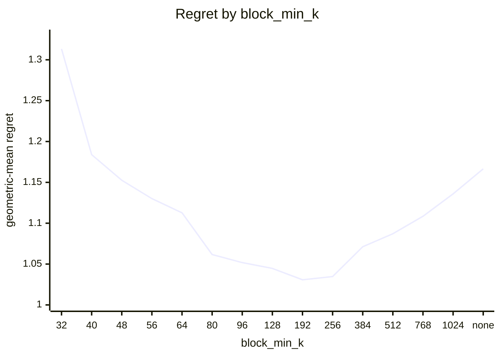
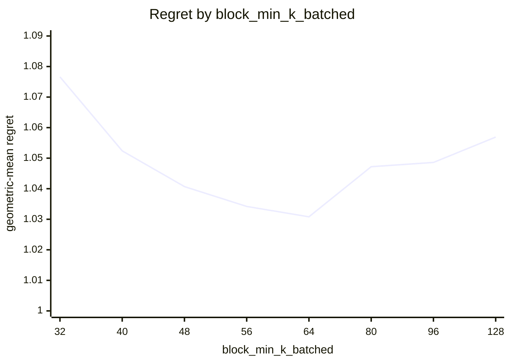
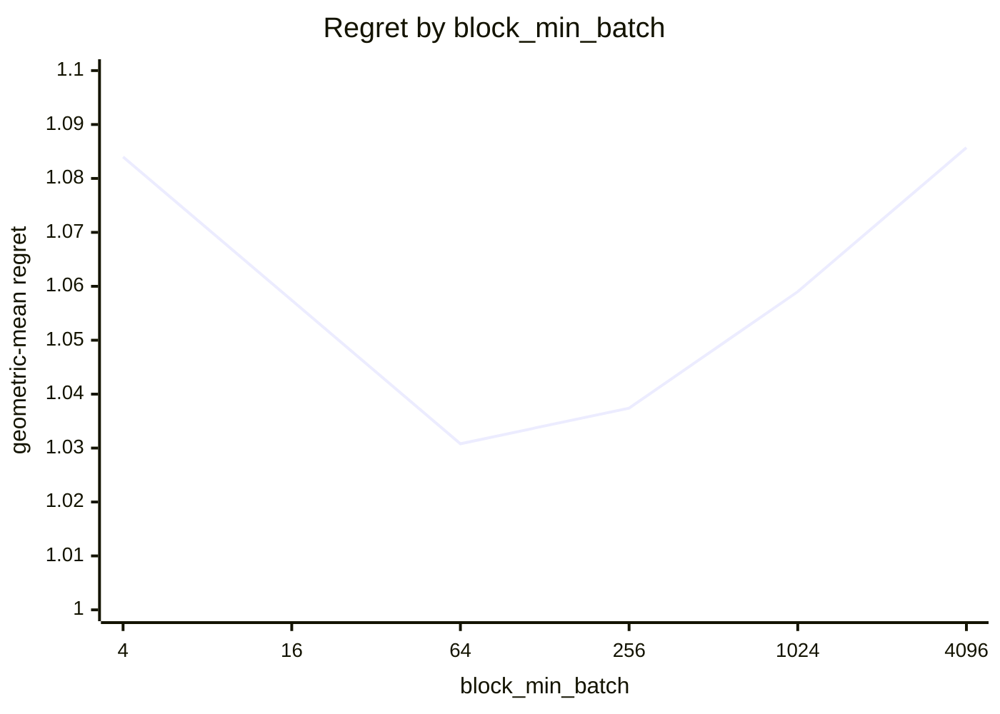
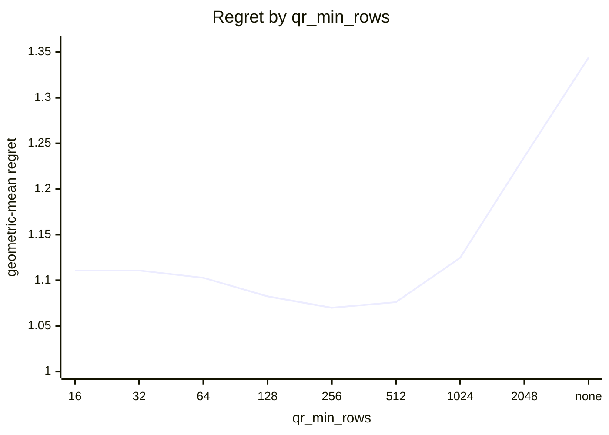
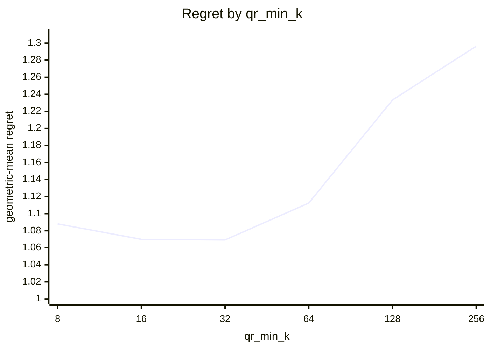
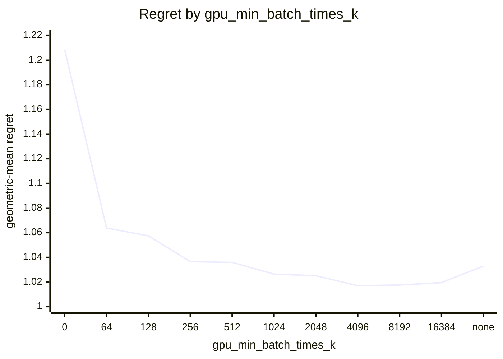
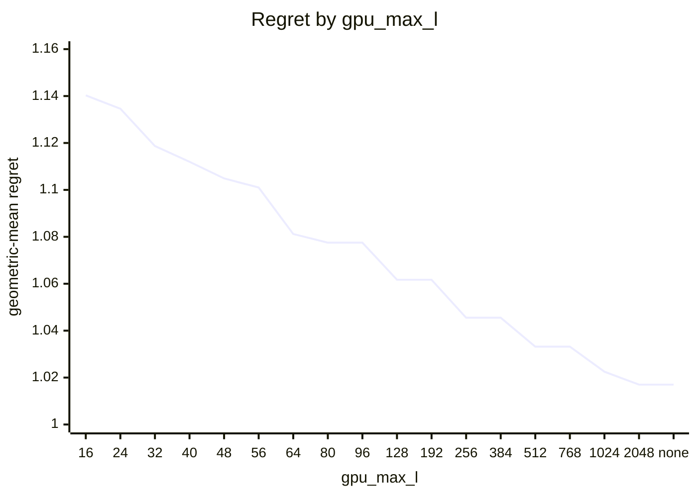
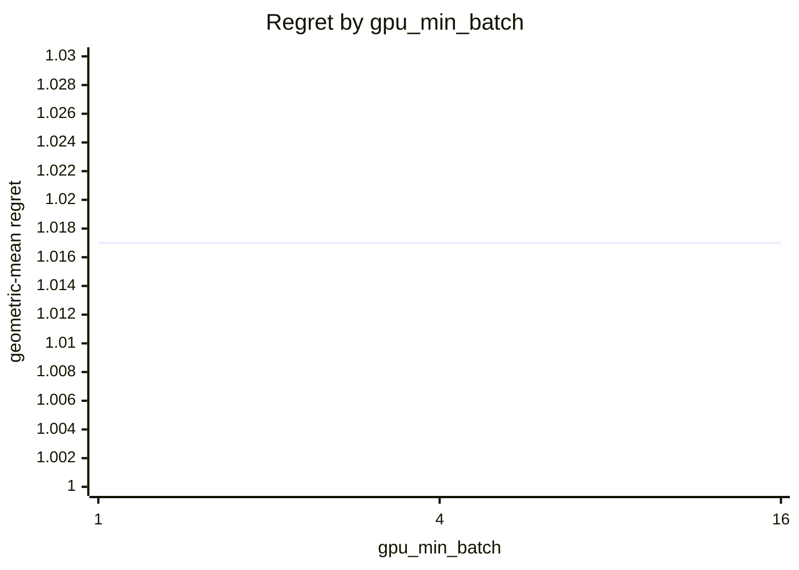
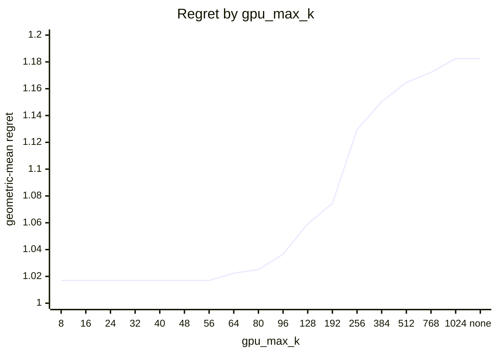

# SVD routing on Apple M5 Pro (20 GPU cores)

What every section and number below means: [reading-reports.md](https://github.com/c0rmac/metal-linalg/blob/main/docs/reading-reports.md).

Cost model scaled to this device from one probe point: bidiag x1.00, block x0.24, cpu x0.07, gk x0.34, jacobi x0.09, qr x0.15, qrblock x0.22 (1.00 is an M1).

Machine state: load 4.5/18 at the start, load 5.5/18 at the end; power mains.

Probe point after the sweep relative to before it: block x0.97, cpu x0.97, gk x1.07, jacobi x1.06, qr x1.02, qrblock x1.01 (stable).

Generated by `tuning/tune_svd.py` from 295 (shape, batch) points, 45 shapes with M >= N, batch in [1, 4, 16, 64, 256, 1024, 4096], seven backends (and the CPU and bidiag again for singular values alone), two or more passes, min-of-repeats.

## Answer

Row for `kTuned[]` in `src/svd.mm`:

```cpp
// device, GPU cores,   qr_min_rows, qr_min_k,   block_min_k, block_min_k_batched, block_min_batch,   gpu_max_k, gpu_min_batch_times_k, gpu_min_batch, gpu_max_l,   values_gpu_max_k, values_gpu_min_batch_times_k, values_gpu_min_batch, values_gpu_max_l,   bidiag_min_k, values_bidiag_min_k, bidiag_max_batch, values_bidiag_max_batch,   gk_min_k, gk_max_k,   share_min_batch,   gpu_big_batch_max_k, gpu_big_batch_min,   values_band_min_k, values_band_width,   band_min_k
{"Apple M5 Pro", 20,   256, 16,   192, 64, 64,   8, 4096, 1, 2048,   80, 16384, 1, 2048,   1024, 1024, 4, 2,   8, 80,   256,   80, 256,   768, 16,   1024},
```

To try it without rebuilding:

```sh
SVD_QR_MIN_ROWS=256 SVD_QR_MIN_K=16 SVD_BLOCK_MIN_K=192 SVD_BLOCK_MIN_K_BATCHED=64 SVD_BLOCK_MIN_BATCH=64 SVD_GPU_MAX_K=8 SVD_GPU_MIN_BATCH_TIMES_K=4096 SVD_GPU_MIN_BATCH=1 SVD_GPU_MAX_L=2048 SVD_BIDIAG_MIN_K=1024 SVD_VALUES_BIDIAG_MIN_K=1024 SVD_BIDIAG_MAX_BATCH=4 SVD_VALUES_BIDIAG_MAX_BATCH=2 SVD_GK_MIN_K=8 SVD_GK_MAX_K=80 SVD_SHARE_MIN_BATCH=256 SVD_GPU_BIG_BATCH_MAX_K=80 SVD_GPU_BIG_BATCH_MIN=256 SVD_VALUES_BAND_MIN_K=768 SVD_VALUES_BAND_WIDTH=16 SVD_BAND_MIN_K=1024 SVD_VALUES_GPU_MAX_K=80 SVD_VALUES_GPU_MIN_BATCH_TIMES_K=16384 SVD_VALUES_GPU_MIN_BATCH=1 SVD_VALUES_GPU_MAX_L=2048
```

The policy in effect on this device came from `tuned:Apple M5 Pro`. Against the best measured backend at every point the fitted rule scores 1.0170 geometric-mean regret, worst 1.75x, 18 of 295 points losing more than 10%, and 1.005x the oracle's total time.

## Warnings

- chosen rule loses more than 25% at 16x8 batch=1024 (gk_share, 1.75x), 8x8 batch=1024 (gk_share, 1.69x), 32x8 batch=1024 (gk_share, 1.49x), 16x16 batch=256 (gk_share, 1.46x), 32x16 batch=256 (gk_share, 1.37x), 64x8 batch=1024 (gk_share, 1.29x), 2048x64 batch=64 (cpu, 1.26x), 2048x64 batch=16 (cpu, 1.25x)
- the fitted policy differs from the one in effect (tuned:Apple M5 Pro)

## Stage 1: which GPU backend

Scored against the best GPU backend at each of the 295 points, as if there were no CPU: this is the rule a forced-GPU call (`SVD_DEVICE=gpu`) follows, and what a GPU with more cores will lean on. Two independent choices. Precondition with QR iff the long side is at least `qr_min_rows`, the short side at least `qr_min_k`, and the long side at least twice the short one. Block kernel iff the short side is at least `block_min_k`, or at least `block_min_k_batched` in a batch of `block_min_batch` or more.

| rule | geomean regret | worst | >10% | total time / oracle | est. picks |
|---|---|---|---|---|---|
| policy in effect ('512', '32', '192', '64', '64') | 1.0382 | 2.51x | 31 | 1.016 | 0 |
| fitted ('256', '16', '192', '64', '64') | 1.0308 | 2.05x | 25 | 1.002 | 0 |

Without a batch term, 6 of 735 combinations are within 0.5% of the best geomean: qr_min_rows 128 .. 256, qr_min_k 16 .. 32, block_min_k 96 .. 128.

With the batch term adopted (below), 3 combinations are within 0.5% of the best: block_min_k 192 .. 256, block_min_k_batched 56 .. 64, block_min_batch 64 .. 64. The curves vary one constant around the chosen combination.



| block_min_k | 32 | 40 | 48 | 56 | 64 | 80 | 96 | 128 | 192 | 256 | 384 | 512 | 768 | 1024 | none |
|---|---|---|---|---|---|---|---|---|---|---|---|---|---|---|---|
| geomean | 1.3133 | 1.1839 | 1.1526 | 1.1301 | 1.1127 | 1.0617 | 1.0518 | 1.0447 | 1.0308 | 1.0347 | 1.0712 | 1.0871 | 1.1085 | 1.1359 | 1.1665 |
| worst | 6.69x | 4.90x | 4.04x | 3.55x | 3.03x | 2.59x | 2.12x | 2.05x | 2.05x | 2.05x | 2.67x | 4.81x | 7.69x | 15.70x | 25.16x |



| block_min_k_batched | 32 | 40 | 48 | 56 | 64 | 80 | 96 | 128 |
|---|---|---|---|---|---|---|---|---|
| geomean | 1.0766 | 1.0524 | 1.0407 | 1.0342 | 1.0308 | 1.0472 | 1.0486 | 1.0569 |
| worst | 3.03x | 3.03x | 2.24x | 2.05x | 2.05x | 2.05x | 2.05x | 2.24x |



| block_min_batch | 4 | 16 | 64 | 256 | 1024 | 4096 |
|---|---|---|---|---|---|---|
| geomean | 1.0840 | 1.0574 | 1.0308 | 1.0374 | 1.0590 | 1.0857 |
| worst | 3.03x | 2.91x | 2.05x | 2.29x | 2.44x | 2.45x |



| qr_min_rows | 16 | 32 | 64 | 128 | 256 | 512 | 1024 | 2048 | none |
|---|---|---|---|---|---|---|---|---|---|
| geomean | 1.1107 | 1.1107 | 1.1027 | 1.0824 | 1.0699 | 1.0760 | 1.1247 | 1.2353 | 1.3440 |
| worst | 2.28x | 2.28x | 2.28x | 2.12x | 2.12x | 2.42x | 3.57x | 10.17x | 12.70x |



| qr_min_k | 8 | 16 | 32 | 64 | 128 | 256 |
|---|---|---|---|---|---|---|
| geomean | 1.0881 | 1.0699 | 1.0692 | 1.1125 | 1.2333 | 1.2964 |
| worst | 2.67x | 2.12x | 2.51x | 7.80x | 12.70x | 12.70x |

Held-out check of a batch-dependent block crossover (block from a smaller k once the batch is large enough), fitted on 167 points and scored on the other 128; the verdict is a bootstrap over the test points.

| rule | fitted on train | train geomean | test geomean | test worst | verdict |
|---|---|---|---|---|---|
| one block crossover | ["256", "16", "96", "none", "none"] | 1.0617 | 1.0807 | 2.05x | baseline |
| batch-dependent block crossover | {"block_min": "192", "block_lo": "64", "batch_hi": "64"} | 1.0250 | 1.0385 | 2.05x | **justified** (better in 100% of resamples, median gain 4.0%) |

Best GPU backend per point (`J` whole-matrix kernel, `B` block kernel, `j` and `b` the same after QR, `g` gk, `G` gk shared with the CPU), then what the rule picks, the gk window included:

```
      M x N  \ batch     1     4    16    64   256  1024  4096
      4 x 4               J     g     g     g     J     g     g
      8 x 8               g     J     J     J     g     g     g
     16 x 8               g     J     J     J     g     g     g
     32 x 8               J     J     J     J     g     g     g
     64 x 8               J     J     J     J     g     g     g
    128 x 8               g     g     J     g     g     J     J
    256 x 8               J     g     g     J     J     J     J
     16 x 16              J     J     J     g     g     g     g
     32 x 16              g     J     J     g     g     g     g
     64 x 16              J     J     J     J     g     g     g
    128 x 16              J     J     J     J     g     g     g
    256 x 16              g     g     J     J     g     g     g
    512 x 16              J     j     J     J     g     g     g
     24 x 24              J     J     J     g     g     g     g
     32 x 32              J     J     J     g     g     g     g
     64 x 32              J     J     J     g     g     g     g
    128 x 32              J     j     J     g     g     g     g
    256 x 32              J     J     J     J     g     g     g
    512 x 32              J     J     J     j     g     g     g
   1024 x 32              j     j     J     j     g     g     g
     40 x 40              J     J     J     g     g     g     g
     48 x 48              J     J     J     g     g     g     g
     56 x 56              J     J     J     g     g     g     g
     64 x 64              J     J     J     g     g     g     g
    128 x 64              J     J     J     J     g     g     g
    256 x 64              j     j     J     g     g     g     g
    512 x 64              j     j     j     g     g     g     g
   1024 x 64              j     j     j     g     g     g     g
   2048 x 64              j     j     j     g     g     g     g
     80 x 80              J     J     J     g     g     g     g
     96 x 96              J     J     J     J     B     B     B
    128 x 128             J     J     J     B     B     B     B
    256 x 128             j     j     j     b     b     b     b
    512 x 128             j     j     j     b     b     b     b
   1024 x 128             j     j     j     b     b     b     b
   2048 x 128             j     j     j     b     b     b     .
    192 x 192             B     B     B     B     B     B     .
    256 x 256             B     B     B     B     B     B     .
    512 x 256             B     B     b     b     b     b     .
   1024 x 256             b     b     b     b     b     b     .
   2048 x 256             b     b     b     b     b     .     .
    384 x 384             B     B     B     B     B     .     .
    512 x 512             B     B     B     B     .     .     .
    768 x 768             B     B     B     .     .     .     .
   1024 x 1024            B     B     B     .     .     .     .
```

```
      M x N  \ batch     1     4    16    64   256  1024  4096
      4 x 4               J     J     J     J     J     J     J
      8 x 8               g     g     g     g     G     G     G
     16 x 8               g     g     g     g     G     G     G
     32 x 8               g     g     g     g     G     G     G
     64 x 8               g     g     g     g     G     G     G
    128 x 8               g     g     g     g     G     G     G
    256 x 8               g     g     g     g     G     G     G
     16 x 16              g     g     g     g     G     G     G
     32 x 16              g     g     g     g     G     G     G
     64 x 16              g     g     g     g     G     G     G
    128 x 16              g     g     g     g     G     G     G
    256 x 16              g     g     g     g     G     G     G
    512 x 16              g     g     g     g     G     G     G
     24 x 24              g     g     g     g     G     G     G
     32 x 32              g     g     g     g     G     G     G
     64 x 32              g     g     g     g     G     G     G
    128 x 32              g     g     g     g     G     G     G
    256 x 32              g     g     g     g     G     G     G
    512 x 32              g     g     g     g     G     G     G
   1024 x 32              g     g     g     g     G     G     G
     40 x 40              g     g     g     g     G     G     G
     48 x 48              g     g     g     g     G     G     G
     56 x 56              g     g     g     g     G     G     G
     64 x 64              g     g     g     g     G     G     G
    128 x 64              g     g     g     g     G     G     G
    256 x 64              g     g     g     g     G     G     G
    512 x 64              g     g     g     g     G     G     G
   1024 x 64              g     g     g     g     G     G     G
   2048 x 64              g     g     g     g     G     G     G
     80 x 80              g     g     g     g     G     G     G
     96 x 96              J     J     J     B     B     B     B
    128 x 128             J     J     J     B     B     B     B
    256 x 128             j     j     j     b     b     b     b
    512 x 128             j     j     j     b     b     b     b
   1024 x 128             j     j     j     b     b     b     b
   2048 x 128             j     j     j     b     b     b     .
    192 x 192             B     B     B     B     B     B     .
    256 x 256             B     B     B     B     B     B     .
    512 x 256             b     b     b     b     b     b     .
   1024 x 256             b     b     b     b     b     b     .
   2048 x 256             b     b     b     b     b     .     .
    384 x 384             B     B     B     B     B     .     .
    512 x 512             B     B     B     B     .     .     .
    768 x 768             B     B     B     .     .     .     .
   1024 x 1024            B     B     B     .     .     .     .
```

## Stage 1b: the gk backend

Inside a window of k = min(M, N), `gk` (Householder bidiagonalization and implicit QR, one threadgroup per matrix, k <= 83 on this device; on the matrix itself where it fits, else after a QR) instead of the Jacobi backend the split picks, fitted over the 295 points against the best GPU backend, gk included. Chosen: k = 8 .. 80.

| rule | geomean regret | worst | >10% | total time / oracle | est. picks |
|---|---|---|---|---|---|
| without gk (the split alone) | 1.1876 | 2.95x | 113 | 1.042 | 0 |
| with gk for k in (8, 80) | 1.1383 | 2.67x | 84 | 1.002 | 0 |

5 windows are within 0.5% of the best geomean: gk_min_k 4 .. 8, gk_max_k 48 .. 80.

Held out: fitted on 167 points (window (4, 56)), scored on the other 128: geomean 1.1565x, worst 2.67x, against 1.1792x, worst 2.95x without gk.

gk over the best Jacobi backend, M x N x batch: 4x4x1 0.96x, 4x4x4 1.03x, 4x4x16 1.11x, 4x4x64 1.02x, 4x4x256 0.95x, 4x4x1024 1.05x, 4x4x4096 1.05x, 8x8x1 1.06x, 8x8x4 0.83x, 8x8x16 0.94x, 8x8x64 0.79x, 8x8x256 1.16x, 8x8x1024 1.38x, 8x8x4096 1.44x, 16x8x1 1.27x, 16x8x4 0.88x, 16x8x16 0.74x, 16x8x64 0.99x, 16x8x256 2.64x, 16x8x1024 1.27x, 16x8x4096 1.38x, 32x8x1 0.87x, 32x8x4 0.89x, 32x8x16 0.88x, 32x8x64 0.90x, 32x8x256 1.17x, 32x8x1024 1.08x, 32x8x4096 1.11x, 64x8x1 0.89x, 64x8x4 0.83x, 64x8x16 0.85x, 64x8x64 0.91x, 64x8x256 1.26x, 64x8x1024 1.02x, 64x8x4096 1.02x, 128x8x1 1.67x, 128x8x4 1.41x, 128x8x16 0.96x, 128x8x64 2.13x, 128x8x256 2.37x, 128x8x1024 0.96x, 128x8x4096 0.95x, 256x8x1 0.94x, 256x8x4 1.22x, 256x8x16 1.59x, 256x8x64 0.96x, 256x8x256 0.90x, 256x8x1024 0.95x, 256x8x4096 0.88x, 16x16x1 0.68x, 16x16x4 0.72x, 16x16x16 0.66x, 16x16x64 1.80x, 16x16x256 1.65x, 16x16x1024 2.07x, 16x16x4096 2.30x, 32x16x1 1.48x, 32x16x4 0.66x, 32x16x16 0.89x, 32x16x64 1.81x, 32x16x256 1.49x, 32x16x1024 1.47x, 32x16x4096 1.71x, 64x16x1 0.82x, 64x16x4 0.72x, 64x16x16 0.74x, 64x16x64 0.85x, 64x16x256 1.38x, 64x16x1024 1.44x, 64x16x4096 1.45x, 128x16x1 0.70x, 128x16x4 0.66x, 128x16x16 0.93x, 128x16x64 0.95x, 128x16x256 1.19x, 128x16x1024 1.31x, 128x16x4096 1.24x, 256x16x1 1.02x, 256x16x4 1.34x, 256x16x16 0.88x, 256x16x64 0.98x, 256x16x256 1.12x, 256x16x1024 1.18x, 256x16x4096 1.05x, 512x16x1 0.61x, 512x16x4 0.79x, 512x16x16 0.44x, 512x16x64 0.51x, 512x16x256 1.10x, 512x16x1024 1.14x, 512x16x4096 1.16x, 24x24x1 0.56x, 24x24x4 0.51x, 24x24x16 0.46x, 24x24x64 1.57x, 24x24x256 2.09x, 24x24x1024 2.13x, 24x24x4096 2.30x, 32x32x1 0.44x, 32x32x4 0.73x, 32x32x16 0.70x, 32x32x64 1.06x, 32x32x256 2.38x, 32x32x1024 2.73x, 32x32x4096 2.73x, 64x32x1 0.41x, 64x32x4 0.49x, 64x32x16 0.48x, 64x32x64 1.04x, 64x32x256 1.48x, 64x32x1024 1.79x, 64x32x4096 1.74x, 128x32x1 0.54x, 128x32x4 0.73x, 128x32x16 0.64x, 128x32x64 1.06x, 128x32x256 1.21x, 128x32x1024 1.33x, 128x32x4096 1.13x, 256x32x1 0.41x, 256x32x4 0.40x, 256x32x16 0.38x, 256x32x64 0.70x, 256x32x256 1.31x, 256x32x1024 1.47x, 256x32x4096 1.43x, 512x32x1 0.53x, 512x32x4 0.51x, 512x32x16 0.43x, 512x32x64 0.84x, 512x32x256 1.26x, 512x32x1024 1.34x, 512x32x4096 1.27x, 1024x32x1 0.57x, 1024x32x4 0.63x, 1024x32x16 0.58x, 1024x32x64 0.89x, 1024x32x256 1.19x, 1024x32x1024 1.19x, 1024x32x4096 1.14x, 40x40x1 0.71x, 40x40x4 0.66x, 40x40x16 0.61x, 40x40x64 1.33x, 40x40x256 2.26x, 40x40x1024 2.73x, 40x40x4096 2.66x, 48x48x1 0.67x, 48x48x4 0.65x, 48x48x16 0.66x, 48x48x64 1.46x, 48x48x256 2.23x, 48x48x1024 2.85x, 48x48x4096 2.95x, 56x56x1 0.63x, 56x56x4 0.63x, 56x56x16 0.60x, 56x56x64 1.43x, 56x56x256 2.24x, 56x56x1024 2.37x, 56x56x4096 2.34x, 64x64x1 0.57x, 64x64x4 0.55x, 64x64x16 0.59x, 64x64x64 1.47x, 64x64x256 1.85x, 64x64x1024 1.77x, 64x64x4096 1.86x, 128x64x1 0.51x, 128x64x4 0.50x, 128x64x16 0.44x, 128x64x64 0.96x, 128x64x256 1.33x, 128x64x1024 1.37x, 128x64x4096 1.45x, 256x64x1 0.55x, 256x64x4 0.57x, 256x64x16 0.53x, 256x64x64 1.12x, 256x64x256 1.27x, 256x64x1024 1.26x, 256x64x4096 1.31x, 512x64x1 0.54x, 512x64x4 0.58x, 512x64x16 0.62x, 512x64x64 1.06x, 512x64x256 1.17x, 512x64x1024 1.20x, 512x64x4096 1.25x, 1024x64x1 0.59x, 1024x64x4 0.64x, 1024x64x16 0.70x, 1024x64x64 1.06x, 1024x64x256 1.14x, 1024x64x1024 1.11x, 1024x64x4096 1.30x, 2048x64x1 0.66x, 2048x64x4 0.65x, 2048x64x16 0.69x, 2048x64x64 1.04x, 2048x64x256 1.11x, 2048x64x1024 1.06x, 2048x64x4096 1.05x, 80x80x1 0.62x, 80x80x4 0.68x, 80x80x16 0.68x, 80x80x64 1.27x, 80x80x256 1.99x, 80x80x1024 2.23x, 80x80x4096 2.25x

gk over the CPU, M x N x batch: 4x4x1 0.02x, 4x4x4 0.10x, 4x4x16 0.19x, 4x4x64 0.87x, 4x4x256 0.65x, 4x4x1024 1.26x, 4x4x4096 1.90x, 8x8x1 0.02x, 8x8x4 0.09x, 8x8x16 0.28x, 8x8x64 0.43x, 8x8x256 0.88x, 8x8x1024 1.40x, 8x8x4096 1.77x, 16x8x1 0.04x, 16x8x4 0.10x, 16x8x16 0.41x, 16x8x64 0.61x, 16x8x256 1.00x, 16x8x1024 1.58x, 16x8x4096 2.13x, 32x8x1 0.04x, 32x8x4 0.11x, 32x8x16 0.47x, 32x8x64 0.62x, 32x8x256 1.12x, 32x8x1024 1.55x, 32x8x4096 1.97x, 64x8x1 0.05x, 64x8x4 0.12x, 64x8x16 0.33x, 64x8x64 0.67x, 64x8x256 1.11x, 64x8x1024 1.48x, 64x8x4096 1.91x, 128x8x1 0.06x, 128x8x4 0.13x, 128x8x16 0.38x, 128x8x64 0.78x, 128x8x256 1.01x, 128x8x1024 1.13x, 128x8x4096 1.56x, 256x8x1 0.07x, 256x8x4 0.15x, 256x8x16 0.41x, 256x8x64 0.79x, 256x8x256 0.95x, 256x8x1024 1.44x, 256x8x4096 1.20x, 16x16x1 0.05x, 16x16x4 0.11x, 16x16x16 0.26x, 16x16x64 0.53x, 16x16x256 1.15x, 16x16x1024 1.63x, 16x16x4096 2.04x, 32x16x1 0.08x, 32x16x4 0.13x, 32x16x16 0.35x, 32x16x64 0.65x, 32x16x256 1.53x, 32x16x1024 1.89x, 32x16x4096 2.48x, 64x16x1 0.10x, 64x16x4 0.14x, 64x16x16 0.36x, 64x16x64 0.75x, 64x16x256 1.37x, 64x16x1024 1.68x, 64x16x4096 2.04x, 128x16x1 0.11x, 128x16x4 0.14x, 128x16x16 0.40x, 128x16x64 0.76x, 128x16x256 1.12x, 128x16x1024 1.65x, 128x16x4096 1.58x, 256x16x1 0.13x, 256x16x4 0.18x, 256x16x16 0.51x, 256x16x64 0.73x, 256x16x256 0.83x, 256x16x1024 1.23x, 256x16x4096 1.15x, 512x16x1 0.11x, 512x16x4 0.15x, 512x16x16 0.25x, 512x16x64 0.40x, 512x16x256 1.32x, 512x16x1024 1.29x, 512x16x4096 1.30x, 24x24x1 0.08x, 24x24x4 0.09x, 24x24x16 0.23x, 24x24x64 0.52x, 24x24x256 1.29x, 24x24x1024 1.57x, 24x24x4096 1.82x, 32x32x1 0.09x, 32x32x4 0.10x, 32x32x16 0.25x, 32x32x64 0.50x, 32x32x256 1.36x, 32x32x1024 1.75x, 32x32x4096 1.94x, 64x32x1 0.09x, 64x32x4 0.12x, 64x32x16 0.27x, 64x32x64 0.58x, 64x32x256 1.03x, 64x32x1024 1.54x, 64x32x4096 1.61x, 128x32x1 0.10x, 128x32x4 0.14x, 128x32x16 0.30x, 128x32x64 0.56x, 128x32x256 0.83x, 128x32x1024 1.11x, 128x32x4096 1.09x, 256x32x1 0.10x, 256x32x4 0.13x, 256x32x16 0.19x, 256x32x64 0.42x, 256x32x256 1.20x, 256x32x1024 1.29x, 256x32x4096 1.40x, 512x32x1 0.14x, 512x32x4 0.19x, 512x32x16 0.23x, 512x32x64 0.62x, 512x32x256 1.28x, 512x32x1024 1.44x, 512x32x4096 1.34x, 1024x32x1 0.18x, 1024x32x4 0.27x, 1024x32x16 0.36x, 1024x32x64 0.99x, 1024x32x256 1.37x, 1024x32x1024 1.39x, 1024x32x4096 1.27x, 40x40x1 0.10x, 40x40x4 0.13x, 40x40x16 0.26x, 40x40x64 0.56x, 40x40x256 1.00x, 40x40x1024 1.47x, 40x40x4096 1.47x, 48x48x1 0.11x, 48x48x4 0.13x, 48x48x16 0.25x, 48x48x64 0.59x, 48x48x256 1.05x, 48x48x1024 1.35x, 48x48x4096 1.35x, 56x56x1 0.10x, 56x56x4 0.12x, 56x56x16 0.22x, 56x56x64 0.52x, 56x56x256 0.85x, 56x56x1024 0.97x, 56x56x4096 0.98x, 64x64x1 0.11x, 64x64x4 0.12x, 64x64x16 0.20x, 64x64x64 0.52x, 64x64x256 0.75x, 64x64x1024 0.88x, 64x64x4096 0.85x, 128x64x1 0.12x, 128x64x4 0.15x, 128x64x16 0.19x, 128x64x64 0.49x, 128x64x256 0.83x, 128x64x1024 0.93x, 128x64x4096 0.94x, 256x64x1 0.13x, 256x64x4 0.18x, 256x64x16 0.23x, 256x64x64 0.67x, 256x64x256 0.93x, 256x64x1024 0.98x, 256x64x4096 0.96x, 512x64x1 0.17x, 512x64x4 0.25x, 512x64x16 0.29x, 512x64x64 0.95x, 512x64x256 1.15x, 512x64x1024 1.20x, 512x64x4096 1.15x, 1024x64x1 0.22x, 1024x64x4 0.34x, 1024x64x16 0.40x, 1024x64x64 1.09x, 1024x64x256 1.25x, 1024x64x1024 1.22x, 1024x64x4096 1.21x, 2048x64x1 0.28x, 2048x64x4 0.58x, 2048x64x16 0.86x, 2048x64x64 1.16x, 2048x64x256 1.37x, 2048x64x1024 1.28x, 2048x64x4096 1.04x, 80x80x1 0.14x, 80x80x4 0.17x, 80x80x16 0.20x, 80x80x64 0.46x, 80x80x256 0.71x, 80x80x1024 0.75x, 80x80x4096 0.73x

## Stage 1c: sharing a batch with the CPU

From a batch on, `gk_share`: gk and the CPU path at once on one batch, the GPU taking chunks from the front and the CPU from the back. Fitted against the best GPU backend, the shared one included, on the 116 points where it was timed and gk is the GPU's choice. Chosen: from batch 256.

| rule | geomean regret | worst | >10% | total time / oracle | est. picks |
|---|---|---|---|---|---|
| gk alone | 1.2109 | 2.15x | 63 | 1.515 | 0 |
| shared from batch 256 | 1.0765 | 1.94x | 25 | 1.005 | 0 |

gk_share over gk alone, M x N x batch: 8x8x64 0.83x, 8x8x256 0.56x, 8x8x1024 0.59x, 8x8x4096 0.95x, 16x8x64 0.65x, 16x8x256 0.57x, 16x8x1024 0.57x, 16x8x4096 0.84x, 32x8x64 0.65x, 32x8x256 0.65x, 32x8x1024 0.67x, 32x8x4096 0.96x, 64x8x64 0.64x, 64x8x256 0.65x, 64x8x1024 0.77x, 64x8x4096 1.02x, 128x8x64 0.64x, 128x8x256 0.77x, 128x8x1024 1.03x, 128x8x4096 1.02x, 256x8x64 0.71x, 256x8x256 0.88x, 256x8x1024 1.16x, 256x8x4096 1.22x, 16x16x64 0.72x, 16x16x256 0.69x, 16x16x1024 0.86x, 16x16x4096 1.16x, 32x16x64 0.72x, 32x16x256 0.73x, 32x16x1024 0.99x, 32x16x4096 1.02x, 64x16x64 0.73x, 64x16x256 0.88x, 64x16x1024 1.03x, 64x16x4096 1.09x, 128x16x64 0.74x, 128x16x256 1.11x, 128x16x1024 1.08x, 128x16x4096 1.18x, 256x16x64 0.79x, 256x16x256 1.22x, 256x16x1024 1.44x, 256x16x4096 1.60x, 512x16x64 0.88x, 512x16x256 0.85x, 512x16x1024 0.96x, 512x16x4096 1.11x, 24x24x64 0.83x, 24x24x256 0.86x, 24x24x1024 1.18x, 24x24x4096 1.18x, 32x32x64 0.86x, 32x32x256 0.97x, 32x32x1024 1.14x, 32x32x4096 1.21x, 64x32x64 0.82x, 64x32x256 1.56x, 64x32x1024 1.23x, 64x32x4096 1.31x, 128x32x64 0.91x, 128x32x256 1.27x, 128x32x1024 1.52x, 128x32x4096 1.70x, 256x32x64 0.95x, 256x32x256 1.03x, 256x32x1024 1.08x, 256x32x4096 1.26x, 512x32x64 0.90x, 512x32x256 1.12x, 512x32x1024 0.93x, 512x32x4096 1.23x, 1024x32x64 0.94x, 1024x32x256 1.11x, 1024x32x1024 1.05x, 1024x32x4096 1.26x, 40x40x64 0.89x, 40x40x256 1.55x, 40x40x1024 1.22x, 40x40x4096 1.43x, 48x48x64 0.89x, 48x48x256 1.59x, 48x48x1024 1.42x, 48x48x4096 1.54x, 56x56x64 0.92x, 56x56x256 1.10x, 56x56x1024 1.73x, 56x56x4096 1.83x, 64x64x64 0.94x, 64x64x256 1.52x, 64x64x1024 1.90x, 64x64x4096 1.94x, 128x64x64 0.98x, 128x64x256 1.43x, 128x64x1024 1.71x, 128x64x4096 1.79x, 256x64x64 0.94x, 256x64x256 1.45x, 256x64x1024 1.71x, 256x64x4096 1.76x, 512x64x64 1.02x, 512x64x256 1.42x, 512x64x1024 1.42x, 512x64x4096 1.62x, 1024x64x64 1.08x, 1024x64x256 1.46x, 1024x64x1024 1.45x, 1024x64x4096 1.56x, 2048x64x64 1.09x, 2048x64x256 1.37x, 2048x64x1024 1.34x, 2048x64x4096 1.48x, 80x80x64 1.35x, 80x80x256 1.53x, 80x80x1024 2.14x, 80x80x4096 2.15x

## Stage 2: GPU or CPU

GPU iff `k <= gpu_max_k`, `l <= gpu_max_l` (l = max(M, N)), `batch * k >= gpu_min_batch_times_k` and `batch >= gpu_min_batch`, with k = min(M, N), scored against the best of the CPU and the GPU backends (gk included). `worst` is over the points where the chosen backend was timed; a pick the cost model had to guess is listed in the warnings instead.

| rule | geomean regret | worst | >10% | total time / oracle | est. picks |
|---|---|---|---|---|---|
| oracle (best per point) | 1.0000 | 1.00x | 0 | 1.000 | 0 |
| policy in effect ('56', '16384', '1', '256') | 1.0586 | 1.90x | 47 | 1.070 | 0 |
| fitted ('8', '4096', '1', '2048') | 1.0170 | 1.75x | 18 | 1.005 | 0 |

12 of 6171 combinations are within 0.5% of the best geomean: gpu_max_k 64 .. 80, gpu_min_batch_times_k 8192 .. 8192, gpu_min_batch 1 .. 16, gpu_max_l 2048 .. none.

Large batches: the GPU also for k above gpu_max_k up to 80 (and l <= gpu_max_l) in a batch of at least 256, fitted with the product rule (per cap, the rule, the clause over it and the rule again given the clause, the best kept) (product rule alone 1.1325, worst 2.54x; chosen 1.0170, worst 1.75x).



| gpu_min_batch_times_k | 0 | 64 | 128 | 256 | 512 | 1024 | 2048 | 4096 | 8192 | 16384 | none |
|---|---|---|---|---|---|---|---|---|---|---|---|
| geomean | 1.2086 | 1.0638 | 1.0574 | 1.0365 | 1.0359 | 1.0264 | 1.0251 | 1.0170 | 1.0176 | 1.0195 | 1.0329 |
| worst | 43.78x | 5.95x | 3.64x | 2.33x | 2.33x | 2.04x | 2.04x | 1.75x | 1.75x | 1.66x | 2.13x |



| gpu_max_l | 16 | 24 | 32 | 40 | 48 | 56 | 64 | 80 | 96 | 128 | 192 | 256 | 384 | 512 | 768 | 1024 | 2048 | none |
|---|---|---|---|---|---|---|---|---|---|---|---|---|---|---|---|---|---|---|
| geomean | 1.1403 | 1.1346 | 1.1187 | 1.1120 | 1.1049 | 1.1010 | 1.0812 | 1.0775 | 1.0775 | 1.0617 | 1.0617 | 1.0455 | 1.0455 | 1.0332 | 1.0332 | 1.0225 | 1.0170 | 1.0170 |
| worst | 2.54x | 2.54x | 2.22x | 2.22x | 2.22x | 2.22x | 1.90x | 1.90x | 1.90x | 1.90x | 1.90x | 1.90x | 1.90x | 1.90x | 1.90x | 1.88x | 1.75x | 1.75x |



| gpu_min_batch | 1 | 4 | 16 |
|---|---|---|---|
| geomean | 1.0170 | 1.0170 | 1.0170 |
| worst | 1.75x | 1.75x | 1.75x |



| gpu_max_k | 8 | 16 | 24 | 32 | 40 | 48 | 56 | 64 | 80 | 96 | 128 | 192 | 256 | 384 | 512 | 768 | 1024 | none |
|---|---|---|---|---|---|---|---|---|---|---|---|---|---|---|---|---|---|---|
| geomean | 1.0170 | 1.0170 | 1.0170 | 1.0170 | 1.0170 | 1.0170 | 1.0170 | 1.0224 | 1.0251 | 1.0365 | 1.0592 | 1.0745 | 1.1294 | 1.1504 | 1.1646 | 1.1722 | 1.1825 | 1.1825 |
| worst | 1.75x | 1.75x | 1.75x | 1.75x | 1.75x | 1.75x | 1.75x | 2.04x | 2.17x | 2.72x | 2.72x | 4.68x | 5.07x | 6.74x | 6.74x | 6.77x | 6.77x | 6.77x |

Held-out check of a per-k boundary against the product rule, fitted on 167 points and scored on the other 128; the verdict is a bootstrap.

| rule | fitted on train | train geomean | test geomean | test worst | verdict |
|---|---|---|---|---|---|
| product rule | [8, 4096, 1, 2048] | 1.0153 | 1.0192 | 1.75x | baseline |
| per-k table | {"min_batch_by_k": {"4": 1024, "8": 1024, "16": 256, "24": 1024, "32": 256, "40": 256, "48": 256, "56": 1024, "64": 64, "80": 256, "96": null, "128": 16, "192": null, "256": null, "384": null, "512": null, "768": null, "1024": null}} | 1.0515 | 1.0545 | 2.52x | rejected (better in 0% of resamples, median gain -3.2%) |

Best backend per point (`c` CPU, `J` whole-matrix kernel, `B` block kernel, `j` and `b` the same after QR, `g` gk, `G` gk shared with the CPU, `.` not measured), what the rule picks, and the speedup of the best GPU backend over the CPU:

```
      M x N  \ batch     1     4    16    64   256  1024  4096
      4 x 4               c     c     c     c     c     g     g
      8 x 8               c     c     c     c     c     g     g
     16 x 8               c     c     c     c     c     g     g
     32 x 8               c     c     c     c     g     g     g
     64 x 8               c     c     c     c     g     g     G
    128 x 8               c     c     c     c     g     J     J
    256 x 8               c     c     c     c     J     G     G
     16 x 16              c     c     c     c     g     g     G
     32 x 16              c     c     c     c     g     g     G
     64 x 16              c     c     c     c     g     G     G
    128 x 16              c     c     c     c     G     G     G
    256 x 16              c     c     c     c     G     G     G
    512 x 16              c     c     c     c     g     g     G
     24 x 24              c     c     c     c     g     G     G
     32 x 32              c     c     c     c     g     G     G
     64 x 32              c     c     c     c     G     G     G
    128 x 32              c     c     c     c     G     G     G
    256 x 32              c     c     c     c     G     G     G
    512 x 32              c     c     c     c     G     g     G
   1024 x 32              c     c     c     j     G     G     G
     40 x 40              c     c     c     c     G     G     G
     48 x 48              c     c     c     c     G     G     G
     56 x 56              c     c     c     c     c     G     G
     64 x 64              c     c     c     c     G     G     G
    128 x 64              c     c     c     c     G     G     G
    256 x 64              c     c     c     c     G     G     G
    512 x 64              c     c     c     c     G     G     G
   1024 x 64              c     c     c     G     G     G     G
   2048 x 64              c     c     j     G     G     G     G
     80 x 80              c     c     c     c     G     G     G
     96 x 96              c     c     c     c     c     c     c
    128 x 128             c     c     c     c     c     c     c
    256 x 128             c     c     c     c     c     c     c
    512 x 128             c     c     c     c     c     c     c
   1024 x 128             c     c     c     c     b     c     c
   2048 x 128             c     c     j     b     b     b     .
    192 x 192             c     c     c     c     c     c     .
    256 x 256             c     c     c     c     c     c     .
    512 x 256             c     c     c     c     c     c     .
   1024 x 256             c     c     c     c     c     c     .
   2048 x 256             c     c     c     c     c     .     .
    384 x 384             c     c     c     c     c     .     .
    512 x 512             c     c     c     c     .     .     .
    768 x 768             c     c     c     .     .     .     .
   1024 x 1024            c     c     c     .     .     .     .
```

```
      M x N  \ batch     1     4    16    64   256  1024  4096
      4 x 4               c     c     c     c     c     J     J
      8 x 8               c     c     c     c     c     G     G
     16 x 8               c     c     c     c     c     G     G
     32 x 8               c     c     c     c     c     G     G
     64 x 8               c     c     c     c     c     G     G
    128 x 8               c     c     c     c     c     G     G
    256 x 8               c     c     c     c     c     G     G
     16 x 16              c     c     c     c     G     G     G
     32 x 16              c     c     c     c     G     G     G
     64 x 16              c     c     c     c     G     G     G
    128 x 16              c     c     c     c     G     G     G
    256 x 16              c     c     c     c     G     G     G
    512 x 16              c     c     c     c     G     G     G
     24 x 24              c     c     c     c     G     G     G
     32 x 32              c     c     c     c     G     G     G
     64 x 32              c     c     c     c     G     G     G
    128 x 32              c     c     c     c     G     G     G
    256 x 32              c     c     c     c     G     G     G
    512 x 32              c     c     c     c     G     G     G
   1024 x 32              c     c     c     c     G     G     G
     40 x 40              c     c     c     c     G     G     G
     48 x 48              c     c     c     c     G     G     G
     56 x 56              c     c     c     c     G     G     G
     64 x 64              c     c     c     c     G     G     G
    128 x 64              c     c     c     c     G     G     G
    256 x 64              c     c     c     c     G     G     G
    512 x 64              c     c     c     c     G     G     G
   1024 x 64              c     c     c     c     G     G     G
   2048 x 64              c     c     c     c     G     G     G
     80 x 80              c     c     c     c     G     G     G
     96 x 96              c     c     c     c     c     c     c
    128 x 128             c     c     c     c     c     c     c
    256 x 128             c     c     c     c     c     c     c
    512 x 128             c     c     c     c     c     c     c
   1024 x 128             c     c     c     c     c     c     c
   2048 x 128             c     c     c     c     c     c     .
    192 x 192             c     c     c     c     c     c     .
    256 x 256             c     c     c     c     c     c     .
    512 x 256             c     c     c     c     c     c     .
   1024 x 256             c     c     c     c     c     c     .
   2048 x 256             c     c     c     c     c     .     .
    384 x 384             c     c     c     c     c     .     .
    512 x 512             c     c     c     c     .     .     .
    768 x 768             c     c     c     .     .     .     .
   1024 x 1024            c     c     c     .     .     .     .
```

```
      M x N  \ batch     1     4    16    64   256  1024  4096
      4 x 4            0.03  0.10  0.19  0.87  0.69  1.26  1.90
      8 x 8            0.02  0.10  0.29  0.54  0.88  1.40  1.77
     16 x 8            0.04  0.11  0.56  0.61  1.00  1.58  2.13
     32 x 8            0.05  0.12  0.54  0.68  1.12  1.55  1.97
     64 x 8            0.06  0.15  0.38  0.74  1.11  1.48  1.91
    128 x 8            0.06  0.13  0.40  0.78  1.01  1.18  1.64
    256 x 8            0.08  0.15  0.41  0.82  1.05  1.51  1.37
     16 x 16           0.08  0.15  0.40  0.53  1.15  1.63  2.04
     32 x 16           0.08  0.19  0.39  0.65  1.53  1.89  2.48
     64 x 16           0.13  0.20  0.48  0.87  1.37  1.68  2.04
    128 x 16           0.16  0.21  0.44  0.80  1.12  1.65  1.58
    256 x 16           0.13  0.18  0.58  0.75  0.83  1.23  1.15
    512 x 16           0.18  0.19  0.57  0.78  1.32  1.29  1.30
     24 x 24           0.14  0.18  0.50  0.52  1.29  1.57  1.82
     32 x 32           0.20  0.14  0.36  0.50  1.36  1.75  1.94
     64 x 32           0.23  0.25  0.56  0.58  1.03  1.54  1.61
    128 x 32           0.19  0.19  0.46  0.56  0.83  1.11  1.09
    256 x 32           0.23  0.32  0.51  0.60  1.20  1.29  1.40
    512 x 32           0.27  0.38  0.54  0.74  1.28  1.44  1.34
   1024 x 32           0.32  0.44  0.61  1.11  1.37  1.39  1.27
     40 x 40           0.15  0.20  0.42  0.56  1.00  1.47  1.47
     48 x 48           0.16  0.20  0.37  0.59  1.05  1.35  1.35
     56 x 56           0.16  0.20  0.36  0.52  0.85  0.97  0.98
     64 x 64           0.19  0.22  0.35  0.52  0.75  0.88  0.85
    128 x 64           0.24  0.30  0.43  0.51  0.83  0.93  0.94
    256 x 64           0.24  0.32  0.43  0.67  0.93  0.98  0.96
    512 x 64           0.31  0.43  0.48  0.95  1.15  1.20  1.15
   1024 x 64           0.38  0.53  0.57  1.09  1.25  1.22  1.21
   2048 x 64           0.43  0.90  1.25  1.16  1.37  1.28  1.04
     80 x 80           0.23  0.25  0.30  0.46  0.71  0.75  0.73
     96 x 96           0.25  0.31  0.39  0.38  0.51  0.47  0.44
    128 x 128          0.23  0.29  0.36  0.42  0.45  0.42  0.40
    256 x 128          0.31  0.40  0.55  0.62  0.68  0.63  0.60
    512 x 128          0.35  0.36  0.59  0.76  0.85  0.79  0.73
   1024 x 128          0.40  0.46  0.87  0.92  1.01  0.93  0.83
   2048 x 128          0.51  0.64  1.07  1.11  1.09  1.06     .
    192 x 192          0.20  0.20  0.24  0.27  0.25  0.21     .
    256 x 256          0.29  0.28  0.24  0.23  0.22  0.20     .
    512 x 256          0.43  0.42  0.38  0.38  0.36  0.33     .
   1024 x 256          0.49  0.50  0.50  0.46  0.45  0.39     .
   2048 x 256          0.65  0.64  0.65  0.62  0.58     .     .
    384 x 384          0.33  0.30  0.19  0.16  0.15     .     .
    512 x 512          0.51  0.39  0.17  0.15     .     .     .
    768 x 768          0.51  0.33  0.15     .     .     .     .
   1024 x 1024         0.68  0.30  0.25     .     .     .     .
```

## Stage 2b: GPU or CPU for singular values alone

The rule of stage 2 again, with constants of its own, for `svdvals`: both sides skip the vectors, by different amounts. Fitted on the 202 points where `gk` and the CPU were timed for singular values alone and `gk` is the GPU's choice. Chosen: GPU iff k <= 80, l <= 2048, batch * k >= 16384 and batch >= 1.

| rule | geomean regret | worst | >10% | total time / oracle | est. picks |
|---|---|---|---|---|---|
| CPU always | 1.1481 | 2.50x | 65 | 1.621 | 0 |
| as with vectors (stage 2's rule) | 1.0538 | 2.08x | 28 | 1.014 | 0 |
| fitted ('80', '16384', '1', '2048') | 1.0367 | 2.15x | 21 | 1.012 | 0 |

Held out: fitted on 115 points (('80', '16384', '1', '2048')), scored on the other 87: geomean 1.0496x, worst 1.55x, against 1.0621x, worst 2.08x as with vectors.

gk over the CPU for singular values alone, M x N x batch: 8x8x1 0.03x, 8x8x4 0.09x, 8x8x16 0.28x, 8x8x64 1.00x, 8x8x256 0.81x, 8x8x1024 1.13x, 8x8x4096 1.81x, 16x8x1 0.03x, 16x8x4 0.10x, 16x8x16 0.26x, 16x8x64 0.71x, 16x8x256 0.90x, 16x8x1024 1.30x, 16x8x4096 2.07x, 32x8x1 0.03x, 32x8x4 0.11x, 32x8x16 0.34x, 32x8x64 0.61x, 32x8x256 1.00x, 32x8x1024 1.55x, 32x8x4096 2.19x, 64x8x1 0.03x, 64x8x4 0.12x, 64x8x16 0.31x, 64x8x64 0.74x, 64x8x256 1.06x, 64x8x1024 1.53x, 64x8x4096 2.50x, 128x8x1 0.04x, 128x8x4 0.12x, 128x8x16 0.41x, 128x8x64 0.88x, 128x8x256 1.03x, 128x8x1024 2.15x, 128x8x4096 1.99x, 256x8x1 0.05x, 256x8x4 0.14x, 256x8x16 0.53x, 256x8x64 1.00x, 256x8x256 0.95x, 256x8x1024 1.43x, 256x8x4096 1.58x, 16x16x1 0.03x, 16x16x4 0.09x, 16x16x16 0.41x, 16x16x64 0.50x, 16x16x256 0.85x, 16x16x1024 1.37x, 16x16x4096 1.54x, 32x16x1 0.04x, 32x16x4 0.09x, 32x16x16 0.28x, 32x16x64 0.55x, 32x16x256 1.00x, 32x16x1024 1.40x, 32x16x4096 1.82x, 64x16x1 0.04x, 64x16x4 0.09x, 64x16x16 0.33x, 64x16x64 0.61x, 64x16x256 1.00x, 64x16x1024 1.19x, 64x16x4096 1.78x, 128x16x1 0.05x, 128x16x4 0.12x, 128x16x16 0.34x, 128x16x64 0.66x, 128x16x256 1.01x, 128x16x1024 1.68x, 128x16x4096 1.41x, 256x16x1 0.07x, 256x16x4 0.16x, 256x16x16 0.44x, 256x16x64 0.70x, 256x16x256 1.19x, 256x16x1024 1.24x, 256x16x4096 1.06x, 512x16x1 0.12x, 512x16x4 0.17x, 512x16x16 0.31x, 512x16x64 0.39x, 512x16x256 1.52x, 512x16x1024 1.34x, 512x16x4096 1.35x, 24x24x1 0.04x, 24x24x4 0.08x, 24x24x16 0.25x, 24x24x64 0.47x, 24x24x256 0.92x, 24x24x1024 1.14x, 24x24x4096 1.56x, 32x32x1 0.04x, 32x32x4 0.07x, 32x32x16 0.22x, 32x32x64 0.41x, 32x32x256 0.92x, 32x32x1024 1.13x, 32x32x4096 1.30x, 64x32x1 0.05x, 64x32x4 0.10x, 64x32x16 0.27x, 64x32x64 0.46x, 64x32x256 0.70x, 64x32x1024 1.08x, 64x32x4096 0.99x, 128x32x1 0.06x, 128x32x4 0.11x, 128x32x16 0.32x, 128x32x64 0.51x, 128x32x256 0.57x, 128x32x1024 0.72x, 128x32x4096 0.72x, 256x32x1 0.09x, 256x32x4 0.13x, 256x32x16 0.23x, 256x32x64 0.39x, 256x32x256 0.88x, 256x32x1024 1.11x, 256x32x4096 1.31x, 512x32x1 0.12x, 512x32x4 0.18x, 512x32x16 0.27x, 512x32x64 0.75x, 512x32x256 1.12x, 512x32x1024 1.27x, 512x32x4096 1.33x, 1024x32x1 0.16x, 1024x32x4 0.24x, 1024x32x16 0.32x, 1024x32x64 1.06x, 1024x32x256 1.20x, 1024x32x1024 1.27x, 1024x32x4096 1.23x, 40x40x1 0.04x, 40x40x4 0.07x, 40x40x16 0.18x, 40x40x64 0.33x, 40x40x256 0.68x, 40x40x1024 0.94x, 40x40x4096 1.04x, 48x48x1 0.05x, 48x48x4 0.07x, 48x48x16 0.19x, 48x48x64 0.33x, 48x48x256 0.66x, 48x48x1024 0.87x, 48x48x4096 0.90x, 56x56x1 0.05x, 56x56x4 0.08x, 56x56x16 0.17x, 56x56x64 0.31x, 56x56x256 0.69x, 56x56x1024 0.77x, 56x56x4096 0.81x, 64x64x1 0.05x, 64x64x4 0.07x, 64x64x16 0.16x, 64x64x64 0.31x, 64x64x256 0.56x, 64x64x1024 0.64x, 64x64x4096 0.66x, 128x64x1 0.07x, 128x64x4 0.10x, 128x64x16 0.14x, 128x64x64 0.30x, 128x64x256 0.77x, 128x64x1024 0.76x, 128x64x4096 0.77x, 256x64x1 0.08x, 256x64x4 0.13x, 256x64x16 0.20x, 256x64x64 0.48x, 256x64x256 0.83x, 256x64x1024 0.82x, 512x64x1 0.10x, 512x64x4 0.17x, 512x64x16 0.23x, 512x64x64 0.76x, 512x64x256 1.06x, 512x64x1024 1.08x, 512x64x4096 1.07x, 1024x64x1 0.14x, 1024x64x4 0.22x, 1024x64x16 0.29x, 1024x64x64 0.76x, 1024x64x256 1.03x, 1024x64x1024 1.02x, 1024x64x4096 0.99x, 2048x64x1 0.18x, 2048x64x4 0.39x, 2048x64x16 0.71x, 2048x64x64 0.86x, 2048x64x256 1.02x, 2048x64x1024 0.96x, 2048x64x4096 0.91x, 80x80x1 0.10x, 80x80x4 0.13x, 80x80x16 0.18x, 80x80x64 0.39x, 80x80x256 0.82x, 80x80x1024 0.94x, 80x80x4096 0.91x

## Stage 3: the bidiag backend instead of the CPU

Where the rule above chooses the CPU, the `bidiag` backend (GPU bidiagonalization, then LAPACK's bidiagonal solve) from a threshold k = min(M, N) on (0: never), for batches up to a cap (0: any; it solves a batch one matrix after another, the CPU path spreads one over every core), fitted on the points where bidiag was timed (k >= 128, within the cost cap): the region the threshold decides. With vectors it is scored against the best of all backends, bidiag included; for singular values alone (`svdvals`), bidiag against the CPU at the points where the rule chooses the CPU.

| | threshold | batch cap | geomean regret | worst | without bidiag: geomean | worst | held out (fitted on half) |
|---|---|---|---|---|---|---|---|
| with vectors | 1024 | 4 | 1.0177 | 1.53x | 1.1778 | 4.10x | from 1024, batch <= 4: 1.0191 vs 1.0654 |
| singular values alone | 1024 | 2 | 1.0066 | 1.49x | 1.0871 | 2.65x | from 1024, batch <= 2: 1.0000 vs 1.0280 |

bidiag over the CPU (with vectors), M x N x batch: 128x128x1 0.37x, 128x128x4 0.14x, 128x128x16 0.04x, 128x128x64 0.04x, 128x128x256 0.04x, 256x128x1 0.43x, 256x128x4 0.17x, 256x128x16 0.07x, 256x128x64 0.05x, 256x128x256 0.05x, 512x128x1 0.48x, 512x128x4 0.15x, 512x128x16 0.07x, 512x128x64 0.06x, 512x128x256 0.05x, 1024x128x1 0.51x, 1024x128x4 0.16x, 1024x128x16 0.09x, 1024x128x64 0.07x, 1024x128x256 0.06x, 2048x128x1 0.58x, 2048x128x4 0.21x, 2048x128x16 0.11x, 2048x128x64 0.09x, 2048x128x256 0.09x, 192x192x1 0.47x, 192x192x4 0.14x, 192x192x16 0.05x, 192x192x64 0.04x, 192x192x256 0.04x, 256x256x1 0.68x, 256x256x4 0.21x, 256x256x16 0.08x, 256x256x64 0.07x, 512x256x1 0.69x, 512x256x4 0.21x, 512x256x16 0.08x, 512x256x64 0.07x, 1024x256x1 0.80x, 1024x256x4 0.25x, 1024x256x16 0.11x, 1024x256x64 0.09x, 2048x256x1 1.06x, 2048x256x4 0.32x, 2048x256x16 0.16x, 2048x256x64 0.14x, 384x384x1 0.78x, 384x384x4 0.31x, 384x384x16 0.11x, 384x384x64 0.09x, 512x512x1 1.25x, 512x512x4 0.47x, 512x512x16 0.17x, 512x512x64 0.16x, 768x768x1 1.53x, 768x768x4 0.57x, 768x768x16 0.30x, 1024x1024x1 2.31x, 1024x1024x4 0.88x, 1024x1024x16 0.75x, 1280x1280x1 2.14x, 1280x1280x2 1.51x, 1280x1280x4 0.81x, 1536x1536x1 2.67x, 1536x1536x2 1.79x, 1536x1536x4 1.02x, 1792x1792x1 2.52x, 1792x1792x2 1.81x, 1792x1792x4 1.22x, 2048x2048x1 3.80x, 2048x2048x2 2.96x, 2048x2048x4 1.97x, 3072x3072x1 3.82x, 4096x4096x1 4.10x

bidiag over the CPU (singular values alone), M x N x batch: 128x128x1 0.38x, 128x128x4 0.14x, 128x128x16 0.04x, 128x128x64 0.04x, 128x128x256 0.04x, 256x128x1 0.39x, 256x128x4 0.14x, 256x128x16 0.06x, 256x128x64 0.04x, 256x128x256 0.04x, 512x128x1 0.40x, 512x128x4 0.13x, 512x128x16 0.06x, 512x128x64 0.04x, 512x128x256 0.04x, 1024x128x1 0.38x, 1024x128x4 0.12x, 1024x128x16 0.06x, 1024x128x64 0.04x, 1024x128x256 0.04x, 2048x128x1 0.40x, 2048x128x4 0.16x, 2048x128x16 0.06x, 2048x128x64 0.05x, 2048x128x256 0.05x, 192x192x1 0.32x, 192x192x4 0.11x, 192x192x16 0.04x, 192x192x64 0.03x, 192x192x256 0.03x, 256x256x1 0.46x, 256x256x4 0.14x, 256x256x16 0.06x, 256x256x64 0.05x, 512x256x1 0.42x, 512x256x4 0.13x, 512x256x16 0.06x, 512x256x64 0.04x, 1024x256x1 0.49x, 1024x256x4 0.16x, 1024x256x16 0.07x, 1024x256x64 0.05x, 2048x256x1 0.65x, 2048x256x4 0.21x, 2048x256x16 0.10x, 2048x256x64 0.08x, 384x384x1 0.59x, 384x384x4 0.19x, 384x384x16 0.09x, 384x384x64 0.06x, 512x512x1 0.87x, 512x512x4 0.29x, 512x512x16 0.13x, 512x512x64 0.11x, 768x768x1 1.02x, 768x768x4 0.35x, 768x768x16 0.25x, 1024x1024x1 1.67x, 1024x1024x4 0.52x, 1024x1024x16 0.73x, 1280x1280x1 1.49x, 1280x1280x2 0.94x, 1280x1280x4 0.50x, 1536x1536x1 1.86x, 1536x1536x2 1.13x, 1536x1536x4 0.70x, 1792x1792x1 1.64x, 1792x1792x2 1.28x, 1792x1792x4 0.92x, 2048x2048x1 2.29x, 2048x2048x2 1.79x, 2048x2048x4 1.49x, 3072x3072x1 2.64x, 4096x4096x1 2.65x

## Stage 3b: the band backend for singular values alone

For singular values alone, where the rules above choose the CPU or bidiag, the `band` backend (the two-stage reduction: A to a band on the GPU in blocks whose work is matrix products, the band to bidiagonal on the CPU's cores, then bisection on the GPU) from a threshold k on (0: never), within bidiag's batch cap, fitted on the 24 points where it was timed (k >= 512) against the CPU, bidiag and band.

Chosen: 768 (in effect: 768): 1.0794 geometric-mean regret, worst 3.02x; without band 1.3778, worst 3.73x.

Its band's width: 16 (in effect: 16); geometric mean of each width's time over the best width's at each point: 8 1.083, 16 1.018, 32 1.477. 16, the default, unless another is better by more than 1%.

Thresholds within the fit's tolerance of the best, and within 3% of it on the points where the two choose differently: 768.

band over bidiag, M x N x batch: 512x512x1 0.98x, 512x512x4 1.18x, 512x512x16 1.29x, 512x512x64 1.26x, 768x768x1 1.03x, 768x768x4 1.22x, 768x768x16 1.26x, 1024x1024x1 1.08x, 1024x1024x4 1.29x, 1024x1024x16 1.35x, 1280x1280x1 1.25x, 1280x1280x2 1.37x, 1280x1280x4 1.45x, 1536x1536x1 1.39x, 1536x1536x2 1.60x, 1536x1536x4 1.65x, 1792x1792x1 1.51x, 1792x1792x2 1.63x, 1792x1792x4 1.84x, 2048x2048x1 1.67x, 2048x2048x2 1.89x, 2048x2048x4 2.02x, 3072x3072x1 2.80x, 4096x4096x1 3.73x

band over the CPU, M x N x batch: 512x512x1 0.85x, 512x512x4 0.34x, 512x512x16 0.17x, 512x512x64 0.14x, 768x768x1 1.05x, 768x768x4 0.42x, 768x768x16 0.31x, 1024x1024x1 1.80x, 1024x1024x4 0.67x, 1024x1024x16 0.98x, 1280x1280x1 1.86x, 1280x1280x2 1.29x, 1280x1280x4 0.72x, 1536x1536x1 2.59x, 1536x1536x2 1.80x, 1536x1536x4 1.15x, 1792x1792x1 2.47x, 1792x1792x2 2.09x, 1792x1792x4 1.70x, 2048x2048x1 3.82x, 2048x2048x2 3.38x, 2048x2048x4 3.02x, 3072x3072x1 7.37x, 4096x4096x1 9.89x

## Stage 3c: the band backend with vectors

With singular vectors, where the rules above choose the CPU or bidiag, the `band` backend (the two-stage reduction, its band 16 wide; both stages' reflectors applied on the GPU, Q1 Q2 and P1 P2 formed while the CPU chases the band and solves the bidiagonal problem) from a threshold k on (0: never), within bidiag's batch cap, fitted on the 24 points where it was timed (k >= 512) against the CPU, bidiag and band.

Chosen: 1024 (in effect: 1024): 1.0579 geometric-mean regret, worst 1.77x; without band 1.2529, worst 2.54x.

Thresholds within the fit's tolerance of the best, and within 3% of it on the points where the two choose differently: 1024.

band over bidiag, M x N x batch: 512x512x1 1.15x, 512x512x4 0.86x, 512x512x16 0.90x, 512x512x64 0.87x, 768x768x1 1.16x, 768x768x4 0.87x, 768x768x16 0.88x, 1024x1024x1 1.21x, 1024x1024x4 0.93x, 1024x1024x16 0.92x, 1280x1280x1 1.28x, 1280x1280x2 1.02x, 1280x1280x4 0.99x, 1536x1536x1 1.36x, 1536x1536x2 1.12x, 1536x1536x4 1.09x, 1792x1792x1 1.35x, 1792x1792x2 1.15x, 1792x1792x4 1.14x, 2048x2048x1 1.49x, 2048x2048x2 1.29x, 2048x2048x4 1.30x, 3072x3072x1 2.14x, 4096x4096x1 2.54x

band over the CPU, M x N x batch: 512x512x1 1.43x, 512x512x4 0.40x, 512x512x16 0.15x, 512x512x64 0.14x, 768x768x1 1.77x, 768x768x4 0.50x, 768x768x16 0.26x, 1024x1024x1 2.80x, 1024x1024x4 0.82x, 1024x1024x16 0.69x, 1280x1280x1 2.74x, 1280x1280x2 1.54x, 1280x1280x4 0.80x, 1536x1536x1 3.63x, 1536x1536x2 2.02x, 1536x1536x4 1.10x, 1792x1792x1 3.39x, 1792x1792x2 2.09x, 1792x1792x4 1.39x, 2048x2048x1 5.66x, 2048x2048x2 3.82x, 2048x2048x4 2.55x, 3072x3072x1 8.16x, 4096x4096x1 10.42x

## Noise floor

Pass-to-pass ratio, 2262 measurements: median 1.017, p90 1.075, max 3.29.

| runtime | n | median | p90 | max |
|---|---|---|---|---|
| <1 ms | 766 | 1.027 | 1.294 | 3.29 |
| 1-3 ms | 381 | 1.009 | 1.049 | 1.95 |
| 3-10 ms | 359 | 1.013 | 1.047 | 1.33 |
| 10-30 ms | 221 | 1.014 | 1.050 | 1.19 |
| 30-100 ms | 229 | 1.016 | 1.044 | 1.11 |
| >100 ms | 306 | 1.018 | 1.045 | 1.24 |
