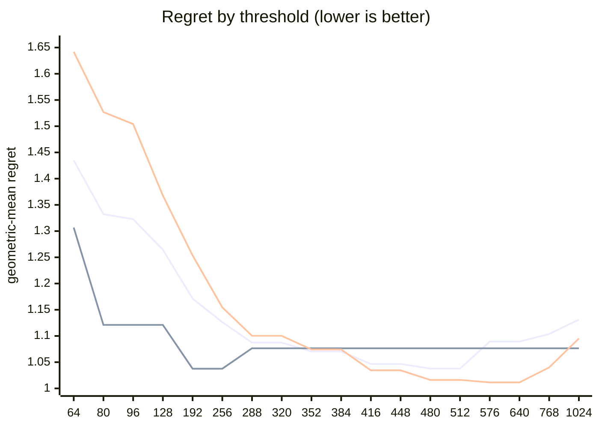

# QR dispatch crossover — Apple M5 Pro

What every section and number below means: [reading-reports.md](https://github.com/c0rmac/metal-linalg/blob/main/docs/reading-reports.md).

Generated by `tuning/tune_qr.py`. 221 shapes, 702 shape/backend pairs measured twice.

| | |
|---|---|
| Device | Apple M5 Pro |
| GPU cores | 20 |
| Resident matrices (`qr_unblocked`) | 120 |
| Shapes measured | 221 |
| Coverage | near-square 29, square 98, tall 56, wide 38 |

## The band

```
k = min(M, N) >= 512  ->  qr_streaming_amx_reduced
otherwise  ->  qr_unblocked
```

The optimum is flat from **k = 480 to 512** (every threshold within 0.3% of the best, 1.0378x). Any value inside that band is equivalent on this hardware; **512** is the middle of it.

Shipped instead: the batch-dependent split, which survived held-out data ([below](#refinements-tested)): the blocked QR from **k = 80** for batches below 8, from **k = 768** for larger ones.

Paste into `kTuned[]` in `src/qr.mm`:

```c
    {"Apple M5 Pro", 20, 80, 768, 8,   448, 1448, 1, 0,   512, 0,   0},
```

### Cost of missing the band

| threshold | regret | excess | |
|---|---|---|---|
| 64 | 1.4349x | +38.26% |  |
| 80 | 1.3323x | +28.38% |  |
| 96 | 1.3228x | +27.46% |  |
| 128 | 1.2644x | +21.83% |  |
| 192 | 1.1713x | +12.86% |  |
| 256 | 1.1264x | +8.54% |  |
| 288 | 1.0873x | +4.77% |  |
| 320 | 1.0873x | +4.77% |  |
| 352 | 1.0704x | +3.14% |  |
| 384 | 1.0704x | +3.14% |  |
| 416 | 1.0466x | +0.85% |  |
| 448 | 1.0466x | +0.85% |  |
| 480 | 1.0378x | +0.00% | **in band** |
| 512 | 1.0378x | +0.00% | **in band** |
| 576 | 1.0893x | +4.96% |  |
| 640 | 1.0893x | +4.96% |  |
| 768 | 1.1038x | +6.36% |  |
| 1024 | 1.1312x | +9.00% |  |

The penalty is usually asymmetric. Erring low costs little; erring high degrades specifically on tall inputs. Adding GPU cores makes the grid-parallel backend relatively stronger and pushes the true crossover down, so an untuned device is safer low than high.

## GPU or CPU

```
GPU iff w <= 448, batch * w >= 1448 and batch >= 1   (w = floor(sqrt(M k)), k = min(M, N))
or sqrt(M k) >= 512   (large matrices, by rows and k)
otherwise LAPACK on the CPU
```

On the GPU, no batch is shared with the CPU path: fitted first, on the GPU's side alone (the kernel against `share`, timed from batch 64), and the routing above fitted with it in effect.

| shared from batch | geomean regret (GPU side) | worst |
|---|---|---|
| never | 1.0377 | 1.33x |
| 64 | 1.4152 | 2.87x |
| 256 | 1.3832 | 2.87x |
| 1024 | 1.3158 | 2.87x |
| 4096 | 1.2140 | 2.87x |
| 16384 | 1.1036 | 2.79x |

Fitted on every shape with a CPU timing; inside the region within 0.5% of the best geometric-mean regret, the candidate with the smallest worst case.

| routing | geomean regret | worst | >10% off |
|---|---|---|---|
| chosen | 1.0231x | 2.02x | 18/221 |
| chosen without the large-matrix clause | 1.2503x | 8.14x | 64/221 |
| always the GPU (before the CPU path) | 1.6555x | 112.08x | 107/221 |
| always the CPU | 1.4908x | 8.14x | 113/221 |

Held out (fitted on half the shapes, scored on the other half): 1.0324x geomean, 2.21x worst, against 1.6021x and 71.17x for always the GPU.

The CPU was the fastest backend at 105 of 221 shapes, e.g. 1 x 8x8, 1 x 16x16, 1 x 16x256, 1 x 32x32, 1 x 32x384, 1 x 32x512, 1 x 64x64, 1 x 64x256.

## Regret by threshold

Regret is how much slower the chosen backend is than the best one measured at that shape; 1.0000x would be a perfect oracle. The per-region curves are the point: a grid covering only one aspect ratio can be nearly flat, and will then pick a threshold out of noise.



Series order: pooled, tall only, square only.

| threshold | pooled | square | tall | wide | near-square | pooled worst |
|---|---|---|---|---|---|---|
| 64 | 1.4349 | 1.6418 | 1.3068 | 1.1017 | 1.3395 | 3.39x |
| 80 | 1.3323 | 1.5269 | 1.1211 | 1.0699 | 1.3395 | 3.39x |
| 96 | 1.3228 | 1.5041 | 1.1211 | 1.0699 | 1.3395 | 3.39x |
| 128 | 1.2644 | 1.3677 | 1.1211 | 1.0699 | 1.3395 | 3.26x |
| 192 | 1.1713 | 1.2536 | 1.0376 | 1.0321 | 1.2456 | 2.96x |
| 256 | 1.1264 | 1.1545 | 1.0376 | 1.0321 | 1.2456 | 2.25x |
| 288 | 1.0873 | 1.1003 | 1.0766 | 1.0822 | 1.0703 | 2.04x |
| 320 | 1.0873 | 1.1003 | 1.0766 | 1.0822 | 1.0703 | 2.04x |
| 352 | 1.0704 | 1.0742 | 1.0766 | 1.0822 | 1.0445 | 2.04x |
| 384 | 1.0704 | 1.0742 | 1.0766 | 1.0822 | 1.0445 | 2.04x |
| 416 | 1.0466 | 1.0344 | 1.0766 | 1.0822 | 1.0174 | 2.04x |
| 448 | 1.0466 | 1.0344 | 1.0766 | 1.0822 | 1.0174 | 2.04x |
| 480 | 1.0378 | 1.0162 | 1.0766 | 1.0822 | 1.0174 | 2.04x |
| 512 | 1.0378 | 1.0162 | 1.0766 | 1.0822 | 1.0174 | 2.04x |
| 576 | 1.0893 | 1.0115 | 1.0766 | 1.6152 | 1.0505 | 6.69x |
| 640 | 1.0893 | 1.0115 | 1.0766 | 1.6152 | 1.0505 | 6.69x |
| 768 | 1.1038 | 1.0400 | 1.0766 | 1.6152 | 1.0505 | 6.69x |
| 1024 | 1.1312 | 1.0952 | 1.0766 | 1.6152 | 1.0505 | 6.69x |

## Which feature decides

`qr_unblocked` gives each matrix a simdgroup or a threadgroup whose threads hold its rows, and walks its k = min(M, N) columns a panel step at a time: its depth is k, while its rows run in parallel. The blocked QR pays several dispatches a panel. Rows and columns are therefore not interchangeable, and a rule on `max(M, N)` cannot express the difference.

| feature | best threshold | geomean regret | worst |
|---|---|---|---|
| K = min(M, N) | 480 | 1.0378x | 2.04x |
| max(M, N) | 768 | 1.0527x | 1.89x |
| M (rows) | 480 | 1.0845x | 2.04x |

## Decision surface

**batch 1**

```
      N=512     
      ---------
  512 ## 0.79 *
  640 ## 0.62 *

      ratio = reduced / unblocked.  ### <0.60  ## <0.85  # <0.95
      ~ tie (0.95-1.05)   . <1.30   blank >1.30  (unblocked wins)
      * k = min(M, N) >= 512: the blocked QR's
```

**batch 16**

```
      N=32      N=64      N=128     N=256     N=512     
      ---------------------------------------------
  128   .         .          1.50     1.82     1.38
  256   .          1.81     1.52     1.64     1.49
  384   .          1.35     1.50     1.64     1.36
  512   .          1.94     1.66     1.45  .  1.30 *
  640    2.02  .  1.14     1.50  .  1.24  ~  1.03 *

      ratio = reduced / unblocked.  ### <0.60  ## <0.85  # <0.95
      ~ tie (0.95-1.05)   . <1.30   blank >1.30  (unblocked wins)
      * k = min(M, N) >= 512: the blocked QR's
```

## Candidate rules

Per-region columns matter more than the overall number: an aggregate can look excellent while one aspect class is badly served.

| rule | geomean | worst | >10% off | square | tall | wide | near-square |
|---|---|---|---|---|---|---|---|
| original 5-rule heuristic | 1.0963x | 2.02x | 21/80 | 1.016 | 1.267 | 1.102 | 1.104 |
| max(M,N) >= 512 | 1.0963x | 2.02x | 21/80 | 1.016 | 1.267 | 1.102 | 1.104 |
| k >= 512  (chosen) | 1.0378x | 2.04x | 8/80 | 1.016 | 1.077 | 1.082 | 1.017 |
| M >= 512  (rows, the feature before 2.16.0) | 1.0845x | 2.04x | 17/80 | 1.016 | 1.267 | 1.082 | 1.050 |

## Refinements tested

Both of these were rejected on an 8-core M1, and both are re-tested here rather than assumed. A GPU with many more cores saturates `qr_unblocked` much later, so the batch split in particular could be justified elsewhere. Each is fitted on half the shapes and scored on the other half.

Baseline for comparison — `k >= 512` on the held-out half: **1.0433x** geomean, 1.79x worst.

| refinement | fitted form | train | held-out | held-out worst | verdict |
|---|---|---|---|---|---|
| batch-dependent split | `k >= (80 if batch < 8 else 768)` | 1.0009x | 1.0132x | 1.25x | **adopt** |
| narrow-N special case | `k >= 416 or (N <= 16 and k >= 128)` | 1.0418x | 1.0514x | 1.79x | reject |

> At least one refinement cleared held-out validation on this GPU. `QrPolicy` already carries the batch-split fields (`m_crossover_small_batch` / `m_crossover_large_batch` / `batch_threshold`) — set them from the fitted form above.

## Measurement noise

Run-to-run ratio over 702 shape/backend pairs measured twice: median 1.031x, p90 1.432x, max 3.154x.

| runtime | pairs | median | p90 | max |
|---|---|---|---|---|
| <1 ms | 351 | 1.059x | 1.836x | 3.154x |
| 1-3 ms | 145 | 1.016x | 1.072x | 1.520x |
| 3-10 ms | 109 | 1.024x | 1.073x | 1.294x |
| 10-30 ms | 51 | 1.036x | 1.206x | 1.382x |
| 30-100 ms | 33 | 1.028x | 1.074x | 1.118x |
| >100 ms | 13 | 1.017x | 1.055x | 1.076x |

Noise concentrates in fast shapes, where submission jitter dominates. A difference smaller than the p90 figure for its size bucket is not a result.

---

Raw timings in `raw.csv`; full analysis including plot-ready series in `results.json`. Re-render this report without remeasuring: `python3 tuning/tune_qr.py --from results.json`.
