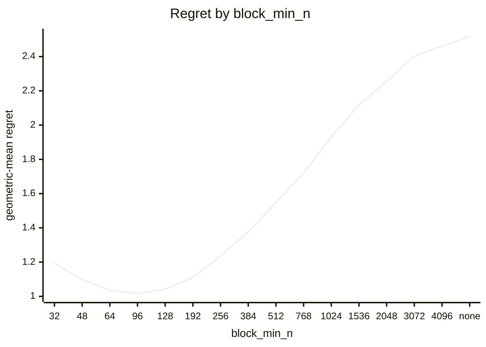
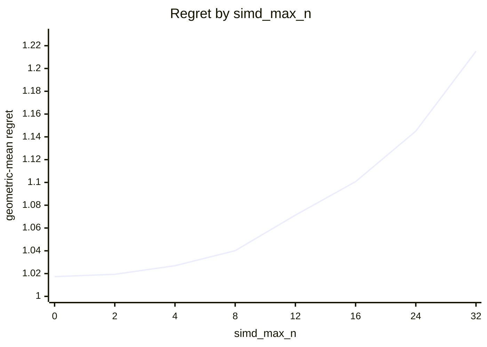
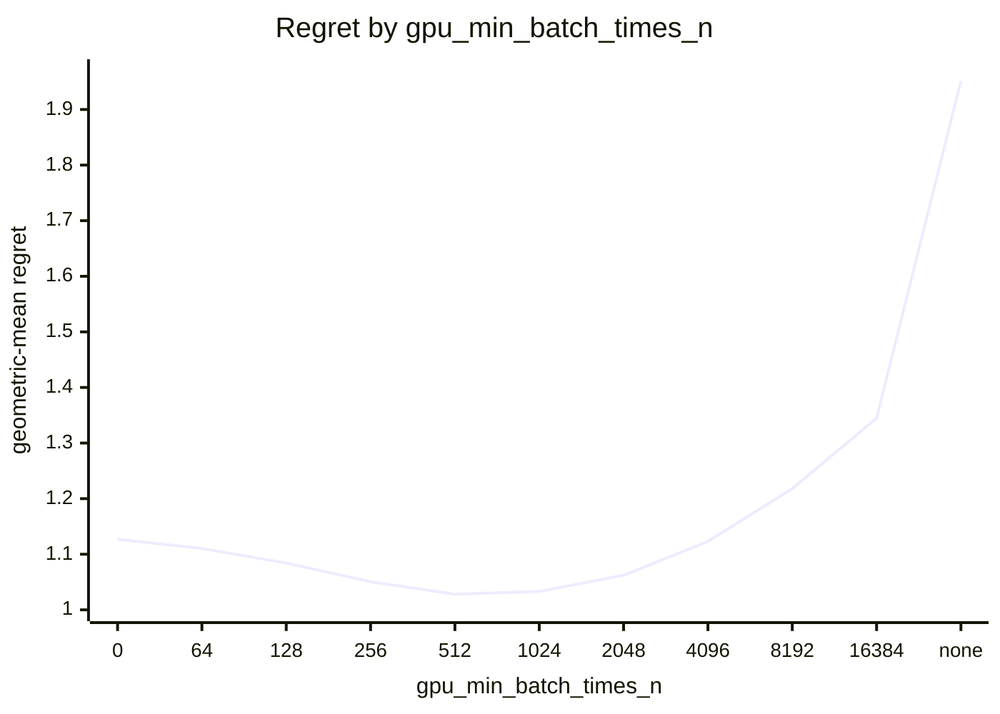
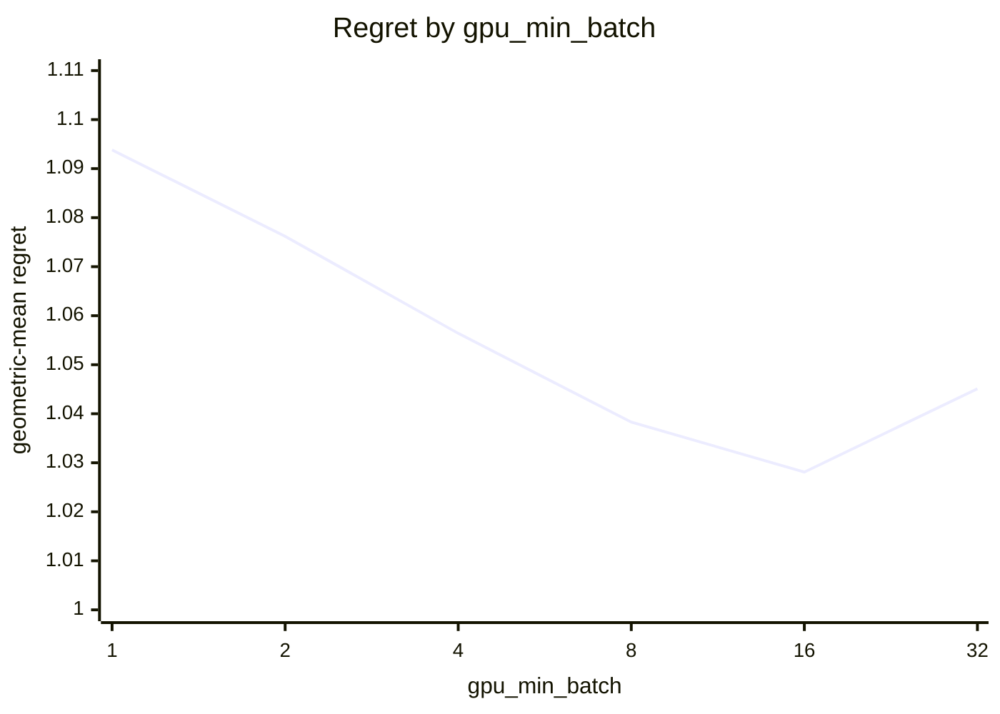
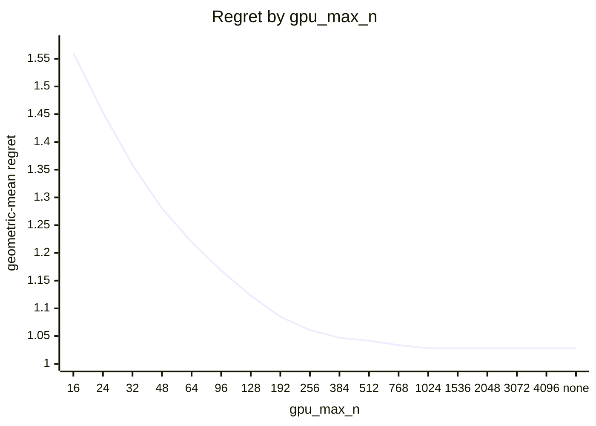

# Eigensolver routing on Apple M5 Pro (20 GPU cores)

What every section and number below means: [reading-reports.md](https://github.com/c0rmac/metal-linalg/blob/main/docs/reading-reports.md).

Cost model scaled to this device from one probe point: block x0.14, cpu x0.93, whole-matrix x1.00 (1.00 is an M1).

Machine state: load 1.8/18 at the start, load 1.6/18 at the end; power mains.

Probe point after the sweep relative to before it: block x1.00, cpu x1.01, tg x1.00 (stable).

Generated by `tuning/tune_eigh.py` from 205 (N, batch) points, N in [2, 4, 8, 12, 16, 24, 32, 48, 64, 96, 128, 192, 256, 384, 512, 768, 1024, 1536, 2048, 3072, 4096], batch in [1, 2, 4, 8, 16, 32, 64, 128, 256, 512, 1024, 2048, 4096], four backends, two or more passes, min-of-repeats.

Combined from 4 submissions (20260930-27b6c2, 20261001-c76e82, 20261002-153352, 20261003-d26059): each submission's fastest pass, then the median across submissions. The noise floor is per submission.

## Answer

Row for `kTuned[]` in `src/eigh.mm`:

```cpp
// device, GPU cores,   simd_max_n, block_min_n, block_min_n_batched, block_min_batch,   gpu_max_n, gpu_min_batch_times_n, gpu_min_batch,   values_gpu_max_n, values_gpu_min_batch_times_n, values_gpu_min_batch,   tridiag_min_n, values_tridiag_min_n
{"Apple M5 Pro", 20,   0, 96, 0, 0,   1024, 512, 16,   256, 2048, 32,   1024, 0},
```

To try it without rebuilding:

```sh
EIGH_SIMD_MAX_N=0 EIGH_BLOCK_MIN_N=96 EIGH_BLOCK_MIN_N_BATCHED=0 EIGH_BLOCK_MIN_BATCH=0 EIGH_GPU_MAX_N=1024 EIGH_GPU_MIN_BATCH_TIMES_N=512 EIGH_GPU_MIN_BATCH=16 EIGH_TRIDIAG_MIN_N=1024 EIGH_VALUES_TRIDIAG_MIN_N=0 EIGH_VALUES_GPU_MAX_N=256 EIGH_VALUES_GPU_MIN_BATCH_TIMES_N=2048 EIGH_VALUES_GPU_MIN_BATCH=32
```

The policy in effect on this device came from `default:untuned-device (Apple M5 Pro)`. It differs from the fitted one; see the warnings.

Against the best measured backend at every point the whole rule scores 1.0281 geometric-mean regret, worst 1.69x, 16 of 205 points losing more than 10%, and 1.318x the oracle's total time. The decision is fitted in two stages, below, because the CPU routing would otherwise hide the GPU backend crossover.

## Warnings

- chosen rule loses more than 25% at N=768 batch=16 (block, 1.69x), N=2 batch=256 (tg, 1.67x), N=4 batch=128 (tg, 1.62x), N=64 batch=4096 (tg, 1.55x), N=64 batch=1024 (tg, 1.53x), N=64 batch=2048 (tg, 1.51x), N=64 batch=512 (tg, 1.47x), N=96 batch=16 (block, 1.37x) ...
- GPU split loses more than 25% against the best GPU backend at N=64 batch=4096 (tg, 1.55x), N=64 batch=1024 (tg, 1.53x), N=64 batch=2048 (tg, 1.51x), N=64 batch=512 (tg, 1.47x), N=96 batch=16 (block, 1.37x), N=96 batch=2 (block, 1.34x), N=96 batch=1 (block, 1.33x), N=96 batch=8 (block, 1.32x) ...
- chosen rule picks a backend that was not timed at 1 points; the cost model's guess counts in the geomean and is kept out of the worst case: N=4096 batch=1 (cpu, est 2.77x)
- this device has no entry in kTuned[]: it is running the untuned default; paste the row above into src/eigh.mm
- the fitted policy differs from the one in effect (default:untuned-device (Apple M5 Pro)): update this device's row in kTuned[] in src/eigh.mm
- eigenvalues alone: the chosen boundary loses more than 25% at N=64 batch=4096 (tg, 1.54x), N=64 batch=1024 (tg, 1.54x), N=64 batch=2048 (tg, 1.47x), N=64 batch=512 (tg, 1.38x), N=12 batch=128 (cpu, 1.32x), N=24 batch=64 (cpu, 1.28x)

## Stage 1: which GPU backend

Scored against the best *GPU* backend at each of the 205 points, as if there were no CPU: this is the rule a forced-GPU call (`EIGH_DEVICE=gpu`) and the `detail` entry points follow, and it is what a GPU with more cores will lean on.

| rule | geomean regret | worst | >10% | total time / oracle | est. picks |
|---|---|---|---|---|---|
| policy in effect ('8', '96', 'none', 'none') | 1.0401 | 1.90x | 22 | 1.003 | 0 |
| fitted ('0', '96', 'none', 'none') | 1.0173 | 1.55x | 10 | 1.003 | 0 |

2 of 128 (simd_max_n, block_min_n) pairs are within 0.5% of the best geomean: simd_max_n 0 .. 2, block_min_n 96 .. 96.



| block_min_n | 32 | 48 | 64 | 96 | 128 | 192 | 256 | 384 | 512 | 768 | 1024 | 1536 | 2048 | 3072 | 4096 | none |
|---|---|---|---|---|---|---|---|---|---|---|---|---|---|---|---|---|
| geomean | 1.1935 | 1.0986 | 1.0355 | 1.0173 | 1.0420 | 1.1112 | 1.2362 | 1.3771 | 1.5470 | 1.7201 | 1.9325 | 2.1174 | 2.2555 | 2.4021 | 2.4603 | 2.5199 |
| worst | 8.70x | 4.36x | 2.60x | 1.55x | 1.93x | 2.24x | 4.53x | 5.83x | 10.07x | 15.80x | 15.80x | 15.80x | 15.80x | 15.80x | 15.80x | 15.80x |



| simd_max_n | 0 | 2 | 4 | 8 | 12 | 16 | 24 | 32 |
|---|---|---|---|---|---|---|---|---|
| geomean | 1.0173 | 1.0194 | 1.0269 | 1.0401 | 1.0713 | 1.1007 | 1.1450 | 1.2151 |
| worst | 1.55x | 1.55x | 1.90x | 1.90x | 3.28x | 3.28x | 3.28x | 4.96x |

Held-out check of a batch-dependent crossover (block from a lower N once the batch is large enough). Fitted on 112 points, scored on the other 93; the verdict is a bootstrap over the test points.

| rule | fitted on train | train geomean | test geomean | test worst | verdict |
|---|---|---|---|---|---|
| two constants | [0, 96, 1000000000, 1000000000] | 1.0134 | 1.0221 | 1.55x | baseline |
| batch-dependent block crossover | {"block_lo": 64, "batch_hi": 16} | 1.0029 | 1.0210 | 2.54x | rejected (better in 54% of resamples, median gain 0.1%) |

Best GPU backend per point (`s` simd, `t` threadgroup, `B` block), then what the split picks:

```
  N \ batch     1     2     4     8    16    32    64   128   256   512  1024  2048  4096
          2     t     t     t     s     t     t     t     t     t     s     t     t     s
          4     t     t     t     t     t     t     s     s     t     t     s     t     t
          8     t     t     t     t     t     s     t     t     t     t     t     t     t
         12     t     t     t     t     t     t     t     t     t     t     t     s     t
         16     t     t     t     t     t     t     t     t     t     t     t     t     t
         24     t     t     t     t     t     t     t     t     t     t     t     t     t
         32     t     t     t     t     t     t     t     t     t     t     t     t     t
         48     t     t     t     t     t     t     t     t     t     t     t     t     t
         64     t     t     t     t     t     t     t     t     B     B     B     B     B
         96     t     t     t     t     t     B     B     B     B     B     B     B     B
        128     B     B     B     B     B     B     B     B     B     B     B     B     B
        192     B     B     B     B     B     B     B     B     B     B     B     B     B
        256     B     B     B     B     B     B     B     B     B     B     B     .     .
        384     B     B     B     B     B     B     B     B     B     B     .     .     .
        512     B     B     B     B     B     B     B     B     .     .     .     .     .
        768     B     B     B     B     B     B     B     .     .     .     .     .     .
       1024     B     B     B     B     B     .     .     .     .     .     .     .     .
       1536     B     B     B     .     .     .     .     .     .     .     .     .     .
       2048     B     B     B     .     .     .     .     .     .     .     .     .     .
       3072     B     .     .     .     .     .     .     .     .     .     .     .     .
       4096     B     .     .     .     .     .     .     .     .     .     .     .     .
```

```
  N \ batch     1     2     4     8    16    32    64   128   256   512  1024  2048  4096
          2     t     t     t     t     t     t     t     t     t     t     t     t     t
          4     t     t     t     t     t     t     t     t     t     t     t     t     t
          8     t     t     t     t     t     t     t     t     t     t     t     t     t
         12     t     t     t     t     t     t     t     t     t     t     t     t     t
         16     t     t     t     t     t     t     t     t     t     t     t     t     t
         24     t     t     t     t     t     t     t     t     t     t     t     t     t
         32     t     t     t     t     t     t     t     t     t     t     t     t     t
         48     t     t     t     t     t     t     t     t     t     t     t     t     t
         64     t     t     t     t     t     t     t     t     t     t     t     t     t
         96     B     B     B     B     B     B     B     B     B     B     B     B     B
        128     B     B     B     B     B     B     B     B     B     B     B     B     B
        192     B     B     B     B     B     B     B     B     B     B     B     B     B
        256     B     B     B     B     B     B     B     B     B     B     B     .     .
        384     B     B     B     B     B     B     B     B     B     B     .     .     .
        512     B     B     B     B     B     B     B     B     .     .     .     .     .
        768     B     B     B     B     B     B     B     .     .     .     .     .     .
       1024     B     B     B     B     B     .     .     .     .     .     .     .     .
       1536     B     B     B     .     .     .     .     .     .     .     .     .     .
       2048     B     B     B     .     .     .     .     .     .     .     .     .     .
       3072     B     .     .     .     .     .     .     .     .     .     .     .     .
       4096     B     .     .     .     .     .     .     .     .     .     .     .     .
```

## Stage 2: GPU or CPU

Given the split above, GPU iff `N <= gpu_max_n`, `batch * N >= gpu_min_batch_times_n` and `batch >= gpu_min_batch`, scored against the best of all four backends. `worst` is over the points where the chosen backend was timed; a pick the cost model had to guess is listed in the warnings instead.

| rule | geomean regret | worst | >10% | total time / oracle | est. picks |
|---|---|---|---|---|---|
| oracle (best per point) | 1.0000 | 1.00x | 0 | 1.000 | 0 |
| policy in effect ('64', '1024', '1') | 1.2257 | 3.78x | 59 | 2.356 | 10 |
| fitted ('1024', '512', '16') | 1.0281 | 1.69x | 16 | 1.318 | 1 |

12 of 1188 combinations are within 0.5% of the best geomean: gpu_max_n 1024 .. none, gpu_min_batch_times_n 512 .. 1024, gpu_min_batch 16 .. 16.



| gpu_min_batch_times_n | 0 | 64 | 128 | 256 | 512 | 1024 | 2048 | 4096 | 8192 | 16384 | none |
|---|---|---|---|---|---|---|---|---|---|---|---|
| geomean | 1.1269 | 1.1104 | 1.0841 | 1.0506 | 1.0281 | 1.0331 | 1.0621 | 1.1231 | 1.2180 | 1.3447 | 1.9511 |
| worst | 20.55x | 12.59x | 7.36x | 3.53x | 1.69x | 2.17x | 3.48x | 5.29x | 6.81x | 9.83x | 17.04x |



| gpu_min_batch | 1 | 2 | 4 | 8 | 16 | 32 |
|---|---|---|---|---|---|---|
| geomean | 1.0938 | 1.0762 | 1.0564 | 1.0383 | 1.0281 | 1.0451 |
| worst | 3.34x | 3.06x | 3.06x | 2.15x | 1.69x | 1.72x |



| gpu_max_n | 16 | 24 | 32 | 48 | 64 | 96 | 128 | 192 | 256 | 384 | 512 | 768 | 1024 | 1536 | 2048 | 3072 | 4096 | none |
|---|---|---|---|---|---|---|---|---|---|---|---|---|---|---|---|---|---|---|
| geomean | 1.5602 | 1.4533 | 1.3586 | 1.2802 | 1.2198 | 1.1682 | 1.1230 | 1.0850 | 1.0610 | 1.0470 | 1.0418 | 1.0337 | 1.0281 | 1.0281 | 1.0281 | 1.0281 | 1.0281 | 1.0281 |
| worst | 10.71x | 8.29x | 5.72x | 5.72x | 3.78x | 2.99x | 2.33x | 2.00x | 1.67x | 1.67x | 1.67x | 1.69x | 1.69x | 1.69x | 1.69x | 1.69x | 1.69x | 1.69x |

Held-out check of a per-N boundary (a lookup table of the smallest batch at which the GPU wins, per N) against the product rule. Fitted on 112 points, scored on the other 93.

| rule | fitted on train | train geomean | test geomean | test worst | verdict |
|---|---|---|---|---|---|
| product rule | [1024, 512, 16] | 1.0267 | 1.0297 | 1.69x | baseline |
| per-N table | {"min_batch_by_n": {"2": 1024, "4": 512, "8": 128, "12": 64, "16": 32, "24": 16, "32": 16, "48": 64, "64": 64, "96": 32, "128": 32, "192": 16, "256": 8, "384": 8, "512": 8, "768": 64, "1024": 16, "1536": null, "2048": null, "3072": null, "4096": 1}} | 1.0073 | 1.0622 | 2.53x | rejected (better in 6% of resamples, median gain -2.9%) |

Best backend per point (`c` CPU, `s` simd, `t` threadgroup, `B` block, `.` not measured), what the whole rule picks, and the speedup of the best GPU backend over the CPU:

```
  N \ batch     1     2     4     8    16    32    64   128   256   512  1024  2048  4096
          2     c     c     c     c     c     c     c     c     c     c     t     t     s
          4     c     c     c     c     c     c     c     c     t     t     s     t     t
          8     c     c     c     c     c     c     c     t     t     t     t     t     t
         12     c     c     c     c     c     c     t     t     t     t     t     s     t
         16     c     c     c     c     c     t     t     t     t     t     t     t     t
         24     c     c     c     c     t     t     t     t     t     t     t     t     t
         32     c     c     c     c     t     t     t     t     t     t     t     t     t
         48     c     c     c     c     t     t     t     t     t     t     t     t     t
         64     c     c     c     c     t     t     t     t     B     B     B     B     B
         96     c     c     c     c     t     B     B     B     B     B     B     B     B
        128     c     c     c     c     B     B     B     B     B     B     B     B     B
        192     c     c     c     c     B     B     B     B     B     B     B     B     B
        256     c     c     c     B     B     B     B     B     B     B     B     .     .
        384     c     c     c     B     B     B     B     B     B     B     .     .     .
        512     c     c     c     B     B     c     c     B     .     .     .     .     .
        768     c     c     c     c     c     B     B     .     .     .     .     .     .
       1024     c     c     c     c     B     .     .     .     .     .     .     .     .
       1536     c     c     c     .     .     .     .     .     .     .     .     .     .
       2048     c     c     c     .     .     .     .     .     .     .     .     .     .
       3072     c     .     .     .     .     .     .     .     .     .     .     .     .
       4096     B     .     .     .     .     .     .     .     .     .     .     .     .
```

```
  N \ batch     1     2     4     8    16    32    64   128   256   512  1024  2048  4096
          2     c     c     c     c     c     c     c     c     t     t     t     t     t
          4     c     c     c     c     c     c     c     t     t     t     t     t     t
          8     c     c     c     c     c     c     t     t     t     t     t     t     t
         12     c     c     c     c     c     c     t     t     t     t     t     t     t
         16     c     c     c     c     c     t     t     t     t     t     t     t     t
         24     c     c     c     c     c     t     t     t     t     t     t     t     t
         32     c     c     c     c     t     t     t     t     t     t     t     t     t
         48     c     c     c     c     t     t     t     t     t     t     t     t     t
         64     c     c     c     c     t     t     t     t     t     t     t     t     t
         96     c     c     c     c     B     B     B     B     B     B     B     B     B
        128     c     c     c     c     B     B     B     B     B     B     B     B     B
        192     c     c     c     c     B     B     B     B     B     B     B     B     B
        256     c     c     c     c     B     B     B     B     B     B     B     .     .
        384     c     c     c     c     B     B     B     B     B     B     .     .     .
        512     c     c     c     c     B     B     B     B     .     .     .     .     .
        768     c     c     c     c     B     B     B     .     .     .     .     .     .
       1024     c     c     c     c     B     .     .     .     .     .     .     .     .
       1536     c     c     c     .     .     .     .     .     .     .     .     .     .
       2048     c     c     c     .     .     .     .     .     .     .     .     .     .
       3072     c     .     .     .     .     .     .     .     .     .     .     .     .
       4096     c     .     .     .     .     .     .     .     .     .     .     .     .
```

```
  N \ batch     1     2     4     8    16    32    64   128   256   512  1024  2048  4096
          2  0.01  0.01  0.01  0.02  0.05  0.08  0.14  0.29  0.60  0.93  1.82  3.49  6.41
          4  0.01  0.01  0.03  0.04  0.09  0.14  0.29  0.63  1.12  2.19  4.33  7.02 11.52
          8  0.02  0.04  0.06  0.10  0.23  0.31  0.85  1.40  3.03  5.13  8.88 12.70 17.04
         12  0.03  0.05  0.10  0.18  0.37  0.69  1.43  2.75  4.52  6.81  9.83 11.34 14.08
         16  0.04  0.08  0.15  0.31  0.60  1.14  2.28  4.04  5.97  8.72 10.29 12.78 14.58
         24  0.08  0.16  0.30  0.57  1.13  2.17  3.48  5.29  6.25  8.18  9.28 10.40 10.71
         32  0.11  0.19  0.38  0.75  1.41  2.53  3.69  4.30  5.32  6.80  7.54  7.77  8.29
         48  0.11  0.21  0.43  0.85  1.72  2.53  3.11  3.91  4.71  5.04  5.32  5.45  5.37
         64  0.12  0.23  0.45  0.88  1.72  2.37  2.65  3.27  4.30  5.18  5.47  5.46  5.72
         96  0.08  0.16  0.31  0.62  1.21  1.63  2.31  3.07  3.68  3.67  3.66  3.70  3.78
        128  0.09  0.17  0.33  0.63  1.15  1.90  2.49  2.97  2.99  2.86  2.85  2.90  2.89
        192  0.13  0.26  0.49  0.92  1.58  1.97  2.33  2.25  2.09  2.07  2.13   gpu   gpu
        256  0.19  0.37  0.69  1.19  1.68  2.00  1.98  1.76  1.73  1.75   gpu     .     .
        384  0.23  0.41  0.71  1.13  1.32  1.24  1.12  1.07   gpu   gpu     .     .     .
        512  0.30  0.49  0.81  1.10  1.08  0.97  0.93   gpu     .     .     .     .     .
        768  0.30  0.50  0.70  0.65  0.59   gpu   gpu     .     .     .     .     .     .
       1024  0.40  0.59  0.66  0.58   gpu     .     .     .     .     .     .     .     .
       1536  0.40  0.43  0.40     .     .     .     .     .     .     .     .     .     .
       2048  0.40  0.40  0.39     .     .     .     .     .     .     .     .     .     .
       3072  0.33     .     .     .     .     .     .     .     .     .     .     .     .
       4096   gpu     .     .     .     .     .     .     .     .     .     .     .     .
```

## Stage 3: GPU or CPU, eigenvalues alone

The same rule for `eigvalsh`, with its own thresholds (`values_gpu_max_n`, `values_gpu_min_batch_times_n`, `values_gpu_min_batch`), fitted on the `_vals` timings of 195 points given the split above. The CPU computes eigenvalues alone by LAPACK's two-stage reduction from N = 128, so the boundary need not be eigh's.

| rule | geomean regret | worst | >10% | total time / oracle | est. picks |
|---|---|---|---|---|---|
| eigh's boundary, in effect | 1.0800 | 2.31x | 35 | 1.326 | 0 |
| fitted ('256', '2048', '32') | 1.0145 | 1.54x | 10 | 1.013 | 0 |

5 combinations are within 0.5% of the best geomean: values_gpu_max_n 192 .. 384, values_gpu_min_batch_times_n 1024 .. 2048, values_gpu_min_batch 16 .. 32.

Held out: fitted on 106 points ('256', '2048', '32'), scored on the other 89: geomean 1.0164x, worst 1.54x, against 1.0732x, worst 3.92x for eigh's boundary on the same points.

## Stage 4: the tridiag backend instead of the CPU

Where the rule above chooses the CPU, the `tridiag` backend from a threshold N on (0: never), fitted over the measured N against the best of all backends, tridiag included, on the points where tridiag was timed (N >= 128, within the cost cap): the region the threshold decides.

| | threshold | geomean regret | worst | without tridiag: geomean | worst | held out (fitted on half) |
|---|---|---|---|---|---|---|
| with eigenvectors | 1024 | 1.0377 | 2.00x | 1.1709 | 2.73x | from 1024: 1.0418 vs 1.0844 |
| eigenvalues alone | never | 1.0021 | 1.13x | 1.0021 | 1.13x | from never: 1.0000 vs 1.0000 |

tridiag over the CPU (with eigenvectors), N x batch: 128x1 0.21x, 128x2 0.21x, 128x4 0.21x, 128x8 0.20x, 128x16 0.19x, 128x32 0.21x, 128x64 0.21x, 128x128 0.20x, 128x256 0.20x, 128x512 0.20x, 192x1 0.31x, 192x2 0.31x, 192x4 0.29x, 192x8 0.30x, 192x16 0.29x, 192x32 0.30x, 192x64 0.30x, 192x128 0.29x, 192x256 0.30x, 256x1 0.42x, 256x2 0.42x, 256x4 0.42x, 256x8 0.42x, 256x16 0.41x, 256x32 0.41x, 256x64 0.41x, 256x128 0.41x, 256x256 0.41x, 384x1 0.51x, 384x2 0.49x, 384x4 0.49x, 384x8 0.50x, 384x16 0.49x, 384x32 0.49x, 384x64 0.49x, 384x128 0.49x, 512x1 0.68x, 512x2 0.67x, 512x4 0.67x, 512x8 0.67x, 512x16 0.65x, 512x32 0.66x, 512x64 0.67x, 768x1 0.80x, 768x2 0.79x, 768x4 0.79x, 768x8 0.79x, 768x16 0.78x, 1024x1 1.12x, 1024x2 1.11x, 1024x4 1.11x, 1024x8 1.12x, 1536x1 1.46x, 1536x2 1.42x, 1536x4 1.42x, 2048x1 1.90x, 2048x2 1.94x, 2048x4 1.91x, 3072x1 2.73x

tridiag over the CPU (eigenvalues alone), N x batch: 128x1 0.14x, 128x2 0.14x, 128x4 0.13x, 128x8 0.13x, 128x16 0.13x, 128x32 0.13x, 128x64 0.13x, 128x128 0.13x, 128x256 0.13x, 128x512 0.13x, 192x1 0.19x, 192x2 0.19x, 192x4 0.18x, 192x8 0.19x, 192x16 0.19x, 192x32 0.18x, 192x64 0.19x, 192x128 0.19x, 192x256 0.19x, 256x1 0.24x, 256x2 0.24x, 256x4 0.23x, 256x8 0.24x, 256x16 0.23x, 256x32 0.23x, 256x64 0.24x, 256x128 0.24x, 256x256 0.24x, 384x1 0.32x, 384x2 0.33x, 384x4 0.32x, 384x8 0.33x, 384x16 0.32x, 384x32 0.33x, 384x64 0.32x, 384x128 0.33x, 512x1 0.40x, 512x2 0.40x, 512x4 0.40x, 512x8 0.39x, 512x16 0.40x, 512x32 0.40x, 512x64 0.40x, 768x1 0.55x, 768x2 0.55x, 768x4 0.54x, 768x8 0.53x, 768x16 0.54x, 1024x1 0.68x, 1024x2 0.67x, 1024x4 0.67x, 1024x8 0.67x, 1536x1 0.84x, 1536x2 0.85x, 1536x4 0.84x, 2048x1 0.93x, 2048x2 0.94x, 2048x4 0.94x, 3072x1 1.13x

## Noise floor

Pass-to-pass ratio (max/min of the same measurement across passes), 3560 measurements: median 1.013, p90 1.127, max 3.82. The held-out verdicts use a bootstrap rather than this figure, since a mean over many points is far less noisy than one measurement.

| runtime | n | median | p90 | max |
|---|---|---|---|---|
| <1 ms | 1360 | 1.040 | 1.417 | 3.82 |
| 1-3 ms | 366 | 1.008 | 1.051 | 1.56 |
| 3-10 ms | 540 | 1.008 | 1.032 | 1.22 |
| 10-30 ms | 330 | 1.007 | 1.031 | 1.09 |
| 30-100 ms | 371 | 1.008 | 1.041 | 1.13 |
| >100 ms | 593 | 1.009 | 1.047 | 1.16 |
