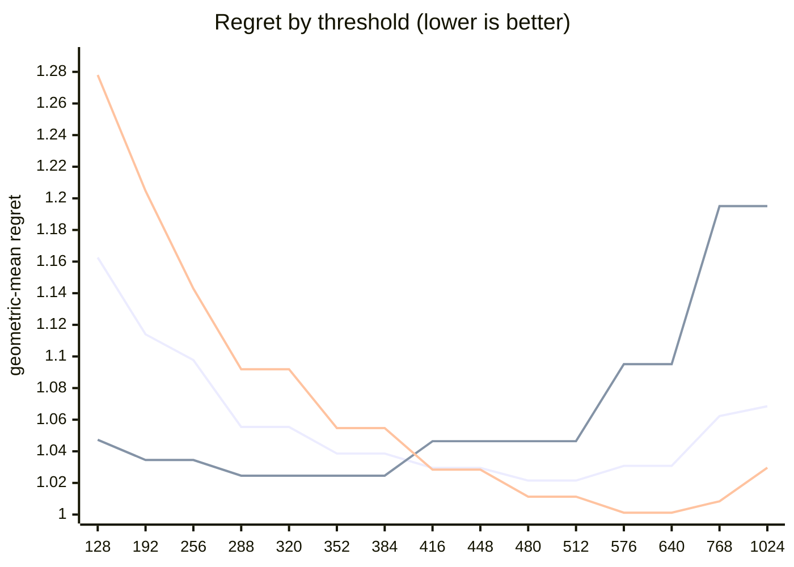

# QR dispatch crossover — Apple M5 Pro

What every section and number below means: [reading-reports.md](https://github.com/c0rmac/metal-linalg/blob/main/docs/reading-reports.md).

Generated by `tuning/tune_qr.py`. 173 shapes, 1091 shape/backend pairs measured twice.

Combined from 3 submissions (20260930-27b6c2, 20261001-c76e82, 20261002-9d19ba): each submission's fastest pass, then the median across submissions. The noise floor is per submission.

| | |
|---|---|
| Device | Apple M5 Pro |
| GPU cores | 20 |
| Resident matrices (`qr_unblocked`) | 120 |
| Shapes measured | 173 |
| Coverage | near-square 29, square 70, tall 44, wide 30 |

## The band

```
M >= 512  ->  qr_streaming_amx_reduced
otherwise  ->  qr_unblocked
```

The optimum is flat from **480 to 512** rows (every threshold within 0.3% of the best, 1.0215x). Any value inside that band is equivalent on this hardware; **512** is the middle of it.

Paste into `kTuned[]` in `src/qr.mm`:

```c
    {"Apple M5 Pro", 20, 512, 512, 16,   kQrNoLimit, 512, 1},
```

### Cost of missing the band

| threshold | regret | excess | |
|---|---|---|---|
| 128 | 1.1626x | +13.81% |  |
| 192 | 1.1140x | +9.06% |  |
| 256 | 1.0977x | +7.46% |  |
| 288 | 1.0554x | +3.32% |  |
| 320 | 1.0554x | +3.32% |  |
| 352 | 1.0386x | +1.67% |  |
| 384 | 1.0386x | +1.67% |  |
| 416 | 1.0295x | +0.78% |  |
| 448 | 1.0295x | +0.78% |  |
| 480 | 1.0215x | +0.00% | **in band** |
| 512 | 1.0215x | +0.00% | **in band** |
| 576 | 1.0308x | +0.91% |  |
| 640 | 1.0308x | +0.91% |  |
| 768 | 1.0623x | +3.99% |  |
| 1024 | 1.0685x | +4.60% |  |

The penalty is usually asymmetric. Erring low costs little; erring high degrades specifically on tall inputs. Adding GPU cores makes the grid-parallel backend relatively stronger and pushes the true crossover down, so an untuned device is safer low than high.

## GPU or CPU

```
GPU iff k <= no limit, batch * k >= 512 and batch >= 1   (k = min(M, N))
otherwise LAPACK on the CPU
```

Fitted on every shape with a CPU timing; inside the region within 0.5% of the best geometric-mean regret, the candidate with the smallest worst case.

| routing | geomean regret | worst | >10% off |
|---|---|---|---|
| chosen | 1.0798x | 5.28x | 20/173 |
| always the GPU (before the CPU path) | 1.6841x | 61.31x | 72/173 |
| always the CPU | 1.8895x | 14.06x | 98/173 |

Held out (fitted on half the shapes, scored on the other half): 1.1430x geomean, 5.28x worst, against 1.6169x and 51.38x for always the GPU.

The CPU was the fastest backend at 72 of 173 shapes, e.g. 1 x 8x8, 1 x 16x16, 1 x 16x256, 1 x 32x32, 1 x 32x512, 1 x 64x64, 1 x 64x256, 1 x 64x384.

## Regret by threshold

Regret is how much slower the chosen backend is than the best one measured at that shape; 1.0000x would be a perfect oracle. The per-region curves are the point: a grid covering only one aspect ratio can be nearly flat, and will then pick a threshold out of noise.



Series order: pooled, tall only, square only.

| threshold | pooled | square | tall | wide | near-square | pooled worst |
|---|---|---|---|---|---|---|
| 128 | 1.1626 | 1.2780 | 1.0473 | 1.0737 | 1.2983 | 2.11x |
| 192 | 1.1140 | 1.2047 | 1.0345 | 1.0320 | 1.2109 | 1.80x |
| 256 | 1.0977 | 1.1429 | 1.0345 | 1.0320 | 1.2109 | 1.67x |
| 288 | 1.0554 | 1.0919 | 1.0246 | 1.0096 | 1.1029 | 1.58x |
| 320 | 1.0554 | 1.0919 | 1.0246 | 1.0096 | 1.1029 | 1.58x |
| 352 | 1.0386 | 1.0547 | 1.0246 | 1.0096 | 1.0688 | 1.58x |
| 384 | 1.0386 | 1.0547 | 1.0246 | 1.0096 | 1.0688 | 1.58x |
| 416 | 1.0295 | 1.0284 | 1.0464 | 1.0096 | 1.0264 | 1.58x |
| 448 | 1.0295 | 1.0284 | 1.0464 | 1.0096 | 1.0264 | 1.58x |
| 480 | 1.0215 | 1.0113 | 1.0464 | 1.0096 | 1.0109 | 1.58x |
| 512 | 1.0215 | 1.0113 | 1.0464 | 1.0096 | 1.0109 | 1.58x |
| 576 | 1.0308 | 1.0012 | 1.0951 | 1.0096 | 1.0000 | 1.94x |
| 640 | 1.0308 | 1.0012 | 1.0951 | 1.0096 | 1.0000 | 1.94x |
| 768 | 1.0623 | 1.0084 | 1.1951 | 1.0096 | 1.0062 | 2.31x |
| 1024 | 1.0685 | 1.0296 | 1.1951 | 1.0096 | 1.0062 | 2.31x |

## Which feature decides

`qr_unblocked` gives each matrix a single threadgroup, which sweeps `M` rows per Householder reflection while `N` parallelises across that threadgroup's threads. Rows and columns are therefore not interchangeable, and a rule on `max(M, N)` cannot express the difference.

| feature | best threshold | geomean regret | worst |
|---|---|---|---|
| M (rows) | 480 | 1.0215x | 1.58x |
| max(M, N) | 576 | 1.0701x | 2.08x |
| K = min(M, N) | 576 | 1.1406x | 6.58x |

## Decision surface

**batch 1**

```
      N=32      N=64      N=128     N=256     N=512     
      ---------------------------------------------
  128    1.37     1.77     1.83     1.77     1.50
  256 ~  1.04  .  1.23     1.55     1.67     1.49
  384 ## 0.66  #  0.94  .  1.24     1.30  .  1.23
  512 ###0.52  ## 0.79  .  1.07  ~  1.04  .  1.07   <- M >= 512
  640 ###0.46  ## 0.63  #  0.85  ## 0.83  ## 0.84

      ratio = reduced / unblocked.  ### <0.60  ## <0.85  # <0.95
      ~ tie (0.95-1.05)   . <1.30   blank >1.30  (unblocked wins)
```

**batch 16**

```
      N=32      N=64      N=128     N=256     N=512     
      ---------------------------------------------
  128 .  1.26     1.56     1.62     1.55     1.39
  256 #  0.91  .  1.21     1.45     1.54     1.36
  384 ## 0.69  #  0.94  .  1.18  .  1.27  .  1.22
  512 ###0.59  ## 0.74  ~  1.01  ~  1.05  .  1.18   <- M >= 512
  640 ###0.43  ###0.58  ## 0.75  #  0.91  ~  1.00

      ratio = reduced / unblocked.  ### <0.60  ## <0.85  # <0.95
      ~ tie (0.95-1.05)   . <1.30   blank >1.30  (unblocked wins)
```

## Candidate rules

Per-region columns matter more than the overall number: an aggregate can look excellent while one aspect class is badly served.

| rule | geomean | worst | >10% off | square | tall | wide | near-square |
|---|---|---|---|---|---|---|---|
| original 5-rule heuristic | 1.1900x | 2.08x | 61/143 | 1.144 | 1.044 | 1.506 | 1.200 |
| max(M,N) >= 512 | 1.0823x | 2.08x | 28/143 | 1.011 | 1.046 | 1.281 | 1.050 |
| K = min(M,N) >= 128 | 1.2747x | 6.58x | 76/143 | 1.278 | 1.446 | 1.074 | 1.254 |
| M >= 512  (chosen) | 1.0215x | 1.58x | 8/143 | 1.011 | 1.046 | 1.010 | 1.011 |

## Refinements tested

Both of these were rejected on an 8-core M1, and both are re-tested here rather than assumed. A GPU with many more cores saturates `qr_unblocked` much later, so the batch split in particular could be justified elsewhere. Each is fitted on half the shapes and scored on the other half.

Baseline for comparison — `M >= 512` on the held-out half: **1.0235x** geomean, 1.58x worst.

| refinement | fitted form | train | held-out | held-out worst | verdict |
|---|---|---|---|---|---|
| batch-dependent split | `M >= (480 if batch < 32 else 416)` | 1.0196x | 1.0254x | 1.58x | reject |
| narrow-N special case | `M >= 416 or (N <= 64 and M >= 288)` | 1.0191x | 1.0212x | 1.58x | **adopt** |

> At least one refinement cleared held-out validation on this GPU. `QrPolicy` already carries the batch-split fields (`m_crossover_small_batch` / `m_crossover_large_batch` / `batch_threshold`) — set them from the fitted form above.

## Measurement noise

Run-to-run ratio over 1091 shape/backend pairs measured twice: median 1.012x, p90 1.116x, max 3.169x.

| runtime | pairs | median | p90 | max |
|---|---|---|---|---|
| <1 ms | 298 | 1.037x | 1.477x | 3.169x |
| 1-3 ms | 354 | 1.012x | 1.062x | 1.637x |
| 3-10 ms | 282 | 1.007x | 1.041x | 1.196x |
| 10-30 ms | 92 | 1.007x | 1.020x | 1.084x |
| 30-100 ms | 39 | 1.011x | 1.029x | 1.138x |
| >100 ms | 26 | 1.009x | 1.036x | 1.114x |

Noise concentrates in fast shapes, where submission jitter dominates. A difference smaller than the p90 figure for its size bucket is not a result.

---

Raw timings in `raw.csv`; full analysis including plot-ready series in `results.json`. Re-render this report without remeasuring: `python3 tuning/tune_qr.py --from results.json`.
