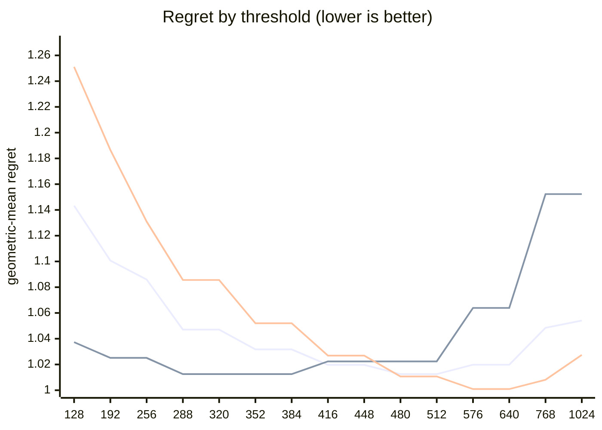

# QR dispatch crossover — Apple M5 Pro

What every section and number below means: [reading-reports.md](https://github.com/c0rmac/metal-linalg/blob/main/docs/reading-reports.md).

Generated by `tuning/tune_qr.py`. 143 shapes, 572 shape/backend pairs measured twice.

Combined from 2 submissions (20260930-27b6c2, 20261001-c76e82): each submission's fastest pass, then the median across submissions. The noise floor is per submission.

| | |
|---|---|
| Device | Apple M5 Pro |
| GPU cores | 20 |
| Resident matrices (`qr_unblocked`) | 120 |
| Shapes measured | 143 |
| Coverage | near-square 29, square 40, tall 44, wide 30 |

## The band

```
M >= 512  ->  qr_streaming_amx_reduced
otherwise  ->  qr_unblocked
```

The optimum is flat from **480 to 512** rows (every threshold within 0.3% of the best, 1.0125x). Any value inside that band is equivalent on this hardware; **512** is the middle of it.

Paste into `kTuned[]` in `src/qr.mm`:

```c
    {"Apple M5 Pro", 20, 512, 512, 16,   kQrNoLimit, 0, 1},
```

### Cost of missing the band

| threshold | regret | excess | |
|---|---|---|---|
| 128 | 1.1433x | +12.92% |  |
| 192 | 1.1007x | +8.71% |  |
| 256 | 1.0860x | +7.26% |  |
| 288 | 1.0471x | +3.42% |  |
| 320 | 1.0471x | +3.42% |  |
| 352 | 1.0317x | +1.90% |  |
| 384 | 1.0317x | +1.90% |  |
| 416 | 1.0197x | +0.71% |  |
| 448 | 1.0197x | +0.71% |  |
| 480 | 1.0125x | +0.00% | **in band** |
| 512 | 1.0125x | +0.00% | **in band** |
| 576 | 1.0198x | +0.72% |  |
| 640 | 1.0198x | +0.72% |  |
| 768 | 1.0485x | +3.56% |  |
| 1024 | 1.0541x | +4.11% |  |

The penalty is usually asymmetric. Erring low costs little; erring high degrades specifically on tall inputs. Adding GPU cores makes the grid-parallel backend relatively stronger and pushes the true crossover down, so an untuned device is safer low than high.

## GPU or CPU

No CPU timings in these runs (they predate QR's CPU path), so the row sends every call to the GPU, as before.

## Regret by threshold

Regret is how much slower the chosen backend is than the best one measured at that shape; 1.0000x would be a perfect oracle. The per-region curves are the point: a grid covering only one aspect ratio can be nearly flat, and will then pick a threshold out of noise.



Series order: pooled, tall only, square only.

| threshold | pooled | square | tall | wide | near-square | pooled worst |
|---|---|---|---|---|---|---|
| 128 | 1.1433 | 1.2511 | 1.0373 | 1.0601 | 1.2653 | 2.01x |
| 192 | 1.1007 | 1.1866 | 1.0251 | 1.0204 | 1.1958 | 1.69x |
| 256 | 1.0860 | 1.1310 | 1.0251 | 1.0204 | 1.1958 | 1.60x |
| 288 | 1.0471 | 1.0856 | 1.0125 | 1.0003 | 1.0989 | 1.43x |
| 320 | 1.0471 | 1.0856 | 1.0125 | 1.0003 | 1.0989 | 1.43x |
| 352 | 1.0317 | 1.0520 | 1.0125 | 1.0003 | 1.0667 | 1.31x |
| 384 | 1.0317 | 1.0520 | 1.0125 | 1.0003 | 1.0667 | 1.31x |
| 416 | 1.0197 | 1.0269 | 1.0224 | 1.0003 | 1.0262 | 1.33x |
| 448 | 1.0197 | 1.0269 | 1.0224 | 1.0003 | 1.0262 | 1.33x |
| 480 | 1.0125 | 1.0107 | 1.0224 | 1.0003 | 1.0127 | 1.33x |
| 512 | 1.0125 | 1.0107 | 1.0224 | 1.0003 | 1.0127 | 1.33x |
| 576 | 1.0198 | 1.0009 | 1.0639 | 1.0003 | 1.0011 | 1.66x |
| 640 | 1.0198 | 1.0009 | 1.0639 | 1.0003 | 1.0011 | 1.66x |
| 768 | 1.0485 | 1.0081 | 1.1523 | 1.0003 | 1.0070 | 2.11x |
| 1024 | 1.0541 | 1.0274 | 1.1523 | 1.0003 | 1.0070 | 2.11x |

## Which feature decides

`qr_unblocked` gives each matrix a single threadgroup, which sweeps `M` rows per Householder reflection while `N` parallelises across that threadgroup's threads. Rows and columns are therefore not interchangeable, and a rule on `max(M, N)` cannot express the difference.

| feature | best threshold | geomean regret | worst |
|---|---|---|---|
| M (rows) | 480 | 1.0125x | 1.33x |
| max(M, N) | 576 | 1.0491x | 1.70x |
| K = min(M, N) | 576 | 1.1224x | 6.08x |

## Decision surface

**batch 1**

```
      N=32      N=64      N=128     N=256     N=512     
      ---------------------------------------------
  128    1.31     1.54     1.63     1.59     1.58
  256 ~  1.01  .  1.13     1.46     1.60     1.44
  384 ## 0.83  ~  0.99  .  1.23  .  1.27  .  1.20
  512 ## 0.60  ## 0.82  .  1.06  ~  1.03  .  1.06   <- M >= 512
  640 ###0.49  ## 0.66  #  0.86  ## 0.83  ## 0.82

      ratio = reduced / unblocked.  ### <0.60  ## <0.85  # <0.95
      ~ tie (0.95-1.05)   . <1.30   blank >1.30  (unblocked wins)
```

**batch 16**

```
      N=32      N=64      N=128     N=256     N=512     
      ---------------------------------------------
  128 .  1.29     1.44     1.57     1.47     1.39
  256 ~  0.97  .  1.13     1.37     1.46     1.32
  384 ## 0.75  #  0.94  .  1.18  .  1.27  .  1.24
  512 ## 0.60  ## 0.79  ~  1.01  .  1.10  .  1.19   <- M >= 512
  640 ###0.47  ## 0.62  ## 0.78  #  0.91  ~  1.03

      ratio = reduced / unblocked.  ### <0.60  ## <0.85  # <0.95
      ~ tie (0.95-1.05)   . <1.30   blank >1.30  (unblocked wins)
```

## Candidate rules

Per-region columns matter more than the overall number: an aggregate can look excellent while one aspect class is badly served.

| rule | geomean | worst | >10% off | square | tall | wide | near-square |
|---|---|---|---|---|---|---|---|
| original 5-rule heuristic | 1.1529x | 1.70x | 61/143 | 1.129 | 1.034 | 1.361 | 1.180 |
| max(M,N) >= 512 | 1.0632x | 1.70x | 27/143 | 1.011 | 1.022 | 1.220 | 1.050 |
| K = min(M,N) >= 128 | 1.2418x | 6.08x | 74/143 | 1.251 | 1.382 | 1.060 | 1.231 |
| M >= 512  (chosen) | 1.0125x | 1.33x | 6/143 | 1.011 | 1.022 | 1.000 | 1.013 |

## Refinements tested

Both of these were rejected on an 8-core M1, and both are re-tested here rather than assumed. A GPU with many more cores saturates `qr_unblocked` much later, so the batch split in particular could be justified elsewhere. Each is fitted on half the shapes and scored on the other half.

Baseline for comparison — `M >= 512` on the held-out half: **1.0121x** geomean, 1.33x worst.

| refinement | fitted form | train | held-out | held-out worst | verdict |
|---|---|---|---|---|---|
| batch-dependent split | `M >= (480 if batch < 32 else 416)` | 1.0129x | 1.0139x | 1.33x | reject |
| narrow-N special case | `M >= 416 or (N <= 64 and M >= 288)` | 1.0145x | 1.0136x | 1.18x | reject |

> Neither refinement survived. Ship the plain threshold. A refinement that looks good on the training half and not on the held-out half is fitting noise, which is exactly what the split is there to catch.

## Measurement noise

Run-to-run ratio over 572 shape/backend pairs measured twice: median 1.011x, p90 1.142x, max 2.721x.

| runtime | pairs | median | p90 | max |
|---|---|---|---|---|
| <1 ms | 125 | 1.052x | 1.462x | 2.721x |
| 1-3 ms | 219 | 1.014x | 1.080x | 1.637x |
| 3-10 ms | 170 | 1.005x | 1.028x | 1.196x |
| 10-30 ms | 45 | 1.005x | 1.017x | 1.028x |
| 30-100 ms | 12 | 1.006x | 1.017x | 1.037x |
| >100 ms | 1 | 1.006x | 1.006x | 1.006x |

Noise concentrates in fast shapes, where submission jitter dominates. A difference smaller than the p90 figure for its size bucket is not a result.

---

Raw timings in `raw.csv`; full analysis including plot-ready series in `results.json`. Re-render this report without remeasuring: `python3 tuning/tune_qr.py --from results.json`.
