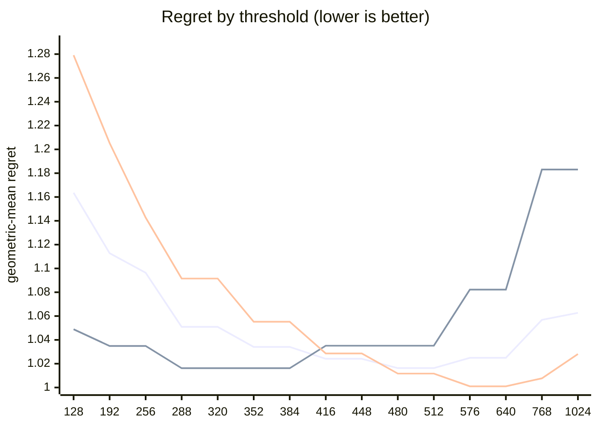

# QR dispatch crossover — Apple M5 Pro

What every section and number below means: [reading-reports.md](https://github.com/c0rmac/metal-linalg/blob/main/docs/reading-reports.md).

Generated by `tuning/tune_qr.py`. 178 shapes, 1053 shape/backend pairs measured twice.

Combined from 2 submissions (20261003-2d2c19, 20261003-847f0e): each submission's fastest pass, then the median across submissions. The noise floor is per submission.

| | |
|---|---|
| Device | Apple M5 Pro |
| GPU cores | 20 |
| Resident matrices (`qr_unblocked`) | 120 |
| Shapes measured | 178 |
| Coverage | near-square 29, square 75, tall 44, wide 30 |

## The band

```
M >= 512  ->  qr_streaming_amx_reduced
otherwise  ->  qr_unblocked
```

The optimum is flat from **480 to 512** rows (every threshold within 0.3% of the best, 1.0163x). Any value inside that band is equivalent on this hardware; **512** is the middle of it.

Paste into `kTuned[]` in `src/qr.mm`:

```c
    {"Apple M5 Pro", 20, 512, 512, 16,   128, 131072, 1,   1024, 4},
```

### Cost of missing the band

| threshold | regret | excess | |
|---|---|---|---|
| 128 | 1.1635x | +14.48% |  |
| 192 | 1.1128x | +9.50% |  |
| 256 | 1.0964x | +7.88% |  |
| 288 | 1.0509x | +3.40% |  |
| 320 | 1.0509x | +3.40% |  |
| 352 | 1.0341x | +1.75% |  |
| 384 | 1.0341x | +1.75% |  |
| 416 | 1.0241x | +0.77% |  |
| 448 | 1.0241x | +0.77% |  |
| 480 | 1.0163x | +0.00% | **in band** |
| 512 | 1.0163x | +0.00% | **in band** |
| 576 | 1.0249x | +0.85% |  |
| 640 | 1.0249x | +0.85% |  |
| 768 | 1.0568x | +3.99% |  |
| 1024 | 1.0627x | +4.57% |  |

The penalty is usually asymmetric. Erring low costs little; erring high degrades specifically on tall inputs. Adding GPU cores makes the grid-parallel backend relatively stronger and pushes the true crossover down, so an untuned device is safer low than high.

## GPU or CPU

```
GPU iff k <= 128, batch * k >= 131072 and batch >= 1   (k = min(M, N))
or k >= 1024 and batch <= 4   (large matrices)
otherwise LAPACK on the CPU
```

Fitted on every shape with a CPU timing; inside the region within 0.5% of the best geometric-mean regret, the candidate with the smallest worst case.

| routing | geomean regret | worst | >10% off |
|---|---|---|---|
| chosen | 1.0346x | 2.43x | 13/178 |
| chosen without the large-matrix clause | 1.0600x | 2.43x | 22/178 |
| always the GPU (before the CPU path) | 2.2031x | 60.85x | 149/178 |
| always the CPU | 1.0601x | 2.43x | 22/178 |

Held out (fitted on half the shapes, scored on the other half): 1.0700x geomean, 2.43x worst, against 2.0561x and 43.58x for always the GPU.

The CPU was the fastest backend at 151 of 178 shapes, e.g. 1 x 8x8, 1 x 16x16, 1 x 16x256, 1 x 32x32, 1 x 32x384, 1 x 64x64, 1 x 64x256, 1 x 64x384.

## Regret by threshold

Regret is how much slower the chosen backend is than the best one measured at that shape; 1.0000x would be a perfect oracle. The per-region curves are the point: a grid covering only one aspect ratio can be nearly flat, and will then pick a threshold out of noise.



Series order: pooled, tall only, square only.

| threshold | pooled | square | tall | wide | near-square | pooled worst |
|---|---|---|---|---|---|---|
| 128 | 1.1635 | 1.2791 | 1.0489 | 1.0704 | 1.3025 | 2.16x |
| 192 | 1.1128 | 1.2053 | 1.0349 | 1.0221 | 1.2153 | 1.80x |
| 256 | 1.0964 | 1.1427 | 1.0349 | 1.0221 | 1.2153 | 1.68x |
| 288 | 1.0509 | 1.0915 | 1.0162 | 1.0000 | 1.1050 | 1.46x |
| 320 | 1.0509 | 1.0915 | 1.0162 | 1.0000 | 1.1050 | 1.46x |
| 352 | 1.0341 | 1.0552 | 1.0162 | 1.0000 | 1.0692 | 1.33x |
| 384 | 1.0341 | 1.0552 | 1.0162 | 1.0000 | 1.0692 | 1.33x |
| 416 | 1.0241 | 1.0286 | 1.0351 | 1.0000 | 1.0265 | 1.48x |
| 448 | 1.0241 | 1.0286 | 1.0351 | 1.0000 | 1.0265 | 1.48x |
| 480 | 1.0163 | 1.0117 | 1.0351 | 1.0000 | 1.0114 | 1.48x |
| 512 | 1.0163 | 1.0117 | 1.0351 | 1.0000 | 1.0114 | 1.48x |
| 576 | 1.0249 | 1.0010 | 1.0822 | 1.0000 | 1.0000 | 1.83x |
| 640 | 1.0249 | 1.0010 | 1.0822 | 1.0000 | 1.0000 | 1.83x |
| 768 | 1.0568 | 1.0077 | 1.1831 | 1.0000 | 1.0066 | 2.34x |
| 1024 | 1.0627 | 1.0281 | 1.1831 | 1.0000 | 1.0066 | 2.34x |

## Which feature decides

`qr_unblocked` gives each matrix a single threadgroup, which sweeps `M` rows per Householder reflection while `N` parallelises across that threadgroup's threads. Rows and columns are therefore not interchangeable, and a rule on `max(M, N)` cannot express the difference.

| feature | best threshold | geomean regret | worst |
|---|---|---|---|
| M (rows) | 480 | 1.0163x | 1.48x |
| max(M, N) | 576 | 1.0660x | 2.05x |
| K = min(M, N) | 576 | 1.1356x | 6.70x |

## Decision surface

**batch 1**

```
      N=32      N=64      N=128     N=256     N=512     
      ---------------------------------------------
  128    1.41     1.72     1.77     1.75     1.69
  256 #  0.90  .  1.28     1.63     1.68     1.48
  384 ## 0.68  #  0.95  .  1.28     1.31  .  1.23
  512 ## 0.65  ## 0.79  .  1.07  ~  1.04  .  1.08   <- M >= 512
  640 ###0.46  ## 0.63  #  0.85  ## 0.83  ## 0.83

      ratio = reduced / unblocked.  ### <0.60  ## <0.85  # <0.95
      ~ tie (0.95-1.05)   . <1.30   blank >1.30  (unblocked wins)
```

**batch 16**

```
      N=32      N=64      N=128     N=256     N=512     
      ---------------------------------------------
  128 .  1.28     1.63     1.62     1.52     1.47
  256 ~  0.96  .  1.15     1.44     1.53     1.34
  384 ## 0.68  #  0.95  .  1.22  .  1.23  .  1.27
  512 ###0.57  ## 0.77  ~  1.00  .  1.09  .  1.18   <- M >= 512
  640 ###0.43  ###0.57  ## 0.75  #  0.88  ~  1.00

      ratio = reduced / unblocked.  ### <0.60  ## <0.85  # <0.95
      ~ tie (0.95-1.05)   . <1.30   blank >1.30  (unblocked wins)
```

## Candidate rules

Per-region columns matter more than the overall number: an aggregate can look excellent while one aspect class is badly served.

| rule | geomean | worst | >10% off | square | tall | wide | near-square |
|---|---|---|---|---|---|---|---|
| original 5-rule heuristic | 1.1975x | 2.20x | 62/143 | 1.145 | 1.044 | 1.546 | 1.204 |
| max(M,N) >= 512 | 1.0863x | 2.05x | 28/143 | 1.012 | 1.035 | 1.323 | 1.051 |
| K = min(M,N) >= 128 | 1.2719x | 6.70x | 74/143 | 1.279 | 1.435 | 1.070 | 1.257 |
| M >= 512  (chosen) | 1.0163x | 1.48x | 6/143 | 1.012 | 1.035 | 1.000 | 1.011 |

## Refinements tested

Both of these were rejected on an 8-core M1, and both are re-tested here rather than assumed. A GPU with many more cores saturates `qr_unblocked` much later, so the batch split in particular could be justified elsewhere. Each is fitted on half the shapes and scored on the other half.

Baseline for comparison — `M >= 512` on the held-out half: **1.0166x** geomean, 1.48x worst.

| refinement | fitted form | train | held-out | held-out worst | verdict |
|---|---|---|---|---|---|
| batch-dependent split | `M >= (480 if batch < 32 else 416)` | 1.0160x | 1.0185x | 1.48x | reject |
| narrow-N special case | `M >= 416 or (N <= 32 and M >= 128)` | 1.0160x | 1.0281x | 1.41x | reject |

> Neither refinement survived. Ship the plain threshold. A refinement that looks good on the training half and not on the held-out half is fitting noise, which is exactly what the split is there to catch.

## Measurement noise

Run-to-run ratio over 1053 shape/backend pairs measured twice: median 1.011x, p90 1.166x, max 2.960x.

| runtime | pairs | median | p90 | max |
|---|---|---|---|---|
| <1 ms | 406 | 1.035x | 1.475x | 2.960x |
| 1-3 ms | 286 | 1.009x | 1.072x | 1.654x |
| 3-10 ms | 210 | 1.007x | 1.030x | 1.315x |
| 10-30 ms | 74 | 1.007x | 1.025x | 1.293x |
| 30-100 ms | 41 | 1.005x | 1.023x | 1.271x |
| >100 ms | 36 | 1.002x | 1.010x | 1.082x |

Noise concentrates in fast shapes, where submission jitter dominates. A difference smaller than the p90 figure for its size bucket is not a result.

---

Raw timings in `raw.csv`; full analysis including plot-ready series in `results.json`. Re-render this report without remeasuring: `python3 tuning/tune_qr.py --from results.json`.
