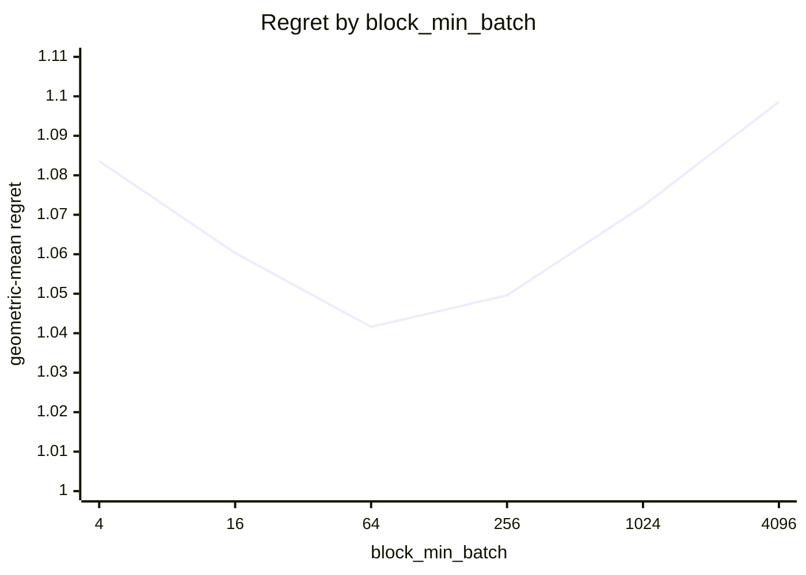
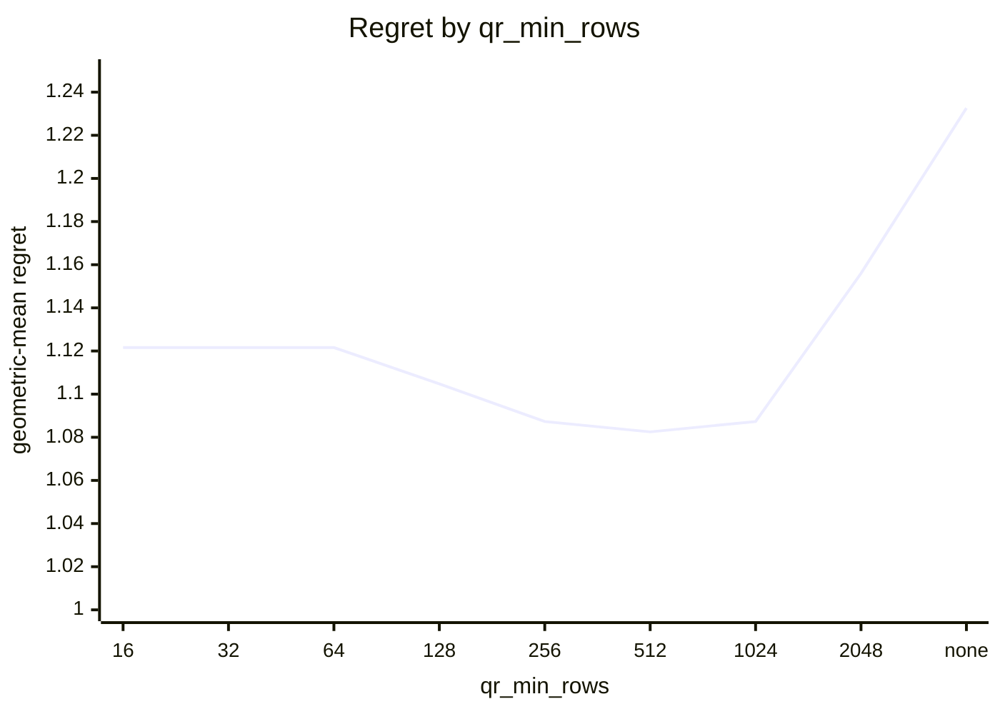
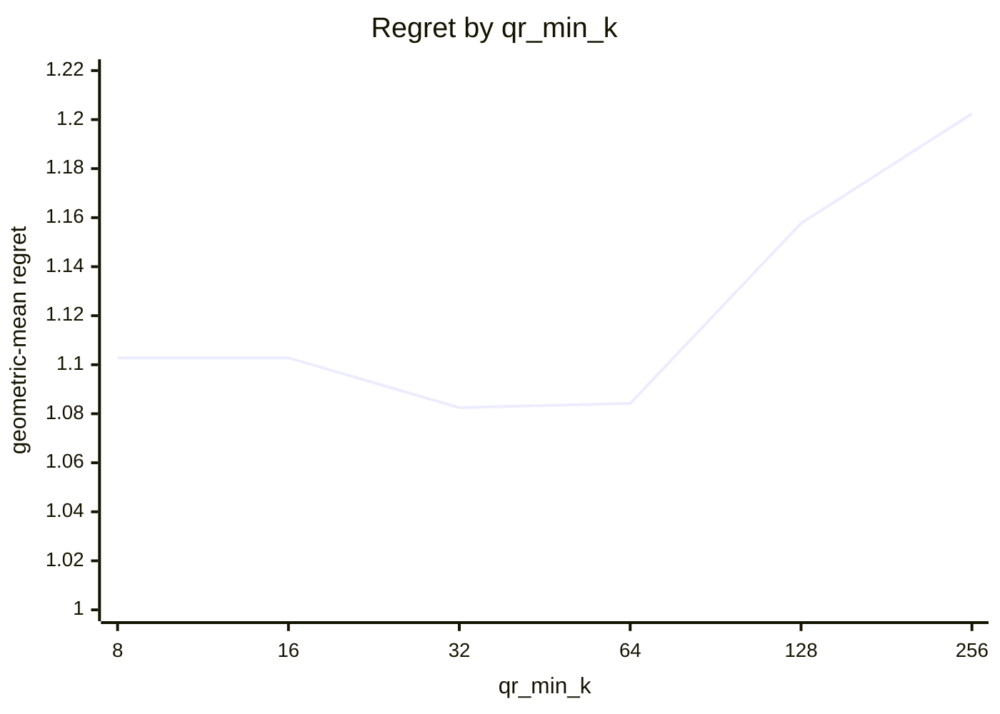
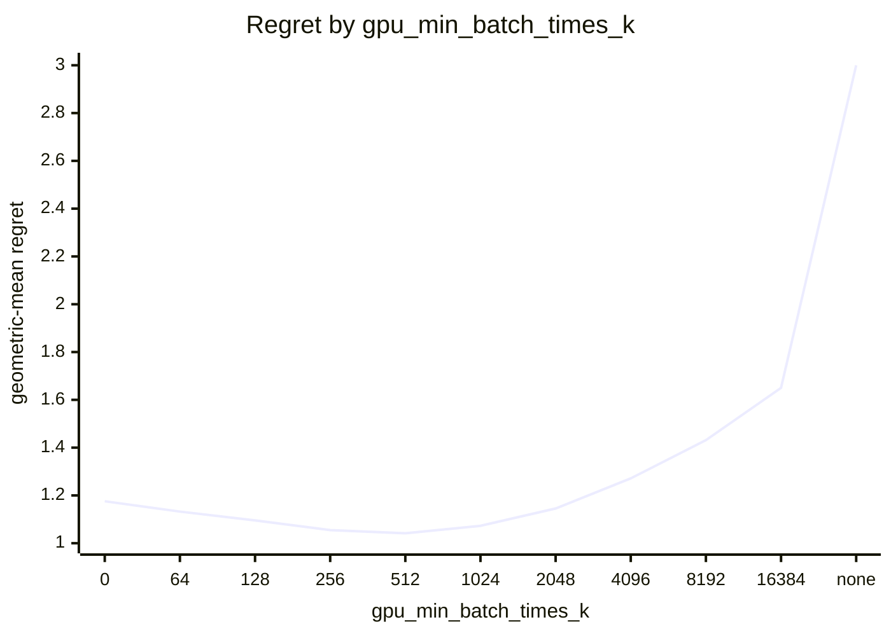
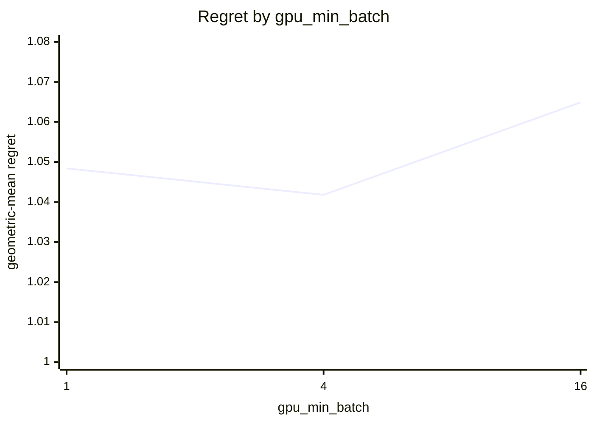
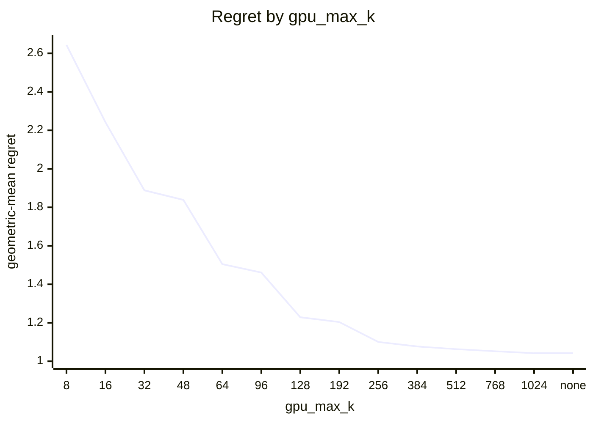

# SVD routing on Apple M5 Pro (20 GPU cores)

What every section and number below means: [reading-reports.md](https://github.com/c0rmac/metal-linalg/blob/main/docs/reading-reports.md).

Cost model scaled to this device from one probe point: block x0.30, cpu x0.67, jacobi x0.16, qr x0.26, qrblock x0.33 (1.00 is an M1).

Machine state: load 1.6/18 at the start, load 1.7/18 at the end; power mains.

Probe point after the sweep relative to before it: block x0.98, cpu x1.00, jacobi x0.93, qr x1.00, qrblock x0.98 (stable).

Generated by `tuning/tune_svd.py` from 263 (shape, batch) points, 41 shapes with M >= N, batch in [1, 4, 16, 64, 256, 1024, 4096], five backends, two or more passes, min-of-repeats.

## Answer

Row for `kTuned[]` in `src/svd.mm`:

```cpp
// device, GPU cores,   qr_min_rows, qr_min_k,   block_min_k, block_min_k_batched, block_min_batch,   gpu_max_k, gpu_min_batch_times_k, gpu_min_batch
{"Apple M5 Pro", 20,   512, 32,   192, 64, 64,   1024, 512, 4},
```

To try it without rebuilding:

```sh
SVD_QR_MIN_ROWS=512 SVD_QR_MIN_K=32 SVD_BLOCK_MIN_K=192 SVD_BLOCK_MIN_K_BATCHED=64 SVD_BLOCK_MIN_BATCH=64 SVD_GPU_MAX_K=1024 SVD_GPU_MIN_BATCH_TIMES_K=512 SVD_GPU_MIN_BATCH=4
```

The policy in effect on this device came from `default:untuned-device (Apple M5 Pro)`. Against the best measured backend at every point the fitted rule scores 1.0418 geometric-mean regret, worst 2.03x, 31 of 263 points losing more than 10%, and 1.130x the oracle's total time.

## Warnings

- chosen rule loses more than 25% at 2048x64 batch=4 (cpu, 2.03x), 1024x32 batch=16 (qr, 1.98x), 512x32 batch=16 (qr, 1.70x), 512x32 batch=64 (qr, 1.69x), 256x32 batch=4096 (jacobi, 1.66x), 512x32 batch=4096 (qr, 1.56x), 128x128 batch=4 (jacobi, 1.47x), 512x32 batch=1024 (qr, 1.45x) ...
- GPU split loses more than 25% against the best GPU backend at 1024x32 batch=16 (qr, 1.98x), 512x32 batch=16 (qr, 1.70x), 512x32 batch=64 (qr, 1.69x), 1024x32 batch=1 (qr, 1.68x), 1024x32 batch=4 (qr, 1.68x), 256x32 batch=4096 (jacobi, 1.66x), 512x32 batch=4 (qr, 1.61x), 512x32 batch=4096 (qr, 1.56x) ...
- chosen rule picks a backend that was not timed at 1 points; the cost model's guess counts in the geomean and is kept out of the worst case: 256x128 batch=4096 (block, est 3.02x)
- the GPU is still ahead of the CPU at the largest k measured (1024): gpu_max_k is a lower bound, rerun with a larger --max-k to find the cap
- this device has no entry in kTuned[]: it is running the untuned default; paste the row above into src/svd.mm
- the fitted policy differs from the one in effect (default:untuned-device (Apple M5 Pro))

## Stage 1: which GPU backend

Scored against the best GPU backend at each of the 263 points, as if there were no CPU: this is the rule a forced-GPU call (`SVD_DEVICE=gpu`) follows, and what a GPU with more cores will lean on. Two independent choices. Precondition with QR iff the long side is at least `qr_min_rows`, the short side at least `qr_min_k`, and the long side at least twice the short one. Block kernel iff the short side is at least `block_min_k`, or at least `block_min_k_batched` in a batch of `block_min_batch` or more.

| rule | geomean regret | worst | >10% | total time / oracle | est. picks |
|---|---|---|---|---|---|
| policy in effect ('512', '64', '192', 'none', 'none') | 1.1262 | 3.80x | 54 | 1.657 | 3 |
| fitted ('512', '32', '192', '64', '64') | 1.0416 | 1.98x | 30 | 1.128 | 1 |

Without a batch term, 6 of 588 combinations are within 0.5% of the best geomean: qr_min_rows 256 .. 512, qr_min_k 32 .. 64, block_min_k 96 .. 128.

With the batch term adopted (below), 2 combinations are within 0.5% of the best: block_min_k 192 .. 256, block_min_k_batched 64 .. 64, block_min_batch 64 .. 64. The curves vary one constant around the chosen combination.


| block_min_k | 32 | 48 | 64 | 96 | 128 | 192 | 256 | 384 | 512 | 768 | 1024 | none |
|---|---|---|---|---|---|---|---|---|---|---|---|---|
| geomean | 1.2404 | 1.1301 | 1.1076 | 1.0599 | 1.0519 | 1.0416 | 1.0461 | 1.0838 | 1.1019 | 1.1261 | 1.1572 | 1.1832 |
| worst | 7.14x | 3.95x | 3.11x | 1.98x | 1.98x | 1.98x | 1.98x | 2.67x | 5.01x | 8.10x | 15.86x | 25.02x |


| block_min_k_batched | 32 | 48 | 64 | 96 | 128 |
|---|---|---|---|---|---|
| geomean | 1.0683 | 1.0479 | 1.0416 | 1.0637 | 1.0732 |
| worst | 3.24x | 2.23x | 1.98x | 2.29x | 2.29x |



| block_min_batch | 4 | 16 | 64 | 256 | 1024 | 4096 |
|---|---|---|---|---|---|---|
| geomean | 1.0836 | 1.0603 | 1.0416 | 1.0496 | 1.0722 | 1.0986 |
| worst | 2.97x | 2.25x | 1.98x | 2.19x | 2.42x | 2.45x |



| qr_min_rows | 16 | 32 | 64 | 128 | 256 | 512 | 1024 | 2048 | none |
|---|---|---|---|---|---|---|---|---|---|
| geomean | 1.1216 | 1.1216 | 1.1216 | 1.1048 | 1.0873 | 1.0825 | 1.0873 | 1.1560 | 1.2326 |
| worst | 3.09x | 3.09x | 3.09x | 2.36x | 1.99x | 2.29x | 2.29x | 5.31x | 5.83x |



| qr_min_k | 8 | 16 | 32 | 64 | 128 | 256 |
|---|---|---|---|---|---|---|
| geomean | 1.1028 | 1.1028 | 1.0825 | 1.0842 | 1.1577 | 1.2024 |
| worst | 3.87x | 3.87x | 2.29x | 3.80x | 5.83x | 5.83x |

Held-out check of a batch-dependent block crossover (block from a smaller k once the batch is large enough), fitted on 150 points and scored on the other 113; the verdict is a bootstrap over the test points.

| rule | fitted on train | train geomean | test geomean | test worst | verdict |
|---|---|---|---|---|---|
| one block crossover | ["512", "64", "128", "none", "none"] | 1.0490 | 1.1363 | 3.80x | baseline |
| batch-dependent block crossover | {"block_min": "128", "block_lo": "32", "batch_hi": "256"} | 1.0233 | 1.0449 | 1.61x | **justified** (better in 100% of resamples, median gain 8.7%) |

Best GPU backend per point (`J` whole-matrix kernel, `B` block kernel, `j` and `b` the same after QR), then what the rule picks:

```
      M x N  \ batch     1     4    16    64   256  1024  4096
      4 x 4               J     J     J     J     J     J     J
      8 x 8               J     J     J     J     J     J     J
     16 x 8               J     J     J     J     J     J     J
     32 x 8               J     J     J     J     J     J     J
     64 x 8               J     J     J     J     J     J     J
    128 x 8               J     J     J     J     J     J     J
    256 x 8               J     J     J     J     J     J     J
     16 x 16              J     J     J     J     J     J     J
     32 x 16              J     J     J     J     J     J     J
     64 x 16              J     J     J     J     J     J     J
    128 x 16              J     J     J     J     J     J     J
    256 x 16              J     J     J     J     J     J     J
    512 x 16              J     J     J     J     J     J     J
     32 x 32              J     J     J     J     J     J     B
     64 x 32              J     J     J     J     J     B     B
    128 x 32              J     J     J     J     J     J     B
    256 x 32              J     J     J     J     J     B     B
    512 x 32              J     J     J     J     B     B     B
   1024 x 32              J     J     J     j     B     B     B
     48 x 48              J     J     J     J     J     J     J
     64 x 64              J     J     J     J     B     B     B
    128 x 64              J     J     J     J     B     B     B
    256 x 64              J     J     J     J     B     B     B
    512 x 64              J     J     J     B     B     B     B
   1024 x 64              j     j     j     j     B     B     b
   2048 x 64              j     j     j     j     B     B     j
     96 x 96              J     J     J     J     B     B     B
    128 x 128             J     J     J     B     B     B     B
    256 x 128             j     J     J     B     b     b     b
    512 x 128             j     j     j     B     b     b     b
   1024 x 128             j     j     j     b     b     b     b
   2048 x 128             j     j     j     b     b     b     .
    192 x 192             B     B     B     B     B     B     .
    256 x 256             B     B     B     B     B     .     .
    512 x 256             B     B     b     b     b     .     .
   1024 x 256             b     b     b     b     b     .     .
   2048 x 256             b     b     b     b     b     .     .
    384 x 384             B     B     B     B     B     .     .
    512 x 512             B     B     B     B     .     .     .
    768 x 768             B     B     B     .     .     .     .
   1024 x 1024            B     B     .     .     .     .     .
```

```
      M x N  \ batch     1     4    16    64   256  1024  4096
      4 x 4               J     J     J     J     J     J     J
      8 x 8               J     J     J     J     J     J     J
     16 x 8               J     J     J     J     J     J     J
     32 x 8               J     J     J     J     J     J     J
     64 x 8               J     J     J     J     J     J     J
    128 x 8               J     J     J     J     J     J     J
    256 x 8               J     J     J     J     J     J     J
     16 x 16              J     J     J     J     J     J     J
     32 x 16              J     J     J     J     J     J     J
     64 x 16              J     J     J     J     J     J     J
    128 x 16              J     J     J     J     J     J     J
    256 x 16              J     J     J     J     J     J     J
    512 x 16              J     J     J     J     J     J     J
     32 x 32              J     J     J     J     J     J     J
     64 x 32              J     J     J     J     J     J     J
    128 x 32              J     J     J     J     J     J     J
    256 x 32              J     J     J     J     J     J     J
    512 x 32              j     j     j     j     j     j     j
   1024 x 32              j     j     j     j     j     j     j
     48 x 48              J     J     J     J     J     J     J
     64 x 64              J     J     J     B     B     B     B
    128 x 64              J     J     J     B     B     B     B
    256 x 64              J     J     J     B     B     B     B
    512 x 64              j     j     j     b     b     b     b
   1024 x 64              j     j     j     b     b     b     b
   2048 x 64              j     j     j     b     b     b     b
     96 x 96              J     J     J     B     B     B     B
    128 x 128             J     J     J     B     B     B     B
    256 x 128             J     J     J     B     B     B     B
    512 x 128             j     j     j     b     b     b     b
   1024 x 128             j     j     j     b     b     b     b
   2048 x 128             j     j     j     b     b     b     .
    192 x 192             B     B     B     B     B     B     .
    256 x 256             B     B     B     B     B     .     .
    512 x 256             b     b     b     b     b     .     .
   1024 x 256             b     b     b     b     b     .     .
   2048 x 256             b     b     b     b     b     .     .
    384 x 384             B     B     B     B     B     .     .
    512 x 512             B     B     B     B     .     .     .
    768 x 768             B     B     B     .     .     .     .
   1024 x 1024            B     B     .     .     .     .     .
```

## Stage 2: GPU or CPU

GPU iff `k <= gpu_max_k`, `batch * k >= gpu_min_batch_times_k` and `batch >= gpu_min_batch`, with k = min(M, N), scored against the best of all five backends. `worst` is over the points where the chosen backend was timed; a pick the cost model had to guess is listed in the warnings instead.

| rule | geomean regret | worst | >10% | total time / oracle | est. picks |
|---|---|---|---|---|---|
| oracle (best per point) | 1.0000 | 1.00x | 0 | 1.000 | 0 |
| policy in effect ('64', '1024', '1') | 1.5455 | 9.10x | 95 | 8.331 | 18 |
| fitted ('1024', '512', '4') | 1.0418 | 2.03x | 31 | 1.130 | 1 |

2 of 462 combinations are within 0.5% of the best geomean: gpu_max_k 1024 .. none, gpu_min_batch_times_k 512 .. 512, gpu_min_batch 4 .. 4.



| gpu_min_batch_times_k | 0 | 64 | 128 | 256 | 512 | 1024 | 2048 | 4096 | 8192 | 16384 | none |
|---|---|---|---|---|---|---|---|---|---|---|---|
| geomean | 1.1757 | 1.1324 | 1.0954 | 1.0551 | 1.0418 | 1.0728 | 1.1454 | 1.2713 | 1.4314 | 1.6502 | 3.1417 |
| worst | 7.13x | 5.58x | 3.90x | 3.09x | 2.03x | 4.39x | 6.16x | 6.63x | 8.35x | 11.70x | 17.69x |



| gpu_min_batch | 1 | 4 | 16 |
|---|---|---|---|
| geomean | 1.0484 | 1.0418 | 1.0649 |
| worst | 2.03x | 2.03x | 2.29x |



| gpu_max_k | 8 | 16 | 32 | 48 | 64 | 96 | 128 | 192 | 256 | 384 | 512 | 768 | 1024 | none |
|---|---|---|---|---|---|---|---|---|---|---|---|---|---|---|
| geomean | 2.6438 | 2.2423 | 1.8884 | 1.8387 | 1.5049 | 1.4610 | 1.2287 | 1.2040 | 1.1006 | 1.0770 | 1.0632 | 1.0522 | 1.0418 | 1.0418 |
| worst | 12.28x | 11.01x | 10.74x | 10.74x | 9.10x | 9.10x | 5.89x | 5.89x | 2.03x | 2.03x | 2.03x | 2.03x | 2.03x | 2.03x |

Held-out check of a per-k boundary against the product rule, fitted on 150 points and scored on the other 113; the verdict is a bootstrap.

| rule | fitted on train | train geomean | test geomean | test worst | verdict |
|---|---|---|---|---|---|
| product rule | [1024, 256, 4] | 1.0458 | 1.0676 | 3.09x | baseline |
| per-k table | {"min_batch_by_k": {"4": 1024, "8": 64, "16": 64, "32": 16, "48": 64, "64": 4, "96": 16, "128": 4, "192": 16, "256": 4, "384": 4, "512": 4, "768": 16, "1024": 4}} | 1.0340 | 1.0591 | 2.26x | rejected (better in 68% of resamples, median gain 0.7%) |

Best backend per point (`c` CPU, `J` whole-matrix kernel, `B` block kernel, `j` and `b` the same after QR, `.` not measured), what the rule picks, and the speedup of the best GPU backend over the CPU:

```
      M x N  \ batch     1     4    16    64   256  1024  4096
      4 x 4               c     c     c     c     J     J     J
      8 x 8               c     c     c     J     J     J     J
     16 x 8               c     c     c     J     J     J     J
     32 x 8               c     c     c     J     J     J     J
     64 x 8               c     c     c     J     J     J     J
    128 x 8               c     c     c     J     J     J     J
    256 x 8               c     c     c     J     J     J     J
     16 x 16              c     c     c     J     J     J     J
     32 x 16              c     c     c     J     J     J     J
     64 x 16              c     c     c     J     J     J     J
    128 x 16              c     c     c     J     J     J     J
    256 x 16              c     c     c     J     J     J     J
    512 x 16              c     c     c     J     J     J     J
     32 x 32              c     c     c     J     J     J     B
     64 x 32              c     c     J     J     J     B     B
    128 x 32              c     c     J     J     J     J     B
    256 x 32              c     c     J     J     J     B     B
    512 x 32              c     c     J     J     B     B     B
   1024 x 32              c     J     J     j     B     B     B
     48 x 48              c     c     J     J     J     J     J
     64 x 64              c     c     J     J     B     B     B
    128 x 64              c     c     J     J     B     B     B
    256 x 64              c     J     J     J     B     B     B
    512 x 64              c     J     J     B     B     B     B
   1024 x 64              c     j     j     j     B     B     b
   2048 x 64              c     j     j     j     B     B     j
     96 x 96              c     c     J     J     B     B     B
    128 x 128             c     c     J     B     B     B     B
    256 x 128             c     c     J     B     b     b     b
    512 x 128             c     j     j     B     b     b     b
   1024 x 128             c     j     j     b     b     b     b
   2048 x 128             c     j     j     b     b     b     .
    192 x 192             c     c     B     B     B     B     .
    256 x 256             c     B     B     B     B     .     .
    512 x 256             c     B     b     b     b     .     .
   1024 x 256             c     b     b     b     b     .     .
   2048 x 256             c     b     b     b     b     .     .
    384 x 384             c     B     B     B     B     .     .
    512 x 512             c     B     B     B     .     .     .
    768 x 768             c     B     B     .     .     .     .
   1024 x 1024            c     B     .     .     .     .     .
```

```
      M x N  \ batch     1     4    16    64   256  1024  4096
      4 x 4               c     c     c     c     J     J     J
      8 x 8               c     c     c     J     J     J     J
     16 x 8               c     c     c     J     J     J     J
     32 x 8               c     c     c     J     J     J     J
     64 x 8               c     c     c     J     J     J     J
    128 x 8               c     c     c     J     J     J     J
    256 x 8               c     c     c     J     J     J     J
     16 x 16              c     c     c     J     J     J     J
     32 x 16              c     c     c     J     J     J     J
     64 x 16              c     c     c     J     J     J     J
    128 x 16              c     c     c     J     J     J     J
    256 x 16              c     c     c     J     J     J     J
    512 x 16              c     c     c     J     J     J     J
     32 x 32              c     c     J     J     J     J     J
     64 x 32              c     c     J     J     J     J     J
    128 x 32              c     c     J     J     J     J     J
    256 x 32              c     c     J     J     J     J     J
    512 x 32              c     c     j     j     j     j     j
   1024 x 32              c     c     j     j     j     j     j
     48 x 48              c     c     J     J     J     J     J
     64 x 64              c     c     J     B     B     B     B
    128 x 64              c     c     J     B     B     B     B
    256 x 64              c     c     J     B     B     B     B
    512 x 64              c     c     j     b     b     b     b
   1024 x 64              c     c     j     b     b     b     b
   2048 x 64              c     c     j     b     b     b     b
     96 x 96              c     c     J     B     B     B     B
    128 x 128             c     J     J     B     B     B     B
    256 x 128             c     J     J     B     B     B     B
    512 x 128             c     j     j     b     b     b     b
   1024 x 128             c     j     j     b     b     b     b
   2048 x 128             c     j     j     b     b     b     .
    192 x 192             c     B     B     B     B     B     .
    256 x 256             c     B     B     B     B     .     .
    512 x 256             c     b     b     b     b     .     .
   1024 x 256             c     b     b     b     b     .     .
   2048 x 256             c     b     b     b     b     .     .
    384 x 384             c     B     B     B     B     .     .
    512 x 512             c     B     B     B     .     .     .
    768 x 768             c     B     B     .     .     .     .
   1024 x 1024            c     B     .     .     .     .     .
```

```
      M x N  \ batch     1     4    16    64   256  1024  4096
      4 x 4            0.10  0.14  0.31  0.59  2.26  7.96  6.65
      8 x 8            0.17  0.21  0.28  1.51  4.44  3.82 13.20
     16 x 8            0.24  0.22  0.55  2.40  5.44  4.63 12.48
     32 x 8            0.14  0.36  0.51  1.06  2.16 11.70 17.69
     64 x 8            0.26  0.19  0.45  2.33  4.39  9.19 15.80
    128 x 8            0.12  0.37  0.26  2.52  5.36  9.26 11.36
    256 x 8            0.11  0.30  0.34  3.14  5.38  8.57 11.60
     16 x 16           0.13  0.18  0.32  2.87  2.75  8.68 10.51
     32 x 16           0.24  0.51  0.73  3.77  6.67 11.92 12.28
     64 x 16           0.26  0.26  0.73  3.80  7.12 10.73 12.00
    128 x 16           0.15  0.47  0.59  4.62  4.75 10.19 11.36
    256 x 16           0.08  0.21  0.51  1.86  7.07  7.52  9.96
    512 x 16           0.27  0.23  0.74  2.44  4.82  4.74  5.04
     32 x 32           0.22  0.67  0.77  3.82  6.07  7.25  9.41
     64 x 32           0.27  0.60  1.47  4.77  7.01  8.83 11.01
    128 x 32           0.25  0.30  1.15  4.92  7.13  8.48  9.89
    256 x 32           0.14  0.77  1.57  6.05  6.03  8.72 10.36
    512 x 32           0.23  0.80  2.78  5.13  5.63  8.24  9.14
   1024 x 32           0.35  1.27  4.39  4.00  6.06  8.73  8.87
     48 x 48           0.16  0.48  2.08  3.73  4.97  5.26  5.54
     64 x 64           0.21  0.68  1.54  3.59  4.75  6.07  6.46
    128 x 64           0.30  0.98  2.43  5.08  7.40  8.83  9.28
    256 x 64           0.34  1.13  2.84  5.04  8.18  9.28  9.74
    512 x 64           0.32  1.17  4.28  5.17  7.68  9.06  9.01
   1024 x 64           0.39  1.39  4.29  6.72  8.84  9.83   gpu
   2048 x 64           0.59  2.03  6.16  8.35 10.12 10.74   gpu
     96 x 96           0.20  0.75  2.66  3.29  5.12  5.21   gpu
    128 x 128          0.18  0.68  2.61  3.56  4.43  4.53   gpu
    256 x 128          0.26  0.95  3.52  5.68  6.32  6.65   gpu
    512 x 128          0.32  1.18  4.07  6.13  7.14   gpu   gpu
   1024 x 128          0.45  1.65  5.53  7.31  8.42   gpu   gpu
   2048 x 128          0.59  2.14  6.63  8.17  9.10   gpu     .
    192 x 192          0.20  0.75  2.25  3.24  3.23   gpu     .
    256 x 256          0.30  1.07  2.49  2.99   gpu     .     .
    512 x 256          0.49  1.70  3.75  4.36   gpu     .     .
   1024 x 256          0.54  1.75  4.49  5.20   gpu     .     .
   2048 x 256          0.66  2.29  5.38  5.89   gpu     .     .
    384 x 384          0.34  1.07  1.84   gpu   gpu     .     .
    512 x 512          0.51  1.37  1.68   gpu     .     .     .
    768 x 768          0.53  1.20   gpu     .     .     .     .
   1024 x 1024         0.69   gpu     .     .     .     .     .
```

## Noise floor

Pass-to-pass ratio, 950 measurements: median 1.010, p90 1.207, max 3.85.

| runtime | n | median | p90 | max |
|---|---|---|---|---|
| <1 ms | 156 | 1.079 | 2.454 | 3.85 |
| 1-3 ms | 160 | 1.020 | 1.353 | 1.93 |
| 3-10 ms | 209 | 1.006 | 1.024 | 1.37 |
| 10-30 ms | 121 | 1.007 | 1.029 | 1.20 |
| 30-100 ms | 125 | 1.007 | 1.024 | 1.09 |
| >100 ms | 179 | 1.006 | 1.023 | 1.40 |
