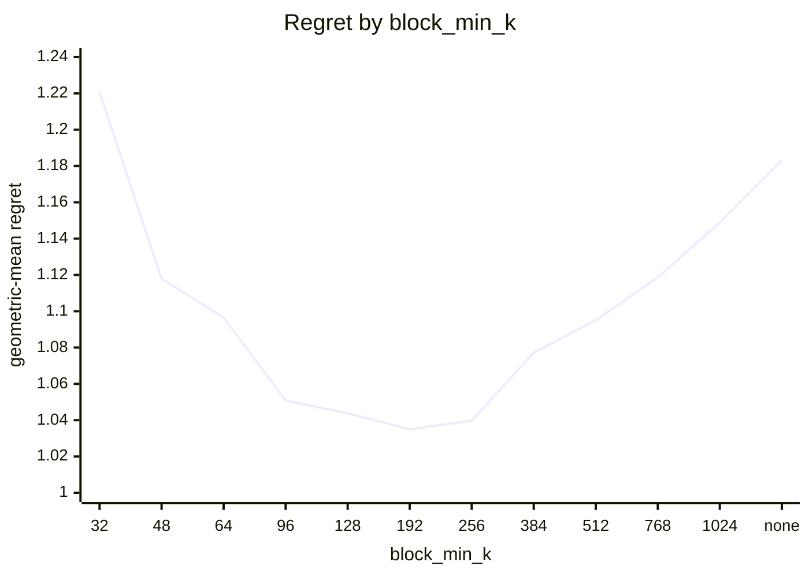
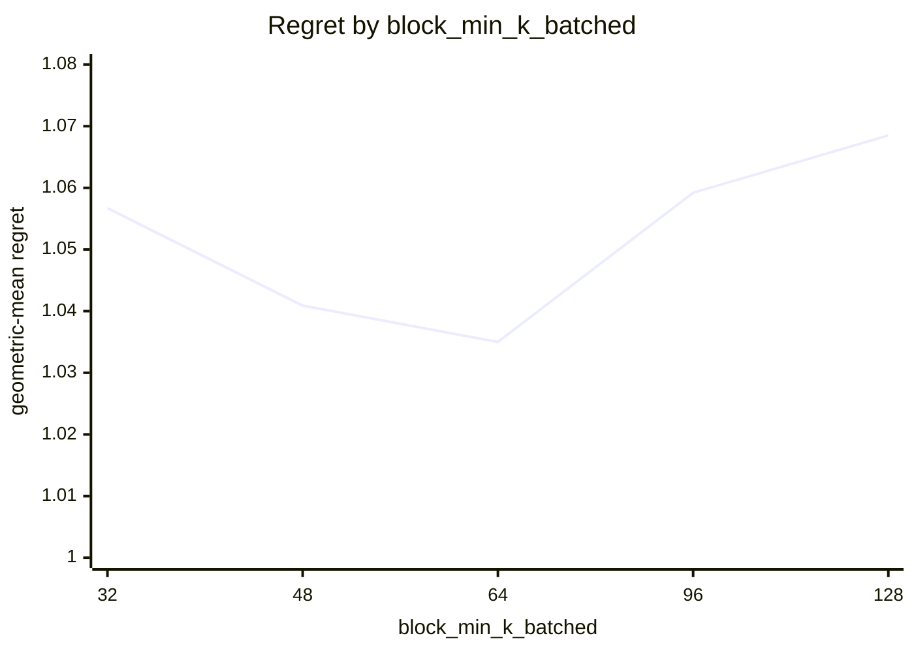
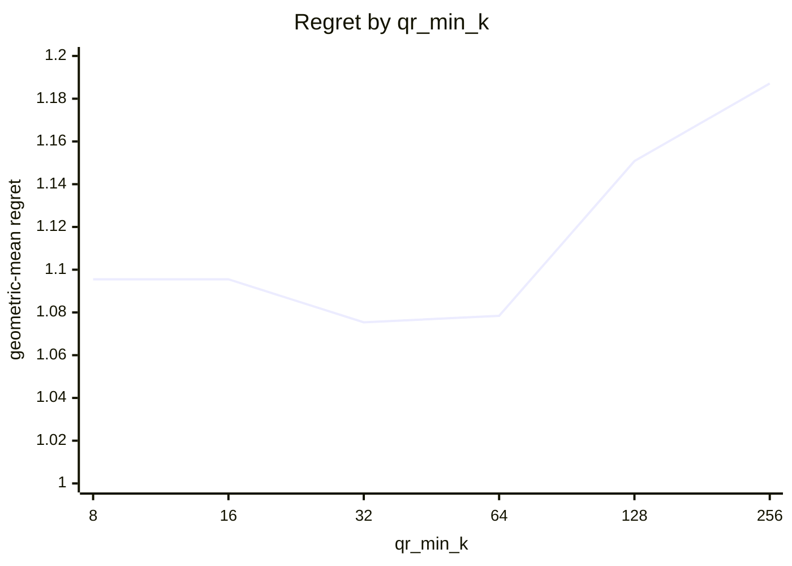
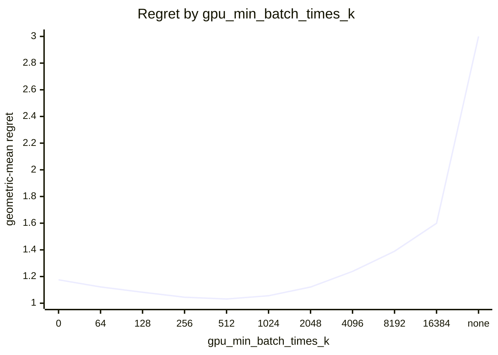
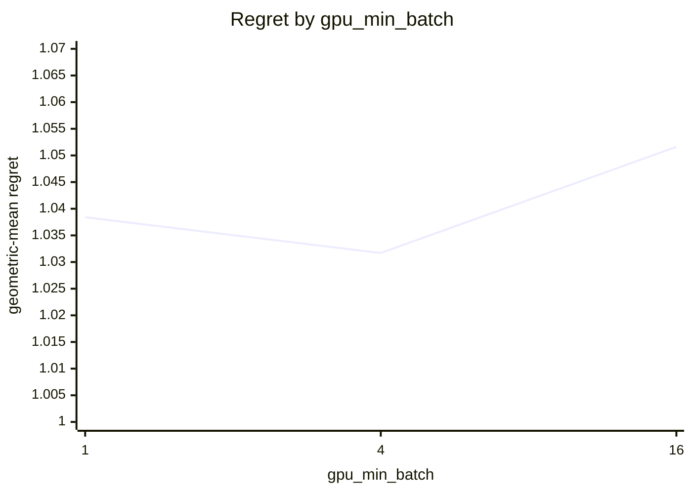

# SVD routing on Apple M5 Pro (20 GPU cores)

What every section and number below means: [reading-reports.md](https://github.com/c0rmac/metal-linalg/blob/main/docs/reading-reports.md).

Cost model scaled to this device from one probe point: block x0.30, cpu x0.67, jacobi x0.16, qr x0.26, qrblock x0.33 (1.00 is an M1).

Machine state: load 1.6/18 at the start, load 1.7/18 at the end; power mains.

Probe point after the sweep relative to before it: block x0.98, cpu x1.00, jacobi x0.93, qr x1.00, qrblock x0.98 (stable).

Generated by `tuning/tune_svd.py` from 267 (shape, batch) points, 41 shapes with M >= N, batch in [1, 4, 16, 64, 256, 1024, 4096], five backends, two or more passes, min-of-repeats.

Combined from 2 submissions (20260930-27b6c2, 20261001-c76e82): each submission's fastest pass, then the median across submissions. The noise floor is per submission.

## Answer

Row for `kTuned[]` in `src/svd.mm`:

```cpp
// device, GPU cores,   qr_min_rows, qr_min_k,   block_min_k, block_min_k_batched, block_min_batch,   gpu_max_k, gpu_min_batch_times_k, gpu_min_batch
{"Apple M5 Pro", 20,   512, 32,   192, 64, 64,   1024, 512, 4},
```

To try it without rebuilding:

```sh
SVD_QR_MIN_ROWS=512 SVD_QR_MIN_K=32 SVD_BLOCK_MIN_K=192 SVD_BLOCK_MIN_K_BATCHED=64 SVD_BLOCK_MIN_BATCH=64 SVD_GPU_MAX_K=1024 SVD_GPU_MIN_BATCH_TIMES_K=512 SVD_GPU_MIN_BATCH=4
```

The policy in effect on this device came from `default:untuned-device (Apple M5 Pro)`. Against the best measured backend at every point the fitted rule scores 1.0317 geometric-mean regret, worst 1.80x, 27 of 267 points losing more than 10%, and 1.021x the oracle's total time.

## Warnings

- chosen rule loses more than 25% at 1024x32 batch=16 (qr, 1.80x), 512x32 batch=16 (qr, 1.75x), 256x32 batch=4096 (jacobi, 1.68x), 512x32 batch=4096 (qr, 1.58x), 512x32 batch=64 (qr, 1.55x), 512x32 batch=1024 (qr, 1.48x), 2048x64 batch=4 (cpu, 1.48x), 1024x32 batch=4096 (qr, 1.45x) ...
- GPU split loses more than 25% against the best GPU backend at 1024x32 batch=16 (qr, 1.80x), 512x32 batch=16 (qr, 1.75x), 256x32 batch=4096 (jacobi, 1.68x), 512x32 batch=4 (qr, 1.60x), 512x32 batch=4096 (qr, 1.58x), 512x32 batch=64 (qr, 1.55x), 1024x32 batch=1 (qr, 1.55x), 1024x32 batch=4 (qr, 1.54x) ...
- the GPU is still ahead of the CPU at the largest k measured (1024): gpu_max_k is a lower bound, rerun with a larger --max-k to find the cap
- this device has no entry in kTuned[]: it is running the untuned default; paste the row above into src/svd.mm
- the fitted policy differs from the one in effect (default:untuned-device (Apple M5 Pro))

## Stage 1: which GPU backend

Scored against the best GPU backend at each of the 267 points, as if there were no CPU: this is the rule a forced-GPU call (`SVD_DEVICE=gpu`) follows, and what a GPU with more cores will lean on. Two independent choices. Precondition with QR iff the long side is at least `qr_min_rows`, the short side at least `qr_min_k`, and the long side at least twice the short one. Block kernel iff the short side is at least `block_min_k`, or at least `block_min_k_batched` in a batch of `block_min_batch` or more.

| rule | geomean regret | worst | >10% | total time / oracle | est. picks |
|---|---|---|---|---|---|
| policy in effect ('512', '64', '192', 'none', 'none') | 1.1233 | 3.69x | 55 | 1.394 | 1 |
| fitted ('512', '32', '192', '64', '64') | 1.0350 | 1.80x | 29 | 1.021 | 0 |

Without a batch term, 5 of 588 combinations are within 0.5% of the best geomean: qr_min_rows 256 .. 512, qr_min_k 32 .. 64, block_min_k 96 .. 128.

With the batch term adopted (below), 2 combinations are within 0.5% of the best: block_min_k 192 .. 256, block_min_k_batched 64 .. 64, block_min_batch 64 .. 64. The curves vary one constant around the chosen combination.



| block_min_k | 32 | 48 | 64 | 96 | 128 | 192 | 256 | 384 | 512 | 768 | 1024 | none |
|---|---|---|---|---|---|---|---|---|---|---|---|---|
| geomean | 1.2208 | 1.1179 | 1.0966 | 1.0509 | 1.0438 | 1.0350 | 1.0397 | 1.0772 | 1.0950 | 1.1186 | 1.1489 | 1.1832 |
| worst | 7.01x | 3.67x | 3.00x | 1.88x | 1.80x | 1.80x | 1.80x | 2.72x | 5.06x | 8.17x | 15.86x | 24.77x |



| block_min_k_batched | 32 | 48 | 64 | 96 | 128 |
|---|---|---|---|---|---|
| geomean | 1.0567 | 1.0409 | 1.0350 | 1.0592 | 1.0685 |
| worst | 2.81x | 2.09x | 1.80x | 2.36x | 2.36x |


| block_min_batch | 4 | 16 | 64 | 256 | 1024 | 4096 |
|---|---|---|---|---|---|---|
| geomean | 1.0745 | 1.0537 | 1.0350 | 1.0442 | 1.0670 | 1.0935 |
| worst | 2.77x | 2.11x | 1.80x | 2.26x | 2.45x | 2.47x |


| qr_min_rows | 16 | 32 | 64 | 128 | 256 | 512 | 1024 | 2048 | none |
|---|---|---|---|---|---|---|---|---|---|
| geomean | 1.1125 | 1.1125 | 1.1125 | 1.1000 | 1.0846 | 1.0754 | 1.0865 | 1.1482 | 1.2236 |
| worst | 2.13x | 2.13x | 2.13x | 2.06x | 2.08x | 2.36x | 2.36x | 5.36x | 5.81x |



| qr_min_k | 8 | 16 | 32 | 64 | 128 | 256 |
|---|---|---|---|---|---|---|
| geomean | 1.0955 | 1.0955 | 1.0754 | 1.0784 | 1.1508 | 1.1871 |
| worst | 3.50x | 3.50x | 2.36x | 3.69x | 5.81x | 5.81x |

Held-out check of a batch-dependent block crossover (block from a smaller k once the batch is large enough), fitted on 151 points and scored on the other 116; the verdict is a bootstrap over the test points.

| rule | fitted on train | train geomean | test geomean | test worst | verdict |
|---|---|---|---|---|---|
| one block crossover | ["512", "64", "128", "none", "none"] | 1.0560 | 1.1134 | 3.69x | baseline |
| batch-dependent block crossover | {"block_min": "128", "block_lo": "32", "batch_hi": "256"} | 1.0215 | 1.0296 | 1.68x | **justified** (better in 100% of resamples, median gain 8.0%) |

Best GPU backend per point (`J` whole-matrix kernel, `B` block kernel, `j` and `b` the same after QR), then what the rule picks:

```
      M x N  \ batch     1     4    16    64   256  1024  4096
      4 x 4               J     J     J     J     J     J     J
      8 x 8               J     J     J     J     J     J     J
     16 x 8               J     J     J     J     J     J     J
     32 x 8               J     J     J     J     J     J     J
     64 x 8               J     J     J     J     J     J     J
    128 x 8               J     J     J     J     J     J     J
    256 x 8               J     J     J     J     J     J     J
     16 x 16              J     J     J     J     J     J     J
     32 x 16              J     J     J     J     J     J     J
     64 x 16              J     J     J     J     J     J     J
    128 x 16              J     J     J     J     J     J     J
    256 x 16              J     J     J     J     J     J     J
    512 x 16              J     J     J     J     J     J     J
     32 x 32              J     J     J     J     J     B     B
     64 x 32              J     J     J     J     J     B     B
    128 x 32              J     J     J     J     J     J     B
    256 x 32              J     J     J     J     B     B     B
    512 x 32              J     J     J     J     B     B     B
   1024 x 32              J     J     J     j     B     B     B
     48 x 48              J     J     J     J     J     J     J
     64 x 64              J     J     J     J     B     B     B
    128 x 64              J     J     J     J     B     B     B
    256 x 64              J     J     J     B     B     B     B
    512 x 64              J     J     J     B     B     B     B
   1024 x 64              j     j     j     j     B     B     B
   2048 x 64              j     j     j     j     B     B     j
     96 x 96              J     J     J     B     B     B     B
    128 x 128             J     J     J     B     B     B     B
    256 x 128             j     J     J     B     b     b     B
    512 x 128             j     j     j     B     b     b     b
   1024 x 128             j     j     j     b     b     b     b
   2048 x 128             j     j     j     b     b     b     .
    192 x 192             B     B     B     B     B     B     .
    256 x 256             B     B     B     B     B     B     .
    512 x 256             B     B     b     b     b     b     .
   1024 x 256             b     b     b     b     b     b     .
   2048 x 256             b     b     b     b     b     .     .
    384 x 384             B     B     B     B     B     .     .
    512 x 512             B     B     B     B     .     .     .
    768 x 768             B     B     B     .     .     .     .
   1024 x 1024            B     B     B     .     .     .     .
```

```
      M x N  \ batch     1     4    16    64   256  1024  4096
      4 x 4               J     J     J     J     J     J     J
      8 x 8               J     J     J     J     J     J     J
     16 x 8               J     J     J     J     J     J     J
     32 x 8               J     J     J     J     J     J     J
     64 x 8               J     J     J     J     J     J     J
    128 x 8               J     J     J     J     J     J     J
    256 x 8               J     J     J     J     J     J     J
     16 x 16              J     J     J     J     J     J     J
     32 x 16              J     J     J     J     J     J     J
     64 x 16              J     J     J     J     J     J     J
    128 x 16              J     J     J     J     J     J     J
    256 x 16              J     J     J     J     J     J     J
    512 x 16              J     J     J     J     J     J     J
     32 x 32              J     J     J     J     J     J     J
     64 x 32              J     J     J     J     J     J     J
    128 x 32              J     J     J     J     J     J     J
    256 x 32              J     J     J     J     J     J     J
    512 x 32              j     j     j     j     j     j     j
   1024 x 32              j     j     j     j     j     j     j
     48 x 48              J     J     J     J     J     J     J
     64 x 64              J     J     J     B     B     B     B
    128 x 64              J     J     J     B     B     B     B
    256 x 64              J     J     J     B     B     B     B
    512 x 64              j     j     j     b     b     b     b
   1024 x 64              j     j     j     b     b     b     b
   2048 x 64              j     j     j     b     b     b     b
     96 x 96              J     J     J     B     B     B     B
    128 x 128             J     J     J     B     B     B     B
    256 x 128             J     J     J     B     B     B     B
    512 x 128             j     j     j     b     b     b     b
   1024 x 128             j     j     j     b     b     b     b
   2048 x 128             j     j     j     b     b     b     .
    192 x 192             B     B     B     B     B     B     .
    256 x 256             B     B     B     B     B     B     .
    512 x 256             b     b     b     b     b     b     .
   1024 x 256             b     b     b     b     b     b     .
   2048 x 256             b     b     b     b     b     .     .
    384 x 384             B     B     B     B     B     .     .
    512 x 512             B     B     B     B     .     .     .
    768 x 768             B     B     B     .     .     .     .
   1024 x 1024            B     B     B     .     .     .     .
```

## Stage 2: GPU or CPU

GPU iff `k <= gpu_max_k`, `batch * k >= gpu_min_batch_times_k` and `batch >= gpu_min_batch`, with k = min(M, N), scored against the best of all five backends. `worst` is over the points where the chosen backend was timed; a pick the cost model had to guess is listed in the warnings instead.

| rule | geomean regret | worst | >10% | total time / oracle | est. picks |
|---|---|---|---|---|---|
| oracle (best per point) | 1.0000 | 1.00x | 0 | 1.000 | 0 |
| policy in effect ('64', '1024', '1') | 1.5630 | 7.00x | 97 | 9.144 | 22 |
| fitted ('1024', '512', '4') | 1.0317 | 1.80x | 27 | 1.021 | 0 |

2 of 462 combinations are within 0.5% of the best geomean: gpu_max_k 1024 .. none, gpu_min_batch_times_k 512 .. 512, gpu_min_batch 4 .. 4.



| gpu_min_batch_times_k | 0 | 64 | 128 | 256 | 512 | 1024 | 2048 | 4096 | 8192 | 16384 | none |
|---|---|---|---|---|---|---|---|---|---|---|---|
| geomean | 1.1755 | 1.1219 | 1.0823 | 1.0448 | 1.0317 | 1.0560 | 1.1214 | 1.2384 | 1.3896 | 1.5991 | 3.1039 |
| worst | 9.97x | 6.32x | 3.59x | 2.56x | 1.80x | 3.70x | 4.76x | 5.86x | 8.08x | 11.96x | 17.69x |



| gpu_min_batch | 1 | 4 | 16 |
|---|---|---|---|
| geomean | 1.0384 | 1.0317 | 1.0516 |
| worst | 1.95x | 1.80x | 1.94x |


| gpu_max_k | 8 | 16 | 32 | 48 | 64 | 96 | 128 | 192 | 256 | 384 | 512 | 768 | 1024 | none |
|---|---|---|---|---|---|---|---|---|---|---|---|---|---|---|
| geomean | 2.6234 | 2.2212 | 1.8871 | 1.8374 | 1.5292 | 1.4831 | 1.2540 | 1.2293 | 1.0992 | 1.0762 | 1.0627 | 1.0519 | 1.0317 | 1.0317 |
| worst | 14.39x | 11.00x | 8.70x | 8.70x | 7.00x | 7.00x | 4.83x | 4.83x | 1.81x | 1.80x | 1.80x | 1.80x | 1.80x | 1.80x |

Held-out check of a per-k boundary against the product rule, fitted on 151 points and scored on the other 116; the verdict is a bootstrap.

| rule | fitted on train | train geomean | test geomean | test worst | verdict |
|---|---|---|---|---|---|
| product rule | [1024, 512, 4] | 1.0311 | 1.0326 | 1.68x | baseline |
| per-k table | {"min_batch_by_k": {"4": 1024, "8": 64, "16": 64, "32": 16, "48": 64, "64": 4, "96": 16, "128": 4, "192": 16, "256": 4, "384": 4, "512": 4, "768": 16, "1024": 4}} | 1.0312 | 1.0467 | 2.14x | rejected (better in 6% of resamples, median gain -1.3%) |

Best backend per point (`c` CPU, `J` whole-matrix kernel, `B` block kernel, `j` and `b` the same after QR, `.` not measured), what the rule picks, and the speedup of the best GPU backend over the CPU:

```
      M x N  \ batch     1     4    16    64   256  1024  4096
      4 x 4               c     c     c     c     J     J     J
      8 x 8               c     c     c     J     J     J     J
     16 x 8               c     c     c     J     J     J     J
     32 x 8               c     c     c     J     J     J     J
     64 x 8               c     c     c     J     J     J     J
    128 x 8               c     c     c     J     J     J     J
    256 x 8               c     c     c     J     J     J     J
     16 x 16              c     c     c     J     J     J     J
     32 x 16              c     c     c     J     J     J     J
     64 x 16              c     c     c     J     J     J     J
    128 x 16              c     c     c     J     J     J     J
    256 x 16              c     c     c     J     J     J     J
    512 x 16              c     c     c     J     J     J     J
     32 x 32              c     c     c     J     J     B     B
     64 x 32              c     c     J     J     J     B     B
    128 x 32              c     c     J     J     J     J     B
    256 x 32              c     c     J     J     B     B     B
    512 x 32              c     c     J     J     B     B     B
   1024 x 32              c     J     J     j     B     B     B
     48 x 48              c     c     J     J     J     J     J
     64 x 64              c     c     J     J     B     B     B
    128 x 64              c     c     J     J     B     B     B
    256 x 64              c     c     J     B     B     B     B
    512 x 64              c     c     J     B     B     B     B
   1024 x 64              c     j     j     j     B     B     B
   2048 x 64              c     j     j     j     B     B     j
     96 x 96              c     c     J     B     B     B     B
    128 x 128             c     c     J     B     B     B     B
    256 x 128             c     c     J     B     b     b     B
    512 x 128             c     j     j     B     b     b     b
   1024 x 128             c     j     j     b     b     b     b
   2048 x 128             c     j     j     b     b     b     .
    192 x 192             c     c     B     B     B     B     .
    256 x 256             c     B     B     B     B     B     .
    512 x 256             c     B     b     b     b     b     .
   1024 x 256             c     b     b     b     b     b     .
   2048 x 256             c     b     b     b     b     .     .
    384 x 384             c     B     B     B     B     .     .
    512 x 512             c     B     B     B     .     .     .
    768 x 768             c     B     B     .     .     .     .
   1024 x 1024            c     B     B     .     .     .     .
```

```
      M x N  \ batch     1     4    16    64   256  1024  4096
      4 x 4               c     c     c     c     J     J     J
      8 x 8               c     c     c     J     J     J     J
     16 x 8               c     c     c     J     J     J     J
     32 x 8               c     c     c     J     J     J     J
     64 x 8               c     c     c     J     J     J     J
    128 x 8               c     c     c     J     J     J     J
    256 x 8               c     c     c     J     J     J     J
     16 x 16              c     c     c     J     J     J     J
     32 x 16              c     c     c     J     J     J     J
     64 x 16              c     c     c     J     J     J     J
    128 x 16              c     c     c     J     J     J     J
    256 x 16              c     c     c     J     J     J     J
    512 x 16              c     c     c     J     J     J     J
     32 x 32              c     c     J     J     J     J     J
     64 x 32              c     c     J     J     J     J     J
    128 x 32              c     c     J     J     J     J     J
    256 x 32              c     c     J     J     J     J     J
    512 x 32              c     c     j     j     j     j     j
   1024 x 32              c     c     j     j     j     j     j
     48 x 48              c     c     J     J     J     J     J
     64 x 64              c     c     J     B     B     B     B
    128 x 64              c     c     J     B     B     B     B
    256 x 64              c     c     J     B     B     B     B
    512 x 64              c     c     j     b     b     b     b
   1024 x 64              c     c     j     b     b     b     b
   2048 x 64              c     c     j     b     b     b     b
     96 x 96              c     c     J     B     B     B     B
    128 x 128             c     J     J     B     B     B     B
    256 x 128             c     J     J     B     B     B     B
    512 x 128             c     j     j     b     b     b     b
   1024 x 128             c     j     j     b     b     b     b
   2048 x 128             c     j     j     b     b     b     .
    192 x 192             c     B     B     B     B     B     .
    256 x 256             c     B     B     B     B     B     .
    512 x 256             c     b     b     b     b     b     .
   1024 x 256             c     b     b     b     b     b     .
   2048 x 256             c     b     b     b     b     .     .
    384 x 384             c     B     B     B     B     .     .
    512 x 512             c     B     B     B     .     .     .
    768 x 768             c     B     B     .     .     .     .
   1024 x 1024            c     B     B     .     .     .     .
```

```
      M x N  \ batch     1     4    16    64   256  1024  4096
      4 x 4            0.06  0.10  0.24  0.61  2.13  5.69  9.82
      8 x 8            0.09  0.15  0.28  1.17  4.51  5.39 13.26
     16 x 8            0.12  0.16  0.46  1.66  3.60  6.71 14.52
     32 x 8            0.10  0.20  0.45  1.30  3.04 11.96 17.69
     64 x 8            0.17  0.16  0.43  1.78  3.35 10.34 15.56
    128 x 8            0.09  0.24  0.36  1.88  5.56  9.44 12.10
    256 x 8            0.08  0.21  0.47  2.18  5.86  8.85 11.24
     16 x 16           0.08  0.16  0.39  2.43  3.76  8.55 10.39
     32 x 16           0.13  0.32  0.77  2.46  8.08 12.96 14.39
     64 x 16           0.14  0.25  0.79  2.52  7.95 11.95 13.76
    128 x 16           0.11  0.38  0.70  4.76  6.13 10.84 12.32
    256 x 16           0.08  0.21  0.63  1.85  7.33  8.36 10.13
    512 x 16           0.24  0.27  0.81  3.50  5.14  4.96  4.98
     32 x 32           0.19  0.52  0.84  3.53  6.13  7.54  9.60
     64 x 32           0.19  0.65  1.16  4.92  7.05  9.27 11.00
    128 x 32           0.21  0.39  1.37  4.97  7.30  8.60  9.93
    256 x 32           0.16  0.81  2.01  5.34  5.69  7.80  9.11
    512 x 32           0.22  0.81  2.79  4.56  5.00  7.21  7.88
   1024 x 32           0.28  1.06  3.70  3.45  5.08  6.95  7.00
     48 x 48           0.15  0.53  2.14  3.82  5.07  5.33  5.64
     64 x 64           0.20  0.68  1.92  3.61  4.98  6.12  6.50
    128 x 64           0.27  0.92  2.77  4.90  7.25  8.35  8.70
    256 x 64           0.27  0.95  2.82  4.35  6.99  7.80  8.17
    512 x 64           0.26  0.98  3.57  4.55  6.47  7.45  7.34
   1024 x 64           0.32  1.12  3.47  4.99  6.53  7.19   gpu
   2048 x 64           0.43  1.48  4.35  5.67  6.88  7.19   gpu
     96 x 96           0.22  0.83  2.95  3.70  5.56  5.71   gpu
    128 x 128          0.19  0.75  2.91  4.04  4.86  4.97   gpu
    256 x 128          0.26  0.94  3.47  5.72  6.23  6.53   gpu
    512 x 128          0.30  1.10  3.83  5.55  6.39   gpu   gpu
   1024 x 128          0.39  1.41  4.67  6.09  6.87   gpu   gpu
   2048 x 128          0.48  1.72  5.06  6.27  7.00   gpu     .
    192 x 192          0.20  0.76  2.28  3.20  3.19   gpu     .
    256 x 256          0.30  1.08  2.47  2.94   gpu   gpu     .
    512 x 256          0.46  1.60  3.52  3.99   gpu   gpu     .
   1024 x 256          0.48  1.59  3.90  4.52   gpu   gpu     .
   2048 x 256          0.56  1.94  4.47  4.83   gpu     .     .
    384 x 384          0.34  1.06  1.81   gpu   gpu     .     .
    512 x 512          0.51  1.36  1.68   gpu     .     .     .
    768 x 768          0.52  1.17   gpu     .     .     .     .
   1024 x 1024         0.68   gpu   gpu     .     .     .     .
```

## Noise floor

Pass-to-pass ratio, 1917 measurements: median 1.008, p90 1.088, max 3.85.

| runtime | n | median | p90 | max |
|---|---|---|---|---|
| <1 ms | 359 | 1.039 | 1.768 | 3.85 |
| 1-3 ms | 312 | 1.014 | 1.229 | 1.93 |
| 3-10 ms | 385 | 1.006 | 1.022 | 1.37 |
| 10-30 ms | 239 | 1.005 | 1.022 | 1.20 |
| 30-100 ms | 248 | 1.006 | 1.021 | 1.15 |
| >100 ms | 374 | 1.006 | 1.028 | 1.40 |
