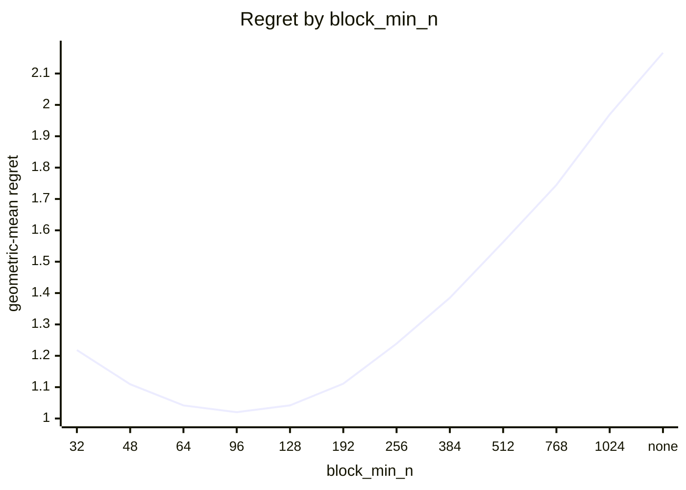
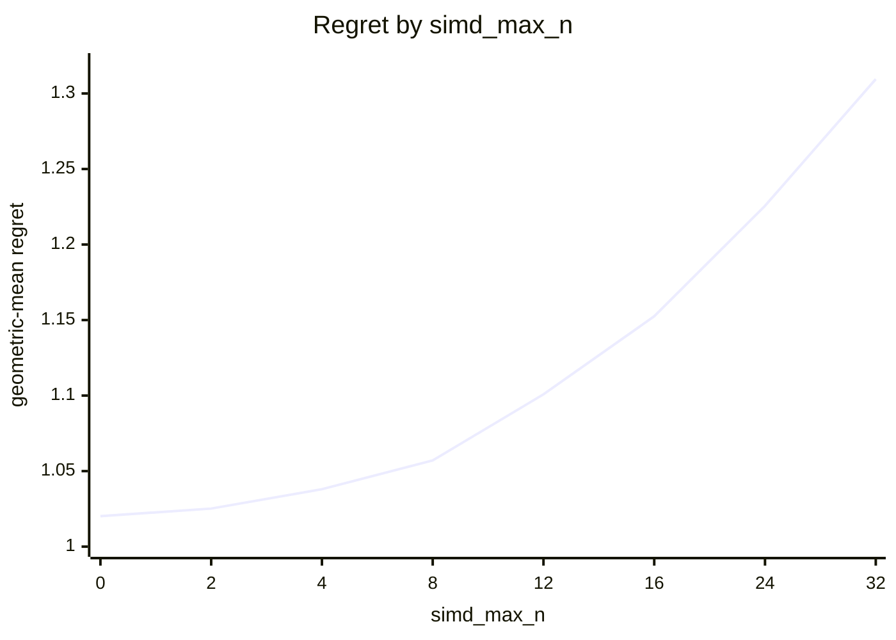
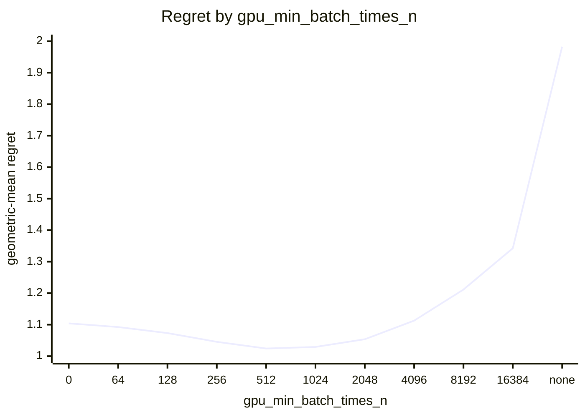
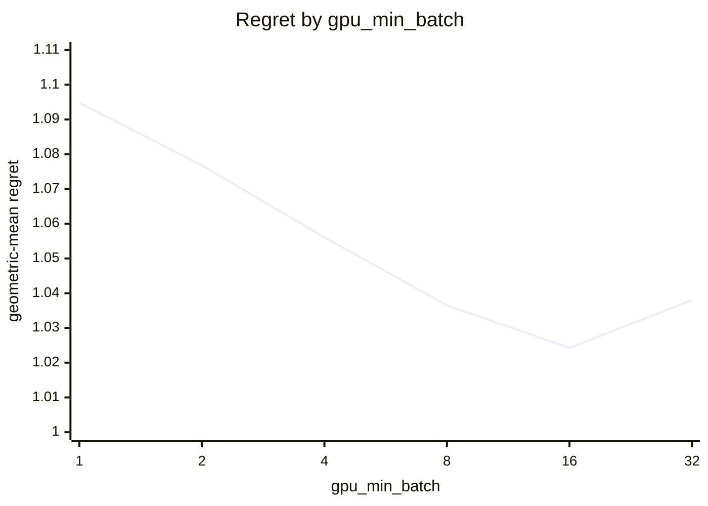
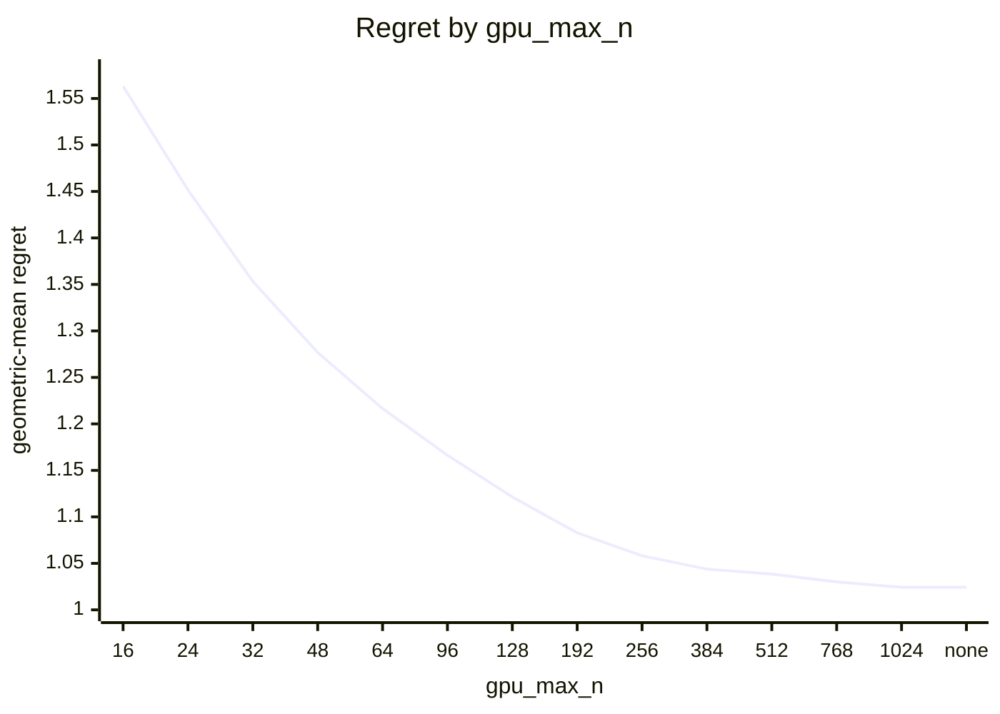

# Eigensolver routing on Apple M5 Pro (20 GPU cores)

Cost model scaled to this device from one probe point: block x0.14, cpu x0.93, whole-matrix x1.00 (1.00 is an M1).

Machine state: load 1.8/18 at the start, load 1.6/18 at the end; power mains.

Probe point after the sweep relative to before it: block x1.00, cpu x1.01, tg x1.00 (stable).

Generated by `tuning/tune_eigh.py` from 197 (N, batch) points, N in [2, 4, 8, 12, 16, 24, 32, 48, 64, 96, 128, 192, 256, 384, 512, 768, 1024], batch in [1, 2, 4, 8, 16, 32, 64, 128, 256, 512, 1024, 2048, 4096], four backends, two or more passes, min-of-repeats.

## Answer

Row for `kTuned[]` in `src/eigh.mm`:

```cpp
// device, GPU cores,   simd_max_n, block_min_n, block_min_n_batched, block_min_batch,   gpu_max_n, gpu_min_batch_times_n, gpu_min_batch
{"Apple M5 Pro", 20,   0, 96, 0, 0,   1024, 512, 16},
```

To try it without rebuilding:

```sh
EIGH_SIMD_MAX_N=0 EIGH_BLOCK_MIN_N=96 EIGH_BLOCK_MIN_N_BATCHED=0 EIGH_BLOCK_MIN_BATCH=0 EIGH_GPU_MAX_N=1024 EIGH_GPU_MIN_BATCH_TIMES_N=512 EIGH_GPU_MIN_BATCH=16
```

The policy in effect on this device came from `tuned:Apple M5 Pro`. It matches the fitted one.

Against the best measured backend at every point the whole rule scores 1.0243 geometric-mean regret, worst 1.93x, 15 of 197 points losing more than 10%, and 1.017x the oracle's total time. The decision is fitted in two stages, below, because the CPU routing would otherwise hide the GPU backend crossover.

## Warnings

- chosen rule loses more than 25% at N=2 batch=256 (tg, 1.93x), N=768 batch=16 (block, 1.69x), N=4 batch=128 (tg, 1.58x), N=64 batch=4096 (tg, 1.52x), N=64 batch=2048 (tg, 1.45x), N=64 batch=1024 (tg, 1.45x), N=2 batch=512 (tg, 1.42x), N=64 batch=512 (tg, 1.39x) ...
- GPU split loses more than 25% against the best GPU backend at N=64 batch=4096 (tg, 1.52x), N=96 batch=8 (block, 1.50x), N=96 batch=2 (block, 1.49x), N=96 batch=4 (block, 1.48x), N=96 batch=1 (block, 1.46x), N=64 batch=2048 (tg, 1.45x), N=64 batch=1024 (tg, 1.45x), N=64 batch=512 (tg, 1.39x) ...
- the GPU is still ahead of the CPU at the largest N measured (1024): gpu_max_n is a lower bound, rerun with --max-n 1024 to find the cap

## Stage 1: which GPU backend

Scored against the best *GPU* backend at each of the 197 points, as if there were no CPU: this is the rule a forced-GPU call (`EIGH_DEVICE=gpu`) and the `detail` entry points follow, and it is what a GPU with more cores will lean on.

| rule | geomean regret | worst | >10% | total time / oracle | est. picks |
|---|---|---|---|---|---|
| policy in effect ('0', '96', 'none', 'none') | 1.0202 | 1.52x | 11 | 1.005 | 0 |
| fitted ('0', '96', 'none', 'none') | 1.0202 | 1.52x | 11 | 1.005 | 0 |

2 of 96 (simd_max_n, block_min_n) pairs are within 0.5% of the best geomean: simd_max_n 0 .. 2, block_min_n 96 .. 96.



| block_min_n | 32 | 48 | 64 | 96 | 128 | 192 | 256 | 384 | 512 | 768 | 1024 | none |
|---|---|---|---|---|---|---|---|---|---|---|---|---|
| geomean | 1.2182 | 1.1093 | 1.0418 | 1.0202 | 1.0419 | 1.1109 | 1.2389 | 1.3848 | 1.5624 | 1.7446 | 1.9695 | 2.1660 |
| worst | 9.33x | 5.05x | 2.94x | 1.52x | 1.88x | 2.22x | 4.42x | 5.73x | 9.81x | 15.69x | 15.69x | 15.69x |



| simd_max_n | 0 | 2 | 4 | 8 | 12 | 16 | 24 | 32 |
|---|---|---|---|---|---|---|---|---|
| geomean | 1.0202 | 1.0252 | 1.0380 | 1.0571 | 1.1008 | 1.1525 | 1.2256 | 1.3095 |
| worst | 1.52x | 1.52x | 2.41x | 2.98x | 4.73x | 5.17x | 5.39x | 6.50x |

Held-out check of a batch-dependent crossover (block from a lower N once the batch is large enough). Fitted on 106 points, scored on the other 91; the verdict is a bootstrap over the test points.

| rule | fitted on train | train geomean | test geomean | test worst | verdict |
|---|---|---|---|---|---|
| two constants | [0, 96, 1000000000, 1000000000] | 1.0178 | 1.0229 | 1.52x | baseline |
| batch-dependent block crossover | {"block_lo": 64, "batch_hi": 256} | 1.0067 | 1.0066 | 1.67x | rejected (better in 93% of resamples, median gain 1.6%) |

Best GPU backend per point (`s` simd, `t` threadgroup, `B` block), then what the split picks:

```
  N \ batch     1     2     4     8    16    32    64   128   256   512  1024  2048  4096
          2     t     t     t     s     t     t     s     s     t     s     t     t     t
          4     t     t     t     t     t     t     t     s     t     t     t     t     t
          8     t     t     t     t     t     s     s     s     t     t     t     t     t
         12     t     t     t     t     t     t     t     t     t     t     t     t     t
         16     t     t     t     t     t     t     t     t     t     t     t     t     t
         24     t     t     t     t     t     t     t     t     t     t     t     t     t
         32     t     t     t     t     t     t     t     t     t     t     t     t     t
         48     t     t     t     t     t     t     t     t     t     t     t     t     t
         64     t     t     t     t     t     t     t     t     B     B     B     B     B
         96     t     t     t     t     t     t     B     B     B     B     B     B     B
        128     B     B     B     B     B     B     B     B     B     B     B     B     B
        192     B     B     B     B     B     B     B     B     B     B     B     B     B
        256     B     B     B     B     B     B     B     B     B     B     B     .     .
        384     B     B     B     B     B     B     B     B     B     B     .     .     .
        512     B     B     B     B     B     B     B     B     .     .     .     .     .
        768     B     B     B     B     B     B     B     .     .     .     .     .     .
       1024     B     B     B     B     B     .     .     .     .     .     .     .     .
```

```
  N \ batch     1     2     4     8    16    32    64   128   256   512  1024  2048  4096
          2     t     t     t     t     t     t     t     t     t     t     t     t     t
          4     t     t     t     t     t     t     t     t     t     t     t     t     t
          8     t     t     t     t     t     t     t     t     t     t     t     t     t
         12     t     t     t     t     t     t     t     t     t     t     t     t     t
         16     t     t     t     t     t     t     t     t     t     t     t     t     t
         24     t     t     t     t     t     t     t     t     t     t     t     t     t
         32     t     t     t     t     t     t     t     t     t     t     t     t     t
         48     t     t     t     t     t     t     t     t     t     t     t     t     t
         64     t     t     t     t     t     t     t     t     t     t     t     t     t
         96     B     B     B     B     B     B     B     B     B     B     B     B     B
        128     B     B     B     B     B     B     B     B     B     B     B     B     B
        192     B     B     B     B     B     B     B     B     B     B     B     B     B
        256     B     B     B     B     B     B     B     B     B     B     B     .     .
        384     B     B     B     B     B     B     B     B     B     B     .     .     .
        512     B     B     B     B     B     B     B     B     .     .     .     .     .
        768     B     B     B     B     B     B     B     .     .     .     .     .     .
       1024     B     B     B     B     B     .     .     .     .     .     .     .     .
```

## Stage 2: GPU or CPU

Given the split above, GPU iff `N <= gpu_max_n`, `batch * N >= gpu_min_batch_times_n` and `batch >= gpu_min_batch`, scored against the best of all four backends. `worst` is over the points where the chosen backend was timed; a pick the cost model had to guess is listed in the warnings instead.

| rule | geomean regret | worst | >10% | total time / oracle | est. picks |
|---|---|---|---|---|---|
| oracle (best per point) | 1.0000 | 1.00x | 0 | 1.000 | 0 |
| policy in effect ('1024', '512', '16') | 1.0243 | 1.93x | 15 | 1.017 | 0 |
| fitted ('1024', '512', '16') | 1.0243 | 1.93x | 15 | 1.017 | 0 |

4 of 924 combinations are within 0.5% of the best geomean: gpu_max_n 1024 .. none, gpu_min_batch_times_n 512 .. 1024, gpu_min_batch 16 .. 16.



| gpu_min_batch_times_n | 0 | 64 | 128 | 256 | 512 | 1024 | 2048 | 4096 | 8192 | 16384 | none |
|---|---|---|---|---|---|---|---|---|---|---|---|
| geomean | 1.1040 | 1.0926 | 1.0733 | 1.0456 | 1.0243 | 1.0293 | 1.0538 | 1.1129 | 1.2115 | 1.3427 | 1.9828 |
| worst | 7.72x | 6.14x | 5.33x | 3.85x | 1.93x | 2.13x | 3.56x | 5.34x | 7.56x | 11.13x | 19.94x |



| gpu_min_batch | 1 | 2 | 4 | 8 | 16 | 32 |
|---|---|---|---|---|---|---|
| geomean | 1.0948 | 1.0768 | 1.0561 | 1.0365 | 1.0243 | 1.0380 |
| worst | 3.34x | 3.34x | 3.34x | 2.48x | 1.93x | 1.93x |



| gpu_max_n | 16 | 24 | 32 | 48 | 64 | 96 | 128 | 192 | 256 | 384 | 512 | 768 | 1024 | none |
|---|---|---|---|---|---|---|---|---|---|---|---|---|---|---|
| geomean | 1.5633 | 1.4517 | 1.3533 | 1.2768 | 1.2165 | 1.1663 | 1.1214 | 1.0828 | 1.0582 | 1.0438 | 1.0385 | 1.0301 | 1.0243 | 1.0243 |
| worst | 10.92x | 8.58x | 5.56x | 5.56x | 3.67x | 2.87x | 2.28x | 1.97x | 1.93x | 1.93x | 1.93x | 1.93x | 1.93x | 1.93x |

Held-out check of a per-N boundary (a lookup table of the smallest batch at which the GPU wins, per N) against the product rule. Fitted on 106 points, scored on the other 91.

| rule | fitted on train | train geomean | test geomean | test worst | verdict |
|---|---|---|---|---|---|
| product rule | [1024, 512, 16] | 1.0199 | 1.0294 | 1.93x | baseline |
| per-N table | {"min_batch_by_n": {"2": 1024, "4": 512, "8": 128, "12": 64, "16": 32, "24": 16, "32": 16, "48": 64, "64": 64, "96": 32, "128": 32, "192": 16, "256": 8, "384": 8, "512": 8, "768": 64, "1024": 16}} | 1.0074 | 1.0484 | 2.30x | rejected (better in 18% of resamples, median gain -1.7%) |

Best backend per point (`c` CPU, `s` simd, `t` threadgroup, `B` block, `.` not measured), what the whole rule picks, and the speedup of the best GPU backend over the CPU:

```
  N \ batch     1     2     4     8    16    32    64   128   256   512  1024  2048  4096
          2     c     c     c     c     c     c     c     c     c     c     t     t     t
          4     c     c     c     c     c     c     c     c     t     t     t     t     t
          8     c     c     c     c     c     c     c     s     t     t     t     t     t
         12     c     c     c     c     c     c     t     t     t     t     t     t     t
         16     c     c     c     c     c     t     t     t     t     t     t     t     t
         24     c     c     c     c     t     t     t     t     t     t     t     t     t
         32     c     c     c     c     t     t     t     t     t     t     t     t     t
         48     c     c     c     c     t     t     t     t     t     t     t     t     t
         64     c     c     c     c     t     t     t     t     B     B     B     B     B
         96     c     c     c     c     t     t     B     B     B     B     B     B     B
        128     c     c     c     c     B     B     B     B     B     B     B     B     B
        192     c     c     c     c     B     B     B     B     B     B     B     B     B
        256     c     c     c     B     B     B     B     B     B     B     B     .     .
        384     c     c     c     B     B     B     B     B     B     B     .     .     .
        512     c     c     c     B     B     c     c     B     .     .     .     .     .
        768     c     c     c     c     c     B     B     .     .     .     .     .     .
       1024     c     c     c     c     B     .     .     .     .     .     .     .     .
```

```
  N \ batch     1     2     4     8    16    32    64   128   256   512  1024  2048  4096
          2     c     c     c     c     c     c     c     c     t     t     t     t     t
          4     c     c     c     c     c     c     c     t     t     t     t     t     t
          8     c     c     c     c     c     c     t     t     t     t     t     t     t
         12     c     c     c     c     c     c     t     t     t     t     t     t     t
         16     c     c     c     c     c     t     t     t     t     t     t     t     t
         24     c     c     c     c     c     t     t     t     t     t     t     t     t
         32     c     c     c     c     t     t     t     t     t     t     t     t     t
         48     c     c     c     c     t     t     t     t     t     t     t     t     t
         64     c     c     c     c     t     t     t     t     t     t     t     t     t
         96     c     c     c     c     B     B     B     B     B     B     B     B     B
        128     c     c     c     c     B     B     B     B     B     B     B     B     B
        192     c     c     c     c     B     B     B     B     B     B     B     B     B
        256     c     c     c     c     B     B     B     B     B     B     B     .     .
        384     c     c     c     c     B     B     B     B     B     B     .     .     .
        512     c     c     c     c     B     B     B     B     .     .     .     .     .
        768     c     c     c     c     B     B     B     .     .     .     .     .     .
       1024     c     c     c     c     B     .     .     .     .     .     .     .     .
```

```
  N \ batch     1     2     4     8    16    32    64   128   256   512  1024  2048  4096
          2  0.15  0.15  0.13  0.14  0.13  0.16  0.22  0.30  0.52  0.75  1.21  3.03  5.24
          4  0.10  0.15  0.12  0.11  0.18  0.19  0.33  0.65  1.21  2.20  4.29  6.95 11.79
          8  0.10  0.11  0.15  0.19  0.31  0.32  0.94  1.39  3.31  5.90  9.77 14.34 19.94
         12  0.11  0.12  0.18  0.27  0.46  0.81  1.52  2.95  4.93  7.56 11.13 12.66 15.71
         16  0.10  0.14  0.21  0.41  0.67  1.29  2.50  4.43  6.51  9.53 11.38 13.95 15.91
         24  0.12  0.21  0.33  0.63  1.17  2.13  3.56  5.34  6.05  8.24  9.44 10.48 10.92
         32  0.14  0.23  0.41  0.79  1.34  2.51  3.12  4.72  5.53  6.97  7.74  8.02  8.58
         48  0.13  0.13  0.44  0.86  1.64  1.57  2.74  3.86  4.62  4.99  5.22  5.40  5.36
         64  0.09  0.24  0.43  0.87  1.14  2.30  2.68  3.28  3.96  4.93  5.29  5.35  5.56
         96  0.08  0.16  0.31  0.60  1.01  1.50  2.17  2.90  3.48  3.51  3.52  3.63  3.67
        128  0.08  0.15  0.30  0.59  1.08  1.78  2.36  2.83  2.87  2.78  2.79  2.83  2.84
        192  0.13  0.25  0.47  0.88  1.50  1.91  2.28  2.19  2.06  2.09  2.12   gpu   gpu
        256  0.19  0.36  0.67  1.15  1.68  1.97  1.96  1.75  1.72  1.74   gpu     .     .
        384  0.22  0.41  0.71  1.11  1.31  1.22  1.12  1.08   gpu   gpu     .     .     .
        512  0.30  0.49  0.81  1.11  1.10  0.97  0.92   gpu     .     .     .     .     .
        768  0.31  0.50  0.70  0.66  0.59   gpu   gpu     .     .     .     .     .     .
       1024  0.40  0.60  0.66  0.57   gpu     .     .     .     .     .     .     .     .
```

## Noise floor

Pass-to-pass ratio (max/min of the same measurement across passes), 563 measurements: median 1.010, p90 1.247, max 3.82. The held-out verdicts use a bootstrap rather than this figure, since a mean over many points is far less noisy than one measurement.

| runtime | n | median | p90 | max |
|---|---|---|---|---|
| <1 ms | 208 | 1.050 | 1.705 | 3.82 |
| 1-3 ms | 70 | 1.021 | 1.298 | 1.56 |
| 3-10 ms | 89 | 1.007 | 1.040 | 1.22 |
| 10-30 ms | 53 | 1.004 | 1.012 | 1.03 |
| 30-100 ms | 58 | 1.005 | 1.015 | 1.04 |
| >100 ms | 85 | 1.004 | 1.014 | 1.02 |
