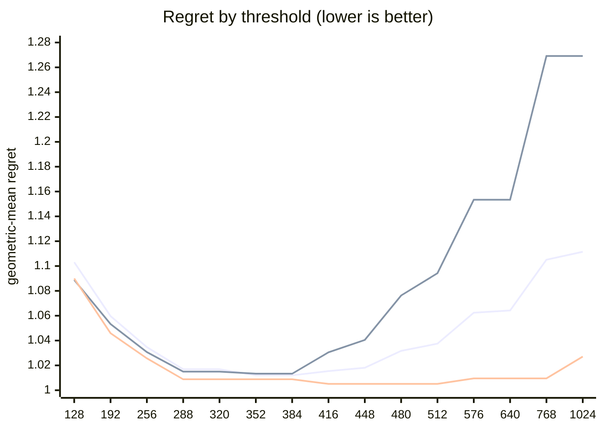

# QR dispatch crossover

Choosing the row threshold that routes a QR factorisation between the
single-threadgroup and grid-parallel Metal backends — and why two earlier
answers, both cross-validated, were wrong.

Measured on an 8-core Apple M1: 421 shapes across four randomised sweeps,
roughly 2,400 timed runs, median timing, two passes each.

---

## The answer

```
M >= 384  ->  qr_streaming_amx_reduced
otherwise ->  qr_unblocked
```

One threshold, on rows only. No batch term, no `N` term.

Against the original five-rule heuristic across all 421 shapes: **97 shapes more
than 15% faster, geometric-mean speedup 1.101x**, five regressions above 10%.
Held-out geometric-mean regret **1.011x** — within about 1% of picking the
fastest backend every time.

*Regret* throughout is how much slower the chosen backend is than the best one
actually measured at that shape. 1.000x would be a perfect oracle.

## The band

The optimum is **flat from 352 to 384 rows**, so the exact value inside it does
not matter. What matters is which side you miss on, and the penalty is not
symmetric.

| threshold | regret | excess |
|---|---|---|
| 128 | 1.1031x | +9.0% |
| 192 | 1.0597x | +4.7% |
| 256 | 1.0347x | +2.2% |
| 320 | 1.0169x | +0.5% |
| **352** | **1.0120x** | **in band** |
| **384** | **1.0120x** | **in band** |
| 416 | 1.0154x | +0.3% |
| 448 | 1.0181x | +0.6% |
| 512 | 1.0375x | +2.5% |
| 640 | 1.0642x | +5.2% |
| 1024 | 1.1115x | +9.8% |

The high side is worse than that table suggests, because it degrades
specifically on *tall* inputs — the shapes easiest to leave out of a benchmark
grid. Adding GPU cores makes the grid-parallel backend relatively stronger and
pushes the true crossover **down**, so an untuned device is safer low than high.

## The decision curve



Series, in order: **pooled** (all 421 shapes) · **tall only** · **square only**.

| threshold | pooled | tall only | square only |
|---|---|---|---|
| 256 | 1.0347 | 1.0307 | 1.0257 |
| 320 | 1.0169 | 1.0150 | 1.0088 |
| 384 | **1.0120** | **1.0133** | 1.0088 |
| 448 | 1.0181 | 1.0405 | 1.0051 |
| 512 | 1.0375 | 1.0942 | 1.0051 |
| 640 | 1.0642 | 1.1534 | 1.0095 |
| 768 | 1.1051 | 1.2691 | 1.0095 |

Read the third column. **A square-only grid is nearly flat from 288 to 768** —
it varies by half a percent across a range where the pooled curve moves by nine.
It had essentially no power to choose a threshold at all, and its shallow
minimum happened to sit at 416–512.

## Why two earlier answers were wrong

Both passed train/test validation on independent datasets. Both were artifacts
of the measurement grid.

**512.** A square-heavy grid put the optimum at 512 with 1.003x geometric-mean
regret — apparently near-perfect. On tall inputs that threshold loses up to
**1.95x**. The curve above shows why it could not be caught: there was no signal
to fit, so the fit found noise.

**A batch term.** `M >= (512 if batch < 16 else 384)` improved worst-case regret
from 1.18x to 1.07x on *two* independently measured datasets. It looked solidly
established. Adding 194 tall and near-square shapes reversed it: **1.025x against
1.011x** for a plain threshold on held-out data. Re-fitted on the pooled set it
becomes `(416 if batch < 8 else 288)` — nothing like the shipped values — and
still loses.

> **Cross-validation cannot rescue a blind grid.** Every check applied — held-out
> splits, two independent sweeps, a measured noise floor, effect sizes far above
> it — was sound *given the sample*. None could detect that the sample never
> probed the region where the rule failed. Grid coverage was the binding
> constraint, not the fitting method.

Coverage of each sweep, and the verdict each one favours on its own:

| sweep | square | tall | wide | near-square | favours |
|---|---|---|---|---|---|
| square-only (exploratory) | 13 | 0 | 0 | 0 | anything 416–768 |
| confirmatory | 13 | 11 | 11 | 4 | two-regime 512/384 |
| boundary | 1 | 15 | 0 | 4 | a lower threshold |
| aspect plane | 3 | 29 | 2 | 14 | flat 384 |
| **pooled** | **157** | **146** | **46** | **72** | **flat 384** |

## Why rows, not `max(M, N)`

`qr_unblocked` gives each matrix a **single threadgroup**, which must sweep `M`
rows for every Householder reflection. `M` is its serial depth; `N` parallelises
across that threadgroup's threads. `qr_streaming_amx_reduced` spreads each
matrix over a grid instead, paying roughly three kernel launches per 32-column
panel.

So a tall matrix and its transpose want opposite backends despite sharing both
`max(M, N)` and `K = min(M, N)`:

| shape | `K` | `qr_unblocked` | `qr_streaming_amx_reduced` | winner |
|---|---|---|---|---|
| 2048 x 64 | 64 | 93.06 ms | 9.40 ms | reduced, **9.9x** |
| 64 x 2048 | 64 | 3.95 ms | 5.79 ms | unblocked, **1.5x** |
| 512 x 32 | 32 | 3.83 ms | 1.92 ms | reduced, **2.0x** |
| 32 x 512 | 32 | 1.45 ms | 1.70 ms | unblocked, **1.2x** |

Measured at batch 16. No rule keyed on `max(M, N)` or `K` can express that:

| feature | best threshold | geomean regret | worst |
|---|---|---|---|
| **M (rows)** | 352 | **1.0120x** | 1.36x |
| max(M, N) | 352 | 1.0403x | 2.31x |
| K = min(M, N) | 256 | 1.1643x | 9.90x |

## Decision surface

Ratio of grid-parallel to single-threadgroup runtime. Below 1.00 the
grid-parallel backend wins.

```
batch 1
      N=32      N=64      N=128     N=256     N=512
      ---------------------------------------------
  128 .  1.21     1.39     1.74     1.66     1.55
  256 ## 0.84  .  1.16     1.49     1.59     1.45
  384 ## 0.66  ## 0.81  .  1.07  .  1.15  .  1.12   <- M >= 384
  512 ###0.47  ## 0.61  ## 0.81  #  0.89  ~  0.95
  640 ###0.39  ###0.46  ## 0.62  ## 0.68  ## 0.72

batch 16
      N=32      N=64      N=128     N=256     N=512
      ---------------------------------------------
  128 .  1.08  .  1.28     1.58  .  1.16  .  1.13
  256 #  0.90  ~  1.00  .  1.11  .  1.14  .  1.09
  384 ## 0.74  ## 0.81  #  0.85  ## 0.85  ~  0.97   <- M >= 384
  512 ###0.51  ###0.59  ## 0.63  ## 0.69  #  0.87
  640 ###0.31  ###0.46  ###0.50  ###0.57  ## 0.73

      ### <0.60   ## <0.85   # <0.95   ~ tie   . <1.30   blank >1.30
```

Two structures are visible. The surface tilts with `M` far more than with `N`,
which is the finding above. And there is a trough at `N = 32`: that is the
grid-parallel backend's 32-column panel running exactly one fully-utilised panel
with minimal launch overhead, while at `N = 16` half the panel is padding.

`qr_unblocked` also sets its threadgroup to `32 * min(ceil(N/8), 32)` threads, so
its width scales with `N` and only saturates past `N ~ 256`. At `N = 32` it
launches roughly 160 threads and leaves the core mostly idle — which is why thin
matrices favour the grid-parallel backend from a lower `M`. `N` genuinely moves
the true crossover. It still does not belong in the rule; see below.

## Candidate rules

Per-region columns matter more than the overall number. An aggregate can look
excellent while one aspect class is badly served — which is exactly the failure
that produced the wrong answer twice.

| rule | overall | square | tall | wide | near-square |
|---|---|---|---|---|---|
| original 5-rule heuristic | 1.100 | 1.048 | 1.063 | **1.390** | 1.126 |
| `max(M,N) >= 512` | 1.067 | 1.007 | **1.094** | **1.249** | 1.040 |
| `K = min(M,N) >= 128` | 1.176 | 1.092 | **1.323** | 1.102 | 1.134 |
| `M >= 512` | 1.038 | 1.007 | **1.094** | 1.001 | 1.018 |
| two-regime 512 / 384 | 1.024 | 1.004 | **1.066** | 1.001 | 1.001 |
| **`M >= 384`** | **1.012** | 1.010 | 1.013 | 1.001 | 1.021 |

The chosen rule is the only one with no region above 1.021x. Every alternative
buys a strong showing in one class by giving up 6–39% in another.

## What did not work

**A cost model built from the real mechanism.** Encoding the actual thread count,
`32 * min(ceil(N/8), 32)`, and comparing predicted runtimes scored **1.100x** —
far worse than a plain threshold. Understanding the cause correctly did not make
it a better predictor.

**A narrow-`N` special case.** `M >= 416 or (N <= 64 and M >= 288)` scored
**1.007x** on the training half with only 4 bad points out of 211. On the
held-out half its worst case *degraded* from 1.25x to **1.48x**. Textbook
overfitting, caught before shipping.

**A third backend.** `qr_streaming_amx_complete` was within noise of the
grid-parallel backend everywhere it was measured — best margin 5.6% against a
7–12% noise floor — while allocating the full `M x M` orthogonal factor. It is
retained and tested, but no longer dispatched to.

## Measurement noise

Two independent passes give the run-to-run floor. It is strongly size-dependent,
which is why sub-millisecond shapes cannot settle a 5% question.

| runtime | pairs | median | p90 | max |
|---|---|---|---|---|
| < 1 ms | 26 | 1.232 | 1.448 | 1.597 |
| 1–3 ms | 86 | 1.062 | 1.346 | 1.787 |
| 3–10 ms | 114 | 1.023 | 1.120 | 1.663 |
| 10–30 ms | 98 | 1.014 | 1.087 | 1.633 |
| 30–100 ms | 73 | 1.018 | 1.066 | 1.441 |
| > 100 ms | 29 | 1.039 | 1.117 | 1.166 |

Above 3 ms the p90 floor is 6.6–12%, which is what licenses calling the 24–56%
crossover effects real — and what disqualifies the 5.6% margin that would
otherwise have kept a third backend alive.

## Reproducing this on other hardware

Everything above is one 8-core M1. **The structure should transfer; the number
will not.**

The structural findings — rows are not columns, and `max(M, N)` cannot express
the difference — are algorithmic consequences of one-threadgroup-per-matrix.
Only the constant is device-specific.

For square inputs the crossover goes as `sqrt(L*R/32) * sqrt(C/(C-1))`, where `C`
is core count, `L` kernel-launch overhead and `R` per-core throughput. The `C`
term is weak — 8 to 80 cores moves it about 6%, inside the flat band — but `R`
rises across GPU generations and pushes the other way. The net is not predictable
without measuring, which is why the library ships a table of measured values
rather than a formula.

```sh
cmake -B build -DCMAKE_BUILD_TYPE=Release
cmake --build build --target sweep_qr
python3 tuning/tune_qr.py build/sweep_qr
```

Runs in roughly three minutes. That writes `qr-tune-results/report.md` in the same shape as this document, plus
`results.json` with plot-ready series and `raw.csv` with every timing. It prints
a paste-ready `kTuned[]` entry for `src/qr.mm`.

The harness re-tests the things that failed here rather than assuming they fail
everywhere. In particular it re-fits the **batch split**, which could genuinely
be justified on a larger GPU: `qr_unblocked` saturates an 8-core M1 at roughly 48
resident matrices — inside the range measured here — while an 80-core device
saturates nearer 480. It also re-tests **which feature** wins, and says so
loudly if `M` is no longer the answer, because that would be a structural change
and matters far more than the threshold moving.

The reference M1 run is committed under [`results/qr-apple-m1/`](../results/qr-apple-m1/)
so a new run can be diffed against it.
